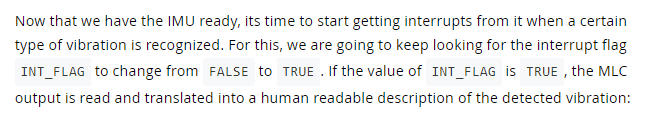
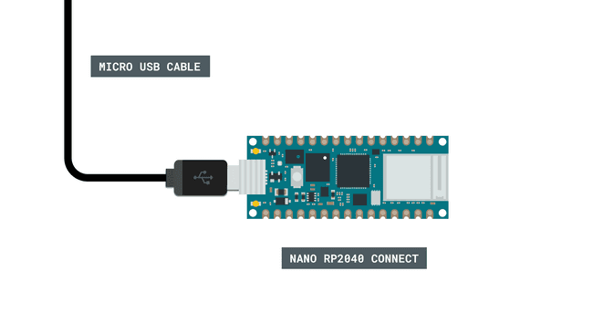

# Contribution to the Arduino Documentation website

1. Read this README file before going further in this list.
2. Copy the template folder into the path structure of choice. See below for suggestions on where to place your content.
2. Read the README documentation on how to fill in the template.
3. Read the [Arduino Style Guide](https://docs.arduino.cc/hacking/software/ArduinoStyleGuide) on how to write content.
4. Fill in your template.
   * remove following from your copy:
     * README.md
     * all assets in assets folder not relating to your content
5. Send in your content for review.
6. Interate according to feedback.
7. Wait for approval.

<hr>

# What can I contribute with?

## Bugs & Minor fixes

The main thing you can contribute with on the public Arduino Documentation repository, is the fixing of bugs, misspelling and other similar but small issues.

You are allowed to suggest these changes on all content available on the repository.

## Adding your own content

You are also allowed to add your own content to the Arduino Documentation repository. You are more than welcome to contribute with the following:

|Content|Description|Example|Placement|
|-------|-----------|-------|---------|
|Tutorial|Learn how to do something.|[Control Built-in RGB LED over Wi-Fi with Nano RP2040 Connect](https://docs.arduino.cc/tutorials/nano-rp2040-connect/rp2040-web-server-rgb)|`Tutorials` folder <br> `Tutorial` folder inside the corresponding product|
|Article|Learn about a specific topic.|[Multimeter Basics](https://docs.arduino.cc/learn/electronics/multimeter-basics)|`Learn`|
|Project|Learn how to build something.|[DIY Photoshop Editing Console using Arduino Nano RP2040 Connect](https://create.arduino.cc/projecthub/jithinsanal1610/diy-photoshop-editing-console-using-arduino-nano-rp-2040-a43e97?ref=search&ref_id=nano%20rp2040%20connect&offset=0)|`Project Hub`|

For us to be able to approve your contribution, you should follow the guidelines on how to structure and write your content.

# Styling Guidelines

## Markdown

We write all of our content in markdown. To be able to contribute properly to our website, we suggest you to do the same. Practise your markdown skills here: https://commonmark.org/help/tutorial/ 

You should use the following markdown styling for our content:

### Bold

\*\*bold** 

**bold**

Use bold when you are referring to either a path in the chosen software, or when you want to highlight a specific topic or button. See examples.


### Inline Code

\`code`

`code`

Use the inline code markdown for code inside text sections.



### Code snippets

\```arduino

this is my code

\```

```arduino

this is my code

```

Use the code snippet markdown for longer code snippets.


### Notes

\*\*\*Note: This is my note.***

***Note: This is my note.***

Use the three asterisks for note tags. Note that these can’t contain line-breaks.


### Quotes

\> This is a quote.

> This is a quote.


### Bullet points

\* bullet point 1 <br>
\* bullet point 2 <br>
\* bullet point 3

* bullet point 1
* bullet point 2
* bullet point 3

Use the * or the - to make bullet points in your tutorial. 

If your bullet point is a full sentence, remember to punctuate it. If your bullet point is a single word, or words not making a sentence, leave the punctuation off.


### Numbered lists

\*\*1.** One <br>
\*\*2.** Two <br>
\*\*3.** Three

**1.** One <br>
**2.** Two <br>
**3.** Three

Make sure to bold your numbering lists to make them format properly.


### Paths

This > is > my > path

Use > when describing paths in your chosen software.


### Images


Used to display images.


## Graphics

All graphics should be 1920x1080. All graphics are stored in an assets folder in the tutorial folder. See section **Naming Guidelines**.

**Note:** If you don’t want to add your own images, you could always ask for our assistance. We can help with the creation of up to ___ screenshots and 1 circuit diagram and 1 schematic per tutorial.

|Type|Purpose|Guidelines|Example|
|----|-------|----------|-------|
|Circuit/Schematic|**Circuit diagrams** represent how Arduino products work with components in order to function. <br> A **schematic** is a stylised electronic diagram explaining electric circuits.|We create the circuits diagrams and schematics. The only thing you need to do is provide us with a properly drawn schematic so that we can replicate it. <br>Please make sure to use the proper schematic style guides found [here]()|<br>|
|Screenshot|**Screenshots** are most often used to show the program in the Arduino IDE or any other chosen software.|Background color: #A5F2EE66 at 40% transparency. <br> The screenshot itself should be of high quality, good zoom.|<br><br>|

## Naming Guidelines

### Tutorial Files

Name the tutorial folder after the title of your tutorial. The name of the folder should contain a maximum of 4 words divided by dashes.


The tutorial folder should then contain an assets folder, as well as the main content markdown file. It’s important to name the main content file the same name as the tutorial folder.


### Images

There is no specific way you need to name the images, however it is a good practise to add something descriptive in the name. Also remember to divide words by using dashes.

`UNO-Mini-LE-external-power.png`

`rp2040-ap-mode-img-01.png`

<hr>


