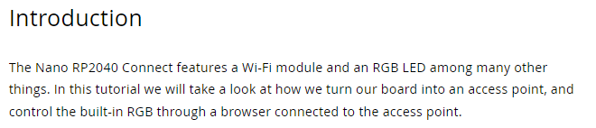

To write a tutorial good enough to be posted on our site, you should follow these guidelines:

# Structure

## Frontmatter

\---  
The frontmatter is enclosed by three dashes. See template. 
\---

Here is where you add the metadata of your tutorial. This is including the author, title of tutorial, compatible libraries, compatible hardware etc.

You must fill in title, description and author. The others are voluntary.

## Introduction

This is an h2 heading.

The Introduction to the tutorial should be a maximum of three sentences long and be well descriptive of what the reader can expect of the tutorial.

You are not allowed to change the name of the heading.

## Goals

This is an h2 heading.

What are the goals of this tutorial? What should the reader be able to do at the end?

You are not allowed to change the name of the heading.

## Hardware & Software Needed

This is an h2 heading.

Here you set the hardware and software you need to continue your tutorial. You are more than welcome to link the Arduino based software and hardware to the respective store or downloads page.

You are not allowed to change the name of the heading.

## Circuit/Schematic

This is an h2 heading.

Here you add the circuits and/or schematics of your tutorial.

You are not allowed to change the name of the heading.

## Focus Feature

This is an h2 heading.

Here you are allowed to use as many h3 headings as you want, to be able to divide your content into easier to read sections.

You can add up to three Focus Feature headings in your tutorial.

This sections heading should be updated to the main focus of your tutorial. This is where the information about the focus start.

This is the only heading you are allowed to modify.

## Programming the Board

This is an h2 heading.

This is the section where you go through the code of your tutorial. 

You are not allowed to change the name of the heading.

## Testing it Out

This is an h2 heading.

This is the experimental part of your tutorial, where the reader is supposed to test out the code and focus of your tutorial.

You are not allowed to change the name of the heading.

### Troubleshoot

This is an h3 heading.

If there are something in your tutorial that you know people might get stuck on, or get wrong, this is the section where you give suggestion on how the reader can troubleshoot.

You are not allowed to change the name of the heading.

## Conclusion

This is an h2 heading.

This is where you summarize your tutorial in a few sentences. What is it that you hoped to have taught or shown the reader?

You are not allowed to change the name of the heading.

# Writing Content

Please read the [Arduino Style Guide](https://docs.arduino.cc/hacking/software/ArduinoStyleGuide).