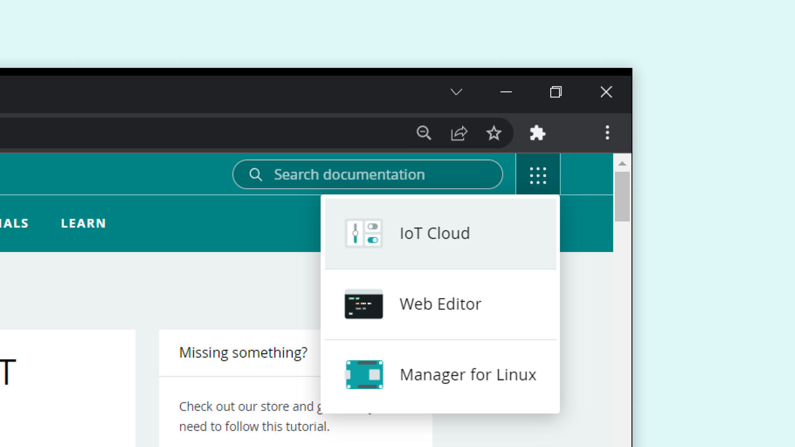
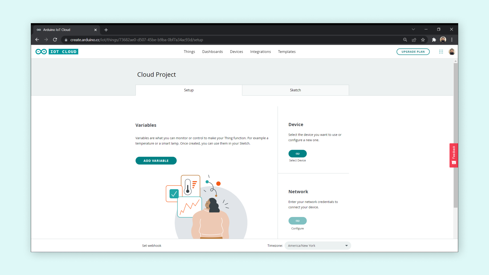
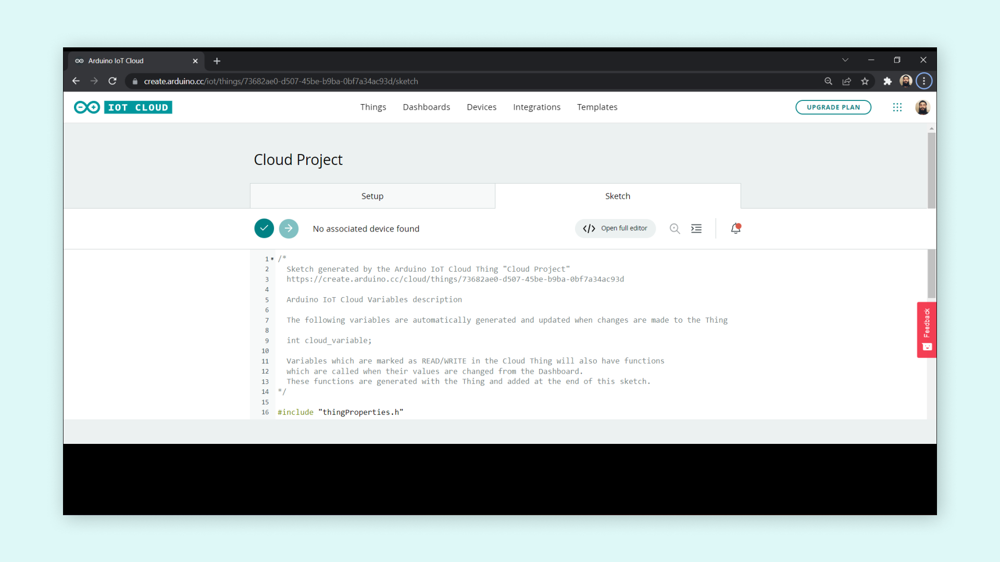
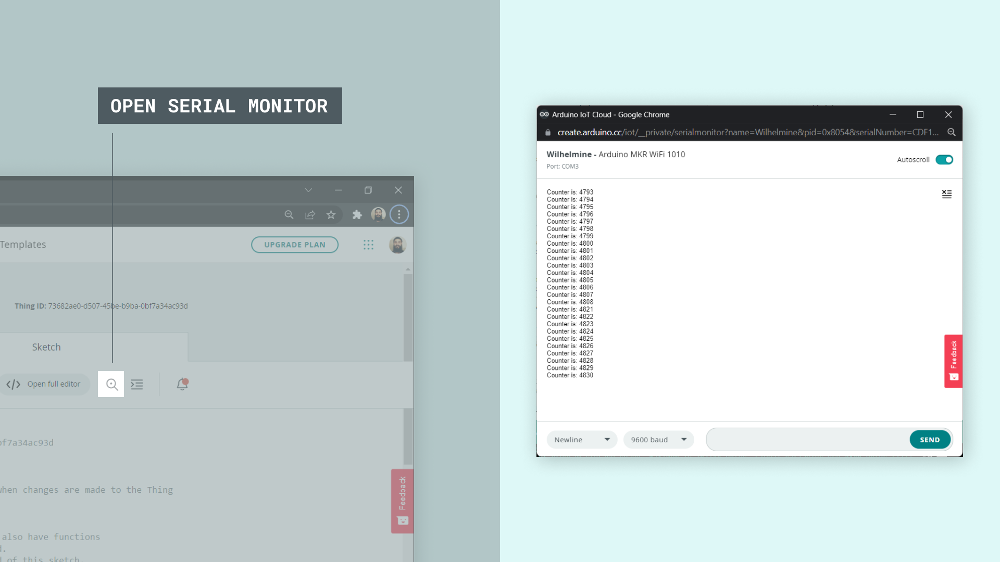
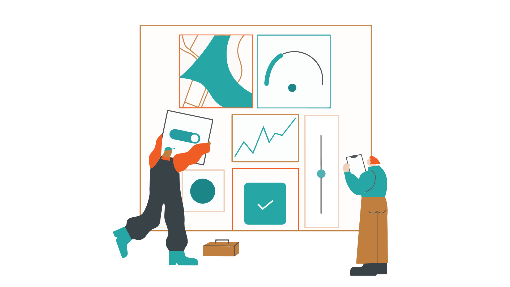
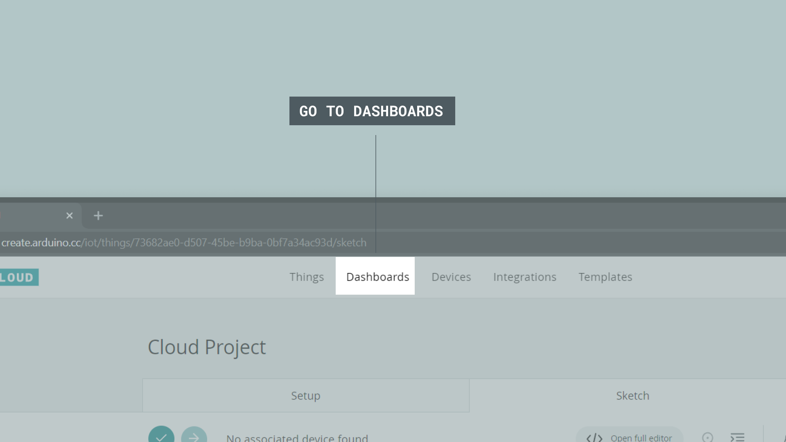

## Introduction

Connected devices around the world are increasing by billions every year. The [Arduino IoT Cloud](https://create.arduino.cc/iot/things) is a platform that allows **anyone** to create IoT projects, with a user friendly interface, and an all in one solution for **configuration, writing code, uploading** and **visualization.**

In this article, we will take a look at some different components of the Arduino IoT Cloud, and provide a general overview.

But if you’re itching to get started and explore the Arduino IoT Cloud yourself, that is also perfectly fine! You can always come back here for more information!

- <a href="https://create.arduino.cc/iot/things" target="_blank">Go to Arduino IoT Cloud</a>

### IoT Cloud Documentation

The Arduino IoT Cloud has several pages of documentation available. Below you will find a list of some popular pages:

- To find **all tutorials & articles**, visit the [Arduino IoT Cloud Documentation page](/cloud/iot-cloud).

- For a **technical overview, list of features,** and **API guide**, visit the [Arduino IoT Cloud Cheat Sheet](/cloud/iot-cloud/tutorials/technical-reference).

- For **API & SDK Documentation**, visit the developer reference at [Arduino IoT Cloud API](https://www.arduino.cc/reference/en/iot/api/).

### Features

Below is a list of Arduino IoT Cloud features.

- [**Data Monitoring**](/cloud/iot-cloud/tutorials/cloud-environmental-data) - learn how to easily monitor your Arduino's sensor values through a dashboard.
- [**Variable Synchronisation**](https://docs.arduino.cc/cloud/iot-cloud/tutorials/device-to-device) - variable synchronisation allows you to sync variables across devices, enabling communication between devices with minimal coding.
- [**Scheduler**](https://docs.arduino.cc/cloud/iot-cloud/tutorials/cloud-scheduler) - schedule jobs to go on/off for a specific amount of time (seconds, minutes, hours).
- [**Over-The-Air (OTA) Uploads**](/cloud/iot-cloud/tutorials/ota-getting-started) - upload code to devices not connected to your computer.
- [**Webhooks**](https://docs.arduino.cc/cloud/iot-cloud/tutorials/webhooks) - integrate your project with another service, such as IFTTT.
- [**Amazon Alexa Support**](/cloud/iot-cloud/tutorials/alexa-mkr-rgb-shield) - make your project voice controlled with the Amazon Alexa integration. 
- [**Dashboard Sharing**](https://docs.arduino.cc/cloud/iot-cloud/tutorials/sharing-dashboards) - share your data with other people around the world. 

## Compatible Hardware

To use the Arduino IoT Cloud, a **cloud compatible board** is required. You can choose between using an official Arduino board, or a board based on the ESP32 / ESP8266 microcontroller. The Arduino IoT Cloud currently supports connection via Wi-Fi, LoRaWAN® (via The Things Network) and mobile networks.

***All cloud-compatible Arduino boards come with a hardware secure element (such as the [ECC508](https://ww1.microchip.com/downloads/aemDocuments/documents/OTH/ProductDocuments/DataSheets/20005928A.pdf) cryptochip), where you can store your security keys.***

### Wi-Fi

***Official Arduino boards only supports the 2.4GHz frequency band for transmitting data.***

The following boards connect to the Arduino IoT Cloud via Wi-Fi.

- [MKR 1000 WiFi](/hardware/mkr-1000-wifi)
- [MKR WiFi 1010](https://store.arduino.cc/arduino-mkr-wifi-1010)
- [Nano RP2040 Connect](https://store.arduino.cc/nano-rp2040-connect)
- [Nano 33 IoT](https://store.arduino.cc/arduino-nano-33-iot)
- [GIGA R1 WiFi](https://store.arduino.cc/products/giga-r1-wifi)
- [Portenta H7](https://store.arduino.cc/portenta-h7)
- [Portenta H7 Lite Connected](https://store.arduino.cc/products/portenta-h7-lite-connected)
- [Portenta Machine Control](https://store.arduino.cc/products/arduino-portenta-machine-control)
- [Nicla Vision](https://store.arduino.cc/products/nicla-vision)
- [Opta](https://docs.arduino.cc/hardware/opta).

Connection via Wi-Fi is an easy alternative, and your credentials can safely be entered during the configuration of a project. This type of connection is most suitable for low-range projects, where you connect your board to the cloud via your home/work/school router.

### LoRaWAN®

The following boards connect to the Arduino IoT Cloud via [The Things Stack](https://www.thethingsindustries.com/stack/), a LoRaWAN® Network Server connected to thousands of public LoRa® gateways.

- [MKR WAN 1300](https://store.arduino.cc/arduino-mkr-wan-1300-lora-connectivity-1414)
- [MKR WAN 1310](https://store.arduino.cc/mkr-wan-1310)

Connection via LoRaWAN® is recommended for low-power projects in both remote and urban areas, where Wi-Fi or other popular connectivity types are not available. The MKR WAN 1300/1310 boards are equipped with a LoRa radio module and has a slot for an antenna. With the right low-power configuration, the board can send data to the cloud for months on a single battery.

***To learn more about setting up LoRaWAN® devices, visit the [Configuring LoRaWAN® devices in the Arduino Cloud](/cloud/iot-cloud/tutorials/cloud-lora-getting-started) guide.***

### GSM / NB-IoT Boards

The MKR GSM 1400 and MKR NB 1500 require a **SIM card** to connect to the cloud, as they communicate over the mobile networks. 

- [MKR GSM 1400](https://store.arduino.cc/arduino-mkr-gsm-1400)
- [MKR NB 1500](https://store.arduino.cc/arduino-mkr-nb-1500-1413)

Connection through mobile networks can be considered in remote areas where there's no Wi-Fi, or in mobile projects (such as cargo tracking).  

***For more information, visit the [Arduino SIM page](https://store.arduino.cc/digital/sim).***

***Note that a secured connection is a memory intense operation, so there's not a lot of memory for the user application (e.g. around 2.6 kB on the MKR GSM 1400). Using a lot of IoT Cloud variables may cause the sketch to run out of memory on boards which don't offload the SSL stack and make it crash.***

### ESP32 / ESP8266

The Arduino IoT Cloud supports a wide range of third party boards based on the ESP32 and ESP8266 microcontrollers with support for Wi-Fi. To set them up, simply choose the **third party option** in the device setup.

***To learn more about ESP32/ESP8266 support and how to set it up, visit the [Connecting ESP32 & ESP8266 to Arduino Cloud IoT](/cloud/iot-cloud/tutorials/esp-32-cloud) guide.***

### Ethernet

The Arduino IoT Cloud supports connection via Ethernet on a number of devices. The options to connect via Ethernet are the following:
- Connect with the [Portenta H7](https://store.arduino.cc/products/portenta-h7) in combination with an Ethernet compatible carrier/shield (see below).
- Connect with the [Opta](https://docs.arduino.cc/hardware/opta).

To connect with the **Portenta H7** board, you will need one of the following shields/carriers:
- [Portenta Vision Shield Ethernet](https://store.arduino.cc/products/arduino-portenta-vision-shield-ethernet)
- [Portenta Machine Control](https://store.arduino.cc/portenta-machine-control)

To enable communication via Ethernet with the Portenta H7, while configuring your device, you need to select the "Ethernet" option. If your device is already configured as a Wi-Fi device, you need to remove it before configuring it to Ethernet communication.

***Please note that older hardware such as the [Ethernet Shield Rev2](https://store.arduino.cc/products/arduino-ethernet-shield-2) and [MKR ETH Shield](https://store.arduino.cc/products/arduino-mkr-eth-shield) are currently not supported by the Arduino IoT Cloud.***

## Support

If you have any problems with the Arduino IoT Cloud, you can browse through common troubleshooting issues and find information on different features in the **Arduino Help Center**. If you don’t find the answer you are looking for, we are always happy to help you with any question regarding our products!

<a href="https://support.arduino.cc/hc/en-us/categories/360002234259-Arduino-Cloud" target="_blank">Go to Arduino Help Center</a>

## A Walk Through the Configuration

Setting up the Arduino IoT Cloud and accessing the different features available involves a few simple steps. So let’s take a look at how to go from start to finish!

### 1. Creating an Arduino Account

To starting using the Arduino IoT cloud, we first need to [log in or sign up to Arduino](https://create.arduino.cc/iot/things).

#### 2. Go to the Arduino IoT Cloud

After we have signed up, you can access the Arduino IoT Cloud from any page on [arduino.cc](https://www.arduino.cc/) by clicking on the four dots menu in the top right corner. You can also [go directly to the Arduino IoT Cloud](https://create.arduino.cc/iot/).

### 3. Creating a Thing

The journey always begin by creating a new **Thing**. In the Thing overview, we can choose what device to use, what Wi-Fi network we want to connect to, and create variables that we can monitor and control. This is the main configuration space, where all changes we make are automatically generated into a **special sketch file**.

### 4. Configuring a Device

Devices can easily be added and linked to a Thing. The Arduino IoT Cloud requires your computer to have the [Arduino Create Agent installed](https://create.arduino.cc/getting-started/plugin/welcome). The configuration process is quick and easy, and can be done by clicking on the **“Select device”** button in the Thing overview. Here, we can choose from any board that has been configured, or select the **“Configure new device”** option.

We can also get a complete overview of our devices by clicking the **“Devices"** tab at the top of the Arduino IoT Cloud interface. Here we can manage and add new devices.

### 5. Creating Variables

The variables we create are automatically generated into a sketch file. There are several data types we can choose from, such as **int, float, boolean, long, char**. There’s also special variables, such as **Temperature, Velocity, Luminance** that can be used. When clicking on the **“Add variable”** button, we can choose name, data type, update setting and interaction mode.

### 6. Connecting to a Network

To connect to a Wi-Fi network, simply click the **“Configure”** button in the network section. Enter the credentials and click **“Save”**. This information is also generated into your sketch file!

### 7. Editing the Sketch

Now that we have configured variables, devices and network settings, we can get to programming our devices! 

An automatically generated sketch file can be found in the **“Sketch”** tab. It has the same structure as a typical `.ino` file, but with some additional code to make the connection to your network and to the cloud.

A sketch that, for example, reads an analog sensor, and use the **cloud variable** to store it. When the sketch has been uploaded, it will work as a regular sketch, but it will also update the cloud variables that we use!

Additionally, each time we create a variable that has the **Read & Write** permission enabled, a function is also generated, at the bottom of your sketch file. Each time this variable changes, it will execute the code within this function! This means that we can leave most of the code out of the **loop()** and only run code when needed.

To upload the program to our board, simply click the **"Upload"** button.

The editor also has a **Serial Monitor Tool**, which can be opened by clicking the magnifying glass in the toolbar. Here you can view information regarding your connection, or commands printed via `Serial.print()`.

After we have successfully uploaded the code, we can open the **“Serial Monitor”** tab to view information regarding our connection. If it is successful, it will print **“connected to network_name”** and **“connected to cloud”**. If it fails to connect, it will print the errors here as well.

***The cloud editor is a mirrored "minimal" version of the Web Editor. Any changes you make will also be reflected in the Web Editor, which is more suitable for developing more advanced sketches.***

#### Over the Air Uploads

Did you know that the Arduino IoT Cloud supports over the air uploads? When you've uploaded a sketch to your board once, it will become available for you to upload a new sketch to the board without connecting it to your computer!

***Over the Air uploads require an Entry plan to the Arduino IoT Cloud***

To use this feature, make sure the board has power. If your board is already connected to the IoT Cloud, you will be able to upload to it over the air. Navigate to the Things sketch tab in the Arduino IoT Cloud interface, and you should see it being discovered just as if it was connected via USB.

### 8. Creating a Dashboard

Now that we have configured the device & network, created variables, completed the sketch and successfully uploaded the code, we can move on to the fun part: **creating dashboards!**

Dashboards are visual user interface for interacting with your boards over the cloud, and we can setup many different setups depending on what your IoT project needs. We can access our dashboards by clicking on the **“Dashboards”** tab at the top of the Arduino IoT Cloud interface, where we can create new dashboards, and see a list of dashboards created for other Things.

If we click on **“Create new dashboard”**, we enter a dashboard editor. Here, we can create something called **widgets**. Widgets are the visual representation of our variables we create, and there are many different to choose from. Below is an example using several types of widgets.

When we create widgets, we also need to **link them to our variables**. This is done by clicking on a widget we create, select a Thing, and select a variable that we want to link. Once it is linked, we can either interact with it, for example a button, or we can monitor a value from a sensor. As long as our board is connected to the cloud, the values will update!

Let's say we have a **temperature widget** that we want to link to the **temperature** variable inside the **Cloud project** thing.

***Note that not all widgets and variables are compatible. A switch and an integer can for example not be linked, and will not be an option while setting up your dashboard.***

We can also have several things running at once, depending on your Arduino IoT Cloud plan, which we can include in the same dashboard. This is a great feature for tracking multiple boards in for example a larger sensor network, where boards can be connected to different networks around the world, but be monitored from the same dashboard.

## Congratulations

You are just a few easy steps from deploying your very own IoT project. Having a project connected to the Arduino IoT Cloud opens up many possibilities, such as tracking data in real time, triggering remote devices and building wireless systems.

What will you create?

<a href="https://create.arduino.cc/iot/things" target="_blank">Start your IoT journey</a>

### More tutorials

You can find more tutorials in the [Arduino IoT Cloud documentation page](/arduino-cloud/).
