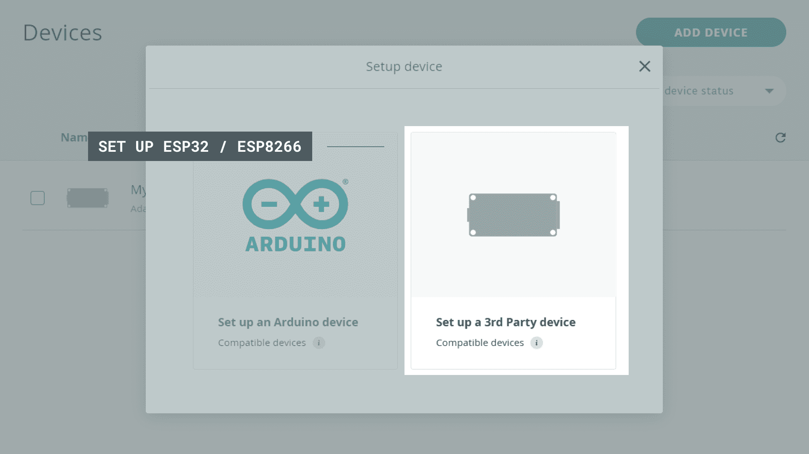
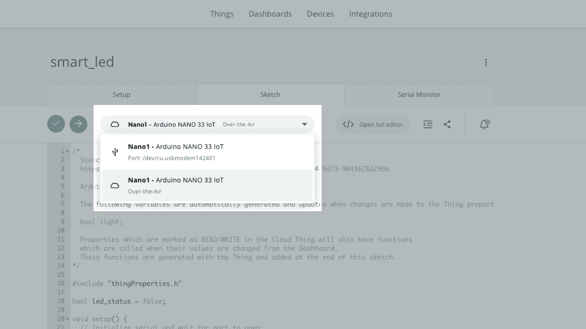
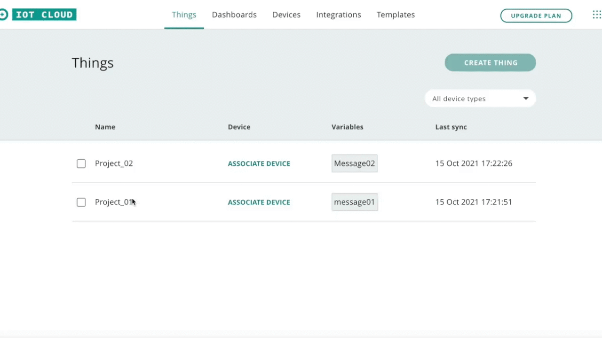
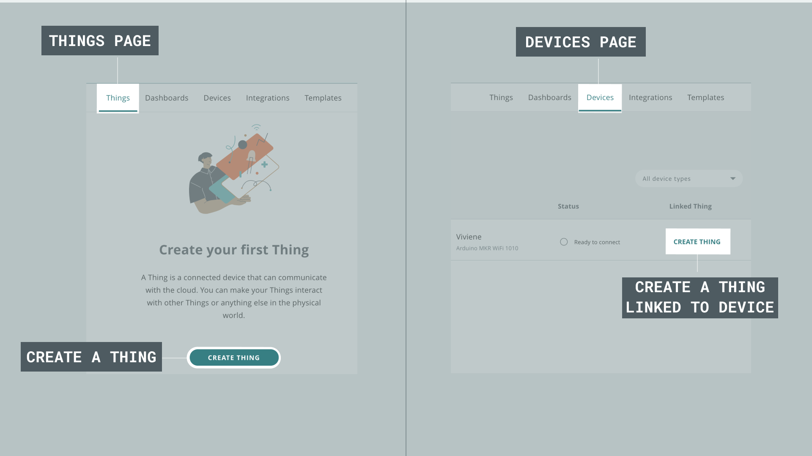
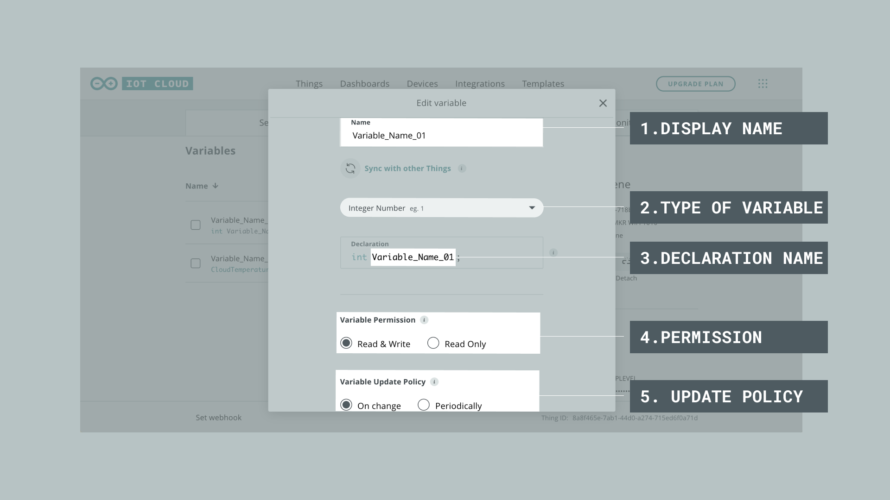
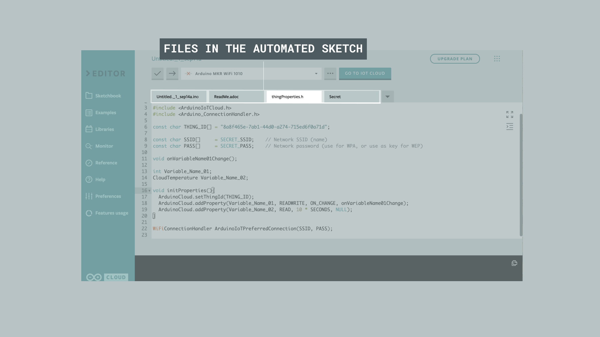
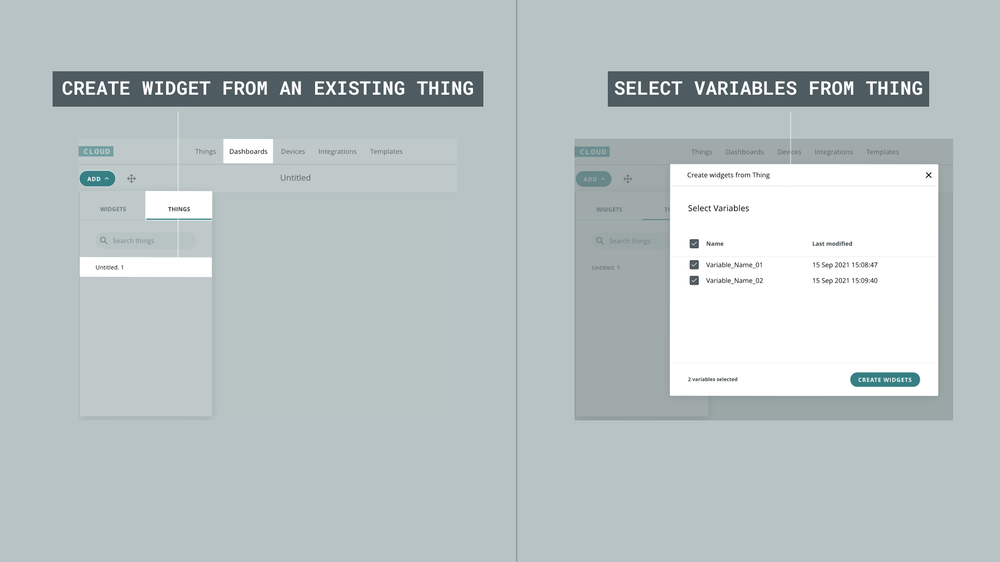

[Arduino IoT Cloud](https://create.arduino.cc/iot/) is a service that allows you to configure, program and deploy your Arduino devices. It is an all-in-one solution for IoT development, where you can build visual dashboards to monitor and control your devices, integrate with other services and much more.

This article summarizes the use of the Arduino Cloud IoT, and includes information regarding requirements, installation, API and general usage of the platform. 

## Compatible Hardware

To use the Arduino IoT Cloud, a **cloud compatible board** is required. You can choose between using an official Arduino board, or a board based on the ESP32 / ESP8266 microcontroller. The Arduino IoT Cloud currently supports connection via Wi-Fi, LoRaWAN® (via The Things Network) and mobile networks.

***All cloud-compatible Arduino boards come with a hardware secure element (such as the [ECC508](https://ww1.microchip.com/downloads/aemDocuments/documents/OTH/ProductDocuments/DataSheets/20005928A.pdf) cryptochip), where you can store your security keys.***

### Wi-Fi

***Official Arduino boards only supports the 2.4GHz frequency band for transmitting data.***

The following boards connect to the Arduino IoT Cloud via Wi-Fi.

- [MKR WiFi 1010](https://store.arduino.cc/arduino-mkr-wifi-1010)
- [Nano RP2040 Connect](https://store.arduino.cc/nano-rp2040-connect)
- [Nano 33 IoT](https://store.arduino.cc/arduino-nano-33-iot)
- [GIGA R1 WiFi](https://store.arduino.cc/products/giga-r1-wifi)
- [Portenta H7](https://store.arduino.cc/portenta-h7)
- [Portenta H7 Lite Connected](https://store.arduino.cc/products/portenta-h7-lite-connected)
- [Nicla Vision](https://store.arduino.cc/products/nicla-vision)
- [UNO R4 WiFi](https://store.arduino.cc/products/uno-r4-wifi)
- [Nano ESP32](https://store.arduino.cc/products/nano-esp32)

Connection via Wi-Fi is an easy alternative, and your credentials can safely be entered during the configuration of a project. This type of connection is most suitable for low-range projects, where you connect your board to the cloud via your home/work/school router.

### LoRaWAN®

The following boards connect to the Arduino IoT Cloud via [The Things Stack](https://www.thethingsindustries.com/stack/), a LoRaWAN® Network Server connected to thousands of public LoRa® gateways.

- [MKR WAN 1300](https://store.arduino.cc/arduino-mkr-wan-1300-lora-connectivity-1414)
- [MKR WAN 1310](https://store.arduino.cc/mkr-wan-1310)

Connection via LoRaWAN® is recommended for low-power projects in both remote and urban areas, where Wi-Fi or other popular connectivity types are not available. The MKR WAN 1300/1310 boards are equipped with a LoRa radio module and has a slot for an antenna. With the right low-power configuration, the board can send data to the cloud for months on a single battery.

***To learn more about setting up LoRaWAN® devices, visit the [Configuring LoRaWAN® devices in the Arduino Cloud](/cloud/iot-cloud/tutorials/cloud-lora-getting-started) guide.***

### GSM / NB-IoT Boards

The MKR GSM 1400 and MKR NB 1500 require a **SIM card** to connect to the cloud, as they communicate over the mobile networks. 

- [MKR GSM 1400](https://store.arduino.cc/arduino-mkr-gsm-1400)
- [MKR NB 1500](https://store.arduino.cc/arduino-mkr-nb-1500-1413)

Connection through mobile networks can be considered in remote areas where there's no Wi-Fi, or in mobile projects (such as cargo tracking).  

***For more information, visit the [Arduino SIM page](https://store.arduino.cc/digital/sim).***

### ESP32 / ESP8266

The Arduino IoT Cloud supports a wide range of third party boards based on the ESP32 and ESP8266 microcontrollers with support for Wi-Fi. To set them up, simply choose the **third party option** in the device setup.



***To learn more about ESP32/ESP8266 support and how to set it up, visit the [Connecting ESP32 & ESP8266 to Arduino Cloud IoT](/cloud/iot-cloud/tutorials/esp-32-cloud) guide.***

## Software Requirements

### Create Agent

The [Arduino Create Agent](https://github.com/arduino/arduino-create-agent) is a single binary that will appear on the menu bar and work in the background. It allows you to use the Arduino IoT Cloud and the Arduino Web Editor to seamlessly upload code to any board directly from the browser.

Downloading and installing the Arduino Create Agent plugin can be simply done following [this quick and easy process](https://create.arduino.cc/getting-started/plugin/welcome).

The full documentation of the [Arduino Create Agent is available here](https://github.com/arduino/arduino-create-agent#readme) for more advanced usage.

### Arduino Account

An Arduino account is needed to use all of the Arduino Cloud services including Arduino IoT Cloud and the Arduino Web Editor. [Follow this link to make an account](http://create.arduino.cc/iot).

***In addition to IoT Cloud, the Arduino account provides access to the Arduino Web Editor which is the full online IDE. Arduino and non-Arduino boards can be programmed using the Arduino Web Editor without the need for installing board drivers or libraries.***

## Device configuration

Configuration of the device to be used with the Arduino IoT Cloud is required **once for every new device**.

Configuring a new device can be achieved following the steps below:

1. [Sign in to the Arduino IoT Cloud](https://create.arduino.cc/iot).

2. [Navigate to "Devices" on the top menu](https://create.arduino.cc/iot/devices).

3. Connect an Arduino IoT Cloud **compatible device**.

4. Click on the **"ADD DEVICE"** button.

5. Select the correct device, either an **Arduino device** or a **third party device**.

6. Wait until the **configuration is complete**.

Once a device is successfully configured it appears in the **"Devices"** list and can be used to **create a thing**, or can be **linked to an existing thing**.

The **Devices** page displays the name, status, and linked Things for each of the configured devices. Clicking on the device allows for **renaming** it, as well as accessing more information about the device such as its **ID number**, **type**, **FQBN**, **serial number**, **NINA firmware** version and the option to update it, **linked Thing**, **status**, latest activity and the date when the device was added.

The **status** of the device indicates whether it's connected to the Arduino IoT Cloud (**online**), or not successfully connected (**offline**).

A shortcut to add a device is also provided in **"Things" page** as explained in the next section.

## Features

Below you will find a list of features that are available in the Arduino IoT Cloud.

### Uploading Over-The-Air (OTA)

This feature allows for uploading sketches wirelessly to Arduino boards, without the need to connect the board physically. This feature is supported for the following boards:

- [Arduino MKR WiFi 1010](https://store.arduino.cc/arduino-mkr-wifi-1010)
- [Arduino NANO 33 IoT](https://store.arduino.cc/arduino-nano-33-iot)
- [Arduino Nano RP2040 Connect](https://store.arduino.cc/products/arduino-nano-rp2040-connect-with-headers)
- [Portenta H7](https://store.arduino.cc/products/portenta-h7)
- [UNO R4 WiFi](https://store.arduino.cc/products/uno-r4-wifi)
- [Nano ESP32](https://store.arduino.cc/products/nano-esp32)
- Cloud compatible ESP32 boards (see list below).

#### Verified ESP32 Boards Supporting OTA 

The following ESP32 boards have been tested and verified to support OTA:

- ESP32-S2-DevKitC
- NODEMCU-32-S2
- WEMOS LOLIN D32
- ESP32-S3-DevKitC
- WEMOS LOLIN D32
- ESP32-CAM
- NodeMCU-32S
- Freenove ESP32 WROVER
- ESP32-DevKitC32E
- DOIT ESP32 DevKit v1



In order to **enable over-the-air uploads**, an initial upload should be done in the traditional way via a cable connection using the IoT Cloud interface. After such initial upload, "Over-the-Air" will appear as an option whenever the board is connected to the cloud via its network connection. For more information about this topic, check out the [tutorial about uploading sketches Over-the-Air (OTA)](/arduino-cloud/features/ota-getting-started).

### Variable Synchronisation

This feature allows Arduino devices to communicate with each other by sharing variables, without writing a single line of code or spending time with radio modules and network protocols.



Using this feature you can link variables of the same data type between **two or more cloud-enabled devices**, and Arduino IoT Cloud will automatically ensure any change to their value is propagated among all linked boards.
For example, one button could set three smart bulbs to the same color by just setting a variable on one device and reading it on the others. Or you could turn on a heater when temperature sensors in your room or outside in your weather station drop below a certain level.

### Local Time

To retrieve local time, use the `ArduinoCloud.getLocalTime()` method in your sketch. The value returned represents the current local time expressed as a Unix timestamp (i.e. seconds from the epoch), and it automatically takes your time zone settings and DST (Daylight Saving Time) into account. Time zone can be set in the Thing configuration page within the Arduino IoT Cloud platform.

The returned timestamp can be displayed in a dashboard using a `CloudTime` variable and the [Time Picker widget](/arduino-cloud/getting-started/technical-reference#time-picker), or can be parsed with a third-party library such as [Time](https://www.arduino.cc/reference/en/libraries/time/) in case you want to show it on a display.

```arduino
myTimeVariable = ArduinoCloud.getLocalTime()
```

***Note that when using a board equipped with a hardware Real-Time Clock (RTC) the [Arduino_IoTCloud](https://github.com/arduino-libraries/ArduinoIoTCloud) library will use it automatically, thus communicating with the RTC from within your sketch or other libraries is not recommended. You can use the `getLocalTime()` and `getInternalTime()` methods provided by Arduino_IoTCloud instead.
*** 

## Things

In order to use your devices in IoT Cloud, you need to associate a Thing to each of them. A Thing is an abstract concept which holds the configuration of the variables and other settings, as well as the history of the data collected for the variables.

Devices and things are distinct concepts in IoT Cloud so that you can easily swap the actual hardware without reconfiguring everything from scratch: just detach a thing from a device, and ressign it to another device.



The **Things page** can be accessed either by clicking on **"CREATE THING"** on the added device in the **"Device" page**, or by navigating to the **"Things"** tab in the top menu, then clicking on the **"CREATE THING"**. The first method links the device to the created Thing **automatically**, while the later method requires a **manual linking** of the device on the Things page.


The steps below can be used as guidance when **setting up a Thing**:

1. **Attach a device** if not already attached.
2. **Add a variable**, or variables by clicking on the **"Add Variable"** button.
3. **Configure the network**, by entering the WiFi's name and password.
4. **Edit the sketch** in the **"Sketch"** tab.

***You can learn more about Things in the [Getting Started with the Arduino IoT Cloud](https://docs.arduino.cc/cloud/iot-cloud/tutorials/iot-cloud-getting-started) guide.***

## Variables

***Visit the main article on [Cloud Variables](/arduino-cloud/getting-started/cloud-variables) for a more detailed coverage.***

A thing can have one or more variables. A variable can be used for multiple purposes:

* collect data over time in the cloud (sensor readings, status changes, log messages etc.)
* show data in real-time in a dashboard using the various available visual widgets
* receive changes originated from a dashboard or other linked devices

When you configure a variable, Arduino IoT Cloud will handle all the communication and synchronization behind the scenes. Variables can be used directly just like any other variables in an Arduino sketch.

When adding a variable the following values need to be determined:



1. A **Display Name**, which can any string name, preferably something that indicates the function of the variable. It can not include spaces and special characters, and it cannot start with a number.

2. The **Type of Variable** corresponds to the data type of the variable and must be chosen from the provided list. See below for a full list of the available types.

   **Please note:** when a variable is added, it is automatically declared in the `thingProperties.h` file so you don't need to declare it yourself in the sketch.

3. A **Declaration Name**, a unique name by which the variable will be called in the sketch. It can not include spaces and special characters, and it cannot start with a number. The display name chosen for the variable may be used here to avoid conflicts.

4. The **Variable's Permission**, which can be either **Read & Write** or **Read Only**. A **Read & Write** variable can work both as **input and output**, the data can be sent from the device to the cloud and vice versa. A **Read Only** variable can only send data from the device to the cloud.

5. The **Variable Update Policy**, which may be either **On Change** or **Periodically**. If **On Change** is chosen, the variable will be updated to the cloud whenever the change in value is greater than or equal to the set **threshold**. If **Periodically** is chosen, the variable will be updated to the cloud each time the number of seconds set is elapsed.

## Configuring Network

Configuring the network allows for connecting an Arduino, or third party devices to a Wi-Fi network. The credentials entered are saved in the **Secret file**, inside the sketch.

Entering the network details can be done simply by navigating to **"Network"** and clicking on **"Configure"**. A popup screen appears where the **Network's Name** and **Password** can be entered. The network details are saved and only gets uploaded to the device when **the sketch is uploaded**.

The network details can be modified by clicking the **"Change"** button, correcting the entered credentials, saving the new details, and uploading the sketch again.

## Editing the sketch

The **"Sketch"** tab in the **Things** page includes a code editor, which is a lite version of the Arduino Web Editor that enables for editing, formatting, compiling and saving a sketch. An automatically generated code is found in the editor after adding **at least one variable**.


The sketch may be also displayed and modified in the full **Arduino Web Editor** by clicking the **"Open full editor"** button, which provides more features.

The sketches generated automatically in IoT Cloud include four files:

### thingProperties.h



This is a file containing the code generated by the Arduino IoT Cloud that should not be edited. This file includes the [ArduinoIoTCloud](https://github.com/arduino-libraries/ArduinoIoTCloud) and [Arduino_ConnectionHandler](https://github.com/arduino-libraries/Arduino_ConnectionHandler) libraries, the network configuration, initializations of variables and function, and properties of each variable saved in the `initProperties()` function.

The example below shows a basic code generated in the `thingProperties.h` file as a result of adding two variables. The first variable **"Variable_Name_01"** is an integer variable with a **READ & WRITE** permission, and the second is a **READ ONLY** CloudTemperature variable.

***Please note: for READ & WRITE variables a callback function (in this case called `onVariableName01Change()`) is automatically generated in sketch. This will allow for writing commands inside the function to trigger actions whenever the value is changed from the cloud.***

```arduino
#include ArduinoIoTCloud.h
#include Arduino_ConnectionHandler.h

const char SSID[]     = SECRET_SSID;    // Network SSID (name)
const char PASS[]     = SECRET_PASS;    // Network password (use for WPA, or use as key for WEP)

void onVariableName01Change(); // declaring a function for the read & write variables

int Variable_Name_01; // declare a normal integer variable
CloudTemperature Variable_Name_02; // declare a Cloud specific temperature variable

void initProperties(){

  ArduinoCloud.addProperty(Variable_Name_01, READWRITE, ON_CHANGE, onVariableName01Change); // linking the read & write variable with its function and updating it on change
  ArduinoCloud.addProperty(Variable_Name_02, READ, 10 * SECONDS, NULL); // setting up the read only variable and updating it every 10 seconds

}

WiFiConnectionHandler ArduinoIoTPreferredConnection(SSID, PASS); // setting up the network name and password chosen in the Network configuration
```

***As of 2022/02/09 the `thingProperties.h` no longer contains your Thing ID. If you have created a Thing prior to this date, simply update your Thing and your `thingProperties.h` will automatically be updated. You can see the lines that were removed in the snippet below:***

```arduino
const char THING_ID[] = "A-UNIQUE-THING-ID-NUMBER";

ArduinoCloud.setThingId(THING_ID); //previously located inside initProperties()
```


### sketch.ino

This file includes the main Arduino sketch that can be **edited and uploaded to the device**. The sketch includes the `thingProperties.h` file, the `setup()` and `loop()` functions, and an empty function for every **Read & Write** variable. The code below is a basic example of an auto generated code in the sketch file, using the same variables from the previous example displayed in `thingProperties.h` section.

```arduino
#include "thingProperties.h"

void setup() {
  Serial.begin(9600);   // Initialize serial and wait for port to open:
  delay(1500);  // This delay gives the chance to wait for a Serial Monitor without blocking if none is found

  initProperties();   // Defined in thingProperties.h

  ArduinoCloud.begin(ArduinoIoTPreferredConnection);   // Connect to Arduino IoT Cloud

  setDebugMessageLevel(2);
  ArduinoCloud.printDebugInfo();
}

void loop() {
  ArduinoCloud.update();
  // Your code here
}

void onVariableName01Change() {
  // Do something
}

```

The `setup()` function includes an initialization of the **Serial Monitor** and the **properties** using the `Serial.begin(9600);` and `initProperties();` commands. Additionally, the **connection to the Arduino IoT Cloud** is initialized using the `ArduinoCloud.begin(ArduinoIoTPreferredConnection);` command, which uses methods from the [ArduinoIoTCloud](https://github.com/arduino-libraries/ArduinoIoTCloud) and [Arduino_ConnectionHandler](https://github.com/arduino-libraries/Arduino_ConnectionHandler) libraries that are included in the `thingProperties.h` file. Finally, `setDebugMessageLevel(2);` and `ArduinoCloud.printDebugInfo();` are used for **debugging**, it prints information related to the state of **network and IoT Cloud connection and errors**. The higher number the more granular information obtained, the default is 0 (only errors) and the maximum is 4.

### Secret

 This is a file to save sensitive data such as passwords and API keys that will be protected and hidden from public access. The network configuration details are saved in this file.

### ReadMe.adoc

 This is a Read Me file as a placeholder for adding a description of the project.

### Uploading A Sketch

Uploading a sketch through the Arduino IoT Cloud can be achieved in two ways, either through the code editor in the thing page (**Sketch** tab) or through the full editor (click on "Open full editor" to open it).

The full editor allows for more control over the code and its libraries and provides access to all files included in the sketch, as well as more editing and sharing options.

***Please note: the status of the connection to the Network and Arduino IoT Cloud may be checked by opening the Serial Monitor after uploading a sketch. If the `while(!Serial);` loop is included in the `setup()` function, the code would not execute before opening the Serial Monitor.***


## Dashboards & Widgets

Dashboards are **visual user interfaces** for interacting with your boards over the cloud, which can be customized with different setups depending on the project's needs.

One or more **Things** can be added to a **Dashboard**, with all or some of their variables. The dashboards can be accessed by navigating to the **“Dashboards”** page at the top menu of the Arduino IoT Cloud interface, where a list of the **existing Dashboards** and an option to **create a new Dashboard** are available.



***You can read more about [Dashboards & Widgets](/arduino-cloud/getting-started/dashboard-widgets).***

## Recommended Code Practices

This section highlights some important aspects of writing code with regard to the implementations in the [ArduinoIoTCloud](https://github.com/arduino-libraries/ArduinoIoTCloud).

### Watchdog Timer (WDT)

All IoT Cloud sketches use a **Watchdog Timer (WDT)** by default. The WDT can be used to automatically recover from hardware faults or unrecoverable software errors.

A WDT is essentially a countdown timer, whereas it starts counting from a set value, and upon reaching zero, it resets the board. To prevent it from reaching zero, we continuously call it from the `loop()`, using the `ArduinoCloud.update()` function.

This is why, it is very important to not use any long blocking code in your sketch. For example, using a long `delay()` inside the `loop()` is **strongly discouraged**, as the WDT can reach zero and reset the board.

The WDT can however be disabled inside of the `setup()` function, by adding the `false` parameter:

```arduino
ArduinoCloud.begin(ArduinoIoTPreferredConnection, false).
```

***You can view the source code of this implementation [here](https://github.com/arduino-libraries/ArduinoIoTCloud/tree/master/src/utility/watchdog).***

### Alternatives to Delays

The `loop()` function includes the `ArduinoCloud.update();` call, which sends data to the cloud and receives updates. In order to get the best responsiveness in your cloud-connected projects, the `loop()` function should run as fast as possible. This means that no blocking commands should be used inside, and you should prefer a non-blocking programming approach whenever possible.

A common **blocking pattern** is the use of the `delay()` function which stops the execution of the function for the given time. We strongly advise to **get rid of this function** and achieve the same behavior in a non-blocking way with the `millis()` function as described below.

Let's see how to blink a LED. The traditional way involves the `delay()` function:

```arduino
void loop() {
  ArduinoCloud.update();

  digitalWrite(LED_BUILTIN, HIGH);
  delay(1000);
  digitalWrite(LED_BUILTIN, LOW);
  delay(1000);
}
```

This works, but it will cause a delay of at least two seconds between one execution of `ArduinoCloud.update()` and the next one, thus causing bad performance of the cloud communication.

This can be rewritten in a non-blocking way as follows:

```arduino
void loop() {
  ArduinoCloud.update();

  digitalWrite(LED_PIN, (millis() % 2000) < 1000);
}
```

How does this work? It gets the current execution time provided by `millis()` and divides it by 2 seconds. If the remainder is smaller than one second it will turn the LED on, and if it's greater it will turn the LED off.

For a more complex and commented example, you can have a look at the [BlinkWithoutDelay example](/built-in-examples/digital/BlinkWithoutDelay).

### I2C Usage

Components connected via I²C (including the sensors onboard the [MKR IoT Carrier](https://store.arduino.cc/products/arduino-mkr-iot-carrier)) uses the same bus as the **ECCX08** cryptochip. As the crypto chip is an essential part of establishing a connection to the IoT Cloud (it contains the credentials), it is important that other I²C peripherals are initialized after the connection has been made.

For example, if you are initializing a library such as [Arduino_MKRENV](https://www.arduino.cc/reference/en/libraries/arduino_mkrenv), your `setup()` should be implemented as:

```arduino
void setup() {
  Serial.begin(9600);
  delay(1500);

  initProperties();

  ArduinoCloud.begin(ArduinoIoTPreferredConnection);
  setDebugMessageLevel(2);
  ArduinoCloud.printDebugInfo();

  //initializing the Arduino_MKRENV library
  if (!ENV.begin()) {
    Serial.println("Failed to initialize MKR ENV shield!");
    while (1);
  }
```


### Avoid Blocking Serial Communication

`while(!Serial) {}` loops endlessly until the Serial Monitor is opened. This is a useful practice in cases where you want to see all debug output from the start of the sketch execution. However, when building IoT systems using **`while(!Serial){}` can hinder our project from running autonomously**, stopping the board from connecting to the network and IoT Cloud before manually opening the Serial Monitor. Therefore, it is recommended to consider removing the `while(!Serial){}` loop if it's not necessary.

A common trick is to add a **`delay(1500);` command after `Serial.begin(9600);`**. This will slightly slow down the initialization of your device, but will give you some time to open the serial monitor when you're interested in seeing its output within losing the very first lines.


## Arduino IoT Cloud API

We provide two Arduino Iot Cloud APIs:

**1.** The first is the **REST API** which allows you to adding and configuring new Arduino IoT Cloud Devices, Things, Properties, as well as reading historical data. An example of this API's use is making custom dashboards in a local server. A full [documentation of the Arduino IoT Cloud REST API](https://www.arduino.cc/reference/en/iot/api/) is available for advanced users. 

 The Arduino IoT Cloud REST API can be called just with any **HTTP Client**, or using one of these clients:
  - [Javascript NPM package](https://www.npmjs.com/package/@arduino/arduino-iot-client).
  - [Python® PYPI Package](https://pypi.org/project/arduino-iot-client/).
  - [Golang Module](https://github.com/arduino/iot-client-go).
  
**2.** The second is the **Data API (MQTT)** which allows you to send/receive Variables' data. An example of this API's use is sending IoT Cloud Variables' updates to the browser. A full [documentation of the Arduino IoT Cloud Data API (MQTT)](https://www.npmjs.com/package/arduino-iot-js) is available for advanced users.


