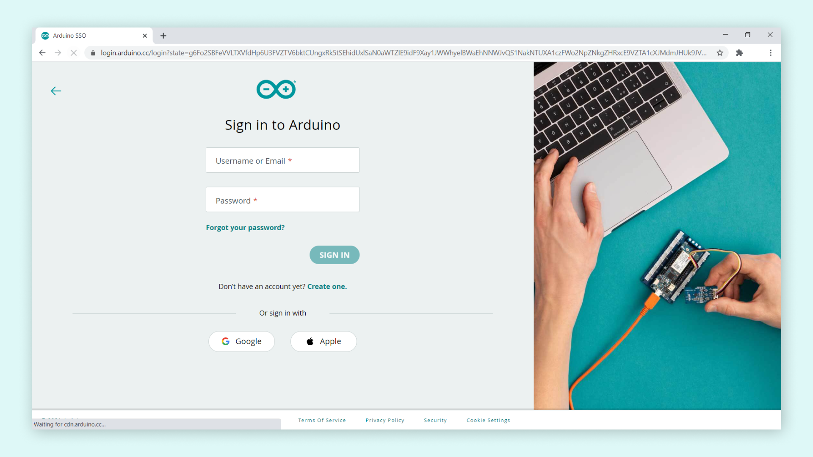
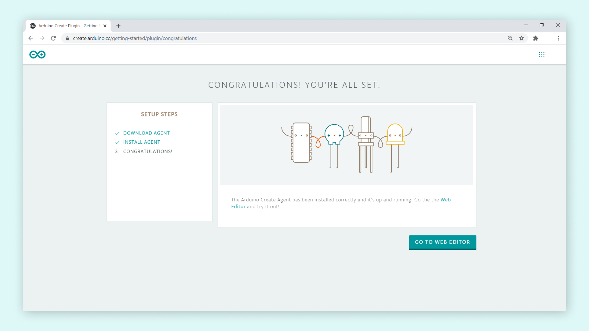
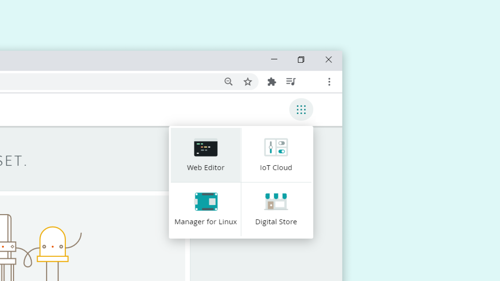
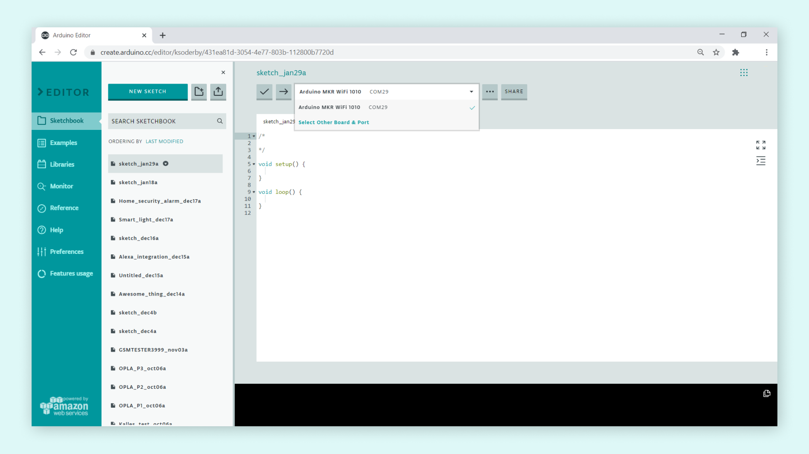
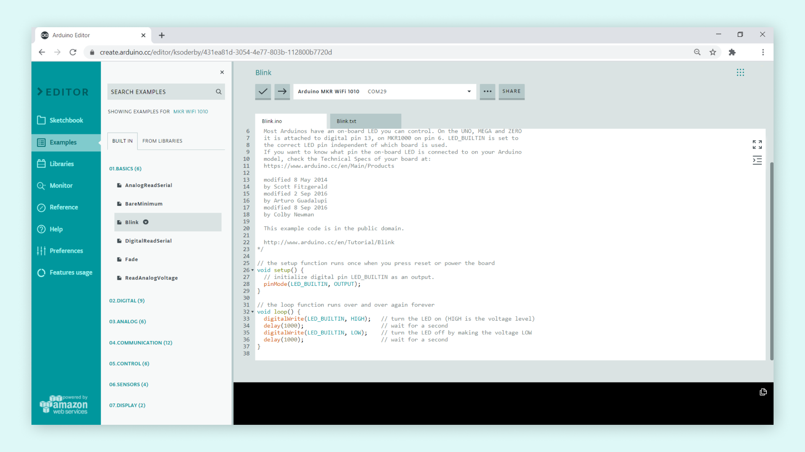

## Getting started with the Web Editor

The Web Editor is a great choice for working with your Arduino board. It stores all of your sketches online, requires no installation of cores and includes most of the popular libraries.

Getting started with the Web Editor is quick & easy, and in this tutorial, we will walk you through the necessary steps so you can use it with your Arduino board.

>**Note:** This tutorial works with **all** official Arduino boards.

### Goals

In this tutorial, we will achieve the following:

- Creating an account (required to use the Web Editor).
- Download and install the [Create Plugin](https://create.arduino.cc/getting-started/plugin/welcome).
- Make sure our board is recognized by the computer.
- Upload a simple blink example.

### Hardware & software needed

- [Arduino Web Editor](https://create.arduino.cc/editor)
- [Create Agent](https://create.arduino.cc/getting-started/plugin/welcome)
- Arduino board
- USB cable (different depending on the board you are using).

### Setting up the Web Editor

We will now go through the necessary steps to get your Arduino board working with the Web Editor.

#### Creating an account

The first step is to create an account. This is done by navigating to login.arduino.cc/login. Here, you can either manually create an account, or login using for example Google.



### Installing the plugin

Once you have created and activated your account, we need to install the **Create Plugin.** This is done by navigating to the [Create Agent Installation page](https://create.arduino.cc/getting-started/plugin/welcome). Here, you simply need to click on **"Start"** to begin the installation.


Follow the instructions at this page to complete the installation. You will need to download the Create Agent in this process, and install it locally on your machine.

When we are done, we should see this screen:



Congratulations, you now have the necessary tools to start using the Web Editor.

> You can find the Arduino Create Agent files by following the path that relates to your operative system:
> 
> **Windows:** `C:\Users\{username}\AppData\Roaming\ArduinoCreateAgent`
> 
> **MacOS:** `Users/{username}/Applications/ArduinoCreateAgent`
> 
> **Linux:** `/home/<user>/ArduinoCreateAgent`

### Uploading a simple example

Now, let's take a look at how the Web Editor works, by uploading a simple example to the board. First, we need to navigate to the Web Editor, by either [clicking this link](https://create.arduino.cc/editor) or clicking the menu at the top right corner, following the image below:



Once you are in the Web Editor, you can see any board that you have connected to the computer. In this case, we have a **Arduino MKR WiFi 1010** at port **COM29** connected. Yours may look differently. This means that the board is recognized and the Create Agent is working.



Now, let's test it out by uploading the basic **Blink example.** This is done by navigating to **Examples > 01.Basics > Blink**, following the image below.



To upload it, click on the arrow in the top left corner of the editor. Do not disconnect the board during the uploading phase.


Once it is uploaded, there should be a message in the bottom of the editor saying:

```
Success. Saved on your online Sketchbook and done uploading Blink.
```

If we look at the board we uploaded the code to, we should see the onboard LED blink with an interval of 1 second. This means that you have successfully used the Web Editor to upload a code to your board!

#### More tutorials

You can find more tutorials in the [Arduino Cloud documentation page](/arduino-cloud).
