## Introduction

In this tutorial, we will go through the steps necessary to set up an **ESP32 / ESP8266 development board** with the Arduino Cloud IoT. To test it out, we will send random values from the board to the cloud, and set up a switch that can enable the built-in LED on the board.

***Over-the-air (OTA) uploads is now supported on ESP32 boards. You can read more about this feature in the [OTA uploads article](/arduino-cloud/features/ota-getting-started).***

## Goals

The goals of this project are:

- Send data to the cloud from the board.
- Turn ON/OFF an LED on the board through the cloud. 

## Hardware & Software needed

- ESP32 / ESP8266 development board.
- [Arduino Cloud IoT](https://create.arduino.cc/iot/).

We will also need the following components for the circuit:

- LED
- 220 ohm resistor
- Breadboard
- Jumper Wires

## Circuit

Follow the circuit below to connect the LED to the ESP32 / ESP8266 board.

>**Note: if you prefer to use your board's built-in LED, you do not need a circuit.**


## Setting up the Arduino Cloud IoT

To start, we will need to head over to the [Arduino Cloud IoT](https://create.arduino.cc/iot/). This is also accessible through the menu at the top right.

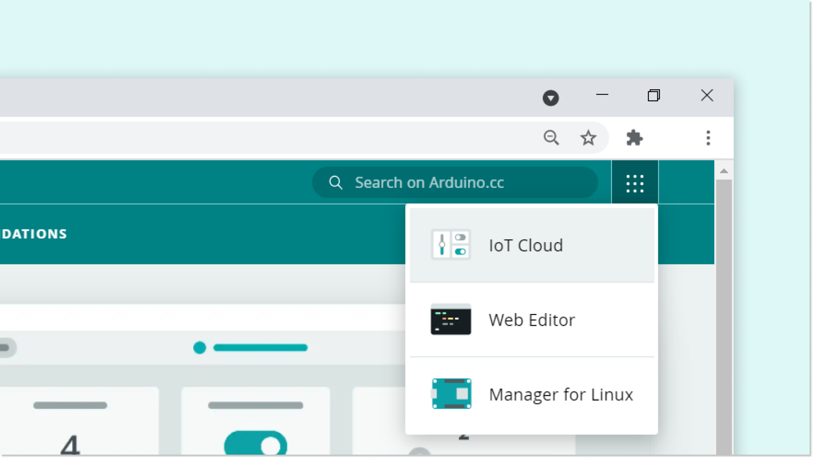

### Step 1: Setting up the device

**1.** Once in the cloud, click on the **"Devices"** tab. Then, click on the **"Add device"** button.


**2.** Then, click on **"Set up a 3rd party device"**. 


**3.** Now we need to select what board we are using. Select either ESP32 or ESP8266, and then choose the board from the drop-down menu.


**4.** Now the board needs a name. We choose **My_ESP32**, but you can have a lot more imagination than that!


**5.** You will now receive your **Device ID** and **Secret key**. Please note that the secret key cannot be recovered, so make sure you note it down. You can also download a PDF with the information.

When you have saved it, tick the box at the bottom, and click on **"Continue"**.

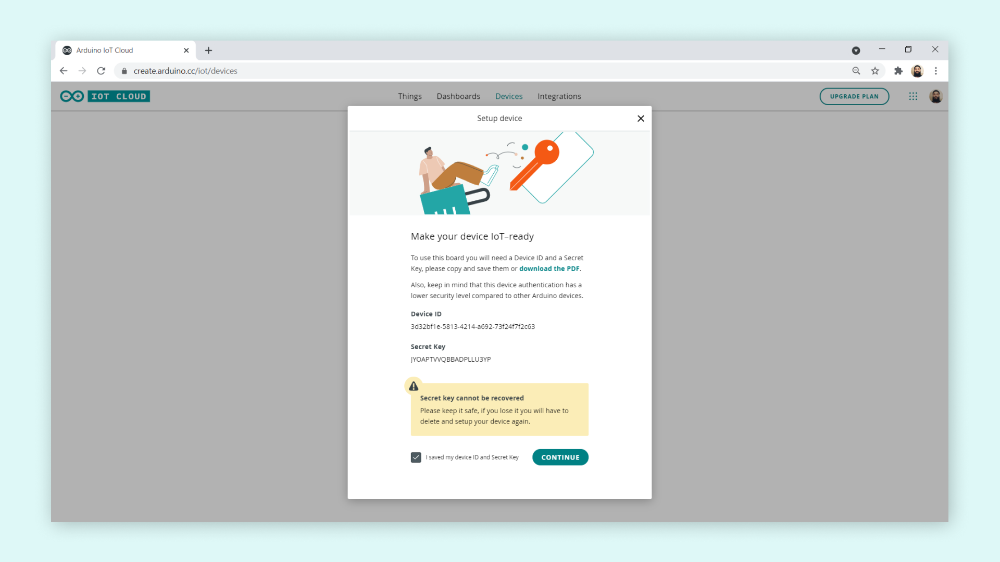

Congratulations! You have now configured your ESP32 board with the Arduino Cloud IoT. Your device will now appear in the list of devices.

### Step 2: Creating a Thing

The next step is to create a Thing. This is done by navigating to the **"Things"** tab. 

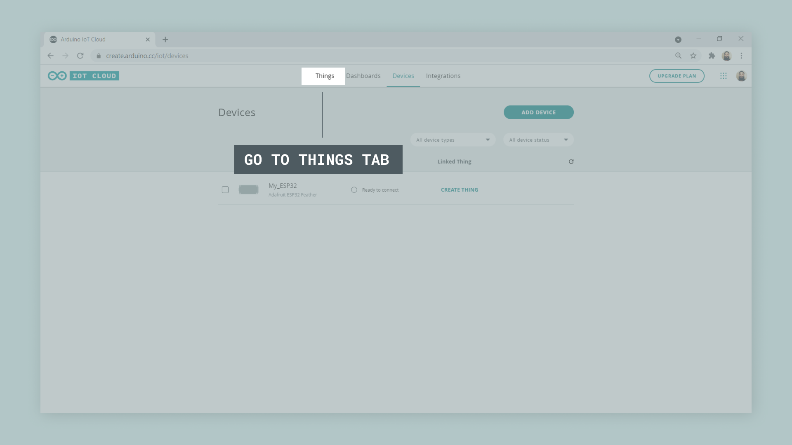

Then, we need to create a new Thing, by clicking on the **"Create Thing"** button. We can then rename our Thing something appropriate to what we are doing, in this case we simply chose **ESP32 Project**.

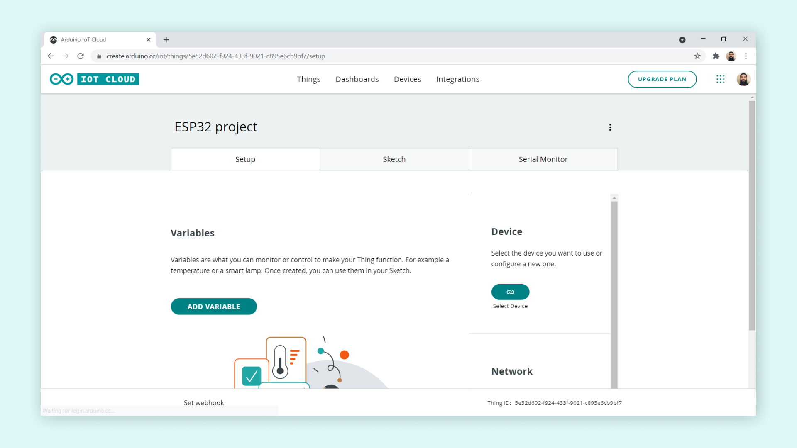

Now, we need to link our device with our Thing. This is done by clicking on the button in the **"Device"** section. This will open a window, where your ESP32 / ESP8266 should be available to select.


Once the device is linked, we need to create two variables: `random_value` and `led_switch`. Click on **"Add variable"** button. This will open a window where you need to fill in variable information. Let's create the `random_value` first. The data type is **int**, permission is **read only** and update policy is **on change**.

Once done, click on the **"Add variable"** button.


Now, let's also add the `led_switch` variable. The data type for this variable is **boolean**, the permission is **read & write**, and update policy is **on change**.

Once done, click on the **"Add variable"** button.

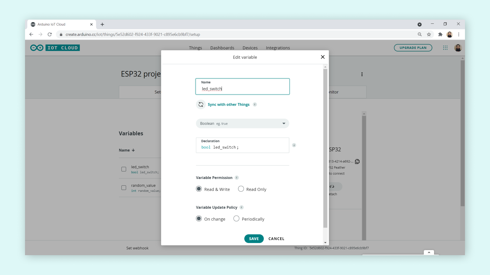

### Step 3: Adding credentials

Now, we need to enter the credentials for our network, plus the secret key generated during the device configuration.

First, click on the button in the **"Network Section"**.

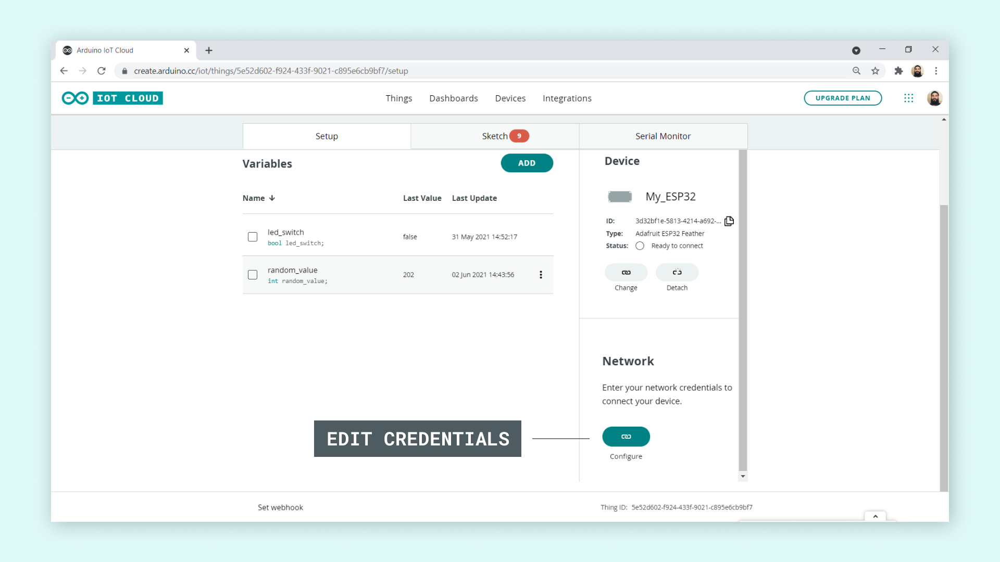

Then, enter the credentials (network name, network password and secret key). Click **"Save"** when finished.

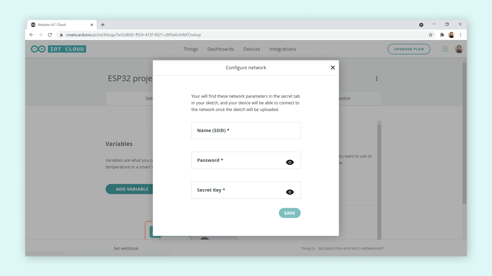

## Programming the board

The next step is to program the board. To do so, we need to go to the **"Sketch"** tab.

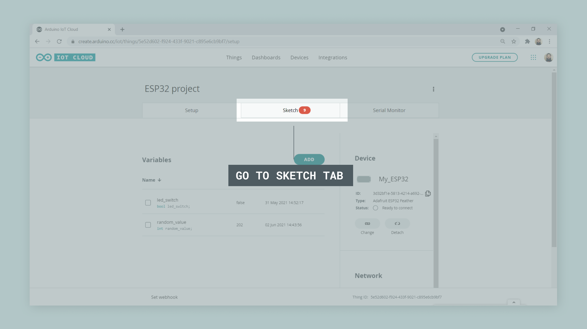

The code for this tutorial can be found in the snippet below. Upload it to the board by clicking on the **"Upload"** button at the top left corner.

## Complete sketch

>**Note:** in this tutorial we are using pin 13 for the LED. You can easily change this to another GPIO, by editing the LED variable.

```arduino
#include "thingProperties.h"

int LED = 13;

void setup() {
  pinMode(LED, OUTPUT);
  // Initialize serial and wait for port to open:
  Serial.begin(9600);
  // This delay gives the chance to wait for a Serial Monitor without blocking if none is found
  delay(1500); 

  // Defined in thingProperties.h
  initProperties();

  // Connect to Arduino IoT Cloud
  ArduinoCloud.begin(ArduinoIoTPreferredConnection);
  
  /*
     The following function allows you to obtain more information
     related to the state of network and IoT Cloud connection and errors
     the higher number the more granular information you’ll get.
     The default is 0 (only errors).
     Maximum is 4
 */
  setDebugMessageLevel(2);
  ArduinoCloud.printDebugInfo();
}

void loop() {
  ArduinoCloud.update();
  // Your code here 
  random_value = random(0, 500);
  delay(500);
}


void onLedSwitchChange() {
  // Do something
  if(led_switch){
    digitalWrite(LED, HIGH);
  }
  else{
    digitalWrite(LED, LOW);
  }
}
```

If the upload was successful, we should see it printed in the console at the bottom of the editor.

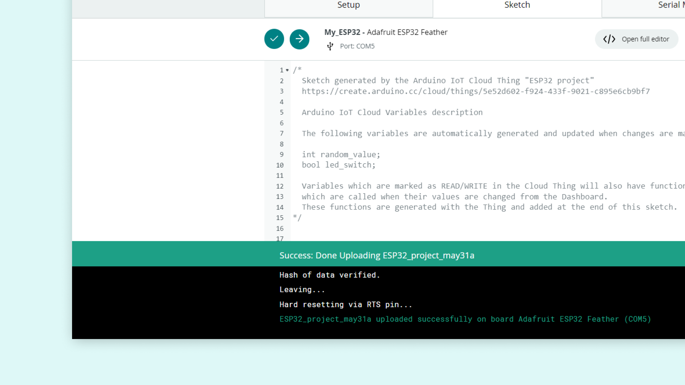

## Creating a dashboard

Now that the sketch is running on the ESP32 / ESP8266 board, we can move on to the final step, which is creating a dashboard. 

First, navigate to the **"Dashboards"** tab.


Then, click on the **"Build dashboard"** button. 

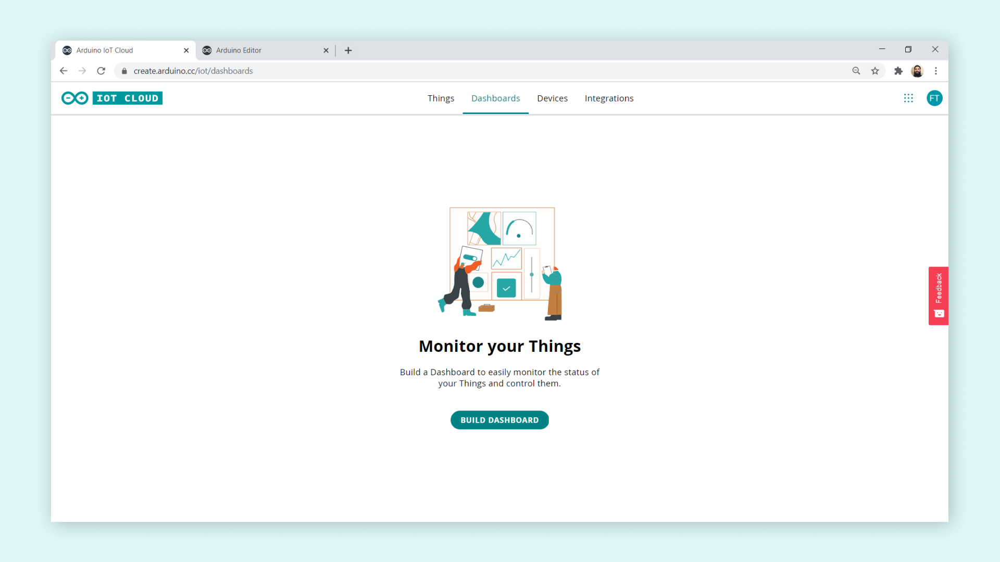

To edit the dashboard, click on the pencil icon at the top left icon, select **"Things"** and search for your Thing. Select it, and click on **"Add widgets"** as shown in the image below. 

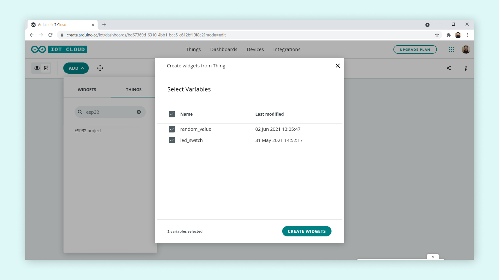

We should now have two widgets that are linked to your ESP32 / ESP8266 board. 

- `random_value` - whenever the `random_value` updates on the board, it also updates here.
- `led_switch` - when we activate this switch, we turn ON the LED connected to the board (pin 13).

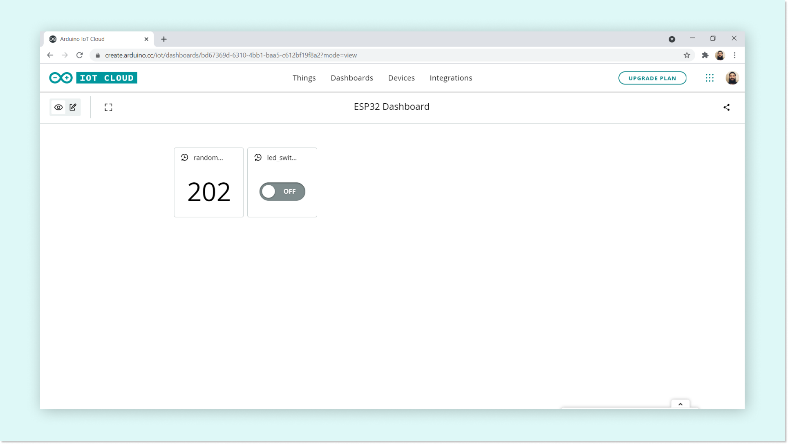


## Troubleshooting

If you are having issues completing this tutorial, make sure that the following is correct:

- We have entered the right **secret key** in the credentials window.
- We have entered the right **network name** and **password** in the credentials window.
- We have selected the right device (if you have multiple devices registered in the cloud, you may have selected the wrong device).

>**Note:** The Arduino Cloud IoT's support for the ESP32 is in an experimental stage. 


## Conclusion

In this tutorial, we went through the basics of setting up an ESP32 / ESP8266 microcontroller to communicate with the Arduino Cloud IoT. We tested this out by sending a **random value** from the board to the cloud, and by creating a switch that **controls an LED** from the cloud.

### More tutorials

You can find more tutorials in the [Arduino IoT Cloud documentation page](/arduino-cloud/).