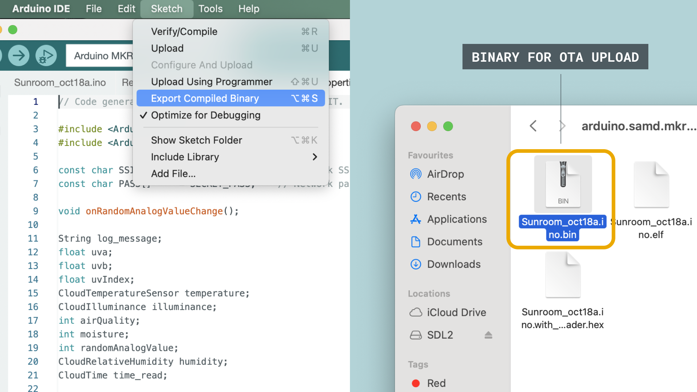

## Introduction

The [Arduino Cloud CLI](https://github.com/arduino/arduino-cloud-cli) is a tool developed to access features of the [Arduino IoT Cloud service](https://create.arduino.cc/iot/) from the terminal. 

It can be used as an automation tool to:
- Clone existing Things & Dashboards (by extracting its template).
- Perform mass OTA uploads.
- Create **devices, things, variables & dashboards** directly via the CLI.

### What is the Arduino Cloud CLI?

This tool was primarily designed to reduce time spent duplicating projects in the Arduino IoT Cloud. Working with the CLI allows you to quickly make 10+ copies of a Thing, or update sketches on 50+ boards simultaneously. 

An example of a workflow using this tool can be:

1. Create your application using the Arduino IoT Cloud web interface. Here you can configure your device, create variables, enter network credentials, edit your sketch and deploy your first project.
2. With the **Arduino Cloud CLI**, extract templates of Things and dashboards you want to replicate.
3. Provision a device with the `device create` command and setup a Thing and dashboard using the templates previously extracted.
4. Download the sketch related to the Thing you extracted, and upload it to the device you created. This can also be done via the Arduino IoT Cloud. 
5. Whenever an update is required for a fleet of devices, you can use the OTA mass-upload tool to update all of your devices at once, without being connected to your computer.


Let's for example say that you have created a "smart plug" setup, that includes 100 devices in a large building. The firmware running on the devices is not optimal, and needs an update. 

With the Arduino Cloud CLI tool, you can not only automate the initial setup of these devices, but also be able to automate the maintenance sequence as well.   

***If you are new to the Arduino Cloud as well, you can follow the [Getting Started guide](/arduino-cloud/getting-started/iot-cloud-getting-started).***

## Requirements

- [Arduino account](https://cloud.arduino.cc/home/).
- [Arduino Cloud CLI](https://github.com/arduino/arduino-cloud-cli) installed.
- A [cloud compatible board](/arduino-cloud/getting-started/iot-cloud-getting-started#compatible-hardware)\*

***\*This is needed only for certain commands, like OTA uploads.***

## Installation

Download and extract the [latest release](https://github.com/arduino/arduino-cloud-cli/releases). Make sure it is in your machine's PATH, so that it can be used globally.

After installation, check that it is working by opening a terminal, and type: 

```
arduino-cloud-cli
```

## Overview

The Arduino Cloud CLI has 5 main commands.

- `credentials` - credentials specific commands.
- `dashboard` - dashboard specific commands.
- `device` - device specific commands
- `ota` - Over The Air uploads.
- `thing` - Thing specific commands.

Each command has a set of **subcommands** which we will be exploring in this guide.

## Credentials 

- `arduino-cloud-cli credentials`

***Get your API key from the [Arduino Cloud home page](https://cloud.arduino.cc/home/) (bottom left corner of the page)***

To authenticate with the Arduino Cloud, we will need to first set our credentials, using our `clientId` and `clientSecret` which is obtained from the Arduino Cloud API keys section.

To authenticate, begin with:

```
arduino-cloud-cli credentials init
```

And enter your credentials.

This will create a `arduino-cloud-credentials.yaml` file in your [Arduino Data directory](https://support.arduino.cc/hc/en-us/articles/360018448279-Open-the-Arduino15-folder). 

To overwrite, we can use:

```
arduino-cloud-cli credentials init --overwrite
```

It is also possible to use `.json` as format, (default is yaml):

```
arduino-cloud-cli credentials init --file-format json
```

As you may have multiple `arduino-cloud-credentials.yaml` existing, you can use the following command to locate the one that is currently being used:

```
arduino-cloud-cli credentials find
```

## Device

- `arduino-cloud-cli device`

To configure a device, you can use the following command:

```
arduino-cloud-cli device create --name <deviceName> --port <port> --fqbn <deviceFqbn>
```

Here's follows the FQBN's list of the supported devices:

* `arduino:samd:nano_33_iot` [Arduino Nano 33 IoT](https://docs.arduino.cc/hardware/nano-33-iot)
* `arduino:samd:mkrwifi1010` [Arduino MKR WiFi 1010](https://docs.arduino.cc/hardware/mkr-wifi-1010)
* `arduino:mbed_nano:nanorp2040connect` [Arduino Nano RP2040 Connect](https://docs.arduino.cc/hardware/nano-rp2040-connect)
* `arduino:mbed_portenta:envie_m7` [Arduino Portenta H7](https://docs.arduino.cc/hardware/portenta-h7) / [Arduino Portenta H7 Lite connected](https://docs.arduino.cc/hardware/portenta-h7-lite-connected) / [Arduino Portenta Machine Control](https://docs.arduino.cc/hardware/portenta-machine-control)
* `arduino:mbed_nicla:nicla_vision` [Arduino Nicla Vision](https://docs.arduino.cc/hardware/nicla-vision)
* `arduino:samd:mkr1000` [Arduino MKR 1000 WiFi](https://docs.arduino.cc/hardware/mkr-1000-wifi)
* `arduino:samd:mkrgsm1400` [Arduino MKR GSM 1400](https://docs.arduino.cc/hardware/mkr-gsm-1400)
* `arduino:samd:mkrnb1500` [Arduino MKR NB 1500](https://docs.arduino.cc/hardware/mkr-nb-1500) 
* `arduino:mbed_opta:opta` [Arduino Opta](https://docs.arduino.cc/hardware/opta) 

### LoRaWAN® Devices

To configure LoRaWAN® devices, use the additional `create-lora` and the `--frequency-plan` flag. This 

```
arduino-cloud-cli device create-lora --name <deviceName> --frequency-plan <freqID> --port <port> --fqbn <deviceFqbn>
```

LoRaWAN® devices that are supported: 

* `arduino:samd:mkrwan1310`
* `arduino:samd:mkrwan1300`

To find out what frequency to use for `--frequency-plan` flag, you can run:

```
arduino-cloud-cli device list-frequency-plans
```

### Generic Devices (ESP32 / ESP8266)

General devices is a virtual device that does not need to be attached to a physical board. 

To see the full list of supported FQBNs (Fully Qualified Board Names), you can run the following command:

```
arduino-cloud-cli device list-fqbn
```

To create a generic device, you can use the following command. Note that the `--fqbn` flag is optional: leaving this blank will set the fqbn to `generic:generic:generic`. 

```
arduino-cloud-cli device create-generic --name <deviceName> --fqbn <fqbn>
```

### Delete a Device

Devices can be deleted using the device delete command.

This command accepts two mutually exclusive flags: `--id` and `--tags`. Only one of them must be passed. When the `--id` is passed, the device having such ID gets deleted:

```
arduino-cloud-cli device delete --id <deviceID>
```

When `--tags` is passed, the devices having all the specified tags get deleted:

```
arduino-cloud-cli device delete --tags <key0>=<value0>,<key1>=<value1>
```

### List Devices

Devices currently present on Arduino IoT Cloud can be retrieved with:

```
arduino-cloud-cli device list
```

It has an optional `--tags` flag that allows to list only the devices having all the provided tags:

```
arduino-cloud-cli device list --tags <key0>=<value0>,<key1>=<value1>
```

### Tag Device

Add tags to a device. Tags should be passed as a comma-separated list of `<key>=<value>` items:

```
arduino-cloud-cli device create-tags --id <deviceID> --tags <key0>=<value0>,<key1>=<value1>
```

### Untag Device

Deletes specific tags of a device. The keys of the tags to delete should be passed in a comma-separated list of strings:

```
arduino-cloud-cli device delete-tags --id <deviceID> --keys <key0>,<key1>
```

## Things

- `arduino-cloud-cli things`

**Things** in the Arduino IoT Cloud is the virtual twin of your hardware device. In a Thing, you create variables, attach device and add network credentials. 

With `arduino-cloud-cli` you can:

- `extract` a template from existing Things, and output in a template file (`.yaml`). 
- `create` a Thing, based on a template.
- `clone` a Thing. This command simply duplicates a Thing.
- `bind` a device to a Thing (attach it).

### Extract Thing Template

Extract a template from an existing Thing.

The template is printed to stdout and its format depends on the global `--format` flag:

```
arduino-cloud-cli thing extract --id <thingID> --format <json|yaml>
```

### Create Things

Create a thing from a thing template.

Supported template formats are JSON and YAML. The name parameter is optional. If it is provided, then it overrides the name retrieved from the template:

```
arduino-cloud-cli thing create --name <thingName> --template <template.(json|yaml)>
```

### Clone Things

To clone a Thing (duplicating it), we can use the `clone` command. Note that `--name` is a mandatory flag. 

```
arduino-cloud-cli thing clone --name <thingName> --clone-id <thingToCloneID>
```

### List Things

The `thing list` prints out information regarding your Things. It can be used to e.g. list out a Thing's ID, or list attached variables. 

To display all Things with all variables, use: 

```
arduino-cloud-cli thing list --show-variables
```

To print a list of specific Things, we can use the `--ids` flag followed by the thing IDs, separated by comma.

```
arduino-cloud-cli thing list --ids <thingOneID>,<thingTwoID>
```

Print out the Thing associated with a specific device.

```
arduino-cloud-cli thing list --device-id <deviceID>
```

Print only the things that have all the specified tags:

```
arduino-cloud-cli thing list --tags <key0>=<value0>,<key1>=<value1>
```

### Delete Things

Things can be deleted using the thing delete command.

This command accepts two mutually exclusive flags: `--id` and `--tags`. Only one of them must be passed. When the `--id` is passed, the Thing with the matching ID will be deleted.

```
arduino-cloud-cli thing delete --id <thingID>
```

When `--tags` is passed, the Things having all the specified tags get deleted:

```
arduino-cloud-cli thing delete --tags <key0>=<value0>,<key1>=<value1>
```

### Bind Thing to Device

Binding a device is the same as "attaching" a device to a Thing.

To bind a Thing to an existing device:

```
arduino-cloud-cli thing bind --id <thingID> --device-id <deviceID>
```

### Tag a Thing

Add tags to a Thing. Tags should be passed as a comma-separated list of `<key>=<value>` items:

```
arduino-cloud-cli thing create-tags --id <thingID> --tags <key0>=<value0>,<key1>=<value1>
```

### Untag a Thing

Delete specific tags of a Thing. The keys of the tags to delete should be passed in a comma-separated list:

```
arduino-cloud-cli thing delete-tags --id <thingID> --keys <key0>,<key1>
```

## Dashboard

- `arduino-cloud-cli dashboard`

Dashboards are used to visualize and interact with data from your board. With the `arduino-cloud-cli` you can:
- `extract` template from a dashboard and output in a template file (`.yaml`). 
- `create` a dashboard from a template file. 

### Extract Dashboard Template

Extract a template from an existing dashboard. The template is printed to stdout and its format depends on the global `--format` flag:

```
arduino-cloud-cli dashboard extract --id <dashboardID> --format <json|yaml>
```

### List Dashboards

Print a list of available dashboards and their widgets by using this command:

```
arduino-cloud-cli dashboard list --show-widgets
```

### Delete Dashboards

Delete a dashboard with the following command:

```
arduino-cloud-cli dashboard delete --id <dashboardID>
```

### Create Dashboard

Dashboards can only be created from a template. Supported dashboard template formats are `.json` and `.yaml`. The name parameter is optional. If it is provided, then it overrides the name retrieved from the template. The `--override` flag can be used to override the template `thing_id` placeholder with the actual ID of the thing to be used.

```
arduino-cloud-cli dashboard create --name <dashboardName> --template <template.(json|yaml)> --override <thing-0>=<actualThingID>,<thing-1>=<otherActualThingID>
```

## OTA (Over-The-Air)

- `arduino-cloud-cli ota`

OTA (Over-The-Air) is the process of upgrading the firmware remotely.

With the `arduino-cloud-cli`, you can:

- `upload` sketches to a board remotely. 
- `mass-upload` sketches to several boards simultaneously, also remotely.
- Schedule a preferred time (up to one week in advance) for an upload to happen, by using the `--deferred` flag.

### Upload

To upload a sketch, you will need to specify the `--device-id` and `--file`.  

```
arduino-cloud-cli ota upload --device-id <deviceID> --file <sketch-file.ino.bin>
```

***Note that this is not your `.ino` file, but a binary file that you will need to generate. You will find instructions [further down this document](#compile-sketches-bin) on how to do this.***

### Deferred Upload

The default OTA upload should complete in 10 minutes. Use `--deferred` flag to extend this time up to one week (see an example sketch [here](https://github.com/arduino-libraries/ArduinoIoTCloud/blob/ab0af75a5666f875929029ac6df59e04789269c5/examples/ArduinoIoTCloud-DeferredOTA/ArduinoIoTCloud-DeferredOTA.ino)):

```
arduino-cloud-cli ota upload --device-id <deviceID> --file <sketch-file.ino.bin> --deferred
```

### Mass Upload

It is also possible to perform a mass ota upload through a specific command.
The fqbn is mandatory.

To upload using a device 

```
arduino-cloud-cli ota mass-upload --fqbn <deviceFQBN> --device-ids <deviceIDs> --file <sketch-file.ino.bin>
```

You can also specify by using `device-tags` (see the [Tag a Device](#tag-device) section.)

```
arduino-cloud-cli ota mass-upload --fqbn <deviceFQBN> --device-tags <key0>=<value0>,<key1>=<value1> --file <sketch-file.ino.bin>
```

### Compile Sketches (.bin)

When uploading a sketch using OTA, you will need to compile the binary file (`.bin`) first. This is **not** a feature in the `arduino-cloud-cli`, so you will need to use the following options:

- [Arduino CLI](https://arduino.github.io/arduino-cli/)
- [Arduino IDE](https://www.arduino.cc/en/software) 

#### Compile with Arduino CLI

Using `arduino-cli`, you can compile a sketch through the following command: 

```
arduino-cli compile -b arduino:samd:mkrwifi1010 /home/user/Arduino/MySketch
```

***You can find out your board's FQBN by running `arduino-cli board listall`, a command that lists all boards and their corresponding FQBN.***

#### Compile with Arduino IDE

You can also compile a file through any version of the Arduino IDE (not online). 

- In the IDE, with your sketch open, navigate to **Sketch > Export Compiled Binary**. In your sketch folder, a new folder called `build` will appear. The binary needed is located inside of this folder.
- To navigate to your sketch folder, navigate to **Sketch > Show Sketch Folder**. You will see the `<sketchname>.bin` file, which is the file we can use to perform OTA.



## Summary

The Arduino Cloud CLI is a tool that can primarily be used to extract a template from a single Thing or dashboard, and deploy it to several devices. It is also a tool for managing your fleet of devices, such as providing mass OTA uploads (such as firmware updates). 

It is intended to be used as a supplementary tool for the [Arduino IoT Cloud](https://cloud.arduino.cc/home/) web interface, but can well be used as a standalone tool to manage your devices, Things properties and dashboards. 

The Arduino Cloud CLI can also be well combined with the [Arduino CLI](https://arduino.github.io/arduino-cli), a separate tool that brings the functionality of the Arduino IDE to your choice of terminal.

To recap, this tool can be used to:
- Extract templates from your existing Things & dashboards previously created in the Arduino IoT Cloud.
- Perform the same actions as the Arduino IoT Cloud but from a terminal (like creating/deleting devices, Things and linking them).
- List all available components from the cloud (like `thing list`).
- Tag your devices & Things with the `--tags <key0>=<value0>` command.

