## Overview

The [Arduino Cloud for Business](https://www.arduino.cc/pro/software-arduino-iot-cloud/) is an Arduino IoT Cloud plan dedicated to companies and industrial clients wanting enhanced features in terms of device management, Role-Based Access Control (RBAC), fleet management, and safe remote access.

In this article, you will get a general overview of the major features of the Arduino Cloud for Business.

If you are not familiar with Arduino IoT Cloud, we strongly recommend you to take a look at the following documentation:

* To find all tutorials & articles, visit the [Arduino IoT Cloud Documentation page](https://docs.arduino.cc/cloud/iot-cloud).
* For a technical overview, list of features, and API guide, visit the [Arduino IoT Cloud Cheat Sheet](https://docs.arduino.cc/cloud/iot-cloud/tutorials/technical-reference).
* For API & SDK Documentation, visit the developer reference at [Arduino IoT Cloud API](https://www.arduino.cc/reference/en/iot/api/).

## Goals

* Get in-depth information about how the Arduino Cloud for Business works
* Learn about the multiple dedicated features Arduino Cloud for Business provides
* Learn how to get started with Arduino Cloud for Business

## Required Software

* [Arduino Cloud for Business](https://cloud.arduino.cc/plans#business)

## Purchase An Arduino Cloud For Business Plan

In order to get started with Arduino Cloud for Business, you need to [subscribe to a plan](https://cloud.arduino.cc/plans#business).

The Arduino Cloud for Business plan consists of two main subscriptions:

* **Enterprise Base Plan.** It includes all the Arduino Cloud for Business features, like data plane, fleet management, Role-Based-Access-Control, Web Editor with Over-the-air updates, IoT Cloud with dashboards, etc. Multiples of 50 devices can be connected under the Enterprise Base Plan – and you can always [contact our team](https://www.arduino.cc/pro/contact-us) for a tailored plan to accelerate your IoT solutions.
* **Optional Add-Ons.** To address additional needs, Arduino Cloud for Business can be customized with optional add-ons. Check the [dedicated section](#optional-add-ons) of this tutorial to learn more.

If you do not need any tailored plan, go to [Arduino Cloud for Business page](https://cloud.arduino.cc/plans#business) and select **Purchase**. You will be then asked to log in with your Arduino credentials. If you do not have an account yet, feel free to create a new one.

It is now time to customize your plan. Select the billing frequency you prefer and the number of Things (and so devices) that you would like to connect with your Arduino Cloud for Business workspace. Click on **Continue**.

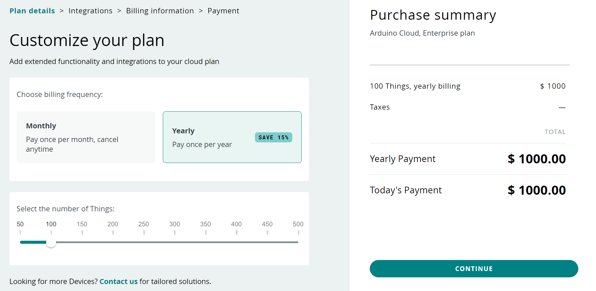

Proceed by marking the optional add-ons you may need in your projects and click on **Add billing information**. To learn more about these add-ons, check the [dedicated section](#optional-add-ons) of the present getting started guide.

In the next steps, add all your billing and payment information and then purchase your plan.

Now you are ready to get started with your brand new Arduino Cloud for Business plan.

Check the next sections to understand how to set up your account and which features are included in your plan.

## Manage Your Spaces

Once your plan has been successfully activated, you will be asked to define the company/space name for your workspace. You are free to modify it later by navigating to `Arduino Cloud > General Settings > Space information > Edit info > Name`.

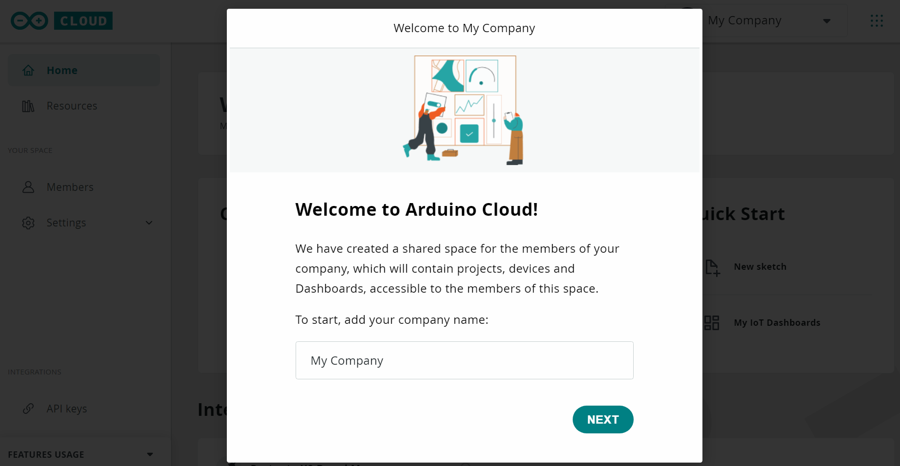

Your Arduino Cloud for Business plan comes with two spaces by default:

* **My Cloud**. My Cloud is an automatically created private space once the Arduino Cloud for Business plan is purchased. You can use this space for personal projects you do not want to share with all your team. This space is free and includes two Things, unlimited dashboards, and 100MB of Sketch storage by default, but it can be further extended and customized within *My plans* settings. Have a look at the [Arduino IT Cloud Getting Started](https://docs.arduino.cc/arduino-cloud/getting-started/iot-cloud-getting-started) if you would like to start using your private space.
* **Shared Space**. A *Shared Space* is a company space you can use with all your team. It can have any number of members, who can all access the resources within its space. The access level and specific permissions can be customized by the *Space Admin* (see [Invite members into your space section](#invite-members-into-your-space) to learn more).

In the next sections, you will learn more about Shared Space features and functionalities.

### Switch Between Spaces

If you are the owner of more than one Shared Space, or you have been invited into a Shared Space by another user, you can switch to other Shared Spaces at any time using the corresponding menu.

Move your mouse over the Space-Selector, which you can find at the top right-hand corner, and click on it. All the Spaces you have access to will be listed there.

The Space-Selector shows you at any time which Space you are currently working on, in this case, *Arduino PRO*. To switch to another Space, simply select the Space you would like to work on.

### Change Shared Space Settings

To change the current settings of your Shared Space, navigate to the **General Settings** tab using the sidebar.

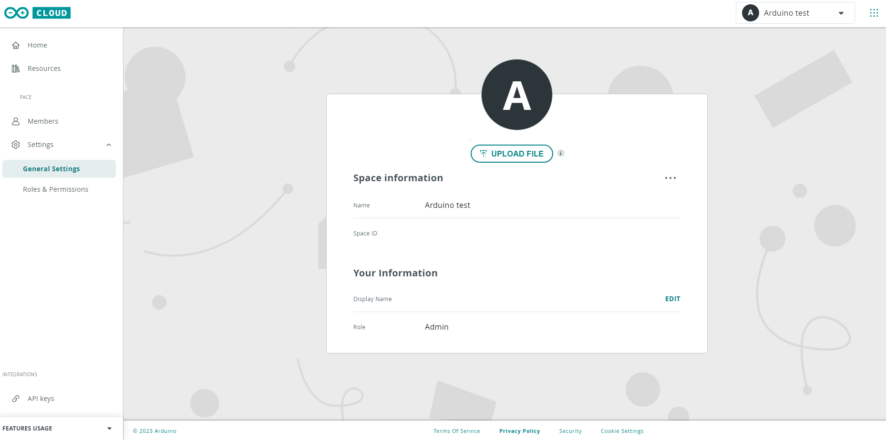

There you will find multiple options to customize your Shared Space, including:

* Editing the Space name
* Assigning your custom logo

### Create Additional Spaces

The Arduino Cloud for Business plan allows you to create and manage one Shared Space and one Private Space. If you need additional Spaces, you have to purchase a new Arduino Cloud plan. Check the available plans [here](https://cloud.arduino.cc/plans).

In order to create a new Shared Space, click on **New Shared Space** in the Space-Selector.

Then you will be asked which type of Shared Space you want to create (i.e. For Business or For Education). Click on the type of your interest and proceed with purchasing a new plan.

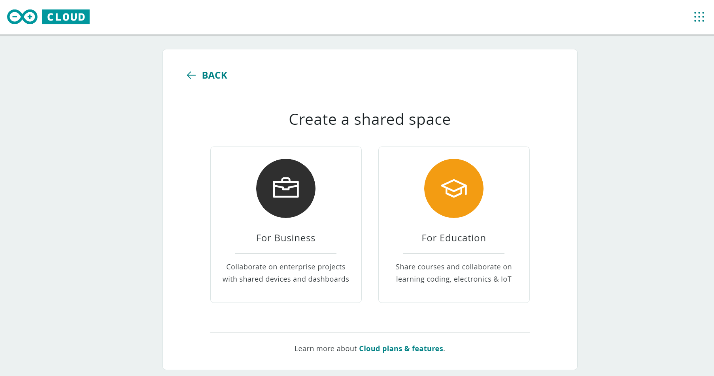

### Invite Members Into Your Space

To add more members to your Shared Space, use the sidebar to navigate to the **Members** item under **Your space** group.

There you will find the complete list of all members who have access to your Shared Space, as well as the current role of each member.

#### Members Types

There are multiple role types in Arduino Cloud for Business to allow the admin to have full control of the rights/permissions each user has in the Shared Space. In this way, the admin can set up Role-Based-Access-Control (RBAC) by assigning profiles and sharing with any number of users.

The table below reports the list of supported roles and corresponding permissions.

|                                           | Admin | Manager | Editor | Viewer | Service Account |
|-------------------------------------------|-------|---------|--------|--------|-----------------|
| **Create/edit/delete Things**             | X     | X       | X      |        |                 |
| **View Things**                           | X     | X       | X      | X      |                 |
| **Add/edit/delete Devices**               | X     | X       | X      |        |                 |
| **View Devices**                          | X     | X       | X      | X      |                 |
| **Create/edit/delete Dashboards/Widgets** | X     | X       | X      |        |                 |
| **View Dashboards**                       | X     | X       | X      | X      |                 |
| **Widget Interaction**                    | X     | X       | X      | X      |                 |
| **Download Historical Data**              | X     | X       | X      | X      |                 |
| **Add/remove Members**                    | X     | X \[1\] |        |        |                 |
| **Manage billing**                        | X     |         |        |        |                 |
| **Create/edit/delete API keys**           |       |         |        |        | X               |

\[1\] It can add/remove only Editors or Viewers.

Thus, the only role with full permissions is the *Admin*, which corresponds to the owner of the Arduino Cloud for Business plan.

In addition to manager/editor/viewer roles, we added a Service Account, which should be one dedicated to the creation and maintenance of API Keys Tokens. We recommend having at least one Service Account for each Shared Space and linking it to a non-personal email account. In this way, API Keys do not risk getting lost with the cancellation of a personal email address.

#### Add A New Member

To add a new member, click on **Add member** in the top right-hand corner.

The following page will appear to allow you to send an email invitation to all the members you would like to join your Space.

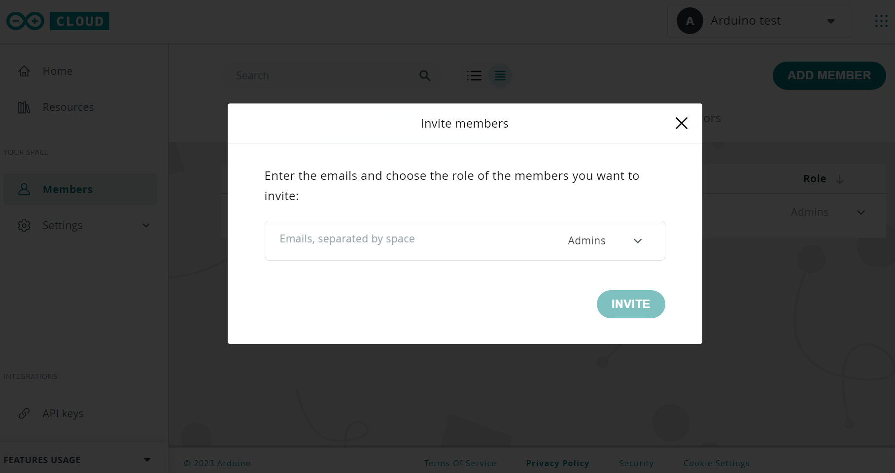

Type the email addresses of all your team and define which role they will cover in your Space based on the available options. Click on **Invite**.  
The users you added will get the invitation by email with a link to join your Shared Space. You are now ready to start working all together on your Arduino Cloud projects.

## Device Management

The Arduino Cloud for Business allows for device management with Over-The-Air updates, secure provisioning to connect boards leveraging their secure element, and easy verification of their status (connected, not connected) and maintenance.

### Compatible Hardware

The Arduino Cloud for Business is compatible with multiple Arduino boards or devices based on the ESP32 / ESP8266 microcontrollers. The Arduino Cloud currently supports devices connected via Wi-Fi®, Ethernet, LoRaWAN® (via The Things Network), and cellular connectivity.

To check the full list of compatible Hardware, have a look at [this tutorial](https://docs.arduino.cc/arduino-cloud/getting-started/iot-cloud-getting-started).

### Device Provisioning

Arduino Cloud allows you to securely provision your devices through two different tools:

* **Arduino IoT Cloud.** Arduino IoT Cloud is an App integrated into your Arduino Cloud Space, guaranteeing straightforward provisioning of Arduino or other Cloud-compatible devices. It is provided with a dedicated User Interface which will guide you step-by-step during the onboarding process. This is a great choice in case you need to provision a few devices or you are not an advanced user.
* **Arduino Cloud CLI.** As explained in [this section](#arduino-cloud-cli), Arduino has developed a command line tool enabling the access of all Arduino IoT Cloud features from a terminal window. Arduino Cloud CLI is the right choice when you need to provision multiple devices at the same time and you are an advanced user.

#### Device Provisioning With Arduino IoT Cloud

If your device is compatible with Arduino Cloud, you can start provisioning it into your Shared Space by connecting it to your computer through a USB cable.

In addition, Arduino IoT Cloud requires your computer to have the [Arduino Create Agent installed](https://create.arduino.cc/getting-started/plugin/welcome).

When you are all set up correctly, you can click on **Arduino IoT Cloud** button in your Shared Space.

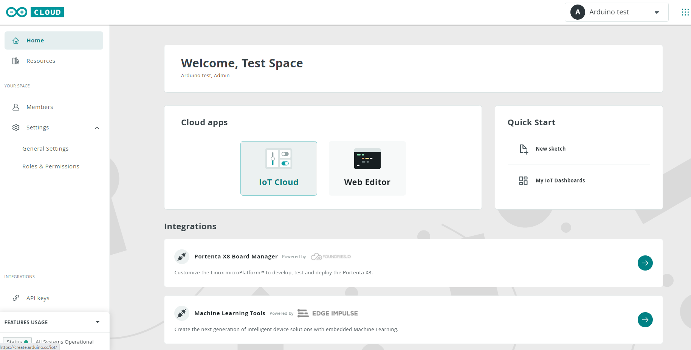

Go to the **Devices** tab, click on **Add** and decide which type of device you would like to onboard. In this case, a Portenta H7 board will be used.

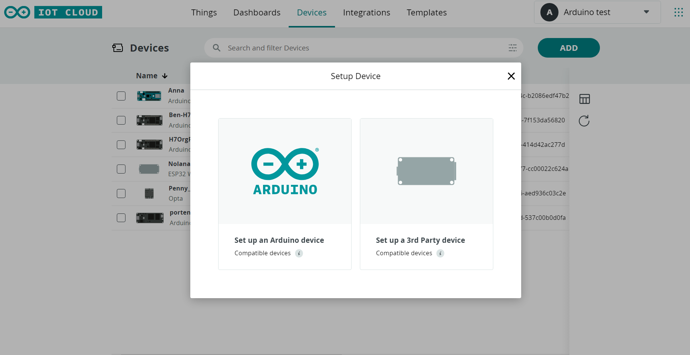

The agent will start looking for your board. When your board has been found, the following screen will appear. Click on **Configure**.

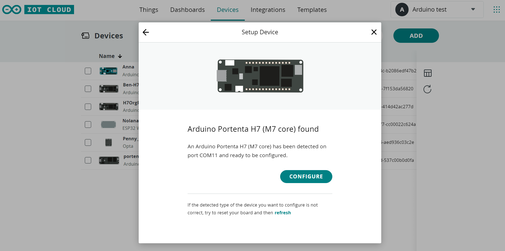

Select a board name to be able to correctly identify your device and click on **Next**.  

Define the connection type you want to use with your board and click on **Next.** The agent will start securely provisioning your device by leveraging the secure element embedded in your board. This way, your security keys will be stored in the secure element and full data encryption will be guaranteed during data exchanges between Arduino devices and the Cloud.

***If you want to learn more about security in Arduino Cloud, please check the [dedicated documentation](https://docs.arduino.cc/arduino-cloud/features/security-considerations).***

If the onboarding proceeds as expected, the following page will appear confirming that your device has been successfully provisioned in Arduino Cloud.

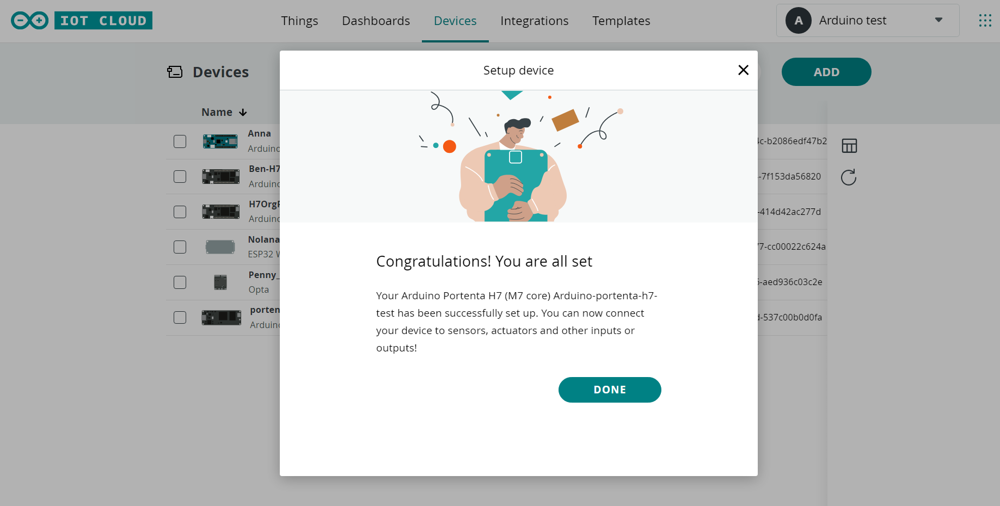

You can now check its status under the Devices section. This section displays the name, status, and linked Things for each of the configured devices. Clicking on the device allows for renaming it, as well as accessing more information about the device, such as its ID number, type, FQBN, serial number, firmware version, linked Thing, latest activity, and the date when the device was added.

The device status indicates whether it is connected to the Arduino IoT Cloud (online), or not connected (offline).

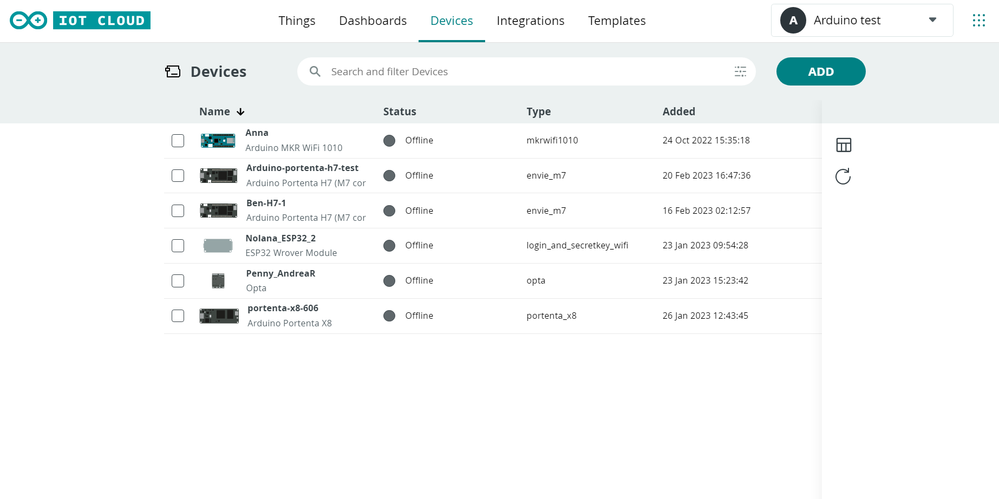

#### Device Provisioning With Arduino Cloud CLI

If you need to provision more than one device at a time or you prefer to work through your terminal window, we have the right tool for you: [Arduino Cloud CLI](https://github.com/arduino/arduino-cloud-cli).

To proceed with the onboarding, check [this tutorial](https://docs.arduino.cc/arduino-cloud/getting-started/arduino-cloud-cli). It will explain to you all the required steps to provision your board through your terminal.

### Assign A Thing To Your Device

As already said, once a device is successfully configured, it appears in the "Devices" list and can be used to create a Thing, or can be linked to an existing Thing.

To use your devices in IoT Cloud, you need to associate a Thing with each of them. A Thing is the digital twin of your device, holding the configuration of some variables and other settings, as well as the history of the data collected for those variables.

To create a Thing, click on **Create Thing** next to the device of your interest, and your Thing will be automatically created for you. At this point, you can start updating it.

***If you want to understand how to work with your Things, check the dedicated documentation available [here](https://docs.arduino.cc/arduino-cloud/getting-started/iot-cloud-getting-started#3-creating-a-thing).***

***Do you want to learn more about the different types of Variables and their features? Have a look at [this tutorial](https://docs.arduino.cc/arduino-cloud/getting-started/cloud-variables).***

### Device Programming

It is now time to start uploading sketches on your devices.

The Arduino Cloud has a feature capable of creating some pre-built sections of the sketch related to a Thing, including some libraries necessary to interact with the cloud variables, as well as directly populating and updating the sketch once the new cloud variables are created and defined.

The sketch related to the thing is visible from the tab "Sketch" next to the "Setup" view, where the Thing's list of cloud variables is shown.

From this sketch view, by clicking the "</>Open full editor button", it is fast and smooth to access the Arduino Cloud integrated [Web Editor](https://docs.arduino.cc/learn/starting-guide/the-arduino-web-editor), which allows you to program your boards from any browser and use the latest Arduino IDE features and libraries without having to install any software locally.

Otherwise, to open the Web Editor to directly retrieve your sketches, go to Arduino Cloud Home and click on the [Web Editor](https://create.arduino.cc/editor) button.

***To get started with the Web Editor, check the dedicated tutorial at [this link](https://docs.arduino.cc/arduino-cloud/getting-started/getting-started-web-editor). However, if you have already developed your sketch and you would like to import it into the Web Editor, see the corresponding documentation [here](https://docs.arduino.cc/arduino-cloud/tutorials/import-your-sketchbook-and-libraries-to-the-web-editor)***

All the created sketches are individual and owned by the user that created them. Other members of the Shared Space can access your sketch in their Web Editor only if you share it with them. If you would like to do so, have a look at [this tutorial](https://docs.arduino.cc/arduino-cloud/tutorials/share-your-sketches) on how to do it.

Keep in mind that your sketch may contain some sensitive data that you do not want to share with other members, like Wi-Fi credentials or API keys. If this is the case, check [this tutorial](https://docs.arduino.cc/arduino-cloud/tutorials/store-your-sensitive-data-safely-when-sharing) to learn how to share sketches without sharing sensitive data.

### OTA Updates

Arduino Cloud for Business integrates an amazing feature: Over-The-Air updates. This feature allows you to upload sketches wirelessly to your Arduino boards. This way, as soon as you have a compatible board connected to a WiFi/Ethernet network and configured to work with OTA, you will not need to physically connect the board to your computer to upload new sketches to it; instead, everything will work Over-The-Air, even from remote.

***Are you interested in learning how to perform an OTA update? Check [this tutorial](https://docs.arduino.cc/arduino-cloud/features/ota-getting-started#how-does-it-work). If you prefer to use the Arduino Cloud CLI instead, go to [this link](https://docs.arduino.cc/arduino-cloud/getting-started/arduino-cloud-cli#ota-over-the-air).***

## Fleet Management

Now it is time for you to start managing your fleet of devices/Things. The Arduino Cloud for Business fleet management features allow you to filter your devices/Things by status, add tags to more efficiently identify your projects, search between boards, and list and order them.

Get started with this awesome feature by going to **Things** or **Devices** tab in [Arduino IoT Cloud](https://create.arduino.cc/iot/devices) and start searching and filtering among your Things/devices.

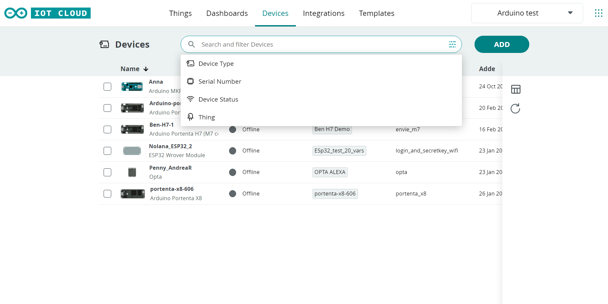

If you want to create your own tag, which you can use as a filtering option, go to **Things** tab, click on the Thing you would like to tag, and go to the Metadata tab as shown in the figure below.

.

Click on **Add**. You will be asked to customize your tag through two fields:

* **Key**. The Key is the filter name which you will see among the list of available filtering options. E.g. Location.
* **Value**. The Value corresponds to the specific value your tag has for that specific Thing. E.g. Rome.

You can add an unlimited number of tags to each Thing.

At this point, you can go back to the Things tab and start filtering your Things according to the new tag you have just created.

## Dashboards

With Arduino Cloud for Business, you can create an unlimited number of dashboards. Push button, Switch, Scheduler, Map, Chart… These are just a few of the many widgets you can customize to visualize all your data or to remotely control your devices.

In order to start creating your dashboard, go to **Dashboards** tab in [Arduino IoT Cloud](https://create.arduino.cc/iot/dashboards) and select the Thing you want to create a dashboard for.

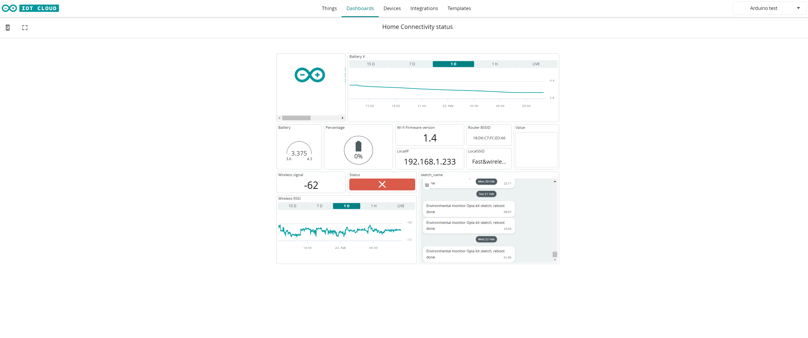

***If you want to learn more on how to customize your dashboard and leverage the wide widget portfolio, check the dedicated documentation available at [this link](https://docs.arduino.cc/arduino-cloud/getting-started/dashboard-widgets).***

### Sharing Dashboards

Whether it is your teammate, your customer, or your system integrator; you can freely share your dashboards with all the people you like. Just keep in mind that the interested stakeholders need to have an Arduino Account to access the dashboards.

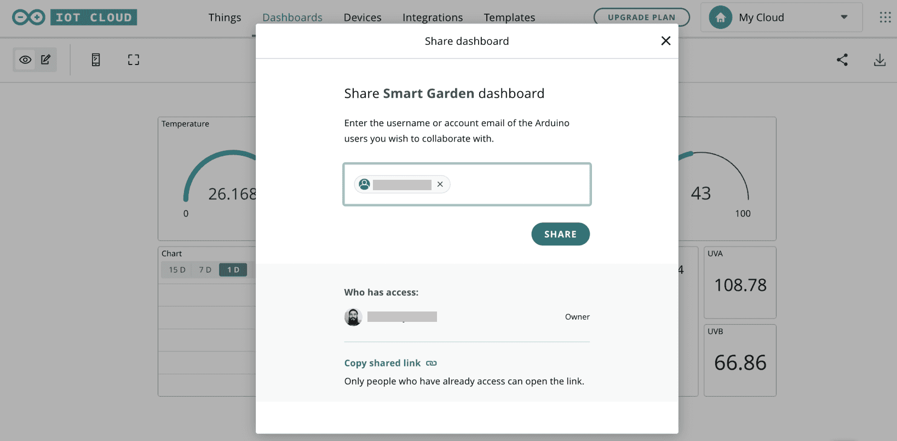

***Ready to share your dashboard? Have a look at [this tutorial](https://docs.arduino.cc/arduino-cloud/features/sharing-dashboards).***

### Data Export

Arduino Cloud for Business allows any user to download historical data from Arduino IoT Cloud Things and Variables. The data are downloaded in **.csv** format to be ready for further evaluation or manipulation.

The Arduino Cloud for Business plan includes 1 year data retention by default; this means that your data will be available and downloadable from your Arduino Cloud account for 1 year.

In order to start exporting your data locally, navigate into one of your dashboards on the [Arduino IoT Cloud](https://create.arduino.cc/iot/dashboards). While inside a dashboard, press the Download icon up in the right corner. This will open a new window that will allow you to select which historical data you would like to download.

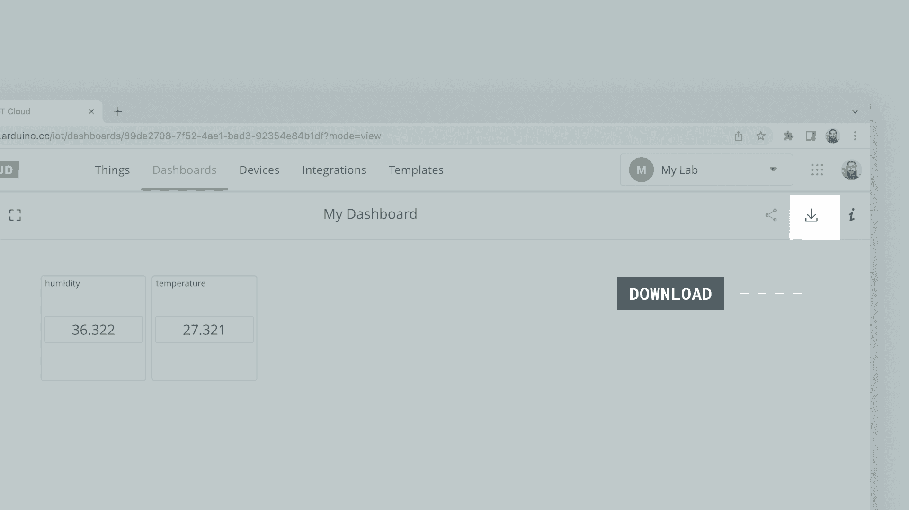

From here you can select all the variables you want to download by checking the boxes as well as the time frame you are interested in.

When you have selected the data, click on **Select Data Source** button.

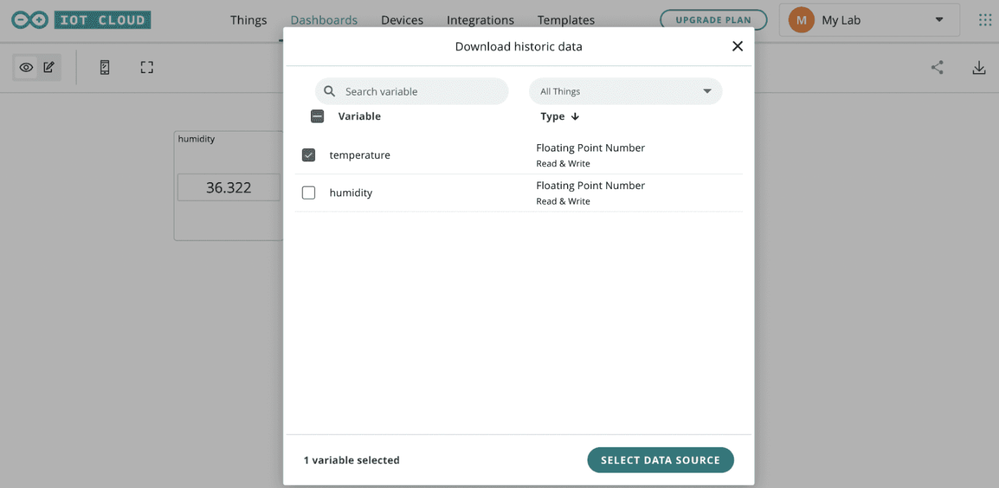

At this point, click on **Get data** to receive your data by email.

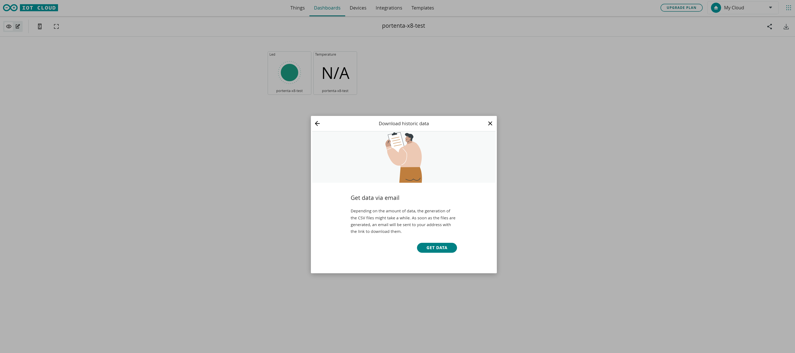

You will get an email like the one below with a link allowing you to download all your data.

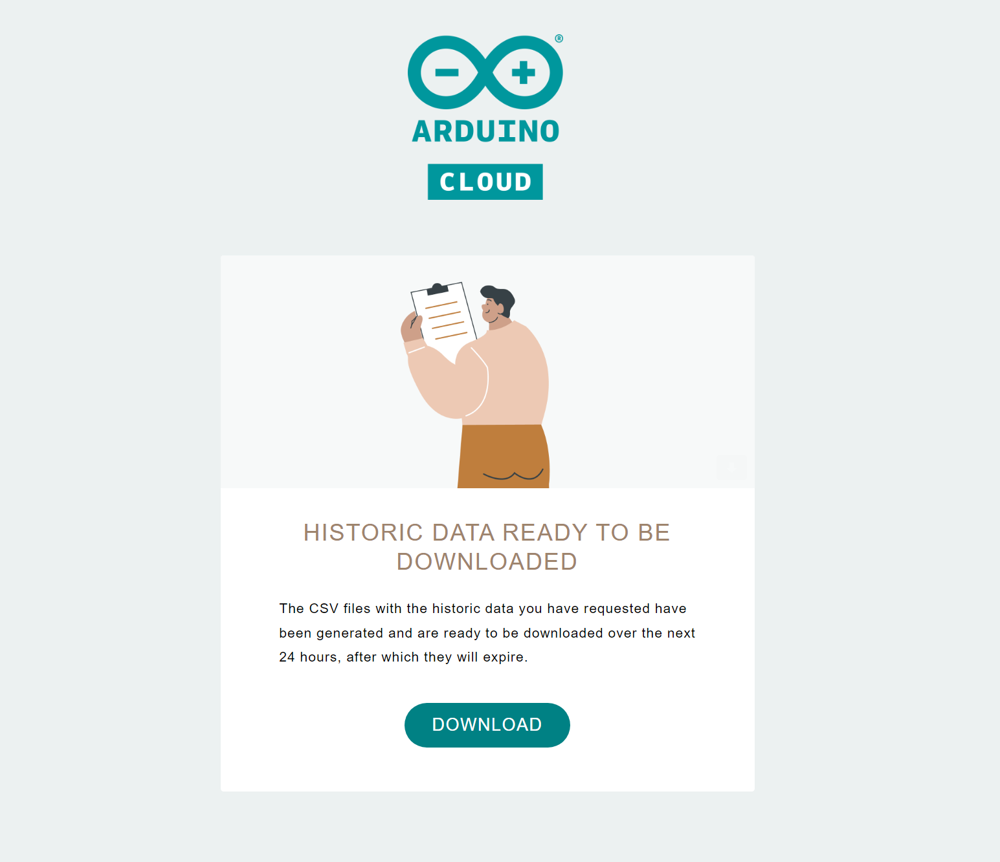

You are now ready to monitor and manipulate all your Cloud data.

## Arduino Cloud API

Use Arduino IoT Cloud back-end to control Things and devices via Arduino rest APIs in [Javascript](https://www.npmjs.com/package/@arduino/arduino-iot-client), [Python](https://pypi.org/project/arduino-iot-client/), or [Go](https://github.com/arduino/iot-client-go). With Arduino rest APIs, you will be able to manage up to 10 requests per second, guaranteeing stable data sharing.

Leveraging the APIs, you can interact with any element of the Cloud: data, devices, dashboards, and web properties. At the same time, APIs allow you to add the power to script, create complex scenarios or send and receive data from your custom service, 3rd party solution, or mobile application.

To use the APIs, you need to create an API Key Token in the API Keys section of your Space.

***We strongly recommend you add a Service Account role to your Shared Space to create/manage/maintain API Keys Tokens. The Service Account should not be linked to a personal email account so that the API Keys which will be created do not risk getting lost if that email account gets canceled.***

***If you want to start creating your own API Keys Token, take a look at [this tutorial](https://docs.arduino.cc/arduino-cloud/getting-started/arduino-iot-api) and [this documentation](https://www.arduino.cc/reference/en/iot/api/).***

## IoT Cloud App

Monitor your dashboards anywhere, anytime, and use your dashboards on the go with the free IoT Remote App.

To start exploring it, you will need to download it from either [Google Play Store](https://play.google.com/store/apps/details?id=cc.arduino.cloudiot&hl=en&gl=US) or the [Apple App Store](https://apps.apple.com/us/app/arduino-iot-cloud-remote/id1514358431) depending on your device.

***Do you want to get started with IoT Remote App? Read [this tutorial](https://docs.arduino.cc/arduino-cloud/tutorials/iot-remote-phone-sensors#phone-setup).***

## Arduino Cloud CLI

As already mentioned, Arduino Cloud for Business fully supports the [Arduino Cloud CLI](https://github.com/arduino/arduino-cloud-cli). The Arduino Cloud CLI allows accessing all the Arduino Cloud features from your terminal window.

Arduino Cloud CLI is the right choice when you are familiar with command-line interfaces and you would like to manage multiple devices and Things at the same time with few lines of code.

These are the main features of Arduino Cloud CLI:

* [Mass provisioning](https://docs.arduino.cc/arduino-cloud/getting-started/arduino-cloud-cli#device), i.e. provisioning of multiple devices at the same time.
* [Mass OTA updates](https://docs.arduino.cc/arduino-cloud/getting-started/arduino-cloud-cli#ota-over-the-air), i.e. Over-The-Air update of multiple devices at the same time.
* Advanced fleet management, including multiple devices [tagging](https://docs.arduino.cc/arduino-cloud/getting-started/arduino-cloud-cli#list-devices).
* Things monitoring and management, such as Things [tagging](https://docs.arduino.cc/arduino-cloud/getting-started/arduino-cloud-cli#tag-a-thing), [listing](https://docs.arduino.cc/arduino-cloud/getting-started/arduino-cloud-cli#list-things), [cloning](https://docs.arduino.cc/arduino-cloud/getting-started/arduino-cloud-cli#clone-things) and [template creation](https://docs.arduino.cc/arduino-cloud/getting-started/arduino-cloud-cli#extract-thing-template).
* Dashboard [creation](https://docs.arduino.cc/arduino-cloud/getting-started/arduino-cloud-cli#create-dashboard)/[cancellation](https://docs.arduino.cc/arduino-cloud/getting-started/arduino-cloud-cli#delete-dashboards), maintenance and dashboard [template extraction](https://docs.arduino.cc/arduino-cloud/getting-started/arduino-cloud-cli#extract-dashboard-template).

***If you would like to learn more about Arduino Cloud CLI and get started with it, check the corresponding documentation available [here](https://docs.google.com/document/d/1UBh5L-GXiAJiZG4LoZ5nY7ldXd7PAXSDax3pyb5DULU/edit).***

## Optional Add-Ons

Arduino Cloud for Business can be customized with optional add-ons:

* **Portenta X8 Manager**
* **Machine Learning Tools Enterprise**

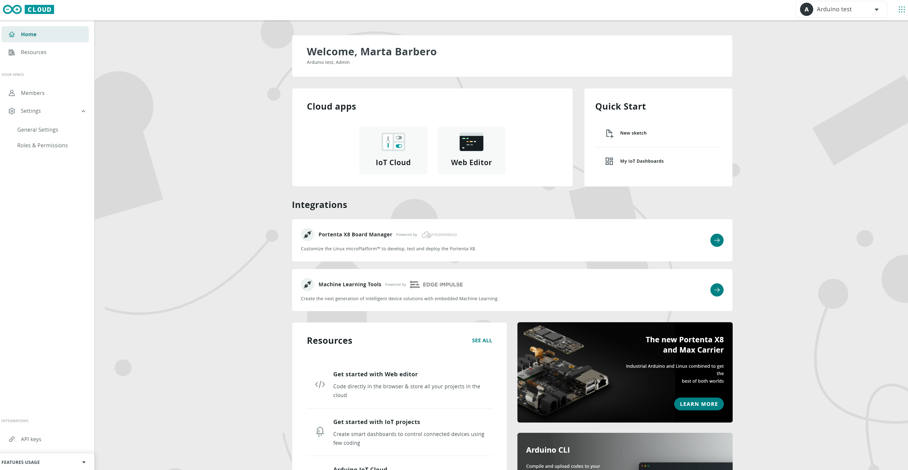

To get started with them, it is sufficient to click on the corresponding tab.

### Portenta X8 Manager

Securely maintain Portenta X8 Linux distribution with this dedicated add-on, powered by [Foundries.io](https://foundries.io/). Deploy and update all your applications packaged into containers and perform secure Over-The-Air differential updates to target Portenta X8 devices/fleets.

***Check [Portenta X8 documentation](https://docs.arduino.cc/hardware/portenta-x8) to find out more and start working with Portenta X8 Manager.***

### Machine Learning Tools Enterprise

Build and train professional-grade predictive models with just a few lines of code through this dedicated add-on, powered by [Edge Impulse®](https://www.edgeimpulse.com/). Deploy premade models out of the box to quickly develop your machine learning projects, starting from object detection, and machine vision to audio segmentation.

***If you are interested in learning more about this add-on, have a look at [this documentation](https://cloud.arduino.cc/machine-learning-tools). Otherwise, we have plenty of tutorials already using Machine Learning Tools. Check if your device is compatible with it in the board documentation available [here](https://docs.arduino.cc/).***

## Additional Tutorials

You can find more tutorials on the [Arduino IoT Cloud documentation page](https://docs.arduino.cc/arduino-cloud/).

## Support

Sentence provided by Content team.

## Congratulations

You are just a few easy steps from deploying your very own IoT project. Having a project connected to the Arduino Cloud for Business opens up many possibilities, such as tracking data in real-time, triggering remote devices and building wireless systems.

What will you create?

[Start your Cloud journey now](https://cloud.arduino.cc/plans#business).
