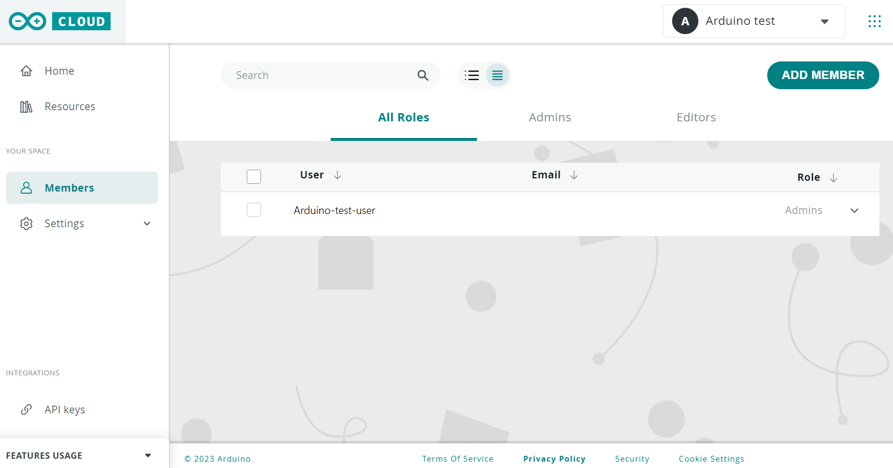
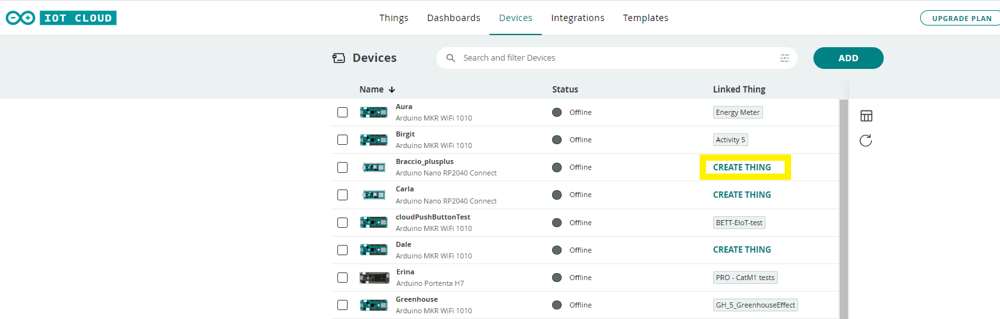
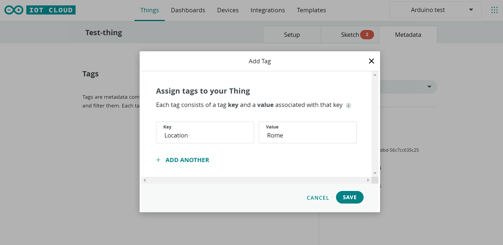
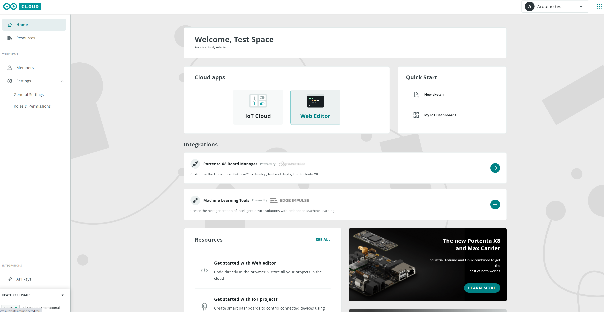

## Introduction

The [Arduino Cloud for Schools](https://cloud.arduino.cc/schools/) is a tool that provides an online space for teachers and students. 

In this article, you will get a general overview of the major features of the Arduino Cloud for Education and the features Free and School plan can offer.

## Required Software

* [Arduino Cloud ](https://cloud.arduino.cc/plans#school)

## How to create an account

In order to get started with Arduino Cloud, you need to [have an Arduino account](https://auth.arduino.cc/login.). An **Arduino account gives you full access to all Arduino websites, apps, and services**.

If you do not have an account yet, feel free to create a new one. You can follow [this tutorial](https://support.arduino.cc/hc/en-us/articles/360016724040-Create-an-Arduino-account) for a step by step explanation on how to do it.

After the registration is completed, you should verify your email address by clicking CONFIRM NOW in the email that was automatically sent to your inbox.

Now let's explore https://cloud.arduino.cc/home/:

The Arduino Cloud for School consists of **two main subscriptions**:

* **Free Plan**  
* **School Plan** 

By default any new user who created an Arduino account has access to Arduino Cloud with a *Free Plan*.

## Free Plan

* [Access to free online courses content](insert anchor here?)
* [Manage Your Spaces](linktoanchor)
* [CLOUD APPS](link to anchor)
* [IoT Projects Management](link anchor)

### Access to free online courses content

Once you've logged in, you are free to check out our free content in `Arduino Cloud > home > Courses`or click [here](https://cloud.arduino.cc/home/courses). 

In this section you get access to several free online courses, for different age groups and topics. This library of courses get widen an extended regularly with new releases.

***With a School Plan you unlock access to extra online courses.***

## Manage Your Spaces

In your Arduino Cloud free plan comes with two **spaces** by default:

* **My Cloud**. My Cloud is an *automatically* created private space once joined Arduino Cloud. You can use this space for personal projects you do not want to share with all your class. This space is free and includes *two Things*, unlimited dashboards, 100MB of Sketch storage, 1 day data retention by default.
* **New shared space**. A *Shared Space* is a space you can use with all your students. There is no limit in the number of members, who can all access the resources within its space.
* **Join Space** - copy paste here the space code that another admin or teacher shared with you to join their space. Like in the image below.

### Create a shared space

Open the top-right space selection menu and click on *New shared space*.

Then you will be asked which type of Shared Space you want to create (i.e. For Business or For Education). Click on **For Education** and proceed with creating a online space to share with your students or other colleagues.  

Fill in additional information.

Congratulations! Now you own a Shared Space linked to your Arduino account.

### Switch Between Spaces

You can switch to other Shared Spaces at any time using the corresponding menu, which you can find at the top right-hand corner, and click on it.

With a Free Plan or School Plan there is no limitations in the number of Shared Space you can have.

### Change Shared Space Settings

To change the current settings of your Shared Space, navigate to the **General Settings** tab using the sidebar.

Here you can edit for example your displayed name or change the logo of your Space.

### Invite Members Into Your Space

To add more members to your Shared Space, use the sidebar to navigate to the **Members** item under **Your space** group.

There you will find the complete list of all members who have access to your Shared Space, as well as the current role of each member. 

You can add members in **three possile ways**:

**1.** Type the **email addresses** of each user and define which role they will cover in your Space based on the available options. Click on **Invite**. The users you added will get the invitation by email with a link to join your Shared Space. 
**2.** You can invite your students to the Space through **Code** invitation (check *Join Space* explained above).
**3.** **Copy pasting the link** and share it with the whole class.

### Role types

There are [three role types](https://cloud.arduino.cc/home/roles-permissions) in Arduino Cloud for Schools: 

* Admin
* Teacher
* Students

By default the member who has activated the plan and created the workspace is set as *Admin*. It is possible to have multiple Admins with same permissions. The admin has full control of the rights/permissions each user has in the Shared Space:

The list of supported roles and corresponding permissions can be found here:

https://cloud.arduino.cc/home/roles-permissions

Important to remember are **Student role limitations:**

* They are not allowed to add new remembers to your School organization
* They are not allowed to assign members roles
* They are not allowed to view the Plan Management and Payment information

## CLOUD APPS

On the left menu bar in https://cloud.arduino.cc/home/ are listed the Cloud apps:

* Web Editor
* IoT Cloud
* Triggers

With a *Free* *Plan* you have access both to Arduino Web Editor and Arduino IoT Cloud, with **different limitations**. We'll discuss more in details below what those limitations are.

With a *Free Plan* you won't have access to Cloud Triggers, so you'll see something similar to this:

If you want to unlock this function, you'll need to upgrade to a [School Plan](https://digital-store.arduino.cc/education/purchase).

### What is Arduino Web Editor?

[Arduino Web Editor](http://create.arduino.cc/editor) allows you to **write code** and **upload sketches** to any Arduino board after installing a **[simple plug-in](https://create.arduino.cc/getting-started/plugin/welcome) for your browser**. Your Sketchbook will be stored in the Cloud and accessible from any device. You can even import your Sketchbook via a .zip file. Web Editor is part of Arduino Cloud, that simplifies a project by bringing all the different tools you need together in one place. This is a complementary solutions for schools or institutions that don't want to install [Arduino IDE](https://www.arduino.cc/en/software). A lite version of the Web Editor is included in the Arduino IoT Cloud, under `Things > Sketch`, which is actually a preview of a sketch saved on the Web Editor. 

***If you want to know more about Arduino Web Editor [visit this link](https://docs.arduino.cc/arduino-cloud/getting-started/getting-started-web-editor).***

### What is Arduino IoT Cloud?

Arduino IoT Cloud is an easy-to-use Internet of Things application platform. Arduino IoT Cloud makes the creation of connected objects quick, simple, and secure. You can connect multiple devices and allow them to exchange real-time data. You can also monitor them from anywhere using a simple user interface. It is integrated into your Arduino Cloud Space. 

## IoT Projects Management

In your IoT projects with Arduino you'll need **three elements**:

1. [The **Arduino IoT Cloud**](https://docs.arduino.cc/arduino-cloud/getting-started/iot-cloud-getting-started)
2. [The **Arduino Create Agent**:](https://create.arduino.cc/getting-started/plugin/welcome) the middle man between Arduino’s Web Editor, Arduino IoT Cloud and your computer. It allows you to use the browser to edit and deploy sketches to your Arduino board, and is required to be installed when using this kit.
3. **A device** of your choice.

### Setup a Device in Arduino IoT Cloud

The Arduino IoT Cloud is compatible with multiple Arduino boards or devices based on the ESP32 / ESP8266 microcontrollers. The Arduino IoT Cloud currently supports devices connected via Wi-Fi®, Ethernet, LoRaWAN® (via The Things Network), and cellular connectivity. You can check the [full list of compatible hardware here](https://support.arduino.cc/hc/en-us/articles/360016077320-What-devices-can-be-used-with-Arduino-IoT-Cloud-).

If your device is compatible with Arduino IoT Cloud, you can start to *Setup your Device* in your Shared Space by connecting it to your computer through a USB cable.

The agent will start looking for your board. When your board has been found, the following screen will appear. Click on **Configure**.

Select a board name to be able to correctly identify your device and click on **Next**.  

Define the connection type you want to use with your board and click on **Next.** 

If the onboarding proceeds as expected, the following page will appear confirming that your device has been successfully set up.

The `Devices` tab displays the name, status, and linked Things for each of the configured devices. Clicking on the device allows for renaming it, as well as accessing more information about the device, such as its ID number, type, FQBN, serial number, firmware version, linked Thing, latest activity, and the date when the device was added.

The device status indicates whether it is connected to the Arduino IoT Cloud (online), or not connected (offline).

### Link A Thing To Your Device

To use a device in IoT Cloud, you need to [create a Thing](https://create.arduino.cc/iot/things), or associate it to an existing Thing. A Thing is the digital twin of your device, as little reference to the actual hardware used to implement them. Each Thing is represented by a collection of properties, the configuration of some variables and other settings, as well as the history of the data collected for those variables.

To create a Thing, click on **Create Thing** next to the device of your interest, and your Thing will be automatically created for you. At this point, you can start updating it.

***If you want to explore more on how Things work, check [here](https://docs.arduino.cc/arduino-cloud/getting-started/iot-cloud-getting-started#3-creating-a-thing).***

***With a Free Plan you can only connect two Things with the IoT Cloud at the a time***

The image  below highlights the important elements that we will use frequently. Each number is explained below the image.

1. **Name of thing:** By clicking on "Untitled", we can rename our thing to anything we like. 
2. **Navigation menu:** This helps to navigate between things, dashboards and devices. 
3. **Thing tab:** There are two different tabs: **Setup** ,**Sketch** and **Metadata**. The setup is the current view, while the sketch works as the Arduino IDE where the Serial Monitor is detachable.
4. **Variables:** By clicking the **Add variable** button, we can create variables that will be incorporated in a sketch later on. These variables can then be linked to a dashboard.
5. **Device configuration:** To associate our Thing with a device, detach or change it.
6. **Network configuration:** Here, we will enter the name and password of our Wi-Fi network, which will be necessary to communicate with the IoT Cloud.

### Filter your Things or Devices

You can search and filter among your Things/Devices by going to **Things** or **Devices** tab in [Arduino IoT Cloud](https://create.arduino.cc/iot/devices)

If you want to **create your tag**, which you can use as a filtering option, go to Things tab, click on the Thing you would like to tag and go to the **Metadata** tab as shown in the figure below.

.

Click on **Add**. You will be asked to customize your tag through two fields:

* **Key**. The Key is the filter name which you will see among the list of available filtering options. E.g. Location.
* **Value**. The Value corresponds to the specific value your tag has for that specific Thing. E.g. Rome.

You can add an unlimited number of tags to each Thing.

At this point, you can go back to the Things tab and start filtering your Things according to the new tag you have just created.

### Variables

In order to retrieve and store information we need to create Variables in the Arduino IoT Cloud are very similar to the variables we create in a regular sketch. When we create variables here, they are automatically generated in a sketch, and when we upload the code to the board, the variables used in the sketch synchronize with the variables in the cloud.

***To learn more on the different types of Variables and their features go to [this tutorial](https://docs.arduino.cc/arduino-cloud/getting-started/cloud-variables).***

The Arduino Cloud *Free Plan* allows a maximum number of 5 variables per each Thing by default.

The Arduino Cloud *School Plan* allows unlimited number of variables per each Thing by default.

### Dashboards

***If you want to learn more on how to customize your dashboard and leverage the wide widget portfolio, check the dedicated documentation available at [this link](https://docs.arduino.cc/arduino-cloud/getting-started/dashboard-widgets).***

### Sharing Dashboards

You can check [this tutorial](https://docs.arduino.cc/arduino-cloud/features/sharing-dashboards) 

### Data Export

Arduino Cloud, both with free or School plan, allows any user to download historical data from Arduino IoT Cloud Things and Variables. The data are downloaded in **.csv** format to be ready for further evaluation or manipulation.

The Arduino Cloud *Free Plan* allows only 1 day of data retention by default.

The Arduino Cloud for *School Plan* includes 6 months of data retention by default; this means that your data will be available and downloadable from your Arduino Cloud account for 6 months.

To start exporting your data locally, navigate into one of your dashboards on the [Arduino IoT Cloud](https://create.arduino.cc/iot/dashboards). While inside a dashboard, press the Download icon in the upper right corner. This will open a new window that will allow you to select which historical data you would like to download.

From here you can select all the variables you want to download by checking the boxes as well as the time frame you are interested in.

When you have selected the data, click on the **Select Data Source** button.

At this point, click on **Get data** to receive your data by email.

You will get an email like the one below with a link allowing you to download all your data.

You are now ready to monitor and manipulate all your Cloud data.

## Arduino Cloud API

Some of

Use Arduino IoT Cloud back-end to control Things and devices via Arduino rest APIs in [Javascript](https://www.npmjs.com/package/@arduino/arduino-iot-client), [Python](https://pypi.org/project/arduino-iot-client/), or [Go](https://github.com/arduino/iot-client-go). With Arduino rest APIs, you will be able to manage up to 10 requests per second, guaranteeing stable data sharing.

Leveraging the APIs, you can interact with any element of the Cloud: data, devices, dashboards, and web properties. At the same time, APIs allow you to add power to the script, create complex scenarios or send and receive data from your custom service, 3rd party solution, or mobile application.

To use the APIs, you need to create an API Key Token in the API Keys section of your Space.

If you want to start creating your own API Keys Token, take a look at [this tutorial](https://docs.arduino.cc/arduino-cloud/getting-started/arduino-iot-api) and [this documentation](https://www.arduino.cc/reference/en/iot/api/).

## Device Management

The Arduino Cloud for Business allows for device management with Over-The-Air updates, secure provisioning to connect boards leveraging their secure element, and easy verification of their status (connected, not connected) and maintenance.

### Device Programming

It is now time to start uploading sketches on your devices.

The Arduino Cloud has a feature capable of creating some pre-built sections of the sketch related to a Thing, including some libraries necessary to interact with the cloud variables, as well as directly populating and updating the sketch once the new cloud variables are created and defined.

The sketch related to the thing is visible from the tab "Sketch" next to the "Setup" view, where the Thing's list of cloud variables is shown.

From this sketch view, by clicking the "Open full editor button", it is fast and smooth to access the Arduino Cloud integrated [Web Editor](https://docs.arduino.cc/learn/starting-guide/the-arduino-web-editor), which allows you to program your boards from any browser and use the latest Arduino IDE features and libraries without having to install any software locally.

Otherwise, to open the Web Editor to directly retrieve your sketches, go to Arduino Cloud Home and click on the [Web Editor](https://create.arduino.cc/editor) button.

***To get started with the Web Editor, check the dedicated tutorial at [this link](https://docs.arduino.cc/arduino-cloud/getting-started/getting-started-web-editor). However, if you have already developed your sketch and you would like to import it into the Web Editor, see the corresponding documentation [here](https://docs.arduino.cc/arduino-cloud/tutorials/import-your-sketchbook-and-libraries-to-the-web-editor)***

All the created sketches are individual and owned by the user that created them. Other members of the Shared Space can access your sketch in their Web Editor only if you share it with them. If you would like to do so, have a look at [this tutorial](https://docs.arduino.cc/arduino-cloud/tutorials/share-your-sketches) on how to do it.

Keep in mind that your sketch may contain some sensitive data that you do not want to share with other members, like Wi-Fi® credentials or API keys. If this is the case, check [this tutorial](https://docs.arduino.cc/arduino-cloud/tutorials/store-your-sensitive-data-safely-when-sharing) to learn how to share sketches without sharing sensitive data.

### OTA Updates

Arduino Cloud for Business integrates an amazing feature: Over-The-Air updates. This feature allows you to upload sketches wirelessly to your Arduino boards. This way, as soon as you have a compatible board connected to a Wi-Fi®/Ethernet network and configured to work with OTA, you will not need to physically connect the board to your computer to upload new sketches to it; instead, everything will work Over-The-Air, even from remote.

***Are you interested in learning how to perform an OTA update? Check [this tutorial](https://docs.arduino.cc/arduino-cloud/features/ota-getting-started#how-does-it-work). If you prefer to use the Arduino Cloud CLI instead, go to [this link](https://docs.arduino.cc/arduino-cloud/getting-started/arduino-cloud-cli#ota-over-the-air).***

## School Plan

### Cloud Triggers

Triggers are used in many IoT projects to monitor specific variables within your Things and receive notifications.  This is super useful when you monitor data and you need to know about any change as soon as it happens. This could be anything from different values in environmental monitoring or something security related such as movement detection. With a School Plan you have **10 notifications per day for 10 members** of your Shared Space. There is no limitations on how many triggers you can create for your projects and you can combine them together.

***To learn how to use triggers that allow you to send notifications based on set conditions, [read this tutorial](https://docs.arduino.cc/arduino-cloud/features/triggers)***

### Billing

School plan is specifically designed for institutions that aim to cover a larger amount of users. The billing account can be managed by a single Arduino account that then will grant access to different users and assign a role.

### Junior Account

The content courses included in the School Plan are only partially available for minor users. They will get access only to COPPA compliant courses. If your students are **under the age of 14**, they need parental consent to sign up for an Arduino account. We recommend to read [this tutorial](https://support.arduino.cc/hc/en-us/articles/360022234360) to learn how to manage a Junior account. Arduino Education provides [several solutions for middle school](https://www.arduino.cc/education/middle-school/) students.

## Other Arduino Tools for teaching

### Arduino IoT Cloud Remote

It allows you to monitor your dashboards anywhere, anytime, from a **mobile device** i.e smartphone or tablet and use your dashboards on the go with the *free* Arduino IoT Cloud Remote App. Download it from either [Google Play Store](https://play.google.com/store/apps/details?id=cc.arduino.cloudiot&hl=en&gl=US) or the [Apple App Store](https://apps.apple.com/us/app/arduino-iot-cloud-remote/id1514358431) depending on your device.

***Do you want to get started with IoT Remote App? Read [this tutorial](https://docs.arduino.cc/arduino-cloud/tutorials/iot-remote-phone-sensors#phone-setup).***

### Arduino Cloud CLI

If you want to communicate with more than one device at a time or you prefer to work through a terminal window, we have the right tool for you: [Arduino Cloud CLI](https://github.com/arduino/arduino-cloud-cli).

To proceed with the onboarding, check [this tutorial](https://docs.arduino.cc/arduino-cloud/getting-started/arduino-cloud-cli). It will explain to you all the required steps to connect your board through your terminal.

## Arduino Cloud Tutorials

You can find more tutorials on the [Arduino IoT Cloud documentation page](https://docs.arduino.cc/arduino-cloud/).

