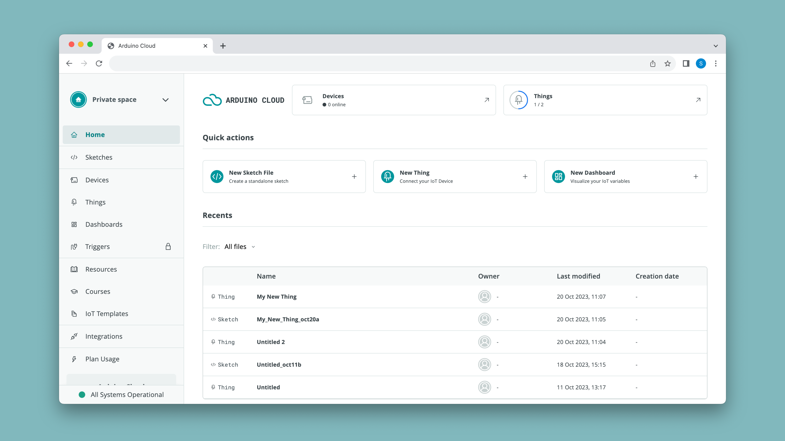
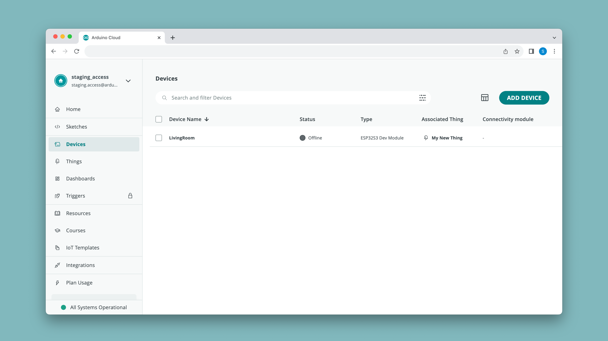
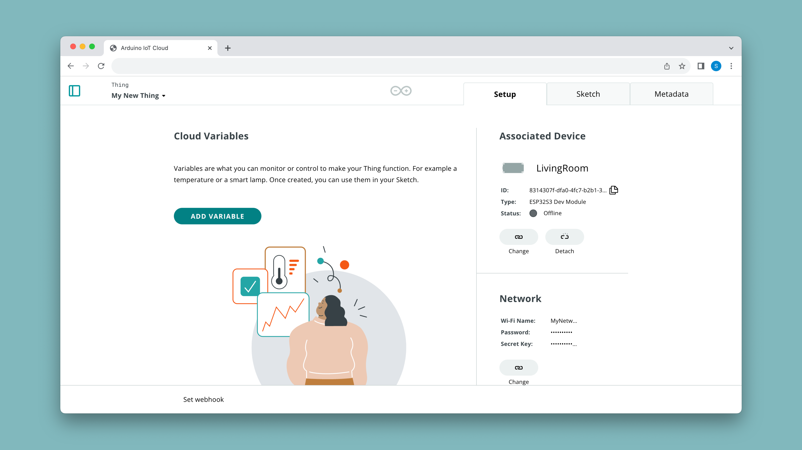
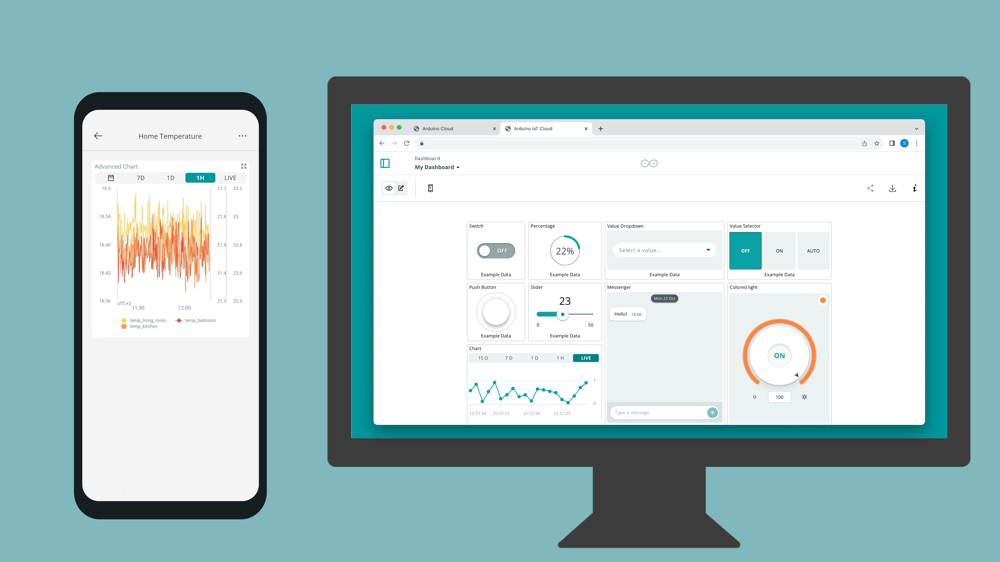

The [Arduino Cloud](https://app.arduino.cc/) is a platform for developing Arduino projects and connecting them to the world. It supports secure connections with boards via [Wi-Fi®](/arduino-cloud/hardware/wifi), [LoRa®](/arduino-cloud/hardware/lora), [Ethernet](/arduino-cloud/hardware/ethernet) and [Cellular (GSM/NB-IoT)](/arduino-cloud/hardware/cellular), and lets you create a system for sending any variable information you can think of from one board to another within minutes of unboxing them.

The Arduino Cloud platform includes:
- an **Integrated Development Environment (IDE)** for programming your boards,
- a **cloud backend service** for synchronizing data from Arduino boards, but also from [Python](/arduino-cloud/guides/python) & [JavaScript](/arduino-cloud/guides/javascript) clients,
- a **graphical tool (dashboard)** for controlling and monitoring your board (as well as an [mobile app](/arduino-cloud/iot-remote-app/getting-started)).
- [REST API](/arduino-cloud/api/arduino-iot-api) and [command line tools](/arduino-cloud/arduino-cloud-cli/getting-started) for larger scale automations. 

Very simply explained, with the Arduino Cloud you can:
1. Create a program for an Arduino based on a brilliant idea you just hatched.
2. Upload the program to your board and synchronize any data you want to (most commonly through Wi-Fi®).
3. Create a dashboard with a set of widgets to control and monitor your data.

Developing a sketch made for the Arduino Cloud is almost just like developing any other sketch. You have your setup, and loop just like normal. But you are also able to select variables to be automatically synced to the Arduino Cloud. 

Once a variable is synced to the Arduino Cloud you can access it from any of your other devices connected to the Arduino Cloud.  

Once you have setup your project, this is how you could interact & monitor it. 

For example, turning ON / OFF a light connected to a device would work like this:

And if you want to read the value of a sensor connected to your device, it would work like this:

Networking code and data synchronizing is **automatically done**, so just focus on the project, and let the Arduino Cloud handle the rest.

***This document will help you get familiar with the [Arduino Cloud](https://app.arduino.cc/) service, and once you've got a good hang of it, you can explore the [rest of the documentation](/arduino-cloud/).***

## Compatible Boards

***Throughout the documentation, we will often refer to a "board" as a "device". A board is your physical hardware or virtual setup (Python/JS), and a "device" is how it is configured in the cloud.***

Compatibility with the Arduino Cloud is divided into two categories: 
- **Cloud Editor Support** - you can program **any** official Arduino board in the cloud editor. The editor also supports a large amount of third party boards.
- **IoT Support** - board with a radio module (e.g. Wi-Fi®) are supported. ESP32 based boards are also supported. 

For more information and list of supported boards, see the links below:
- [Wi-Fi®](/arduino-cloud/hardware/wifi)
- [LoRa®](/arduino-cloud/hardware/lora)
- [Ethernet](/arduino-cloud/hardware/ethernet)
- [Cellular (GSM/NB-IoT)](/arduino-cloud/hardware/cellular).

***You can also create something called [manual devices](/arduino-cloud/hardware/devices#manual-devices), which allows you to create a virtual instance directly on your computer using JavaScript, Python or MicroPython.***

## Overview

Anything in the Arduino Cloud can be accessed via the left action bar. In the list below, some with links to a documentation pages.

- **[Sketches](/arduino-cloud/cloud-interface/sketches)** - your sketches (programs) are stored here, divided into either a "normal" or "cloud" sketch. 
- **[Devices](/arduino-cloud/hardware/devices)** - here you can configure your Arduino boards, ESP32 devices, manual devices (Python, JavaScript and more).
- **[Things](/arduino-cloud/cloud-interface/things)** - a Thing is a project configuration, where you select device, create variables to synchronize, and enter credentials.
- **[Dashboards](/arduino-cloud/cloud-interface/dashboard-widgets)** - dashboards are used to monitor & control your board through widgets. There's also a [mobile version](/arduino-cloud/iot-remote-app/getting-started) available to view your dashboards from a smartphone.
- **[Triggers](/arduino-cloud/cloud-interface/triggers)** - triggers can be used to send emails and push notifications based on a value change of a variable.
- **Resources** - helpful links and resources. You might have found this article here.
- **Courses** - tailored content for specific products and kits connected to the Arduino Cloud.
- **Templates** - templates are ready-made project that will automatically configure your device, Thing, 
- **Integrations** - third party services that are integrated with the Arduino Cloud.

## A Walkthrough the Arduino Cloud

Setting up a project in the Arduino Cloud is easy, and can be done through a few simple steps summarized in this section.

### 1. Create an Account

To use the Arduino Cloud, you will need an Arduino account, which you can register [here](https://login.arduino.cc/login).

By default, you will have a **free plan**, which can be upgraded to a number of affordable plans starting at 1.99$ a month.

***Read more about [Arduino Cloud plans](https://cloud.arduino.cc/plans)***

### 2. Configure a Device

First you will need to connect your board to your computer, and configure your device in the [Devices](https://app.arduino.cc/devices) tab.

The configurations varies between boards, but everything is covered in the installation wizard.

***Learn more in the documentation for [Arduino Cloud Devices](/arduino-cloud/hardware/devices).***

### 3. Create a Thing

After configuring a device, we can create a Thing, which is the **virtual twin** of your board. Here we configure network details, select device we want to associate and create the variables that we want to synchronize.

Variables we create will be used in the sketch, and will keep synchronizing as long as the board is connected to the cloud. 

When working with your IoT projects, consider this the "main space" for configurations, as you can access your sketches from here as well. 

***Learn more in the documentation for [Arduino Cloud Things](/arduino-cloud/cloud-interface/things).***

### 4. Write a Sketch

Once you have done the above configurations, you can move on to **create a program/sketch**. This is where *you* decide what you want to create, and what data you want sent to the cloud.

When your program is ready, upload it to your board. If your board supports [Over-the-air (OTA)](/arduino-cloud/features/ota-getting-started) uploads, you can from now on upload without your board being connected to your computer!

***Learn more in the documentation for [Arduino Cloud sketches](/arduino-cloud/cloud-interface/sketches).***

### 5. Create a Dashboard

A dashboard allows you to interact with your device from a web interface or mobile app. A dashboard is composed of **widgets**, which you can link to a variable in your Thing.

Choose from switches, sliders, RGB picker, message box,  gauges and much more to create dashboards. Dashboards are not linked to a specific Thing/device, meaning you can control many different boards from the same dashboard.

Some widgets can be linked to multiple variables, for example the [Advanced Chart](/arduino-cloud/cloud-interface/dashboard-widgets#advanced-chart) widget can graph up to 4 variables from different boards simultaneously! 

***Learn more in the documentation for [Arduino Cloud dashboards](/arduino-cloud/cloud-interface/dashboard-widgets).***

### 6. Track Your Project

Once you done all configurations, created a program & dashboard, you can sit back and monitor & interact with your project from the web interface or the mobile app.

## Guides

We recommend checking out the following guides to get started with various coding frameworks:
- [Arduino / C++ setup (default setup)](/arduino-cloud/guides/arduino-c) - the default installation using the built-in code editor and an Arduino / ESP32 board.
- [Python setup](/arduino-cloud/guides/python) - set up of a manual device to run on a PC / Linux system such as Raspberry Pi.
- [MicroPython setup](/arduino-cloud/guides/micropython) - setup of MicroPython on a select number of supported boards.
- [JavaScript / node.js setup](/arduino-cloud/guides/javascript) - setup of JavaScript using node.js, perfect for integrating your front-end projects with the Arduino Cloud.

## Features

Make sure to explore the various features of the Arduino Cloud through the links below:
- [**Data Monitoring**](/arduino-cloud/application-notes/cloud-environmental-data) - learn how to easily monitor environmental sensor values through a dashboard.
- [**Variable Synchronisation**](/arduino-cloud/features/thing-to-thing) - variable synchronisation allows you to sync variables across devices, enabling communication between devices with minimal coding.
- [**Scheduler**](/arduino-cloud/features/cloud-scheduler) - schedule jobs to go on/off for a specific amount of time (seconds, minutes, hours).
- [**Over-The-Air (OTA) Uploads**](/arduino-cloud/features/ota-getting-started) - upload code to devices not connected to your computer.
- [**Webhooks**](/arduino-cloud/features/webhooks) - integrate your project with another service, such as IFTTT.
- [**Amazon Alexa Support**](/arduino-cloud/guides/alexa) - make your project voice controlled with the Amazon Alexa integration. 
- [**Dashboard Sharing**](/arduino-cloud/features/sharing-dashboards) - share your data with other people around the world. 