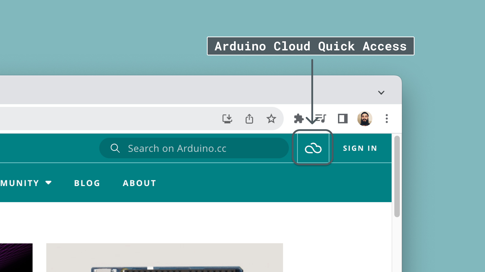
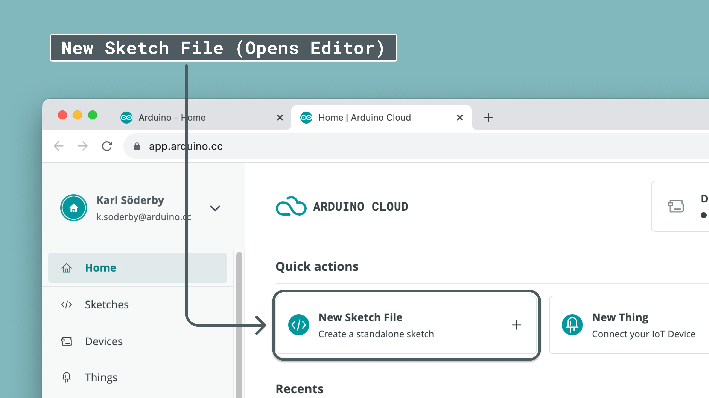
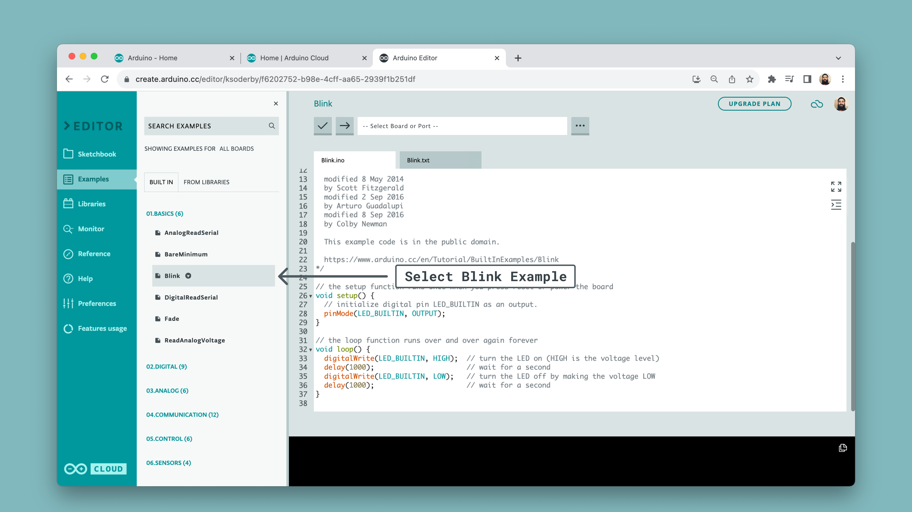
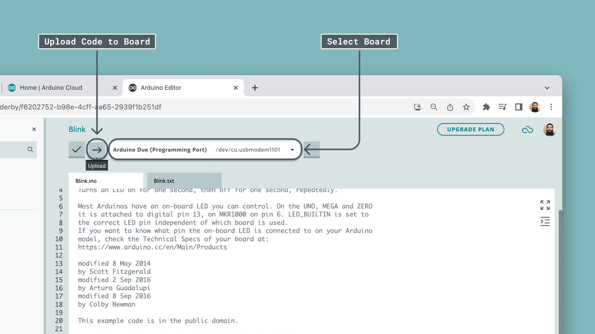

The Cloud Editor is a great choice for working with your Arduino board. It stores all of your sketches online, doesn't require you to install board packages and includes most of the popular libraries, while letting you upload your own if you need to.

Getting started with the Cloud Editor is quick & easy, and in this tutorial, we will walk you through the necessary steps so you can use it with your Arduino board.

This tutorial works with **all** official Arduino boards.

***Note: The Cloud Editor is previously known as the "Create Editor", or "Web Editor".***

## Goals

In this tutorial, we will achieve the following:

- Creating an account (required to use the Cloud Editor).
- Download and install the [Create Plugin](https://create.arduino.cc/getting-started/plugin/welcome).
- Make sure our board is recognized by the computer.
- Upload a simple blink example.

## Hardware & Software Needed

- [Arduino Cloud Editor](https://create.arduino.cc/editor)
- [Create Agent](https://create.arduino.cc/getting-started/plugin/welcome)
- Arduino board (all Arduino boards are supported).
- USB cable (different depending on the board you are using).

## Setting up the Cloud Editor

We will now go through the necessary steps to get your Arduino board working with the Cloud Editor.

### Create an Account

The first step is to create an account. This is done by navigating to the [Log-in page](login.arduino.cc/login). Here, you can either manually create an account, or log in using for example Google.


### Install Create Agent

Once you have created and activated your account, we need to install the **Create Agent.** This is done by navigating to the [Create Agent Installation page](https://create.arduino.cc/getting-started/plugin/welcome). Here, you simply need to click on **"Start"** to begin the installation.


The Create Agent is a piece of software that runs on your computer, and acts as a bridge between your board and your browser. Without it, the browser is not able to see what board you have connected to your computer, or upload code to it.

Follow the instructions at this page to complete the installation. You will need to download the Create Agent in this process, and install it locally on your machine.

When we are done, we should see this screen:


Congratulations, you now have the necessary tools to start using the Cloud Editor.

You can find the Arduino Create Agent files by following the path that relates to your operative system:
- **Windows:** - `C:\Users\{username}\AppData\Roaming\ArduinoCreateAgent`
- **MacOS:** - `Users/{username}/Applications/ArduinoCreateAgent`
- **Linux:** - `/home/<user>/ArduinoCreateAgent`

## Upload a Program

Now, let's take a look at how the Cloud Editor works, by uploading a simple example to the board. First, we need to navigate to the Cloud Editor, by either [clicking this link](https://create.arduino.cc/editor) or clicking the **Arduino Cloud icon** at the top right corner, following the image below:



In the Arduino Cloud home page, click on **"New Sketch File**. This will direct you to the Cloud Editor.



Once you are in the Cloud Editor, you can also access all the built-in examples. Navigate to **Examples > 01.Basics > Blink**, following the image below. This will open the classic blink example, which we will later upload to the board.




To upload it, we first need to **select our board.** If you [installed the Create Agent](#install-a-plugin), your board should appear in the dropdown menu. Select your board (in this case, it is an **Arduino Due** at port `/dev/cu.usbmodem1011`). On Windows this will be something like `COM5`.

Once your board is selected, click the upload button following the image below.



Once it is uploaded, there should be a message in the bottom of the editor saying:

```
Success. Saved on your online Sketchbook and done uploading Blink.
```

If we look at the board we uploaded the code to, we should see the onboard LED blink with an interval of 1 second. This means that you have successfully used the Cloud Editor to upload a code to your board.
