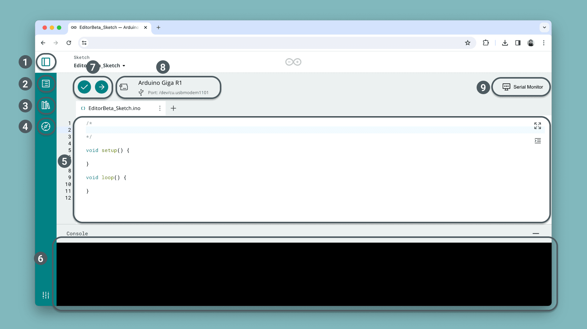

The [Cloud Editor](https://app.arduino.cc/sketches/) is an online code editor that is part of the [Arduino Cloud](https://app.arduino.cc/). With the Cloud Editor, you can write sketches that are automatically stored in your Cloud sketchbook, and upload them to your Arduino board.

The Cloud Editor includes:
- access to all official board packages, as well as packages for popular third party boards (e.g. ESP32),
- access to 5000+ libraries normally available in the offline IDE
- built-in tools for verifying and uploading code to your board,
- serial monitor tool for debugging your code,
- reference to the Arduino programming language.

To use the Cloud Editor, you will only need to [install the Cloud Agent](), a plugin that allows your browser to access USB devices (your board). You will also need an [Arduino account]().

## Goals

In this guide, we will cover:

- How to create an account (required to use the Cloud Editor).
- How to download and install the [Create Plugin](https://create.arduino.cc/getting-started/plugin/welcome).
- The functions of the Cloud Editor,
- How to write and upload a program to your Arduino board.

## Hardware & Software Needed

- [Arduino Cloud Editor](https://create.arduino.cc/editor)
- [Create Agent](https://create.arduino.cc/getting-started/plugin/welcome)
- Arduino board (all Arduino boards are supported).
- USB cable (different depending on the board you are using).

## Cloud Editor Overview

The Cloud Editor features all the necessary tools to develop and test your Arduino projects, including:
- A compiler that checks that your code works on the specified board,
- an upload tool that uploads a sketch to your board,
- the Serial Monitor, a tool that reads the serial commands send from your board.

In the image below, you can get a brief overview of the available functionalities.

1. **Arduino Cloud Menu** - quicklinks to the Arduino Cloud platform.
2. **Built-in Examples** -  a set of basic Arduino examples.
3. **Libraries** - all libraries that are included in the Arduino library manager (5000+).
4. **Reference** - the Arduino Reference provides an overview of the available methods in the Arduino programming API.
5. **Editor** - the code editor area, where we write the program for our board.
6. **Verify/Upload** - verify (compile) your code using the checkmark button, and upload it to your board using the right arrow. 
7. ****

## Setup

### Create an Account

### Install the Plugin

### Upload a Sketch
