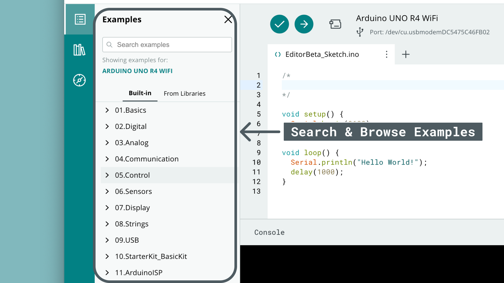
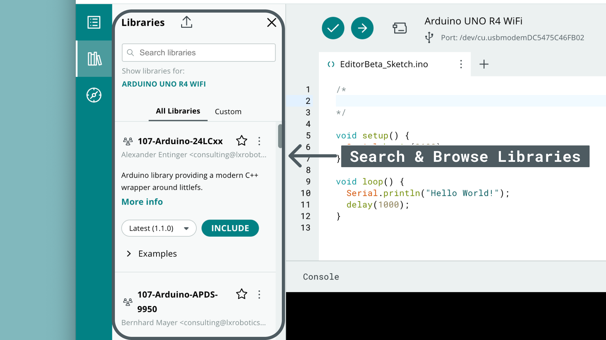
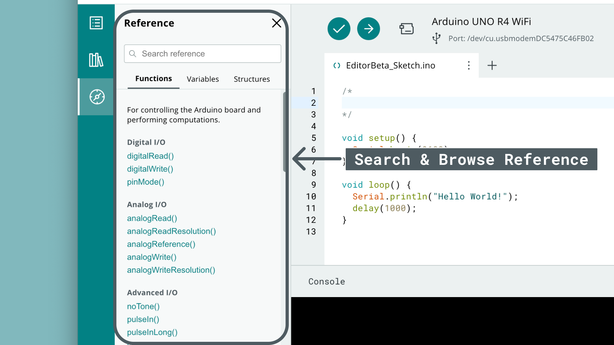

The [Cloud Editor](https://app.arduino.cc/sketches/) is an online code editor which is part of the [Arduino Cloud](https://app.arduino.cc/). With the Cloud Editor, you can write sketches and upload them to your Arduino board, where all your progress is automatically stored in the Cloud!

The Cloud Editor features all the necessary tools to develop and test your Arduino projects, including:
- A compiler that checks that your code works on the specified board,
- an upload tool that uploads a sketch to your board,
- the Serial Monitor, a tool that reads serial data sent from your board,
- all board packages & libraries available without download!

***To use the Cloud Editor, you will need to [install the Cloud Agent](https://create.arduino.cc/getting-started/plugin/welcome), a plugin that allows your browser to access USB devices (your board). You will also need an [Arduino account](https://app.arduino.cc/). The steps are covered later on in this guide.***

## Hardware & Software Needed

- [Cloud Agent](https://create.arduino.cc/getting-started/plugin/welcome)
- Arduino board (all Arduino boards are supported).
- USB cable (different depending on the board you are using).

***If you don't have an Arduino board, visit the [Arduino Store](https://store.arduino.cc/).***

## Setup

1. First, log in or create an [Arduino account](https://app.arduino.cc/).
2. Then install the [Cloud Agent](https://create.arduino.cc/getting-started/plugin/welcome).
3. After installing the Cloud Agent, navigate to the [Cloud Editor](https://app.arduino.cc/sketches/).
4. Now connect an Arduino board to your computer. Once you connect it, it should show up in the editor.

    

5. Finally, let's upload a sketch to your board. Click on the **"Examples"** icon, and navigate to **01.Basics > Blink**. Clicking the example will open a new window. Once open, click on the **"Upload"** button, and make sure to not disconnect your board during this process.

    

6. You can see if the operation was successful or not in the console log window at the bottom. Here's an example of a successful upload:

    

Congratulations, you have now successfully setup and used the Cloud Editor! In the next sections, you can learn a little bit more on what each of the elements in the editor works.

## Cloud Editor Overview

Now that we are all setup, let's take a look at the main components of the editor:


1. **Arduino Cloud Menu** - navigation menu for the Arduino Cloud platform.
2. **Examples** -  a set of basic Arduino examples.
3. **Libraries** - all libraries that are included in the Arduino library manager (5000+).
4. **Reference** - the Arduino Reference provides an overview of the available methods in the Arduino programming API.
5. **Editor** - the code editor area, where we write the program for our board.
6. **Console Log** - this window informs you of the status of your compilation / upload. 
7. **Verify/Upload** - verify (compile) your code using the checkmark button, and upload it to your board using the right arrow. 
8. **Board / Port Selection** - the board connected to your computer will be automatically displayed here. You can also manually change this.
9. **Serial Monitor** - a tool that reads serial data sent from your board to the computer. 

## Serial Monitor

The Serial Monitor is a tool that allows you to read serial data from your board. This is useful for any general debugging cases, such as checking if a block of code is executed, or making sure the values you are using are accurate.

To use the tool, you will need a board connected to your computer that sends serial data, and a sketch that prints something. For this tutorial, the following sketch was used, which simply prints `Hello World!` every second.

```arduino
void setup() {
  Serial.begin(9600);
}

void loop() {
  Serial.println("Hello World!");
  delay(1000);
}
```

When clicking the Serial Monitor button, a new window will open, where you can see the incoming data. See the image below for a complete overview of its functions:


In the Serial Moitor window you can:
- Read incoming data,
- Change baud rate (default is 9600),
- Enable time stamp,
- Download the data as `.csv`,
- Pause the stream, and search through the log,
- Clear the log.

## Resources

The resources (examples, libraries & reference) are all available from the menu on the left hand side. 

### Examples

The "built-in" examples are a set of basic examples focused at learning some key Arduino concepts. Classic examples such as `Blink` and `AnalogReadSerial` will help you get started, with links inside each example to more detailed documentation.



### Library Manager

The library manager allows you to search & browse through all availables that exist in the Arduino Library Manager, which as of 2024 was 5000+.

Most libraries provide examples, which can be accessed be clicking the three dots next to a library. There is no need for downloading any library as they are available and up to date in the Arduino Cloud platform.



### Reference

The reference is an embedded version of the [Arduino Language Reference](), which helps you understand the Arduino programming language & syntax.

