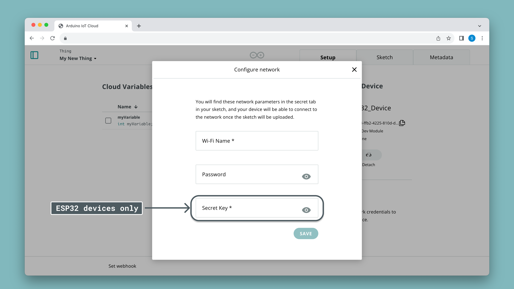

The default option for programming your board to connect to the Arduino Cloud is by using the **C++ language**. The configuration and connection between your board and the Arduino Cloud is supported by the [ArduinoIoTCloud library](https://github.com/arduino-libraries/ArduinoIoTCloud) & [Arduino_ConnectionHandler](https://github.com/arduino-libraries/Arduino_ConnectionHandler) libraries.

***When programming in C++, you can use the Arduino API (which is also known as the Arduino Language). To learn more about the Arduino API, check out the [language reference](https://www.arduino.cc/reference/en/).***

Whenever you create a [Thing](/arduino-cloud/cloud-interface/things) in the Arduino Cloud, you automatically start generating a set of files that will handle the configurations, credentials & connection:
- `<sketchname>.ino` - your main sketch file,
- `thingProperties.h` - your main configuration file,
- `arduino_secrets.h` - your credentials file (for API key, Wi-Fi network etc.)

***If you want to find out more about what the Arduino Cloud service can do, go to the [overview](/arduino-cloud/guides/overview) section.*** 

## Requirements

For this guide, you will need to have a registered account at Arduino. Register through the link below:
- [Create an Arduino account](https://login.arduino.cc/login)

You will also need a supported board:
- [Official Arduino Wi-Fi® boards](/arduino-cloud/hardware/wifi)
- [ESP32 / ESP8266 boards](/arduino-cloud/hardware/wifi#configure-esp-boards)
- [Official LoRaWAN® boards](/arduino-cloud/hardware/lora) 
- [Official Ethernet setups](/arduino-cloud/hardware/ethernet)
- [Official cellular boards (GSM/NB-IoT)](/arduino-cloud/hardware/cellular)

## Setup

In this section, we will go through the steps necessary to connect your Arduino board to the Arduino Cloud. To follow these steps, please make sure you have a [registered Arduino account](https://login.arduino.cc/login), and that you have access to the [Arduino Cloud](app.arduino.cc).

### Configure Device

First navigate to [Arduino Cloud](app.arduino.cc), and click on the **Devices** tab. Here you can see all your devices, and configure a new one. Depending on what type of board you have, the configuration will vary.

***For more details, see the [documentation for devices](/arduino-cloud/hardware/devices).***

### Configure Thing

Next, navigate to the **Things** tab. Here you will see a list of your Things, and a button to create a new one. When you create a new Thing, you will open up a new configuration space.


A "Thing" is a virtual twin of your hardware, and it is here that we create variables that we want to synchronize between the cloud and board. Any changes we make here will be reflected in an [automatically generated sketch](/arduino-cloud/cloud-interface/sketches#iot-sketches).

1. First, let's attach the device we want to use, by clicking the **"Select Device"** button in the **"Associated Devices"** section to the right. 
2. let's create a new variable, call it `test`, and select it to be a `boolean` type and with a **read/write** permission.
3. finally, configure your network in the **Network** section. Here you will enter your Wi-Fi® credentials, and if you are using an ESP32 based board, you need to enter the secret key here.



***Your secret key is obtained during the device configuration. Read more at [Configuring ESP boards](/arduino-cloud/hardware/wifi#configure-esp-boards).***

All the above configurations have now been generated into a set of files that can be accessed in the **Sketch** tab.

***For more details, see the [documentation for Things](/arduino-cloud/cloud-interface/things).***

### Create Sketch

The automatically generated sketch is now available to be edited. This sketch includes all necessities to connect to the cloud, and has a callback function generated for each **read/write** variable.

Below is a sketch generated for a single `boolean` variable called `test`. We modified it to turn on/off the built-in LED of the board anytime the `test` bool is `true`.

```arduino
#include "thingProperties.h"

void setup() {
  pinMode(LED_BUILTIN, OUTPUT);  

  Serial.begin(9600);
  delay(1500); 

  initProperties();

  ArduinoCloud.begin(ArduinoIoTPreferredConnection);
  
  setDebugMessageLevel(2);
  ArduinoCloud.printDebugInfo();
}

void loop() {
  ArduinoCloud.update();
}

void onTestChange()  {
  if(test){
    digitalWrite(LED_BUILTIN, HIGH);
  }
  else{
    digitalWrite(LED_BUILTIN, LOW);
  }
}
```

- The sketch is automatically updated whenever you change your Thing (e.g. adding a variable, changing device),
- **Read/Write** permission variables adds a callback function to the bottom of your code. This function executes whenever the variable changes,
- the `ArduinoCloud.update()` function synchronises data between the board and cloud.
- if we update the `test` variable in the sketch, if it is connected to the cloud, we will see the change there as well. 

### Compile & Upload

When our sketch is ready, we can **compile & upload** our sketch to our board. This process can take some time, depending on how large your sketch is.

1. First make sure that you have the [Create Agent](https://create.arduino.cc/getting-started/plugin/welcome) installed. This allows Arduino Cloud to communicate with your board in the web interface.
2. Check that your board is connected and visible in the board selection menu.
3. Click the verify/upload button.
4. Wait until the code has successfully been uploaded.
5. Open the serial monitor tool to check for debug messages. If your board is failing to connect, it will print the errors here.

### Verify Connection

After a complete upload, you can verify the connection by checking the Thing interface. Here you can see the latest value & time stamp, as well as your device status (online/offline).

In this case, we have just a single boolean variable named `test`, which is used to switch the state of the built-in LED.

To control the state of the `test` variable, we can setup a **dashboard** and a **switch widget**. This will allow us to control the LED remotely.

1. Go to **Dashboards**, and create a new dashboard.
2. Click on the edit button at the top left, then on the **"Add"** button. Select the Thing you want to associate it with, and then click on **"Create Widgets"**.
3. A switch widget will have generated, which is now linked to your board. Flicking it should control the state of the LED (on/off).

***You can find more details in the [dashboards documentation](/arduino-cloud/cloud-interface/dashboard-widgets).***