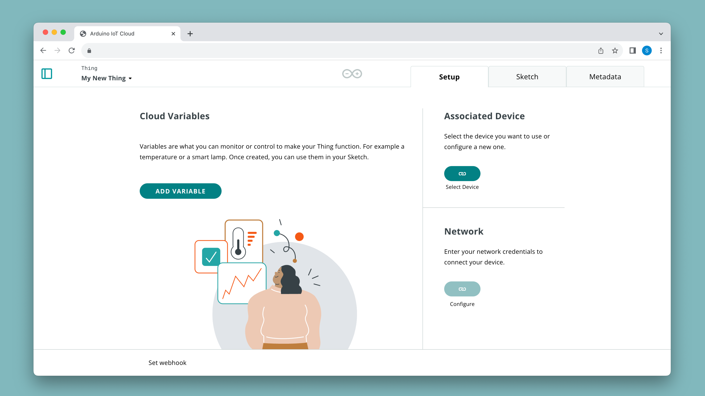
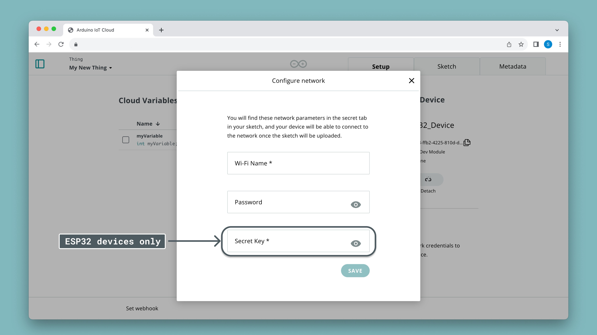
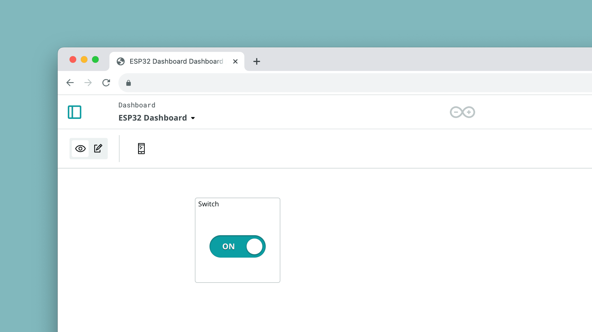

Arduino Cloud supports a wide range of ESP32 / ESP8266 based development boards. The ESP chips are great for any IoT project, and they can be programmed using the Arduino language (C++). 

Setting up ESP based boards in the Arduino Cloud is quick and simple. It is done by generating a **Device ID** and **Secret Key**, which together with your Wi-Fi® credentials is enough to connect to the Arduino Cloud. 

This guide will show you how to set up a generic ESP32/ESP8266 board to communicate with the Arduino Cloud.

***The official guide for connecting to Arduino Cloud using the C++ environment is found [here](/arduino-cloud/guides/arduino-c). This article is specifically for connecting ESP32/ESP8266 development boards.*** 

## Requirements

For this guide, you will need to have a registered account at Arduino. Register through the link below:
- [Create an Arduino account](https://login.arduino.cc/login)

You will also need a **ESP32 or ESP8266** development board.

***ESP32 and ESP8266 boards are third-party boards. Arduino Cloud supports the both variations but cannot guarantee that certain boards based on these SoCs work. A list of tested and officially supported development boards can be found at [here](/arduino-cloud/hardware/wifi#list-of-supported-boards).***

## Setup

In this section, we will go through the steps necessary to connect your ESP32 board to the Arduino Cloud. To follow these steps, please make sure you have a [registered Arduino account](https://login.arduino.cc/login), and that you have access to the [Arduino Cloud](https://app.arduino.cc/).

### Configure Device

First navigate to [Arduino Cloud - Devices](https://app.arduino.cc/devices). Here you can see all your devices, and configure a new one. 

1. Click on **"Add Device"**
2. Select **"Third Party Device"**
3. Choose your board from the list (if not there, choose e.g. `ESP32S3 Dev Board`).
4. Name your board, e.g. `Device_ESP32_LivingRoom`.
5. Save your **Device ID** and **Secret Key**. This will be used to connect to the Arduino Cloud.

***More details on this step is available in the [Setup ESP32/ESP8266 devices.](#setup-esp32esp8266-boards)***

### Configure Thing

Next, navigate to the **Things** tab. Here you will see a list of your Things, and a button to create a new one. When you create a new Thing, you will open up a new configuration space.



A "Thing" is a virtual twin of your hardware, and it is here that we create variables that we want to synchronize between the cloud and board. Any changes we make here will be reflected in an [automatically generated sketch](/arduino-cloud/cloud-interface/sketches#iot-sketches).

1. First, let's attach the device we want to use, by clicking the **"Select Device"** button in the **"Associated Devices"** section to the right. 
2. let's create a new variable, call it `test`, and select it to be a `boolean` type and with a **read/write** permission.
3. finally, configure your network in the **Network** section. Here you will enter your Wi-Fi® credentials, and your **Secret Key**, obtained when configuring your device.



All the above configurations have now been generated into a set of files that can be accessed in the **Sketch** tab.

***For more details, see the [documentation for Things](/arduino-cloud/cloud-interface/things).***

The automatically generated sketch is now available to be edited. This sketch includes all necessities to connect to the cloud, and has a callback function generated for each **read/write** variable.

Below is a sketch generated for a single `boolean` variable called `test`. We modified it to turn on/off the built-in LED of the board anytime the `test` bool is `true`.

```arduino
#include "thingProperties.h"

void setup() {
  pinMode(LED_BUILTIN, OUTPUT);  

  Serial.begin(9600);
  delay(1500); 

  initProperties();

  ArduinoCloud.begin(ArduinoIoTPreferredConnection);
  
  setDebugMessageLevel(2);
  ArduinoCloud.printDebugInfo();
}

void loop() {
  ArduinoCloud.update();
}

void onTestChange()  {
  if(test){
    digitalWrite(LED_BUILTIN, HIGH);
  }
  else{
    digitalWrite(LED_BUILTIN, LOW);
  }
}
```

- The sketch is automatically updated whenever you change your Thing (e.g. adding a variable, changing device),
- **Read/Write** permission variables adds a callback function to the bottom of your code. This function executes whenever the variable changes,
- the `ArduinoCloud.update()` function synchronises data between the board and cloud.
- if we update the `test` variable in the sketch, if it is connected to the cloud, we will see the change there as well. 

### Compile & Upload

When our sketch is ready, we can **compile & upload** our sketch to our board. This process can take some time, depending on how large your sketch is.

1. First make sure that you have the [Create Agent](https://create.arduino.cc/getting-started/plugin/welcome) installed. This allows Arduino Cloud to communicate with your board in the web interface.
2. Check that your board is connected and visible in the board selection menu.
3. Click the verify/upload button.
4. Wait until the code has successfully been uploaded.
5. Open the serial monitor tool to check for debug messages. If your board is failing to connect, it will print the errors here.

### Verify Connection

After a complete upload, you can verify the connection by checking the Thing interface. Here you can see the latest value & time stamp, as well as your device status (online/offline).

In this case, we have just a single boolean variable named `test`, which is used to switch the state of the built-in LED.

To control the state of the `test` variable, we can setup a **dashboard** and a **switch widget**. This will allow us to control the LED remotely.

1. Go to **Dashboards**, and create a new dashboard.
2. Click on the edit button at the top left, then on the **"Add"** button. Select the Thing you want to associate it with, and then click on **"Create Widgets"**.
3. A switch widget will have generated, which is now linked to your board. Flicking it should control the state of the LED (on/off).



***You can find more details in the [dashboards documentation](/arduino-cloud/cloud-interface/dashboard-widgets).***