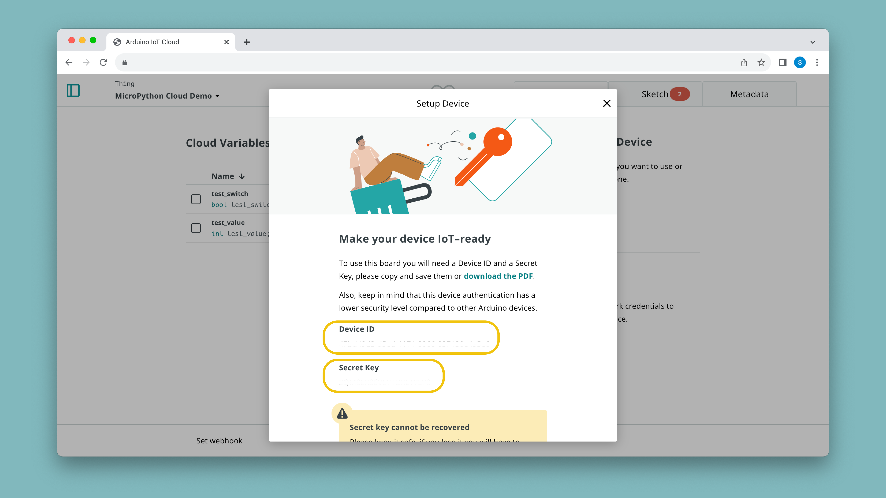
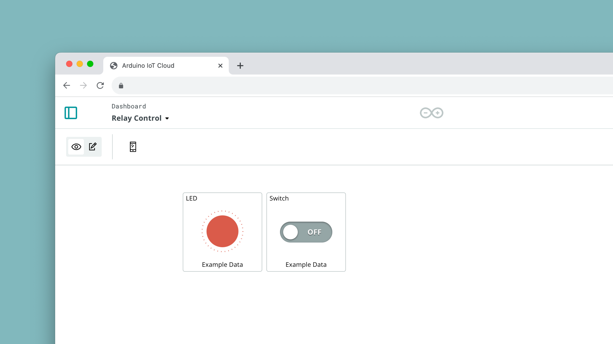

## Introduction 

This tutorial guides you on how to use the MicroPython library to connect your Arduino device to the Arduino Cloud. 

It requires your board to have a version of MicroPython installed, which is covered in [this article](/micropython/basics/board-installation).

To find our full MicroPython documentation, head over to the [MicroPython Docs](/micropython) page.

## Goals

The goals of this tutorial are:

- Connect your Arduino device to your Wi-Fi® network.
- Connect your Arduino device to the Arduino Cloud via MicroPython.
- Control an LED using the Arduino IoT Cloud.

## Hardware & Software Needed

- [Arduino Lab for MicroPython](https://labs.arduino.cc/en/labs/micropython)
- [Arduino GIGA R1 WiFi](/hardware/giga-r1-wifi) or [Portenta H7](/hardware/portenta-h7)
- [Nano ESP32](https://store.arduino.cc/products/nano-esp32)
- MicroPython >= 1.2 installed on your Arduino device.

***To install MicroPython, read the [MicroPython Installation Guide](https://docs.arduino.cc/micropython/basics/board-installation) written for all Arduino boards.***

## Cloud Setup

Before we start, make sure you have MicroPython installed on your board. If you haven't you can follow [this tutorial](https://docs.arduino.cc/micropython/basics/board-installation).

Then, we need to configure a Thing in the [Arduino Cloud](app.arduino.cc/things) consisting of two boolean variables called `led` and `ledSwitch`. Follow the instructions below to do so.

### Thing & Device Configuration

1. Create a new Thing, by clicking on the **"Create Thing"** button.
2. Click on the **"Select Device"** in the **"Associated Devices"** section of your Thing.
3. Click on **"Set Up New Device"**, and select the bottom category (**"Manual Device"**). Click continue in the next window, and choose a name for your device.
4. Finally, you will see a new **Device ID** and a **Secret Key** generate. You can download them as a PDF. Make sure to save it as you cannot access your Secret Key again.



- Learn more about Things in the [Things documentation](/arduino-cloud/cloud-interface/things)
- Learn more about Devices in the [Devices documentation](/arduino-cloud/hardware/devices)

### Create Variables

Next step is to create some cloud variables, which we will later interact with via a MicroPython script.

1. While in Thing configuration, click on **"Add Variable"** which will open a new window.
2. Name your variable `led` and select it to be of an `boolean` type.
3. Click on **"Add Variable"** at the bottom of the window.
4. Create another variable, name it `ledSwitch` and select it to be `int` type.

You should now have **two variables**:
- `led` - boolean 
- `ledSwitch` - boolean

It is important that they are named exactly like this, as we will be using them in the example script of this guide.

Your Thing should look something like this when you are finished:


***Learn more about how variables work in the [Variables documentation](/arduino-cloud/cloud-interface/variables)***

### Create Dashboard

When finished with creating your Thing, we also need to create a dashboard, a tool to monitor & interact with the cloud variables.

1. Go to the [dashboards](app.arduino.cc/dashboards) section, and **create a new dashboard.**
2. In the dashboard, first create a **LED** widget, and link it to the `led` variable we created earlier.
3. Create a **Switch** widget, and link it to `ledSwitch`. 
4. You should now have two widgets, looking something like the image below:



We are now finished with the Arduino Cloud configuration, and we can proceed with the MicroPython setup.

## MicroPython Setup

In this section, we will install the [Arduino IoT Cloud Python](https://pypi.org/project/arduino-iot-cloud/) library on the Arduino board, and run a script that synchronizes the board with the Arduino Cloud.

### Create Secret.py File

During the [device configuration](#thing--device-configuration), you obtained a  **device ID** and **secret key**. These details can be stored, along with your Wi-Fi® credentials, in a `secrets.py` file. Here is an example of how `secrets.py` should look like:

```python
WIFI_SSID = "myNetwork"   # Network SSID
WIFI_PASSWORD = "passwordForWiFi"   # Network key
DEVICE_ID = b"ef77wer88-0432-4574-85e1-54e3d5cac861"
CLOUD_PASSWORD = b"TQHFHEKKKLSYMPB1OZLF"
```

In a MicroPython editor, you can create this file, and save it on your board running MicroPython.

This file should be copied over to the flash drive that mounts when MicroPython boots.  To do so you can use the file manager tool in Arduino Lab for MicroPython. Please note that the latter option is not recommended as the file system can potentially get corrupted when copying files manually.

### Install Cloud Library

To install the Arduino IoT Cloud (Micro)Python library on your board, you can use the Python based tool `mpremote`. This requires Python to be installed. On macOS and Linux Python usually comes pre-installed. If it's not installed on your system you may download it from [here](https://www.python.org/downloads/). Then, to install `mpremote` you can use pip:

```bash
$ pip install mpremote
```

Run `mpremote connect list` to retrieve the serial number of your device. The output will look similar to this:

```
/dev/cu.usbmodem3871345733302 335B34603532 2341:055b Arduino Portenta Virtual Comm Port in HS Mode
```

Pass this serial number (the second value) to the install command:

```bash
$ mpremote connect id:335B34603532 mip install github:arduino/arduino-iot-cloud-py
```

This will install the library and all required dependencies on the board.
Another option is to manually copy the files from the library's [repository](https://github.com/arduino/arduino-iot-cloud-py/tree/main/src/arduino_iot_cloud) to the board's file system. It's good practice to put those files into a folder called `lib` to have the files organized neatly.

For more options on how to install libraries on your board, check out our [Installing Modules Guide](/micropython/basics/installing-modules). 

## Programming the Board

Here is the example code to copy and paste into your sketch. It connects your device

```python
from machine import Pin
import time
import network
import logging
from arduino_iot_cloud import ArduinoCloudClient

from secrets import WIFI_SSID
from secrets import WIFI_PASSWORD
from secrets import DEVICE_ID
from secrets import CLOUD_PASSWORD

led = Pin("LEDB", Pin.OUT) # Configure the desired LED pin as an output.

def on_switch_changed(client, value):
    # Toggles the hardware LED on or off.
    led.value(not value)
    
    # Sets the value of the cloud variable "led" to the current state of the LED
    # and thus mirrors the hardware state in the cloud.
    client["led"] = value

def wifi_connect():
    if not WIFI_SSID or not WIFI_PASSWORD:
        raise (Exception("Network is not configured. Set SSID and passwords in secrets.py"))
    wlan = network.WLAN(network.STA_IF)
    wlan.active(True)
    wlan.connect(WIFI_SSID, WIFI_PASSWORD)
    while not wlan.isconnected():
        logging.info("Trying to connect. Note this may take a while...")
        time.sleep_ms(500)
    logging.info(f"WiFi Connected {wlan.ifconfig()}")

if __name__ == "__main__":
    # Configure the logger.
    # All message equal or higher to the logger level are printed.
    # To see more debugging messages, set level=logging.DEBUG.
    logging.basicConfig(
        datefmt="%H:%M:%S",
        format="%(asctime)s.%(msecs)03d %(message)s",
        level=logging.INFO,
    )
    
    # NOTE: Add networking code here or in boot.py
    wifi_connect()
    
    # Create a client object to connect to the Arduino IoT cloud.
    # For MicroPython, the key and cert files must be stored in DER format on the filesystem.
    # Alternatively, a username and password can be used to authenticate:
    client = ArduinoCloudClient(device_id=DEVICE_ID, username=DEVICE_ID, password=CLOUD_PASSWORD)

    # Register cloud objects.
    # Note: The following objects must be created first in the dashboard and linked to the device.
    # This cloud object is initialized with its last known value from the cloud. When this object is updated
    # from the dashboard, the on_switch_changed function is called with the client object and the new value.
    client.register("ledSwitch", value=None, on_write=on_switch_changed, interval=0.250)

    # This cloud object is updated manually in the switch's on_write_change callback to update the LED state in the cloud.
    client.register("led", value=None)

    # Start the Arduino IoT cloud client.
    client.start()

```

**Explanations:**

- `wifi_connect()` - Connects to your local Wi-Fi® using the credentials specified in secrets.py.
- `client.register` - Registers a variable that will be synced with the cloud.
- `on_switch_changed` - Is the callback that gets executed when the `ledSwitch` variable is changed by toggling the switch on the cloud dashboard. This function in turn toggles the on-board LED and updates the cloud variable `led` that reflects the state of the on-board LED to be displayed in the cloud dashboard.
- `client.start()` - Enters a loop that runs as long as the board is connected to the cloud and synchronises data as it runs.

## Testing It Out

Open Arduino Lab for MicroPython and connect to your board. Pasting the above code and run the script. Then open your Arduino Cloud dashboard. You should see the registered "ledSwitch" and "led" widgets. Toggle the "ledSwitch", and the LED on your Arduino board should light up accordingly. The state of the "led" variable should also change, mirroring the state of the physical LED.

## Troubleshoot

If the code is not working, there are some common issues we can troubleshoot:

- Make sure MicroPython >= 1.2 is installed on your board.
- Check the Wi-Fi® credentials in the `secrets.py` file.
- Ensure the device ID and Cloud password in the `secrets.py` file match with what is registered on the IoT Cloud.
- Make sure your IoT Cloud Thing is correctly set up and your device is assigned to it.

## Conclusion

This tutorial has guided you through the process of connecting your Arduino device to the Arduino Cloud using MicroPython. You learned how to install the necessary library, set up your device, and control an LED via the Arduino Cloud. This opens up possibilities for more complex applications, as you can control and monitor your Arduino device remotely.