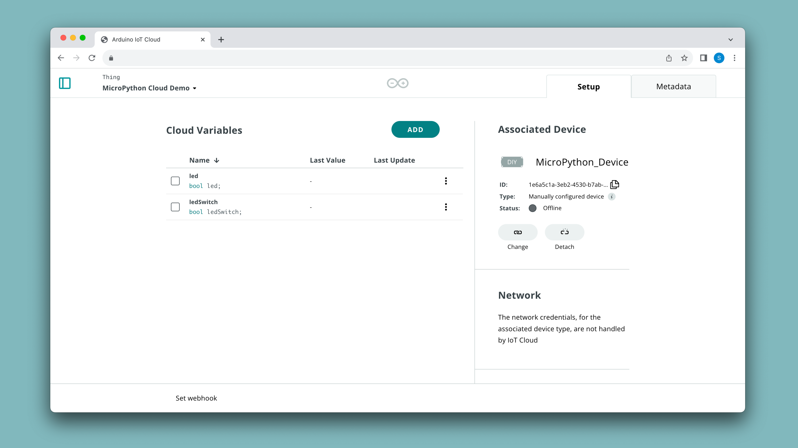
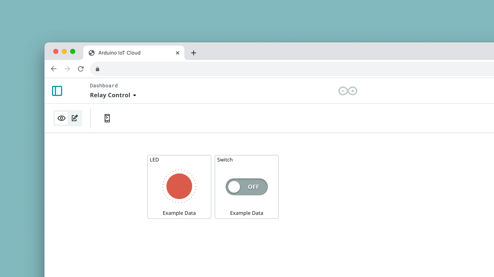

## Introduction 

This tutorial guides you on how to use the MicroPython library to connect your Arduino device to the Arduino Cloud. As a minimal example we will toggle the on-board LED using an Arduino Cloud dashboard widget.

It requires your board to have a version of MicroPython installed, which is covered in [this article](/micropython/basics/board-installation).

To find our full MicroPython documentation, head over to the [MicroPython Docs](/micropython) page.

## Goals

The goals of this tutorial are:

- Connect your Arduino device to your Wi-Fi® network.
- Connect your Arduino device to the Arduino Cloud via MicroPython.
- Control an LED using the Arduino Cloud.

## Hardware & Software Needed

- [Arduino Lab for MicroPython](https://labs.arduino.cc/en/labs/micropython)
- [Arduino GIGA R1 WiFi](/hardware/giga-r1-wifi) or [Portenta H7](/hardware/portenta-h7)
- [Nano ESP32](https://store.arduino.cc/products/nano-esp32)
- MicroPython >= 1.2 installed on your Arduino device.

***To install MicroPython, read the [MicroPython Installation Guide](https://docs.arduino.cc/micropython/basics/board-installation) written for all Arduino boards.***

## Cloud Setup

Before we start, make sure you have MicroPython installed on your board. If you haven't you can follow [this tutorial](https://docs.arduino.cc/micropython/basics/board-installation).

Then, we need to configure a Thing in the [Arduino Cloud](https://app.arduino.cc/things) consisting of two boolean variables called `led` and `ledSwitch`. Follow the instructions below to do so.

### Thing & Device Configuration

1. Create a new Thing, by clicking on the **"Create Thing"** button.
2. Click on the **"Select Device"** in the **"Associated Devices"** section of your Thing.
3. Click on **"Set Up New Device"**, and select the bottom category (**"Manual Device"**). Click continue in the next window, and choose a name for your device.
4. Finally, you will see a new **Device ID** and a **Secret Key** generate. You can download them as a PDF. Make sure to save it as you cannot access your Secret Key again.


- Learn more about Things in the [Things documentation](/arduino-cloud/cloud-interface/things)
- Learn more about Devices in the [Devices documentation](/arduino-cloud/hardware/devices)

### Create Variables

Next step is to create some Cloud variables, which we will later interact with via a MicroPython script.

1. While in Thing configuration, click on **"Add Variable"** which will open a new window.
2. Name your variable `led` and select it to be of an `boolean` type.
3. Click on **"Add Variable"** at the bottom of the window.
4. Create another variable, name it `ledSwitch` and select it to be `boolean` type.

You should now have **two variables**:
- `led` - boolean 
- `ledSwitch` - boolean

It is important that they are named exactly like this, as we will be using them in the example script of this guide.

Your Thing should look something like this when you are finished:



***Learn more about how variables work in the [Variables documentation](/arduino-cloud/cloud-interface/variables)***

### Create Dashboard

When finished with creating your Thing, we also need to create a dashboard, a tool to monitor & interact with the Cloud variables.

1. Go to the [dashboards](https://app.arduino.cc/dashboards) section, and **create a new dashboard.**
2. In the dashboard, first create a **LED** widget, and link it to the `led` variable we created earlier.
3. Create a **Switch** widget, and link it to `ledSwitch`. 
4. You should now have two widgets, looking something like the image below:



We are now finished with the Arduino Cloud configuration, and we can proceed with the MicroPython setup.

## MicroPython Setup

In this section, we will install the [Arduino IoT Cloud Python](https://pypi.org/project/arduino-iot-cloud/) library on the Arduino board, and run a script that synchronizes the board with the Arduino Cloud.

### Create Secret.py File

During the [device configuration](#thing--device-configuration), you obtained a  **device ID** and **secret key**. These details can be stored, along with your Wi-Fi® credentials, in a `secrets.py` file. Here is an example of how `secrets.py` should look like:

```python
WIFI_SSID = "myNetwork"   # Network SSID
WIFI_PASSWORD = "passwordForWiFi"   # Network key
DEVICE_ID = b"ef77wer88-0432-4574-85e1-54e3d5cac861"
CLOUD_PASSWORD = b"TQHFHEKKKLSYMPB1OZLF"
```

In a MicroPython editor, you can create this file, and save it on your board running MicroPython.

This file should be copied over to the flash drive that mounts when MicroPython boots.  To do so you can use the file manager tool in Arduino Lab for MicroPython. Please note that the latter option is not recommended as the file system can potentially get corrupted when copying files manually.

### Install Cloud Library

To install the Arduino Cloud (Micro)Python library on your board, you can use the Python based tool `mpremote`. This requires Python to be installed. On macOS and Linux Python usually comes pre-installed. If it's not installed on your system you may download it from [here](https://www.python.org/downloads/). Then, to install `mpremote` you can use pip:

```bash
$ pip install mpremote
```

Run `mpremote connect list` to retrieve the serial number of your device. The output will look similar to this:

```
/dev/cu.usbmodem3871345733302 335B34603532 2341:055b Arduino Portenta Virtual Comm Port in HS Mode
```

Pass this serial number (the second value) to the install command:

```bash
$ mpremote connect id:335B34603532 mip install github:arduino/arduino-iot-cloud-py
```

This will install the library and all required dependencies on the board.
Another option is to manually copy the files from the library's [repository](https://github.com/arduino/arduino-iot-cloud-py/tree/main/src/arduino_iot_cloud) to the board's file system. It's good practice to put those files into a folder called `lib` to have the files organized neatly.

For more options on how to install libraries on your board, check out our [Installing Modules Guide](/micropython/basics/installing-modules). 

## Programming the Board

### Cloud Connection
There are two main methods to create this connection `async` and `sync`.

#### Async (Default)
This is the method currently implemented by default with the Cloud. Asynchronous operations allow tasks to run independently of the main program flow. Functions can start and continue without waiting for other tasks to finish. This non-blocking behavior is achieved using techniques like callbacks, coroutines, or the async and await keywords in MicroPython. 

Asynchronous functions are particularly useful for handling network communication, as they enable the boards to perform other operations (like reading sensors or updating outputs) while waiting for data from the Arduino Cloud.


**Code example:**
```python
from secrets import DEVICE_ID
from secrets import SECRET_KEY

# Switch callback, toggles the LED.
def on_switch_changed(client, value):
    # Note the client object passed to this function can be used to access
    # and modify any registered cloud object. The following line updates
    # the LED value.
    client["led"] = value

# 1. Create a client object, which is used to connect to the IoT cloud and link local
# objects to cloud objects. Note a username and password can be used for basic authentication
# on both CPython and MicroPython. For more advanced authentication methods, please see the examples.
client = ArduinoCloudClient(device_id=DEVICE_ID, username=DEVICE_ID, password=SECRET_KEY)

# 2. Register cloud objects.
# Note: The following objects must be created first in the dashboard and linked to the device.
# When the switch is toggled from the dashboard, the on_switch_changed function is called with
# the client object and new value args.
client.register("sw1", value=None, on_write=on_switch_changed)

# The LED object is updated in the switch's on_write callback.
client.register("led", value=None)

# 3. Start the Arduino cloud client.
client.start()
```

Remember that our `secrets.py` file should look like:
```python
WIFI_SSID  = ""  # WiFi network SSID (for MicroPython)
WIFI_PASS  = ""  # WiFi network key  (for MicroPython)
DEVICE_ID  = "" # Provided by Arduino cloud when creating a device.
SECRET_KEY = "" # Provided by Arduino cloud when creating a device.
```

#### Sync
In synchronous operations, tasks are executed one after another in a sequential manner. Each function call waits for the previous one to complete before starting. This approach is straightforward and easier to implement but can cause delays if a task takes a long time to finish, as it blocks the execution of subsequent code. In the context of network communication with the Arduino Cloud, synchronous functions may lead to unresponsiveness during data transmission or reception.

Alternatively, you can select the synchronous method by passing sync_mode=True when creating the client object and calling client.update() periodically after connecting.

Code example:
```python
from secrets import DEVICE_ID
from secrets import SECRET_KEY

# Switch callback, toggles the LED.
def on_switch_changed(client, value):
    # Note the client object passed to this function can be used to access
    # and modify any registered cloud object. The following line updates
    # the LED value.
    client["led"] = value

# 1. Create a client object, which is used to connect to the IoT cloud and link local
# objects to cloud objects. Note a username and password can be used for basic authentication
# on both CPython and MicroPython. For more advanced authentication methods, please see the examples.
client = ArduinoCloudClient(device_id=DEVICE_ID, username=DEVICE_ID, password=SECRET_KEY, sync_mode=True)

# 2. Register cloud objects.
# Note: The following objects must be created first in the dashboard and linked to the device.
# When the switch is toggled from the dashboard, the on_switch_changed function is called with
# the client object and new value args.
client.register("sw1", value=None, on_write=on_switch_changed)

# The LED object is updated in the switch's on_write callback.
client.register("led", value=None)

# In synchronous mode, this function returns immediately after connecting to the cloud.
client.start()

# Update the client periodically.
while True:
    client.update()
    time.sleep(0.100)
```

`secrets.py` file should look the same on both implementations.

### Project example

Here is the example code to copy and paste into your program. It connects your device to Arduino Cloud over Wi-Fi® and toggles the LED of the board using the Arduino Cloud dashboard.


```python
from machine import Pin
import time
import network
import logging
from arduino_iot_cloud import ArduinoCloudClient

from secrets import WIFI_SSID
from secrets import WIFI_PASSWORD
from secrets import DEVICE_ID
from secrets import CLOUD_PASSWORD

led = Pin("LED_BUILTIN", Pin.OUT) # Configure the desired LED pin as an output.

def on_switch_changed(client, value):
    # Toggles the hardware LED on or off.
    led.value(not value)
    # Depending on the board you use you may need to use "led.value(value)" instead
    # so that the LED's state reflects correctly the boolean value.
    
    # Sets the value of the Cloud variable "led" to the current state of the LED
    # and thus mirrors the hardware state in the Cloud.
    client["led"] = value

def wifi_connect():
    if not WIFI_SSID or not WIFI_PASSWORD:
        raise (Exception("Network is not configured. Set SSID and passwords in secrets.py"))
    wlan = network.WLAN(network.STA_IF)
    wlan.active(True)
    wlan.connect(WIFI_SSID, WIFI_PASSWORD)
    while not wlan.isconnected():
        logging.info("Trying to connect. Note this may take a while...")
        time.sleep_ms(500)
    logging.info(f"WiFi Connected {wlan.ifconfig()}")

if __name__ == "__main__":
    # Configure the logger.
    # All message equal or higher to the logger level are printed.
    # To see more debugging messages, set level=logging.DEBUG.
    logging.basicConfig(
        datefmt="%H:%M:%S",
        format="%(asctime)s.%(msecs)03d %(message)s",
        level=logging.INFO,
    )
    
    # NOTE: Add networking code here or in boot.py
    wifi_connect()
    
    # Create a client object to connect to the Arduino Cloud.
    # For MicroPython, the key and cert files must be stored in DER format on the filesystem.
    # Alternatively, a username and password can be used to authenticate:
    client = ArduinoCloudClient(device_id=DEVICE_ID, username=DEVICE_ID, password=CLOUD_PASSWORD)

    # Register Cloud objects.
    # Note: The following objects must be created first in the dashboard and linked to the device.
    # This Cloud object is initialized with its last known value from the Cloud. When this object is updated
    # from the dashboard, the on_switch_changed function is called with the client object and the new value.
    client.register("ledSwitch", value=None, on_write=on_switch_changed, interval=0.250)

    # This Cloud object is updated manually in the switch's on_write_change callback to update the LED state in the Cloud.
    client.register("led", value=None)

    # Start the Arduino Cloud client.
    client.start()

```

**Explanations:**

- `wifi_connect()` - Connects to your local Wi-Fi® using the credentials specified in secrets.py.
- `client.register` - Registers a variable that will be synced with the Cloud.
- `on_switch_changed` - Is the callback that gets executed when the `ledSwitch` variable is changed by toggling the switch on the Cloud dashboard. This function in turn toggles the on-board LED and updates the Cloud variable `led` that reflects the state of the on-board LED to be displayed in the Cloud dashboard.
- `client.start()` - Enters a loop that runs as long as the board is connected to the Cloud and synchronises data as it runs.

## Testing It Out

Open Arduino Lab for MicroPython and connect to your board. Pasting the above code and run the script. Then open your Arduino Cloud dashboard. You should see the registered "ledSwitch" and "led" widgets. Toggle the "ledSwitch", and the LED on your Arduino board should light up accordingly. The state of the "led" variable should also change, mirroring the state of the physical LED.

## Using Advanced Cloud Variables

To use variables in Arduino Cloud that are not of a basic type, you can set them up like you would do with any other variable. For example, to control a colored light such as the on-board RGB led on some Arduino boards, you can create a variable of type `CloudColoredLight`. 


On the programming side, you need to import the corresponding class in MicroPython. For the colored light example, you need to import the `ColoredLight` class:

```python
from arduino_iot_cloud import ColoredLight
```

The cloud variable needs then to be registered with the client using that type and the name that you gave it ("light" in our example):

```python
client.register(ColoredLight("light", swi=True, on_write=on_colored_light_changed))
```

In the callback function for this variable ("on_colored_light_changed") you will receive an object of the same type with populated properties. Those properties depend on the type. For example the `ColoredLight` class has the following properties:

- `swi`: The on-value of the light switch (True/False)
- `hue`: The hue value of the color
- `sat`: The saturation of the color
- `bri`: The brightness of the color

Once you receive these values from the Cloud you will need to convert them to RGB so you can set the RGB LEDs accordingly. For reasons of brevity we won't go into the code for the color conversion, it is provided however in the full example code further down. Also we need to make all three RGB LEDs available in the code so their value can be set:

```python
led_red = Pin("LEDR", Pin.OUT)
led_green = Pin("LEDG", Pin.OUT)
led_blue = Pin("LEDB", Pin.OUT)
```

Then each of the three LEDs' brightness needs to be set so that the resulting color is as desired. This is done using a technique called [PWM](/learn/microcontrollers/analog-output/):

```python
def set_led_brightness(led, brightness):
    """
    Sets the brightness (0 - 255) of an LED using PWM.
    """
    pwm = PWM(led)
    max_brightness = 255

    # Ensure brightness is between 0 and max_brightness.
    brightness = max(0, min(max_brightness, brightness))

    # Map input brightness from 0-max_brightness to 0-65535.
    duty_cycle = int(brightness * 65535 / max_brightness)
    pwm.duty_u16(duty_cycle)
```

With that defined we can set the corresponding values of the RGBs:

```python
def set_leds_from_rgb(rgb, common_cathode=True):
    # For common cathode RGB LEDs, invert the RGB values
    # since the LED is on when the pin is low.
    if common_cathode:
        rgb = (255 - rgb[0], 255 - rgb[1], 255 - rgb[2])
    set_led_brightness(led_red, rgb[0])
    set_led_brightness(led_green, rgb[1])
    set_led_brightness(led_blue, rgb[2])
```

The missing piece is the callback handler for when the cloud variable changes that was defined when registering the variable:

```python
def on_colored_light_changed(client, light):
    # Do nothing if the hue, saturation or brightness is None.
    if light.hue is None or light.sat is None or light.bri is None:
        return    
    
    light_enabled = light.swi
    
    if light_enabled:
        rgb_value = convert_hs_to_rgb(light.hue, light.sat, light.bri)
        set_leds_from_rgb(rgb_value)
    else:
        set_leds_from_rgb((0, 0, 0)) # Turn LEDs off
```

### Full Code Example

Here is the complete code to try it out:


```python
# This file is part of the Python Arduino Cloud.

# Any copyright is dedicated to the Public Domain.
# https://creativecommons.org/publicdomain/zero/1.0/
from machine import Pin, PWM
import time
import network
import logging
from arduino_iot_cloud import ArduinoCloudClient
from arduino_iot_cloud import ColoredLight

from secrets import *

led_red = Pin("LEDR", Pin.OUT)
led_green = Pin("LEDG", Pin.OUT)
led_blue = Pin("LEDB", Pin.OUT)

def set_led_brightness(led, brightness):
    """
    Sets the brightness (0 - 255) of an LED using PWM.
    """
    pwm = PWM(led)
    max_brightness = 255

    # Ensure brightness is between 0 and max_brightness.
    brightness = max(0, min(max_brightness, brightness))

    # Map input brightness from 0-max_brightness to 0-65535.
    duty_cycle = int(brightness * 65535 / max_brightness)
    pwm.duty_u16(duty_cycle)

def convert_hs_to_rgb(hue, sat, bri):
    # Convert hue, saturation and brightness to RGB.
    # This function is based on the algorithm described at
    # https://www.developers.meethue.com/documentation/color-conversions-rgb-xy
    # and https://gist.github.com/mjackson/5311256
    h = hue / 360
    s = sat / 100
    v = bri / 100
    if s == 0.0:
        return (int(v * 255), int(v * 255), int(v * 255))
    i = int(h * 6)
    f = (h * 6) - i
    p = v * (1 - s)
    q = v * (1 - s * f)
    t = v * (1 - s * (1 - f))
    if i % 6 == 0:
        return (int(v * 255), int(t * 255), int(p * 255))
    if i % 6 == 1:
        return (int(q * 255), int(v * 255), int(p * 255))
    if i % 6 == 2:
        return (int(p * 255), int(v * 255), int(t * 255))
    if i % 6 == 3:
        return (int(p * 255), int(q * 255), int(v * 255))
    if i % 6 == 4:
        return (int(t * 255), int(p * 255), int(v * 255))
    if i % 6 == 5:
        return (int(v * 255), int(p * 255), int(q * 255))    

def set_leds_from_rgb(rgb, common_cathode=True):
    # For common cathode RGB LEDs, invert the RGB values
    # since the LED is on when the pin is low.
    if common_cathode:
        rgb = (255 - rgb[0], 255 - rgb[1], 255 - rgb[2])
    set_led_brightness(led_red, rgb[0])
    set_led_brightness(led_green, rgb[1])
    set_led_brightness(led_blue, rgb[2])

def on_colored_light_changed(client, light):
    # Do nothing if the hue, saturation or brightness is None.
    if light.hue is None or light.sat is None or light.bri is None:
        return    
    
    light_enabled = light.swi
    
    if light_enabled:
        rgb_value = convert_hs_to_rgb(light.hue, light.sat, light.bri)
        set_leds_from_rgb(rgb_value)
    else:
        set_leds_from_rgb((0, 0, 0))

def wifi_connect():
    if not WIFI_SSID or not WIFI_PASSWORD:
        raise (Exception("Network is not configured. Set SSID and passwords in secrets.py"))
    wlan = network.WLAN(network.STA_IF)
    wlan.active(True)
    wlan.connect(WIFI_SSID, WIFI_PASSWORD)
    while not wlan.isconnected():
        logging.info("Trying to connect. Note this may take a while...")
        time.sleep_ms(500)
    logging.info(f"WiFi Connected {wlan.ifconfig()}")

if __name__ == "__main__":
    # Configure the logger.
    # All message equal or higher to the logger level are printed.
    # To see more debugging messages, set level=logging.DEBUG.
    logging.basicConfig(
        datefmt="%H:%M:%S",
        format="%(asctime)s.%(msecs)03d %(message)s",
        level=logging.INFO,
    )
    
    # NOTE: Add networking code here or in boot.py
    wifi_connect()
    
    # Create a client object to connect to the Arduino Cloud.

    # For MicroPython, the key and cert files must be stored in DER format on the filesystem.
    # Alternatively, a username and password can be used to authenticate:
    client = ArduinoCloudClient(device_id=DEVICE_ID, username=DEVICE_ID, password=CLOUD_PASSWORD)
    client.register(ColoredLight("light", swi=True, on_write=on_colored_light_changed))

    # Start the Arduino Cloud client.

    client.start()
```

## Troubleshoot

If the code is not working, there are some common issues we can troubleshoot:

- Make sure MicroPython >= 1.2 is installed on your board.
- Check the Wi-Fi® credentials in the `secrets.py` file.
- Ensure the device ID and Cloud password in the `secrets.py` file match with what is registered on the Arduino Cloud.
- Make sure your Arduino Cloud Thing is correctly set up and your device is assigned to it.

## Conclusion

This tutorial has guided you through the process of connecting your Arduino device to the Arduino Cloud using MicroPython. You learned how to install the necessary library, set up your device, and control an LED via the Arduino Cloud. This opens up possibilities for more complex applications, as you can control and monitor your Arduino device remotely.
