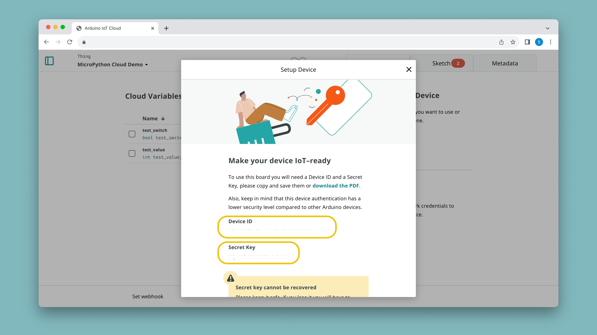
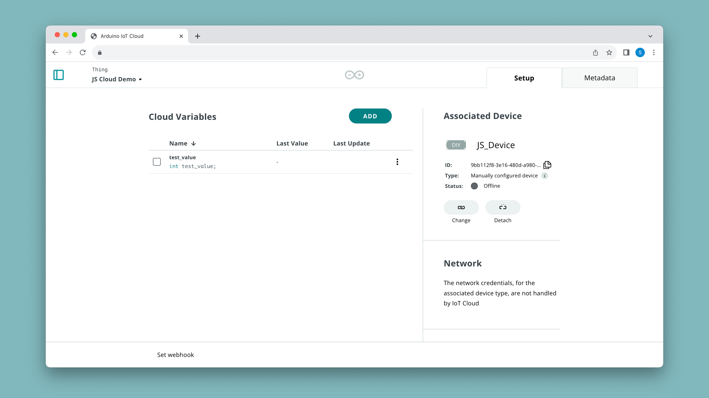

The [arduino-iot-js](https://www.npmjs.com/package/arduino-iot-js) library allows you to interact with the Arduino Cloud via MQTT. It supports basic authentication using the **device ID** as well as **secret key** that is obtained from the Arduino Cloud when configuring a manual device.

## Overview

In this guide we will:
- Configure a manual device in the Arduino Cloud,
- install the **arduino-iot-js** library,
- create a JavaScript example code that connects to the Arduino Cloud. 

## Requirements

To follow this guide, make sure to have:

- An [Arduino account](https://login.arduino.cc/login),
- a version of [node.js](https://nodejs.org/en/download/current) installed (confirmed to work with `v16.15.0`),
- [arduino-iot-js](https://www.npmjs.com/package/arduino-iot-js) installed.
- A code editor (we recommend [VSCode](https://code.visualstudio.com/)).

## Cloud Setup

To begin with, we need to create a manual device, and create a new [Thing](/arduino-cloud/cloud-interface/things). Navigate to the [Arduino Cloud](https://app.arduino.cc/) and to the **"Things"** tab.

### Thing & Device Configuration

1. Create a new Thing, by clicking on the **"Create Thing"** button.
2. Click on the **"Select Device"** in the **"Associated Devices"** section of your Thing.
3. Click on **"Set Up New Device"**, and select the bottom category (**"Manual Device"**). Click continue in the next window, and choose a name for your device.
4. Finally, you will see a new **Device ID** and a **Secret Key** generate. You can download them as a PDF. Make sure to save it as you cannot access your Secret Key again.



- Learn more about Things in the [Things documentation](/arduino-cloud/cloud-interface/things)
- Learn more about Devices in the [Devices documentation](/arduino-cloud/hardware/devices)

### Create Variable

Next step is to create a Cloud variable, which we will later interact with in our JavaScript code.

1. While in Thing configuration, click on **"Add Variable"** which will open a new window.
2. Name your variable `test_value` and select it to be of an `int` type.
3. Click on **"Add Variable"** at the bottom of the window.

You should now have a variable named `test_value`. It is important that it is named exactly like this, as we will be using it in the example script of this guide.



- Learn more about how variables work in the [Variables documentation](/arduino-cloud/cloud-interface/variables)

***Variables that we create here can also be synchronized with variables running on any other device in the platform. This makes it possible to link an Arduino boards with a Python or JavaScript project without writing any connection code!*** 

## JavaScript Setup

Before continuing, make sure you have a version of [node.js](https://nodejs.org/en/download/current) installed. You can check that it is installed by opening a terminal and running:

```
node -v
```

### Install NPM Package

The [arduino-iot-js](https://www.npmjs.com/package/arduino-iot-js) library can be installed by running the following command:

```
npm install arduino-iot-js
```

This will install the library in your current directory. You can check that the library is installed by running `npm list`.

### Example Script

Create a file with a `.js` extension, and call it something appropriate such as `cloud_first_test.js`. Note that it needs to be in the same directory as you installed the library.

Below is a script that connects to the Cloud using the **device ID** and **secret key** that we obtained in the [cloud setup](#cloud-setup) section. Copy the contents into your `.js` file.

```javascript
const { ArduinoIoTCloud } = require('arduino-iot-js');

(async () => {
  const client = await ArduinoIoTCloud.connect({
    deviceId: 'YOUR_DEVICE_ID',
    secretKey: 'YOUR_SECRET_KEY',
    onDisconnect: (message) => console.error(message),
  });

  const value = 20;
  let cloudVar = "test_value"

  client.sendProperty(cloudVar, value);
  console.log(cloudVar, ":", value);

  client.onPropertyValue(cloudVar, (value) => console.log(cloudVar, ":", value));
})();
```

- `sendProperty(cloudVar, value)` - update a variable in the Cloud, 
- `onPropertyValue(cloudVar, (value))` - when receiving an update from the Arduino Cloud, updates the `value` variable.

This example simply sends an update to the Arduino Cloud (updating the value of `test_value` to `20`), and awaits any changes from the Cloud. You can ensure it is working by checking your Thing interface as well:


You can test out the `test_value` variable by creating a dashboard in the Arduino Cloud with a **value** widget linked to the variable. 

When entering a new number, you should see the following command being printed in the terminal:

```
test_value : <value>
```

For creating dashboards and linking variables, check out the [Dashboard & Widgets documentation](/arduino-cloud/cloud-interface/dashboard-widgets).

### Troubleshooting

- `Error: Cannot find module` - the package is not installed/accessible from your current directory. Double check that your directory is correct and that you have successfully installed the package.
- `Error: connection failed: client not connected` - likely due to wrong credentials (device ID / secret key). Double check these parameters.