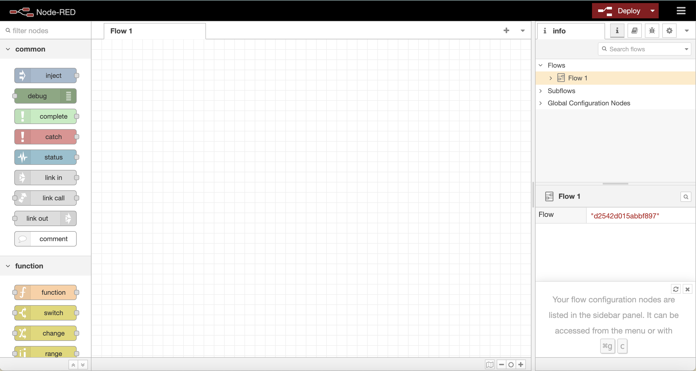
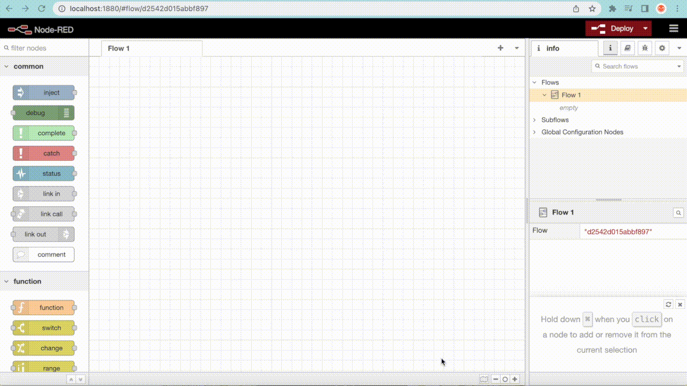
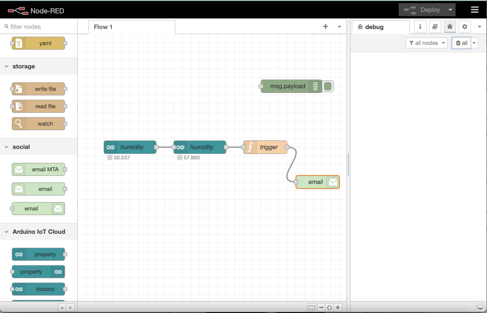

## Introduction

Node-RED is a programming tool for connecting hardware devices such as Arduino with other hardware devices, APIs, and online services easily using a web-based flow editor. It allows you to connect those different devices and services by connecting a combination of nodes that create your desired flow.

In this tutorial, we will look into the applications of using Node-RED together with the Arduino Cloud. The integration of the two platforms allows us to facilitate communications between the Arduino Cloud and home automation devices, send and receive data from online services such as Email and SMS, and write JavaScript code to manipulate the data.

***Note: this tutorial requires a [subscription to the Arduino Cloud](https://cloud.arduino.cc/plans), all three subscriptions (Entry, Maker & Maker Plus) are valid.***

## Goals

- Set up Node-RED with the Arduino Cloud.
- Use simple Flows with Node-RED.
- Build a Node-RED Flow that pulls data from Arduino Cloud.
- Manipulate data received from the Arduino Cloud using JavaScript code.
- Send email notifications with data from the Arduino Cloud.

## Hardware & Software Requirements

- [Arduino Create Agent](https://github.com/arduino/arduino-create-agent)
- [Node.js](https://nodejs.org/en/) and [Node-RED installed](https://nodered.org/)
- An [Arduino account](http://create.arduino.cc/iot).

For this tutorial, you will need a Cloud compatible board. You will find all compatible boards in the link below:

- [Arduino Cloud compatible hardware.](/arduino-cloud/hardware/devices#type-of-devices)


## Node-RED Setup

Setting up Node-RED is simple, we will run it locally following the steps below:

**1.** Install [Node.js](https://nodejs.org/en/). To check if Node.js is installed, open a terminal and enter the following command:

```shell
node --version
```

If correctly installed, you will see the version number printed in the terminal.

**2.** Install Node-RED from the command line using the command `sudo npm install -g --unsafe-perm node-red`, delete `sudo` if you are using a Windows machine.

**3.** After installation, start it by running the command `node-red` in the terminal, you should see a similar output to this:

```shell
    $ node-red

    Welcome to Node-RED
    ===================

    30 Jun 23:43:39 - [info] Node-RED version: v1.3.5
    30 Jun 23:43:39 - [info] Node.js  version: v14.7.2
    30 Jun 23:43:39 - [info] Darwin 19.6.0 x64 LE
    30 Jun 23:43:39 - [info] Loading palette nodes
    30 Jun 23:43:44 - [warn] rpi-gpio : Raspberry Pi specific node set inactive
    30 Jun 23:43:44 - [info] Settings file  : /Users/nol/.node-red/settings.js
    30 Jun 23:43:44 - [info] HTTP Static    : /Users/nol/node-red/web
    30 Jun 23:43:44 - [info] Context store  : 'default' [module=localfilesystem]
    30 Jun 23:43:44 - [info] User directory : /Users/nol/.node-red
    30 Jun 23:43:44 - [warn] Projects disabled : set editorTheme.projects.enabled=true to enable
    30 Jun 23:43:44 - [info] Creating new flows file : flows_noltop.json
    30 Jun 23:43:44 - [info] Starting flows
    30 Jun 23:43:44 - [info] Started flows
    30 Jun 23:43:44 - [info] Server now running at http://127.0.0.1:1880/red/

```

**4.**  Open the Node-RED editor by going to your browser and entering `http://localhost:1880`.

***For more details on installing Node-RED, you can check [their installation page](https://nodered.org/docs/getting-started/local).***

## The Node-RED Editor

The Node-RED editor consists of four main parts:

- A **header on the top** containing the Deploy button, main menu, and the user menu (only visible if user authentication is enabled).
- The **palette on the left side**, containing the available nodes.
- A **workspace in the middle**, where flows can be created.
- The **sidebar on the right**, containing editing tools such as a node configuration tool and a debugger.



You can run the simple flow shown below using Node-RED's default nodes:

- drag the **"inject"** node from the palette on the left side into the workspace in the middle
- double-click on the node to edit it
- assign a name and topic to it
- click on the dropdown menu next to *msg.payload* and choose **"string"**, then enter a random message
- click **Done**
- drag the **"debug"** node into the workspace
- connect the two nodes by dragging a wire from the message node to the debug node
- click on the debug menu from the sidebar on the right
- press **Depoly** from the header on the top
- finally, press on the checkbox of the message node



Your message should be printed to the console on the right side.

In addition to the default nodes installed in node-RED, you can use the palette manager to install additional nodes that can be useful to creating more advanced flows. Follow the steps below to install the Arduino Cloud nodes using the palette manager:

**1.** Click on the menu in the header bar in the top right corner.

**2.** Select **"Manage palette"**.

**3.** Go to the **"Install"** tab.

**4.** Search for **"Arduino"**.

**5.** From the results, install **"@arduino/node-red-contrib-arduino-iot-cloud"**.


Now, you should be able to use the Arduino Cloud nodes from the palette on the left side of the editor. There are five Arduino Cloud nodes: property in, property out, historic, periodic, and inject. Each of the nodes has a description of its function, which appears when you hover over the node.

## Setting Up a Thing

The Thing we will create for this example is quite simple. It is a sketch to read humidity values from a **DHT11 humidity sensor**, any other values can be used alternatively, such as temperature, soil moisture, light etc. Keep in mind that the code and example below are specific to using the DHT11 humidity sensor.

Follow the steps below to set up the Thing:

- Go to the Arduino Cloud -> Thing -> Create a Thing
- Add your Device and your Network credentials
- Add an integer Variable, with the name humidity, and set permissions to Read Only
- Go to the **"Sketch"** tab and replace the code with the code below:  

```arduino

  #include "thingProperties.h"
  #include <Arduino_MKRIoTCarrier.h>
  MKRIoTCarrier carrier;

  #include <dht.h> // include this library, named: "dht library"
  dht DHT; 
  #define DHT11_PIN 7 // define DHT pin

  void setup() {
  // Initialize serial and wait for port to open:
    Serial.begin(9600);
    // This delay gives the chance to wait for a Serial Monitor without blocking if none is found
    delay(1500); 

    // Defined in thingProperties.h
    initProperties();
    
    // Connect to Arduino Cloud
    ArduinoCloud.begin(ArduinoIoTPreferredConnection);
    
    setDebugMessageLevel(2);
    ArduinoCloud.printDebugInfo();
    
    carrier.begin();
  }

  void loop() {
    ArduinoCloud.update();

    int readValue = DHT.read11(DHT11_PIN); // check the data coming from the DHT pin
    humidity = DHT.humidity; // assign the humidity variable to data from sensor
  }

  ```

### Circuit

The final step is connecting the **DHT11 humidity sensor** to our Arduino MKR Wi-Fi 1010 board, as shown in the image below. You can also freely use any other [Arduino Cloud compatible board](/arduino-cloud/hardware/devices#type-of-devices) and a different sensor.


## Communicating with Node-RED

Use the steps below to use Node-RED with the Arduino Cloud:

**1.** Go to the [API keys section](https://app.arduino.cc/api-keys), and create a new API key.

**2.** Save the Client ID and Client Secret in a safe document

**3.** Go to Node-RED web page at [http://localhost:1880](http://localhost:1880)

**4.** Add the Arduino Cloud "**property out**" node from the palette menu on the left side

**5.** Double click on the node -> select "Add new Arduino-connection"

**6.** Click on the pen icon to enter the API Key details -> enter the Client ID and Client Secret saved in the previous steps -> click on the ADD button

**7.** You should now be able to select any of your Things and properties (Variables). In our case, we select the **Humidity Thing**, and **humidity property** (Variable) to retrieve data values from.


### Creating a Flow

Now that you have a node pulling data from the Arduino Cloud, you need to use the *Inject* node in order to manipulate and send the data. All you need to do is dragging the *Inject* node and connect it to the property out node, then double-clicking on the inject node to ensure that the right Thing and property are selected. 

Finally, we will add a debug node from the top of the palette menu, to print the values coming from the Arduino Cloud into the console. You will now be able to see the values from the humidity sensor printed into the Node-RED console.

The next step is adding a **function node** that processes the data coming from the Arduino Cloud. This node is important when working with a constant flow of data, as it allows you to use JavaScript code to create customized triggers from the received values. After dragging the function node into the editor, double-click on the node and select **"on message"** tab, then insert the code below:

```js
let data = msg.payload;
let trigger = context.get("status");

if(typeof trigger == "undefined")
trigger = false;

if(data>60 && !trigger){
    trigger = true;
    context.set("status",trigger);
    return msg;
}

if(data<60 && trigger){
    trigger = false;
    context.set("status",trigger);
    return msg;
}
```

This code will only send values when they are above 60, or when they change back to below 60. You can connect it to the flow, in between the humidity inject node, and the debug node. Try it out by blowing air on the humidity sensors to increase the values.


### Sending Email Notifications

Now that you are able to pull and manipulate data from the Arduino Cloud, it's time to use this data. In this example, we will show how to send alarm notifications to your email, using the Arduino Cloud. To achieve this, we need to add an email nodes following the steps below:

- Click on the menu in the header bar in the top right corner.
- Select **"Manage palette"**.
- Go to the "install" tab.
- Search for "Email".
- From the shown results, install **"node-red-node-email"**.

Next, drag the email node from the palette menu on the left side into the editor. Double-click on the node, then enter an email to send the data to, as well as your email information to send the data from.



Now, all you need to do is replace the debug node with the email node to receive email notifications with the humidity data received from the Arduino Cloud. You can customize the emails using the function node if you wish.

## Further Applications

In this tutorial we demonstrated how you can use the [Arduino Cloud](https://app.arduino.cc/) together with [Node-RED](https://nodered.org/) to build a more complex automation applications. The email notification is only one of the many different use cases, other applications can be creating communication between the Arduino Cloud to other home automation devices, sending customized SMS and WhatsApp messages, and many more.
