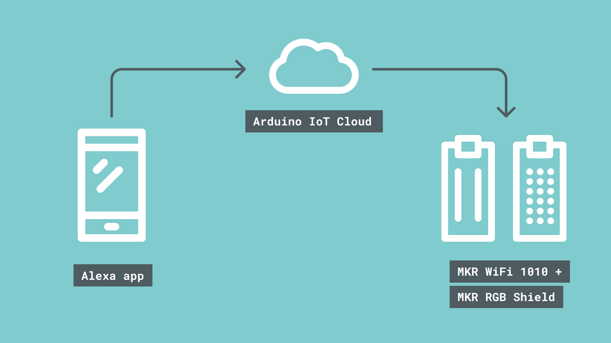
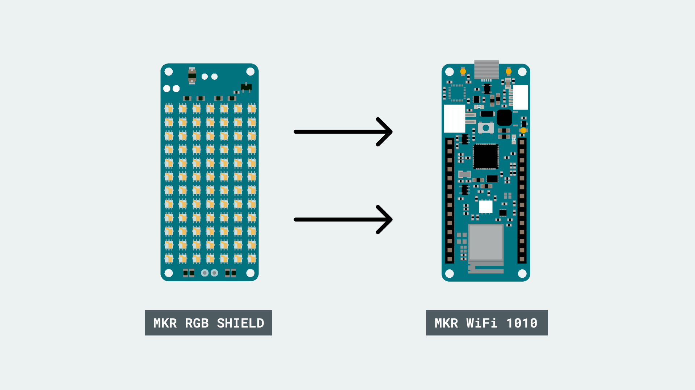
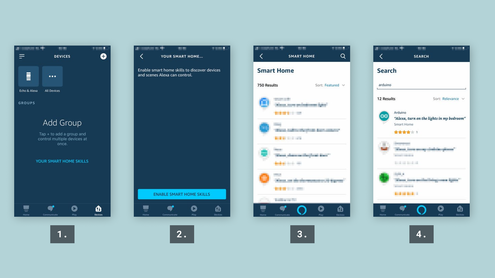
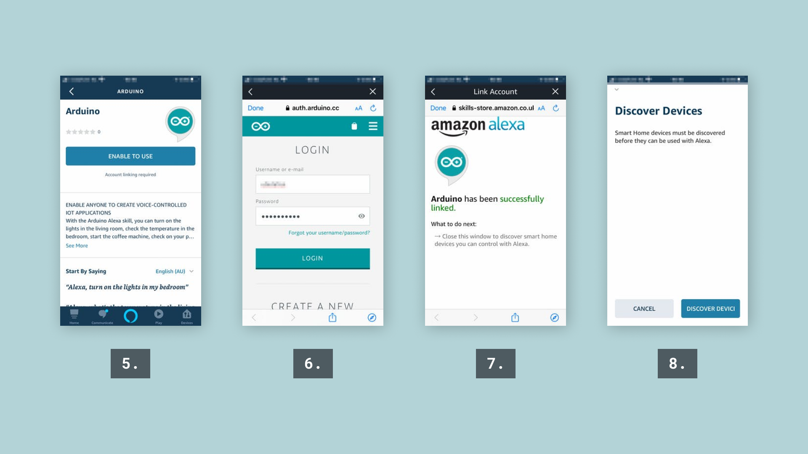
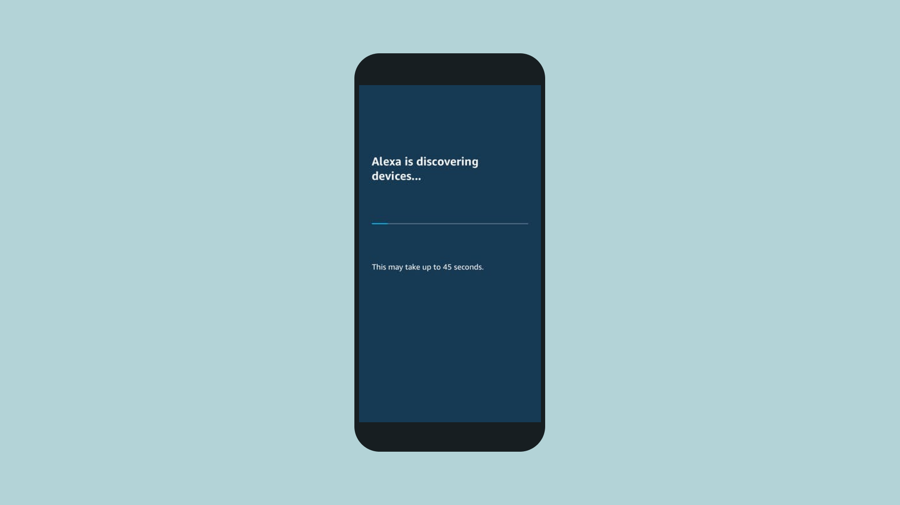
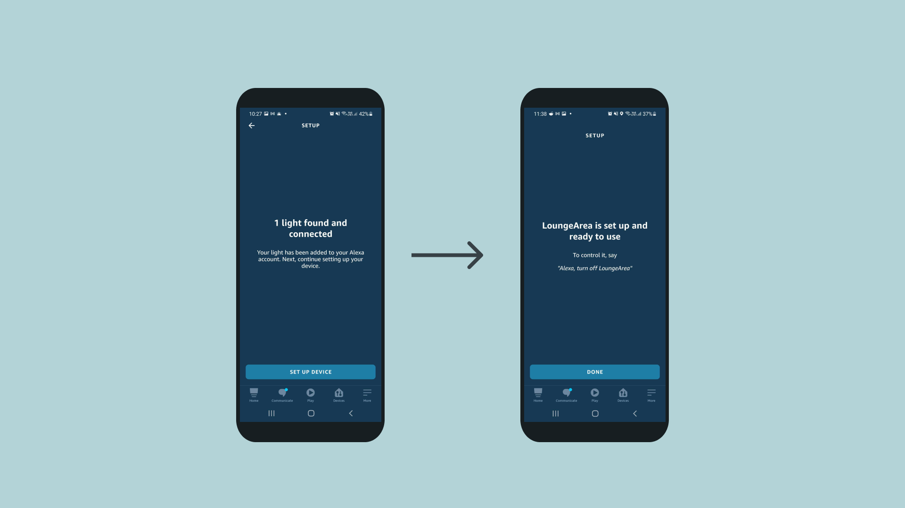
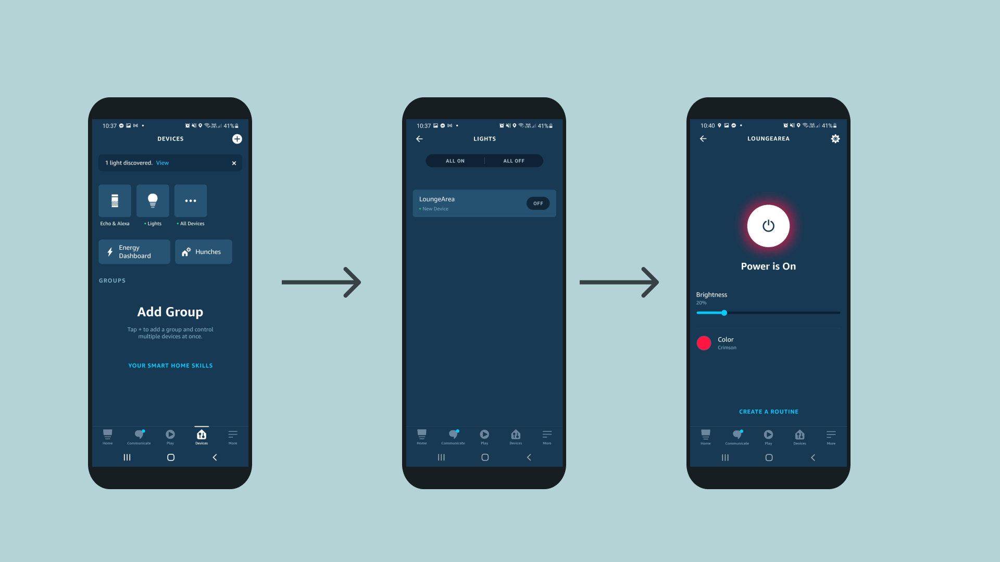

## Introduction

<iframe width="100%" height="400" src="https://www.youtube.com/embed/OMvZjwFYimo" title="YouTube video player" frameborder="0" allow="accelerometer; autoplay; clipboard-write; encrypted-media; gyroscope; picture-in-picture" allowfullscreen></iframe>

In this tutorial you will learn how to integrate the [Arduino Cloud](app.arduino.cc) with the [Amazon Alexa skill](https://www.amazon.com/Arduino-LLC/dp/B07ZT2PK2H). At the end of this tutorial, we will be able to change the color of an  RGB matrix connected to your Arduino, using only voice commands in the Alexa app. 



This tutorial focuses on using the [MKR RGB Shield](https://store.arduino.cc/products/arduino-mkr-rgb-shield) but can easily be modified to use any other RGB pixels / matrices.

***You can also find all variables that can be synchronized between Arduino Cloud and Alexa in the [IoT Cloud Variables guide](/arduino-cloud/getting-started/cloud-variables#alexa-variables).***

## Goals

The goals of this project are:

- Set up the Arduino Cloud.
- Create a program that controls the RGB pixels.
- Install the Arduino Skill on the Alexa app.
- Sync the Arduino Cloud with Alexa.

## Hardware & Software Needed

- [Arduino Cloud](app.arduino.cc)
- [Amazon Alexa skill](https://www.amazon.com/Arduino-LLC/dp/B07ZT2PK2H)
- \*[Arduino MKR WiFi 1010](https://store.arduino.cc/mkr-wifi-1010).
- \*[MKR RGB Shield](https://store.arduino.cc/arduino-mkr-rgb-shield) or other RGB matrices.

***\*You can use any supported Wi-Fi® board in this tutorial, but the example provided is made specifically for the MKR WiFi 1010 + MKR RGB Shield.***

## Circuit

Simply mount the MKR RGB Shield on top of the MKR WiFi 1010.



## Cloud Setup

To set up the cloud, you will need to:
1. Log in to the [Arduino Cloud](https://login.arduino.cc/login).
2. Go to **"Things"** and create a new Thing.
3. Select and attach the device you want to use (or configure a new one).
4. Create a variable called `LoungeArea` and select it to be of a **colored light** type. This is the variable that will be used to store incoming data from the Alexa service. 

***If you are new to the Arduino Cloud, visit the [Arduino / C++ Setup Guide](/arduino-cloud/guides/arduino-c) which has detailed instructions on how to set up devices, configuring Things and more.***

### Example Sketch

With all configurations done, we can move onto creating the program. By clicking on the **"Sketch"** tab, we can start editing the code that we will upload to our device.

First we need to include two libraries called `ArduinoGraphics` and `Arduino_MKRRGB`. These will help us control the MKR RGB Shield. If you are using any other matrix or RGB pixel, you will need to adjust this example.

When we later on will be connecting the cloud to Alexa, the data will be received directly from the Alexa app. Whenever the data updates, the `onLoungeAreaChange()` will execute, where it will fetch the data from Alexa (the RGB values) and display them on the RGB matrix. You can find the full code in the snippet below.

```arduino
#include <ArduinoGraphics.h>
#include <Arduino_MKRRGB.h>
#include "thingProperties.h"

void setup() {
  Serial.begin(9600);
  delay(1500);

  MATRIX.begin();
  MATRIX.brightness(10);

  initProperties();

  ArduinoCloud.begin(ArduinoIoTPreferredConnection);

  setDebugMessageLevel(2);
  ArduinoCloud.printDebugInfo();
}

void loop() {
  ArduinoCloud.update();
  // No code required in the loop for this setup
}


void onLoungeAreaChange() {
  uint8_t r, g, b;
  loungeArea.getValue().getRGB(r, g, b);
  if (loungeArea.getSwitch()) {
    Serial.println("R:" + String(r) + " G:" + String(g) + " B:" + String(b));  //prints the current R, G, B values
    MATRIX.beginDraw();                                                        //starts a new "drawing" on the RGB shield's pixels
    MATRIX.clear();                                                            //clears the RGB shield's pixels
    MATRIX.noStroke();
    MATRIX.fill(r, g, b);                                //the r, g, b values are fed into the shield's pixels
    MATRIX.rect(0, 0, MATRIX.width(), MATRIX.height());  //creates a rectangle (this covers the entire matrix)
    MATRIX.endDraw();                                    // ends the draw, and displays the new "drawing"

  } else {
    Serial.println("Lamp Off");
    //the following code simply turns everything off
    MATRIX.beginDraw();
    MATRIX.clear();
    MATRIX.noStroke();
    MATRIX.fill(0, 0, 0);
    MATRIX.rect(0, 0, MATRIX.width(), MATRIX.height());
    MATRIX.endDraw();
  }
}
```

Upload the code in the snippet above to your board. You can check the Serial Monitor to make sure you have successfully connected to the Arduino Cloud.

We can now move on to the next step: **setting up Alexa.**

## Alexa Setup

For this step, we will need the Amazon Alexa app which can be downloaded from the [Apple App Store](https://apps.apple.com/us/app/amazon-alexa/id944011620) or the [Google Play Store](https://play.google.com/store/apps/details?id=com.amazon.dee.app&hl=en). Once installed, login with your existing account or create a new one.

### Installing the Arduino Alexa Skill

Let's go through the steps necessary to install the Arduino Alexa Skill.



1. Once in the Amazon Alexa app, begin by tapping on "Devices".
2. Tap on the "Enable Smart home skills" button.
3. We will now see a list of featured ones, where we need to search for the right skill.
4. If we search for "Arduino" we will see a skill that has that exact name.



5. Once we have selected it, we'll need to enable it.
6. We now need to sync it with our Arduino Cloud, by logging into it.
7. Our Alexa and Arduino Cloud is now synced!
8. We can now start discovering our devices!



### Amazon Alexa Devices Setup

After waiting a little bit, we should see a new screen appear, where it says **"1 light found and connected"**.

Click **"Set Up Device"**. If you like you can also add it to a group (this way you can control and organize your devices more easily), otherwise skip this part.



Congratulations! You should now be able to control the lights through your Alexa app.

## Controlling the Lights

To control the lights on our setup, we will need to head over to the **"Devices"** tab in the Alexa app. Once in the Devices tab, click on the **"Lights"** button. We will now see the available lights. If you have other lights already connected, they will appear here as well. In our case, we only have one, which is `LoungeArea`, which is the same name as the variable we created earlier in the Arduino Cloud. If we click on `LoungeArea` we will access the color / brightness control.



Any changes of color / brightness you make will be sent to our MKR WiFi 1010, which will change the pixels on the MKR RGB Shield accordingly.


### Troubleshooting

One great way of knowing if data is coming through from the Alexa app is by checking the Serial Monitor. The sketch that we uploaded to the board includes a command that prints out the value of **r, g** and **b** whenever they receive new data. If the board is successfully connecting to the cloud, it is most likely a problem on setting up the Alexa device.

## Over-the-Air (OTA)

Did you know that the Arduino Cloud supports over the air uploads? When you've uploaded a sketch to your board once, it will become available for you to upload a new sketch to the board without connecting it to your computer!

***Over the Air uploads require an Entry plan to the Arduino Cloud***

To use this feature, make sure the board has power. If your board is already connected to the IoT Cloud, you will be able to upload to it over the air. Navigate to the Things sketch tab in the Arduino Cloud interface, and you should see it being discovered just as if it was connected via USB.
