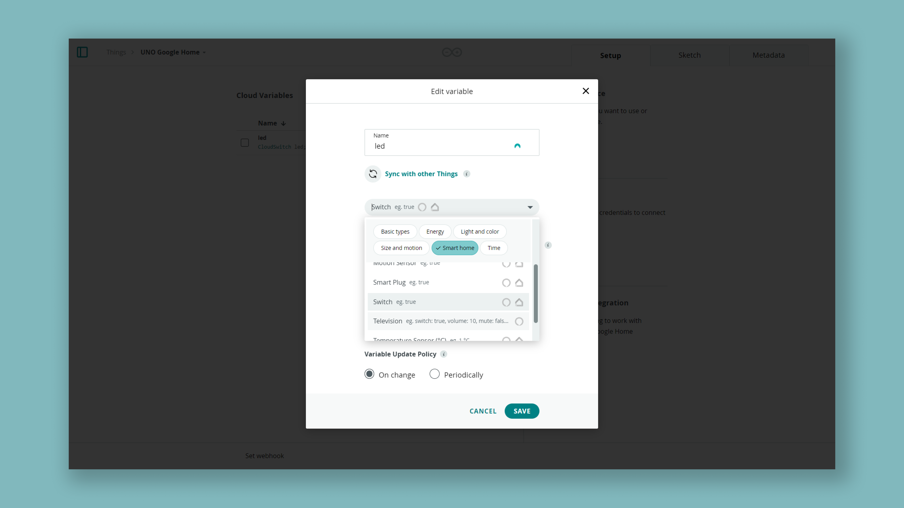
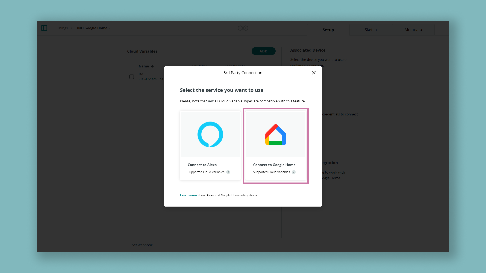
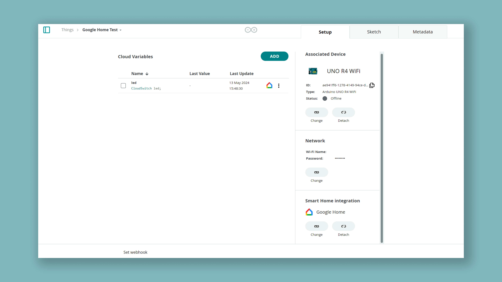
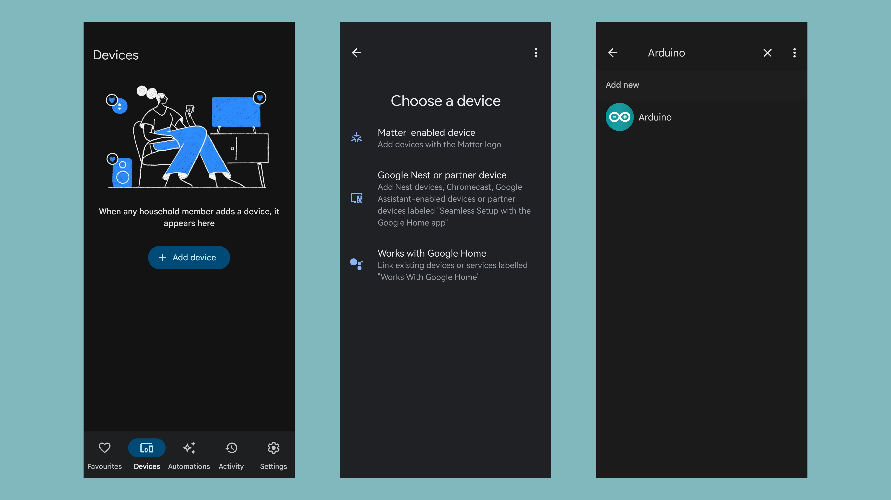
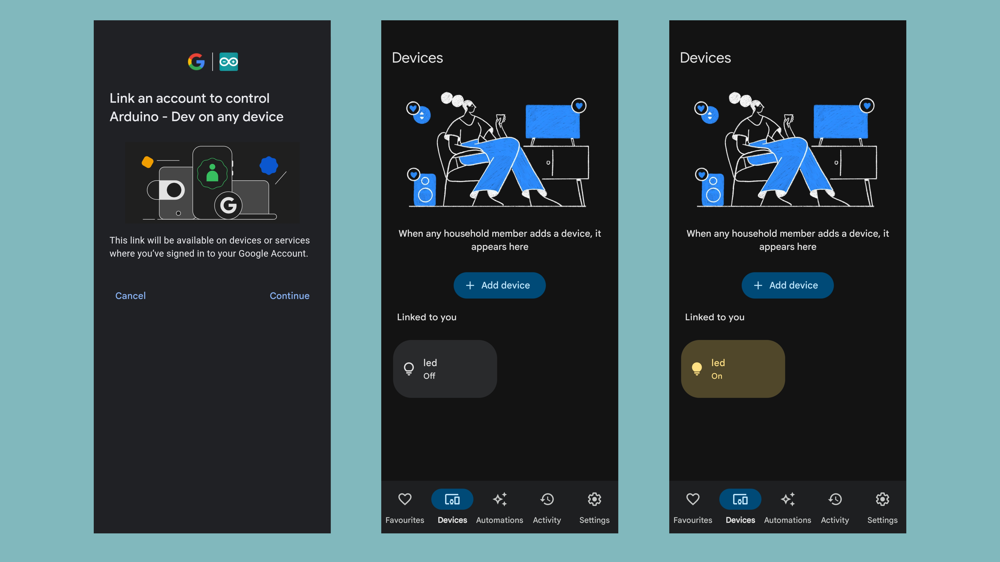

## Introduction

This tutorial guides you on how to connect the Arduino Cloud to your Google Home™ allowing you to interact with your devices, simply through your Google Home Assistant: use voice commands, the Google Home app, or create new routines integrating Arduino solutions.

It requires your board to be [compatible with the Arduino Cloud](https://docs.arduino.cc/arduino-cloud/hardware/devices/).

## Goals

The goals of this tutorial are:

- Create a Google Home compatible variable.
- Control the built-in LED with Google Home.

## Hardware & Software Needed

- [Arduino Cloud](https://cloud.arduino.cc/).
- [A Cloud compatible Arduino board](https://docs.arduino.cc/arduino-cloud/hardware/devices/).
- [Google Home™](https://home.google.com/welcome/).

To familiarize yourself with the Arduino Cloud check out our [getting started guide](https://docs.arduino.cc/arduino-cloud/guides/overview/).

## Cloud Setup

Before we start, make sure you have an Arduino Cloud compatible board.

Then, we need to configure a Thing in the [Arduino Cloud](https://app.arduino.cc/things) consisting of one CloudSwitch variables called `led`. Follow the instructions below to do so.

### Thing & Device Configuration

1. Create a new Thing, by clicking on the **"Create Thing"** button.
2. Click on the **"Select Device"** in the **"Associated Devices"** section of your Thing.
3. Click on **"Set Up New Device"**, and continue to set up your device.

If you need more information on how to set up your device check out our [getting started guide](https://docs.arduino.cc/arduino-cloud/guides/overview/#2-configure-a-device).

### Create Variables

The next step is to create a Cloud variable, which we will later interact with via Google Home.

1. While in Thing configuration, click on **"Add Variable"** which will open a new window.
2. Name your variable `led`, select `Smart home`, and select it to be of a `Switch` type.



3. Click on **"Add Variable"** at the bottom of the window.
4. Make sure the **Smart Home Integration** is set to Google Home.



***Most Cloud variables are compatible with both Alexa and Google Home but there is an icon on the right side of the type that indicates the compatibility***

Your Thing should look something like this when you are finished:



***Learn more about how variables work in the [Variables documentation](/arduino-cloud/cloud-interface/variables)***

### Upload Sketch

Navigate to the Sketch tab and upload the following sketch to your Arduino board.

```arduino


#include "thingProperties.h"

void setup() {
  // Initialize serial and wait for port to open:
  Serial.begin(9600);
  // This delay gives the chance to wait for a Serial Monitor without blocking if none is found
  delay(1500); 

  // Defined in thingProperties.h
  initProperties();

  // Connect to Arduino IoT Cloud
  ArduinoCloud.begin(ArduinoIoTPreferredConnection);
  
  /*
     The following function allows you to obtain more information
     related to the state of network and IoT Cloud connection and errors
     the higher number the more granular information you’ll get.
     The default is 0 (only errors).
     Maximum is 4
 */
  setDebugMessageLevel(2);
  ArduinoCloud.printDebugInfo();
}

void loop() {
  ArduinoCloud.update();
  digitalWrite(LED_BUILTIN, led);
  
}


/*
  Since Led is READ_WRITE variable, onLedChange() is
  executed every time a new value is received from IoT Cloud.
*/
void onLedChange()  {
  // Add your code here to act upon Led change
}

```

Your board setup is now complete and you can continue to the Google Home app.

### Detect Your Device with Google Home

- **Network Connection:** Ensure the board is connected to the network.

- **Google Home App:** Open the app, navigate to Devices, and click "Add Device."

- **Integration Method:** Select "Works with Google Home" and then choose the "Arduino" action.



- **Device Pairing:** Link your Arduino account if requested and proceed to add your devices (one for each variable) by associating them with a room.



**Congratulations!** Your device is now successfully configured to work with Google Home.