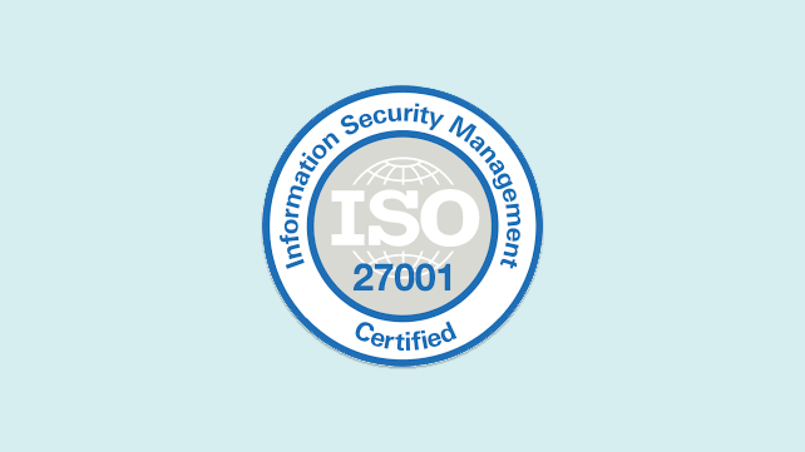

***For any questions regarding security, contact the [Arduino Security Team](mailto:security@arduino.cc).***  

[ISO 27001](https://www.iso.org/isoiec-27001-information-security.html) is an internationally recognized standard that provides a framework for establishing, implementing, maintaining, and continually improving an Information Security Management System (ISMS). The standard sets out the requirements for managing information security risks and protecting sensitive information within an organization. ISO 27001 takes a systematic and risk-based approach to ensure the confidentiality, integrity, and availability of information assets.

The standard encompasses a comprehensive set of controls and best practices for managing information security. It covers various aspects, including risk assessment and treatment, security policies, organizational roles and responsibilities, asset management, access control, cryptography, incident management, business continuity, and compliance. 

The ISO27001 certification is obtained after an audit conducted by an independent third party that acts as certification authority and verifies that the organization is applying all security measures and controls required by the norm.

Our compliance with ISO 27001 demonstrates that Arduino is committed to ensure the best possible security posture for Arduino Cloud services, thus ensuring the best possible protection from cybersecurity risks for Arduino Cloud users.

[Download our ISO27001 certificate here]()
