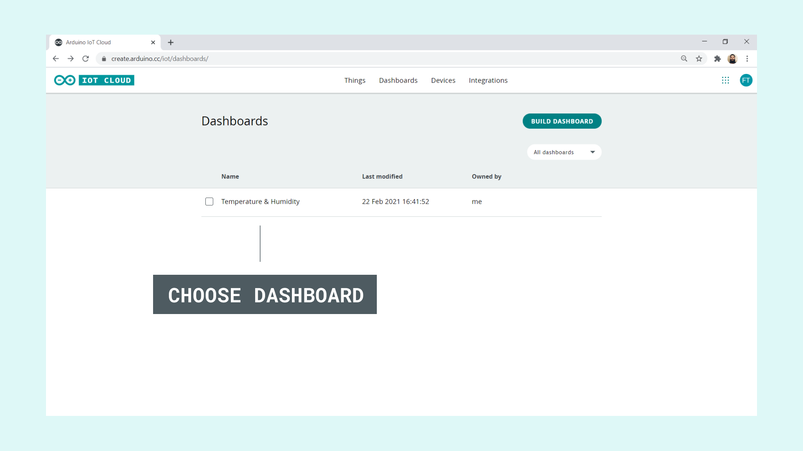
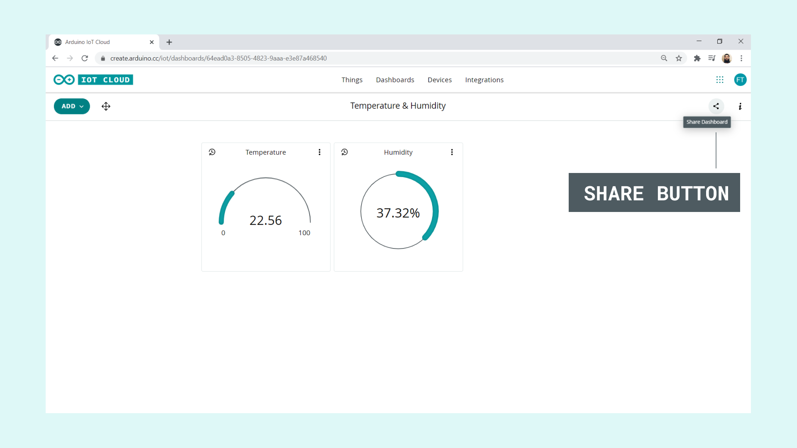
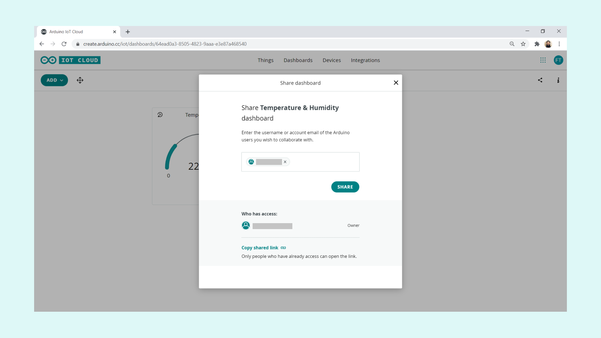
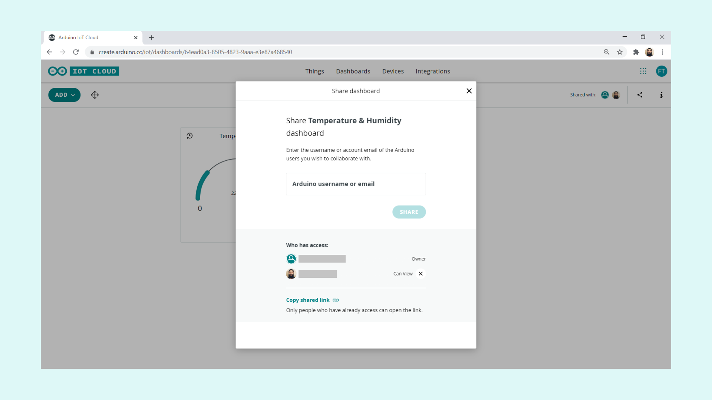
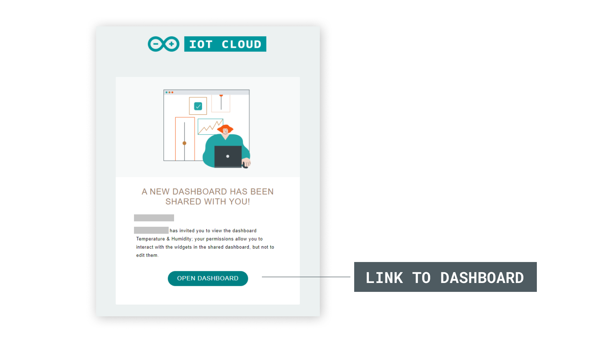

The Arduino Cloud IoT is a great tool for remote control and analytics of your devices. A central component in the cloud system is the **dashboards**, the tool that is used to visualize and interact with you devices. 

In this tutorial, we will show how to share these dashboards with other Arduino IoT Cloud users! 

If you want to get started with the Arduino Cloud IoT, you can check out [getting started with the Arduino Cloud IoT](https://docs.arduino.cc/cloud/iot-cloud/tutorials/iot-cloud-getting-started).

## Sharing your dashboards

>**Note:** Before we start, let's make sure that we have a **Thing** and **Dashboard** already set up. If you haven't got that set up, check out the [Getting Started with Arduino IoT Cloud](/arduino-cloud/getting-started/iot-cloud-getting-started) tutorial.

The Arduino IoT Cloud's dashboard feature is a really good tool for sending, receiving and storing data through the cloud. You can now also share your dashboards with other people, so that they can access your devices as well, without having access to your account!

The **sharing dashboards** feature is really easy to use, but let's take a look at how it is done!

**1.** First, let's select a dashboard of your choice. In this case, we will choose the **"Smart Garden"** dashboard.

**2.** In our example, we have a set of widgets displaying environmental data. If we want to share our dashboard, we can simply click on the share icon at the top right corner, see the image below:

**3.** When we click on the icon, a pop up will appear. Here, we can search for the user that we want to share the dashboard with. We can search by either user name, or email. When have selected someone to invite, we can click on the **"Share"** button. This allow them access to our dashboards, and a link to the dashboard is sent to the users email address.

**4.** When we have sent an invite, they will appear in a list of people who have access.

**5.** In the email sent out, simply click on the **"Open Dashboard"** button, and you will be directed to the dashboard!

And that's how you can share dashboards with your friends, colleagues and family, with just a few clicks!

## Removing access for people

If you no longer want people to have access to your dashboards, simply click the cross next to the person's user name. This will remove their access to the dashboard.

## Conclusion

In this tutorial, we have learned how to **share dashboards**, a feature that can be really useful when we want others to access the data from our IoT devices quickly.

### More tutorials

You can find more tutorials in the [Arduino IoT Cloud documentation page](/arduino-cloud/).