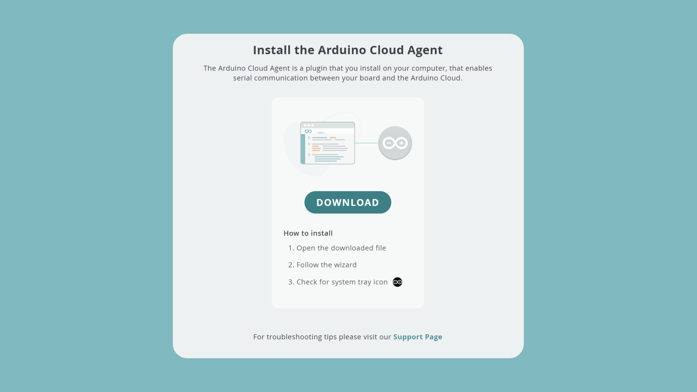
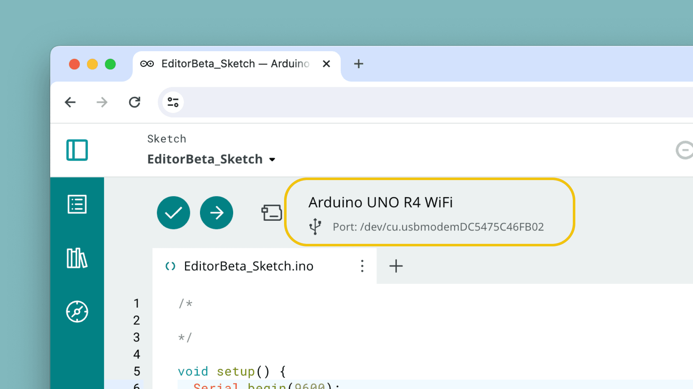

The [Arduino Cloud Agent](https://create.arduino.cc/getting-started/plugin/welcome) is a plugin that you install on your computer, that enables serial communication between your board and the Arduino Cloud. This allows you to upload sketches, and read/write serial data to/from your board, via your web browser.

The Cloud Agent is a requirement to program your devices in the Arduino Cloud, and takes only a minute to install.

## Installation

When you configure a device or use the Cloud Editor, you will automatically receive a prompt to install the Cloud Agent. 

You can also access the download page through [this link](https://create.arduino.cc/getting-started/plugin/welcome). It should look like this:

Follow the installation guide in the page, where you will download an installation file. To install it, run the file and follow the instructions for your operating system.

Once installed, you can navigate back to the Cloud Editor, and you should be able to recognize the board connected to your computer.

## Source Code

The source code for the Cloud Agent lives [in this GitHub repository](https://github.com/arduino/arduino-create-agent). To report issues or improvements, please do so inside in this repository.

## Troubleshooting

If you are having issues with the Cloud Agent, you can visit the link below:
- [Arduino Help Center - Create Agent](https://support.arduino.cc/hc/en-us/articles/360014869820-Install-the-Arduino-Cloud-Agent)