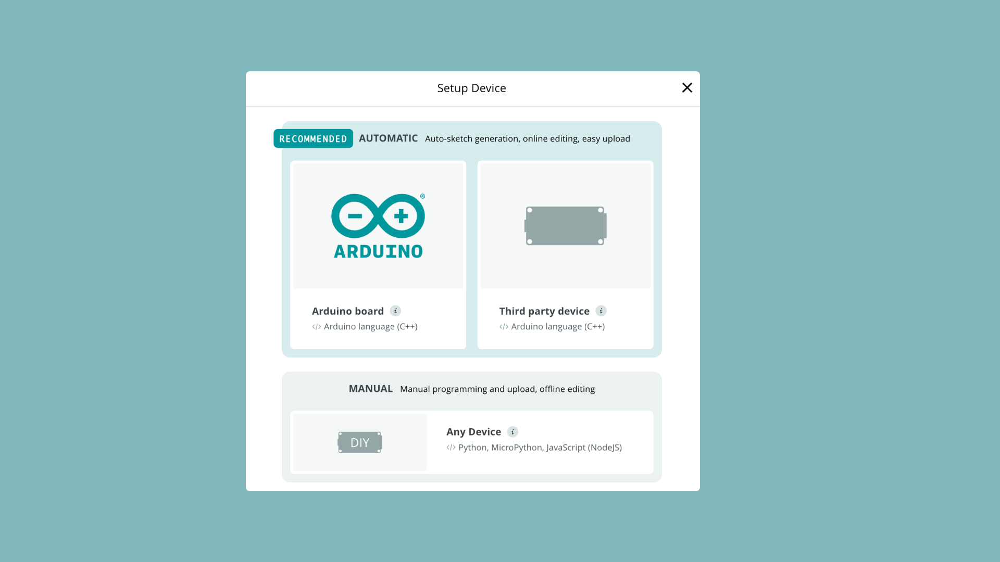

The Arduino Cloud supports a range of official and third-party boards which are handled in the **"Devices"** tab. Devices are considered the "virtual twin" of your physical boards.

Currently, the following device types are supported:
- Wi-Fi® with encryption through on-board crypto chip
- Wi-Fi® through ESP32 with user credentials
- LoRaWAN®
- Ethernet
- Cellular (GSM / NB-IoT)
- Manual (Python, MicroPython, JavaScript)

## Configure a Device

Configuring a device in the Arduino Cloud is done through an installation wizard. There are three main options available:
- Wi-Fi® board with crypto chip (automatic configuration of API key)
- ESP32/ESP8266 (manual configuration of API key)
- Python, MicroPython, JavaScript (manual configuration of API key)

These options are visible when you create a new device:

Depending on what type of device you choose, the installation wizard will differ, as different connection methods to the Arduino Cloud are used.

## Type of Devices

### Official Wi-Fi® Boards

Wi-Fi® devices connect to the Arduino Cloud via a local network and are suitable for short-range connectivity projects.

Most Wi-Fi® supported Arduino boards have a crypto chip that enables secure communication. This chip is configured during setup and enables secure communication for the board without having to enter any API keys in the code.

Wi-Fi devices require you to enter valid credentials for the Wi-Fi network you attempt to connect to. This is done in the Thing configuration. 

***Read more and see the list of all compatible Wi-Fi® boards in the [Arduino Cloud Wi-Fi documentation](/arduino-cloud/hardware/wifi).***

### Official LoRaWAN® Boards

LoRaWAN® boards also have a crypto chip on board but connect to the Arduino Cloud through nearby LoRaWAN® gateways. LoRaWAN® devices are designed to use minimal power and transmit over longer ranges, hence the name:
- **LoRa®** - long-range technology used for transmission of data using minimal amounts of power for long distances.
- **LoRaWAN®** - a network of gateways connected to the Internet that can receive and send data to LoRa® devices.

***Read more and see the list of all compatible LoRa® boards in the [Arduino Cloud LoRaWAN® documentation](/arduino-cloud/hardware/lora).***

### ESP32 / ESP8266 (Wi-Fi®)

ESP32/ESP8266 based boards typically don't have an onboard crypto chip. Instead when configuring a device, a **[secret key](#secret-key--device-id)** is generated, that can together with the **device ID** be used to securely connect to the Arduino Cloud.

There are currently two official ESP32 based Arduino boards:
- [Arduino UNO R4 WiFi](https://store.arduino.cc/products/uno-r4-wifi)
- [Arduino Nano ESP32](https://store.arduino.cc/products/nano-esp32)

You can also configure a wide range of third-party ESP32/ESP8266 boards.

***Read more and see the list of all compatible ESP32/ESP8266 boards in the [Arduino Cloud ESP32/ESP8266 documentation](/arduino-cloud/hardware/wifi#configure-esp-boards).***

### Manual Devices

Manual devices are designed for interfacing with JavaScript, Python & MicroPython, and can for example run on a Raspberry Pi, but also on any. Creating a manual device generates a **[secret key](#secret-key--device-id)** that can together with the **device ID** be used to securely connect to the Arduino Cloud.

***Note that manual devices do not have a sketch associated.***

Check the guides below to get started with each of the programming languages:

- [Connect to Arduino Cloud (JavaScript)](/arduino-cloud/guides/javascript)
- [Connect to Arduino Cloud (Python)](/arduino-cloud/guides/python)
- [Connect to Arduino Cloud (MicroPython)](/arduino-cloud/guides/micropython)

## Secret Key & Device ID

When configuring ESP32/ESP8266 and Manual Devices, you generate a **Device ID** and a **Secret Key**. This is the final step of the configuration of your device.

Make sure to download or store this information somewhere, as you cannot retrieve the Secret Key after this step.

***If you lose your Secret Key or forget to download and store your information you will need to remove and set up the device again.***

## Device Information

A device's information can be accessed directly in the Arduino Cloud under **"Devices"**. Depending on the type, the information will differ.

- **ID** - your device's ID, mainly needed for manual device connection.
- **Type** - name / type of board, e.g. MKR WiFi 1010.
- **Connection Type** - e.g. Wi-Fi®, LoRaWAN®.
- **FQBN** - fully qualified board name, used for compilation for a specific board, e.g. `arduino:samd:mkrwifi1010`.
- **Serial Number** - when configuring an official board, the serial number will be registered.
- **Connectivity Module Firmware** - for Wi-Fi® boards only, the current firmware on the board's radio module.
- **Thing** - Thing associated with a device.
- **Status** - status of the device, online/offline.
- **Last Activity** - timestamp of the last synchronization.
- **Added** - timestamp of date device was added to the Arduino Cloud.

## Connection Handler

All hardware devices connecting to the Arduino Cloud use the following libraries:
- [ArduinoIoTCloud](https://github.com/arduino-libraries/ArduinoIoTCloud) - main library for Arduino Cloud, including methods for sending and receiving data, handling callbacks etc. Either via TCP/IP or LPWAN.
- [Arduino_ConnectionHandler](https://github.com/arduino-libraries/Arduino_ConnectionHandler) - library for handling connection methods to the Arduino Cloud (Wi-Fi®, LoRaWAN®, Ethernet, NB-IoT, GSM).
