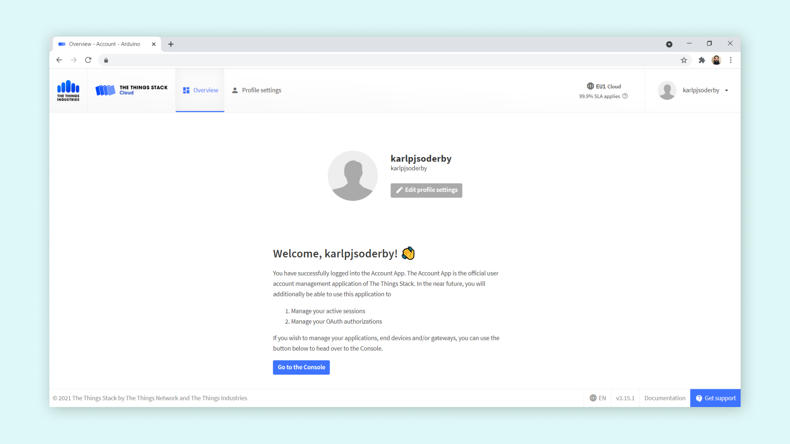
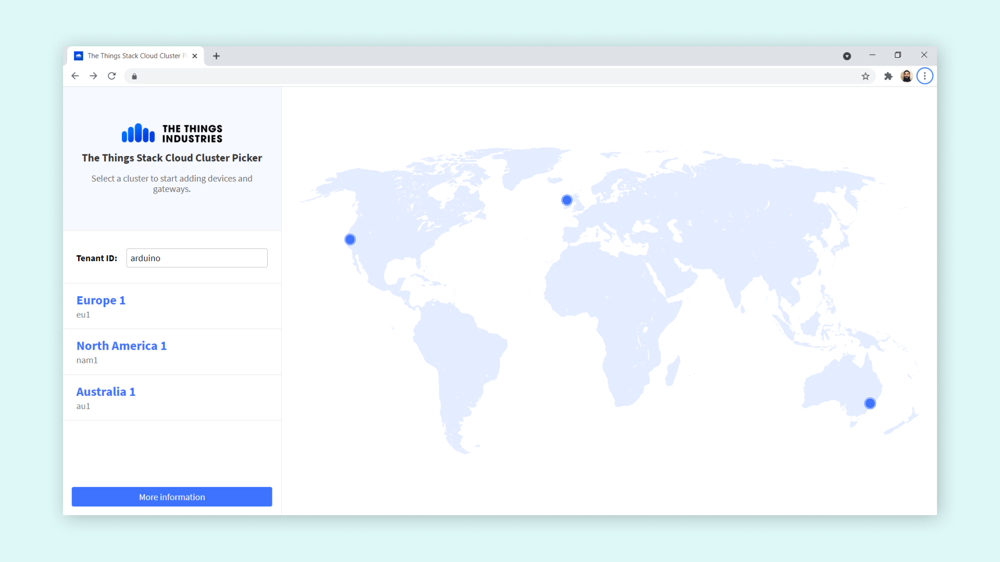
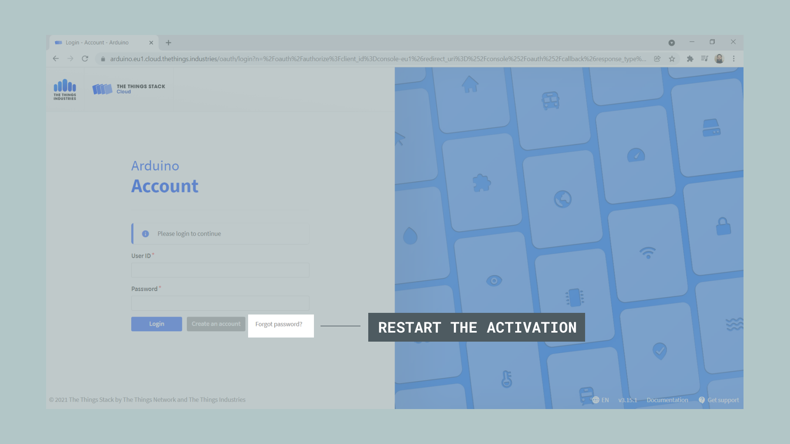
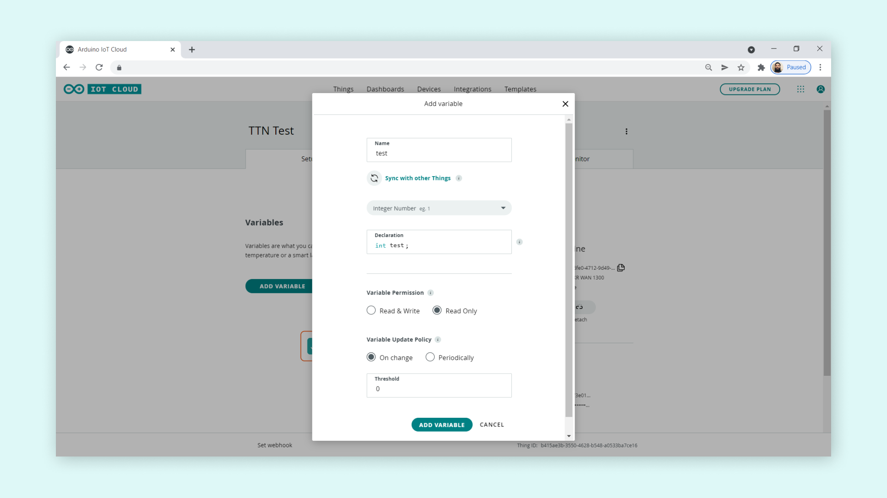
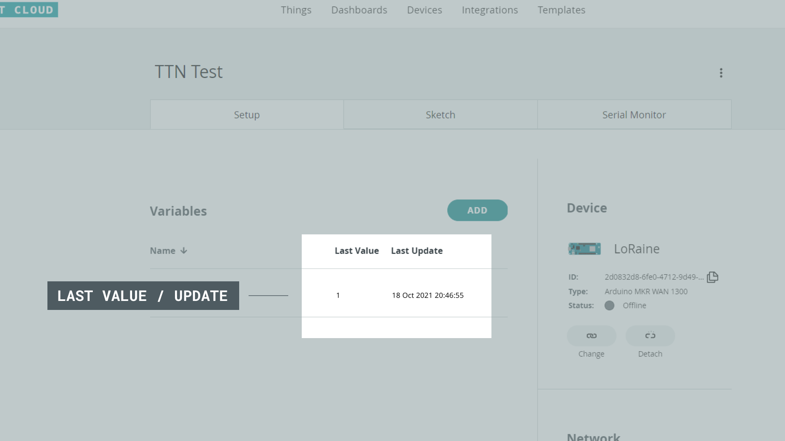
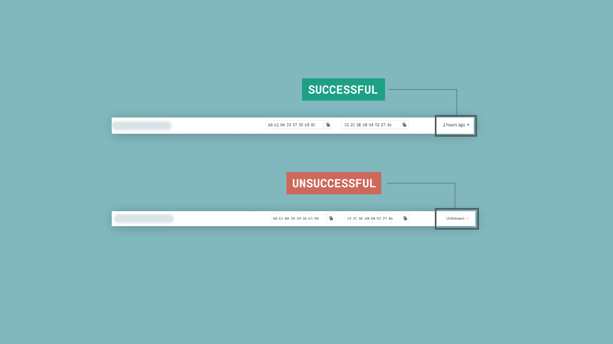

Some Arduino boards support a connections to the Arduino Cloud via LoRaWAN® ([The Things Stack](https://www.thethingsindustries.com/stack/)).

In this document you will find:

- List of supported devices.
- Configure a LoRaWAN® device in the Arduino Cloud.
- Register an account on The Things Console.
- Create a simple testing program for the end device.
- View data from the device in the Arduino Cloud.
- Send data to the device from the Arduino Cloud.

## Supported Boards

The following boards connect to the Arduino Cloud via [The Things Stack](https://www.thethingsindustries.com/stack/), a LoRaWAN® Network Server connected to thousands of public LoRa® gateways.

- [MKR WAN 1300](https://store.arduino.cc/arduino-mkr-wan-1300-lora-connectivity-1414)
- [MKR WAN 1310](https://store.arduino.cc/mkr-wan-1310)

## The Things Stack
  
If you are interested in building cheap, long-range & low-power devices, you will be excited to hear that Arduino Cloud is interfaced with [The Things Stack](https://www.thethingsindustries.com/stack/ ) network (TTS). When configuring a LoRaWAN® device (MKR WAN 1300/1310), you will also automatically register your device on the "The Things Stack" platform.
  
So, what does that mean for you? It means that you can connect to any of the **22 000+ public gateways** making up the network. With coverage in most parts of the world, LoRa® technology has become increasingly more popular, as it continues to chirp payloads using the license-free frequency bands! Your end devices (such as the MKR WAN 1310), can be set up in remote locations (or cities, of course), where there's no internet connection. These devices can then send data to nearby gateways connected to the TTS service, which in turn forwards the data to the Arduino Cloud. Data can also be sent the other way, from the Arduino Cloud to the end device via TTS.
  
In this tutorial, we will walk you through the steps needed to successfully provision devices that use the Arduino Cloud & The Things Network, from unboxing your device to viewing data on a dashboard!
  
***Please note that when working with LoRaWAN® devices, data rates are very limited. Messages sent from devices should be limited to once every several minutes. Methods for implementing this are described further down in this article. To read more about limitations when using the LoRaWAN® network, please visit [The Things Network Limitations article](https://www.thethingsnetwork.org/docs/lorawan/limitations/ ).***
  
###  Terminology Run-Trough

- **LoRa®** - short for **Lo**ng **Ra**nge, is a modulation technique used to send and receive data over low-power, wide-area networks (LPWAN). 
- **LoRaWAN®** - can be defined as the networking protocol. The architecture of the network consists of different gateways that relay messages from low-power devices over long ranges, to central network servers.
- **LoRa® gateway** - a network router able to send and receive LoRa RF packets and forward them on the internet.
- **MKR WAN 1300/1310** - development boards that have a LoRa® module capable of sending and receiving packets of data.
- **End device/node** - end device/node is a term used for deployed devices such as the MKR WAN 1310, that for example are reading and processing sensor data.
- **The Things Network (TTN)** - a nonprofit association, making the TTS Community Edition available as a public LoRaWAN® network service for free.
- **The Things Stack Network (TTS)** - a cloud platform used by TTN and TTI for their LoRaWAN® connectivity networks.
- **The Things Industries (TTI)** -  a company that runs and manages The Things Network and offers private LoRaWAN network and support for enterprise customers.
- **The Things Stack console (TTC)** - a service that allows you to register devices and handle incoming or outgoing data.
- **Device EUI** - a code to identify your device.
- **App EUI** - a code to identify your application.
- **App KEY** - a key used for encryption and decryption of a payload.
- **Frequency Band (e.g. 868 MHz, 915 MHz)** - LoRa only operates on specific, license-free frequencies which differ from region to region. For example, the band used in Europe is 868 MHz, while North America uses the 915 MHz band.

###  Related Resources
  
If you want to learn more about Arduino and LoRa®, you can check out the resources below:
  
- [MKR WAN 1300 documentation page.](/hardware/mkr-wan-1300)
- [MKR WAN 1310 documentation page](/hardware/mkr-wan-1310)
- [LPWAN (Low-Power Wide-Area Networks) 101](/learn/communication/low-power-wide-area-networks-101)
  
##  Circuit
  
Follow the wiring diagram below to connect the antenna to the MKR WAN 1300/1310 board.
  

  
  
## Cloud Setup

### Configuring Device
  
**1.** Navigate to the [Arduino Cloud IoT platform](https://app.arduino.cc).
  
**2.** Sign in or follow the registration process. 
  
**3.** Once signed in, navigate to the **"Things"** tab, and click on **"Create New Thing"**.
  

  
**4.** Connect your board to your computer via USB.
  
**5.** Click on the **"Add Device"** button, and then on the **"Set up an Arduino device."**. If you have not installed the **Create Agent**, download and install it by following the instructions provided in the platform.
  
**6.** If your board is connected, and the Create Agent is installed, your board should now appear, and you can click on **"Configure"**, and **"Continue"** in the next window.
  

  
**7.** Now you will need to select the **frequency band** that you will use. These are available through a dropdown menu, where you will e.g. Europe (868 MHz), America (915 MHz). 
  

  
***It is very important that you select the right band for your country. Enabling a device to transmit on certain frequencies may have legal consequences. It is your responsibility to select the right frequency. You can find more information in [frequencies by country](https://www.thethingsnetwork.org/docs/lorawan/frequencies-by-country/ ).***
  
**8.** Now, you will need to give your board a good name, such as **LoRa**ine, **WAN**da or G**LoR**i**a** (feel free to ignore this advice). Click on **"Next"** to start the configuration.
  

  
When the configuration is complete, we should see the following window:
  

  
Congratulations! We are now done with the first step of the configuration!
  
**Troubleshooting**
  
Did something go wrong? 
  
- Is the Arduino Create Agent downloaded & installed?
- Is your board a MKR WAN 1300/1310?
- Is your board connected to the computer?
  
Some things to try:
  
- Reset the board (double tap the reset button quickly).
- Try uploading a simple sketch (such as blink) to the board.
- Re-install the Create Agent.
  
  
## The Things Stack Network
  
  
In this step, we will complete the registration so we can access the **The Things Console (TTC)**. Here we can see the status of our device, if any data is coming in or out and much more.
  
***Note that you will not need to make any changes in The Things Console, but access is useful to check if your board sends and receives data correctly. All information (DevEUI, AppEUI & AppKey) is available through the Arduino Cloud as well. Your TTC app will automatically be created, and the integration to the Arduino Cloud done automatically.***
  
**1.** After your device is successfully configured, an **email is sent to your account's email address**, and an account is automatically created on **The Things Stack Network**. The email includes a link to **creating a password** for that account, which you will need to follow to complete the registration. 
  

  
**2.** Follow the link, and create a new password.
  

  
**3.** You can now login to the **TTS** platform with your account name and password.  
  

  
***Your account name is listed in the email sent out by The Things Industries (TTI).***
  
**4.** In the next window, click on the **"Go to the Console"** button.
  

  
**5.** In the next window, select your region (Europe, North America, Australia).
  

  
**6.** Select **"Go to Applications"**.
  

  
**7.** Click on the `[username]-app` item from the list.
  

  
**8.** You are now in the application overview. Here you will find a lot of useful information, such as **DevEUI, AppEUI & AppKey**, and see the live data that is sent to and from your device. You do not need to make any changes here, but it acts as a great troubleshooting tool to check if your device is working.
  
###  TTI Email Expiration
  
  
After some time, the automatic email sent out by TTI will expire. If the link is expired and you wish to access the Things Stack Network, you can click on the **"Forgot Password"** link which will restart the activation.
  

  
## Final Cloud Setup
  
  
In this step, we will complete the Arduino Cloud setup that we started earlier by configuring a device. We will create a simple **test variable**, that we will use to send data from the MKR WAN 1300/1310 device. This will just be a counter that updates **3 minutes**, to see if the data can be successfully sent from the **end device** to the **Arduino Cloud** via the **The Things Network**.
  
***At this point, we will need to make sure that we are within reach of a gateway registered to The Things Network. This might take a few attempts, depending on your device's success of transmitting to a nearby gateway. You can check the coverage of your area through either [TTN Map](https://www.thethingsnetwork.org/map ) or the [TTN Mapper](https://ttnmapper.org/ )***
  
**1.** After TTS registration is complete, head back to the Arduino Cloud, and to the Thing you created earlier. Here, we will need to click on the **"Add Variable"** button, following the image below:
  

  
**2.** Let's name the variable `test`, and select `Integer Number` as data type (this will be declared as `int test;`). Tick the **Read Only** option, and click on **"Add Variable**.
  

  
**3.** Let's head to the **Sketch** tab, where you can use the following code:
  
```arduino
#include "thingProperties.h"
  
unsigned long previousMillis = 0;
const long interval = 180000; //180 second interval (3 minutes) 
  
void setup() {
  // Initialize serial and wait for port to open:
  Serial.begin(9600);
  // This delay gives the chance to wait for a Serial Monitor without blocking if none is found
  delay(1500); 
  
  // Defined in thingProperties.h
  initProperties();
  
  // Connect to Arduino Cloud
  ArduinoCloud.begin(ArduinoIoTPreferredConnection, false);
  
  /*
     The following function allows you to obtain more information
     related to the state of network and IoT Cloud connection and errors
     the higher number the more granular information you’ll get.
     The default is 0 (only errors).
     Maximum is 4
 */
  setDebugMessageLevel(2);
  ArduinoCloud.printDebugInfo();
}
  
void loop() {
  ArduinoCloud.update();
  
  unsigned long currentMillis = millis();
  
  if (currentMillis - previousMillis >= interval) {
  
    previousMillis = currentMillis;
  
    test +=1;
  
    }
}
```
  
This code will simply increase the `test` variable every 3 minutes, which will sync with the variable we just created. That means that every 3 minutes, there's a change in value, which should also be visible in the Arduino Cloud if the data is sent properly.
  
***Note that the 180000 milliseconds / 180 seconds interval should be in place to limit the amount of data being sent from the device to the Arduino Cloud. This can also be defined during the variable creation in the Thing interface to update only every 180 seconds.***
  
**4.** Finally, we can upload the sketch to the board. After the upload, the board will start sending data via The Things Network, to the Arduino Cloud. We can check if we are receiving any data in the **Things overview**, under the **"Last Value / Last Update"** column.
  

  
**5a.** After we have uploaded the sketch to the board, we can head over to the TTS console, then to **Applications > NameOfApp > End Devices**. Here we can see if data is received. Basically, if no data is received, it means that data is not correctly passing through the gateway and the Internet to TTS. 
  
**5b.** If **successful**, in the **"live data"** section, the "first sign of life" should be a message that says **"Accept join-request"**. Then under "End Devices" there's a column named **Last Seen**, which should have a **blue circle** and show how long since it was last seen, e.g. 5 minutes or 2 hours.
  
**5c.** If **unsuccessful**, under "End Devices", you can see a **yellow circle** next to the text **"Unknown"**. This means your board has not been sending any data recently.
  

  
**Troubleshooting**
  
- Check out the [TTN Mapper tool](https://ttnmapper.org/ ) to see if you are in range of a gateway. Remember that even if you are in range, you may still have issues transmitting data.
- Make sure your device is close to a window and has an antenna attached to it. The better Line of Sight (LoS), the better chance of transmitting data.
- Did you upload the sketch to the board?
  
##  Arduino PRO Gateway
  
  
If you have an Arduino PRO Gateway, you will need to register it, using the [manager for Linux devices](https://app.arduino.cc/devices).
  
You can visit the [Activate an Arduino Pro Gateway with IoT Cloud](https://support.arduino.cc/hc/en-us/articles/4407770369042-Activate-an-Arduino-Pro-Gateway-with-IoT-Cloud ) article for more details.
  
###  Migrate Existing Gateway

If you have an existing gateway setup prior to the A2A to TTS migration, you will need to complete the following steps to use the Pro Gateway.
  
To perform the Arduino Pro gateway migration:
  
**1.** The Gateway **needs** to be turned on and connected to the internet.
  
**2.** Back up any existing sketch or custom docker images of the Gateway.
  
**3.** Delete the device using the “Manager for Linux” page. It is very important that the Gateway is **turned on and connected to the Internet.** 
  

  
**4.** Redo the provisioning procedure.
  
**5.** Stop the packet forwarder.
  
**6.** Delete the existing packet forwarder in the “Container” page.
  
**7.** Deploy the new packet forwarder using the following parameters:
  
- Container Name: `pktfwd` (use this exact name).
- Image URL: public.ecr.aws/h8w3x7h8/arduino:latest
- Volume flags:--device /dev/spidev0.0 --device /dev/i2c-1  -v /sys:/sys
- Restart Policy: Always
  

  
###  Provision New Gateway

To perform the Arduino Pro gateway provisioning:
  
**1.** Claim the GW in the “Manager For Linux” page.
  
**2.** Stop the packet forwarder.
  
**3.** Delete the existing packet forwarder in the “Container” page.
  
**4.** Deploy the new packet forwarder using the following parameters:
  
- Container Name: `pktfwd` (use this exact name).
- Image URL: public.ecr.aws/h8w3x7h8/arduino:latest
- Volume flags:--device /dev/spidev0.0 --device /dev/i2c-1  -v /sys:/sys
- Restart Policy: Always
  

  
###  Register a Gateway on TTS

As **Arduino Cloud IoT** is now interfacing with the **The Things Stack** network, you can set up your own gateway through their services (this can be done through the same console that is used to check device status). You can visit [The Things Industries](https://www.thethingsindustries.com/stack/ ) to see what commercial gateways are supported.  
  
See the link below for more resources on adding gateways to the Things Stack network.
  
- [Adding Gateways | The Things Industries](https://www.thethingsindustries.com/docs/gateways/adding-gateways/ )
- [Recommended Gateways | YouTube](https://www.youtube.com/watch?v=h_6dIte_IxI&ab_channel=TheThingsNetwork )
  