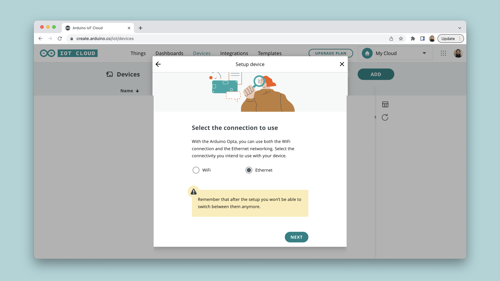

The Arduino IoT Cloud supports connection via Ethernet on a number of devices. 

## Supported Boards

The options to connect via Ethernet are the following:
- Connect with the [Portenta H7](https://store.arduino.cc/products/portenta-h7) in combination with an Ethernet compatible carrier/shield (see below).
- Connect with the [Opta](https://docs.arduino.cc/hardware/opta).

To connect with the **Portenta H7** board, you will need one of the following shields/carriers:
- [Portenta Vision Shield Ethernet](https://store.arduino.cc/products/arduino-portenta-vision-shield-ethernet)
- [Portenta Machine Control](https://store.arduino.cc/portenta-machine-control)

***Please note that older hardware such as the [Ethernet Shield Rev2](https://store.arduino.cc/products/arduino-ethernet-shield-2) and [MKR ETH Shield](https://store.arduino.cc/products/arduino-mkr-eth-shield) are currently not supported by the Arduino IoT Cloud.***

## Setup

To configure Ethernet board, follow the steps below:

**1.** Connect your board to your computer.

**2.** Go to [Arduino Cloud](), and navigate to the **"Devices"** section. Click on the **"Add Device"** button and then select the **"Arduino Board"**. After a while, your board will be visible, and you can click on the **"Configure"** button.

**3.** If you selected an Ethernet compatible board, you will receive an option to choose from **Wi-Fi® / Ethernet**. Choose Ethernet.

**4.** Allow some time for the configuration, as a sketch is being uploaded to your board as well as a configuration of your crypto chip is ongoing. 

Your board is now configured and ready to be used in the Arduino IoT Cloud. 

To get started, check out the official [Getting Started (Arduino / C++)]() guide. This will guide you to successfully send data between your board and Arduino Cloud.