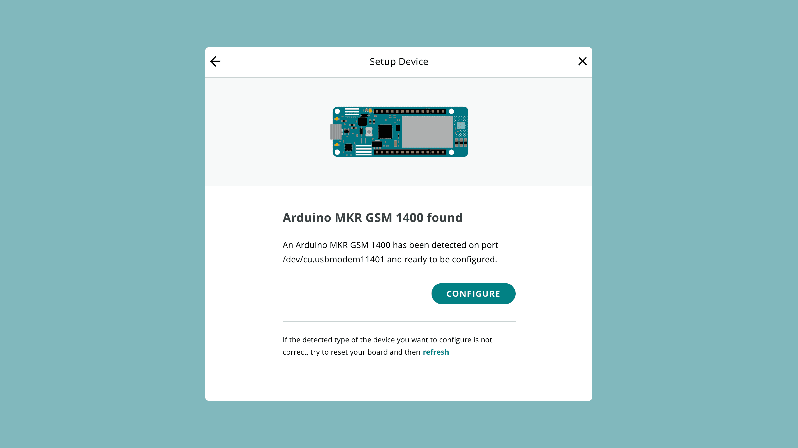

A number of Arduino boards are able to connect to the Arduino Cloud using a sim card, using either the GSM or NB-IoT technologies.

## Supported Boards

- [MKR GSM 1400](https://store.arduino.cc/arduino-mkr-gsm-1400)
- [MKR NB 1500](https://store.arduino.cc/arduino-mkr-nb-1500-1413)

Connection through mobile networks can be considered in remote areas where there's no Wi-Fi, or in mobile projects (such as cargo tracking).  

***For more information, visit the [Arduino SIM page](https://store.arduino.cc/digital/sim).***

***Note that a secured connection is a memory intense operation, so there's not a lot of memory for the user application (e.g. around 2.6 kB on the MKR GSM 1400). Using a lot of IoT Cloud variables may cause the sketch to run out of memory on boards which don't offload the SSL stack and make it crash.***

## Setup

To configure a NB-IoT / GSM board, follow the steps below:

**1.** Connect your board to your computer.

**2.** Go to [Arduino Cloud](), and navigate to the **"Devices"** section. Click on the **"Add Device"** button and then select the **"Arduino Board"**. After a while, your board will be visible, and you can click on the **"Configure"** button.

**3.** Allow some time for the configuration, as a sketch is being uploaded to your board as well as a configuration of your crypto chip is ongoing. 

Your board is now configured and ready to be used in the Arduino IoT Cloud. 

To get started, check out the official [Getting Started (Arduino / C++)]() guide. This will guide you to successfully send data between your board and Arduino Cloud.

## Network Configuration

When you attach your board to a Thing, you will need to enter some credentials. With an Arduino SIM, configure it as:

- **APN** - `prepay.pelion`
- **PIN** - `0000`
- **Username** - `arduino`
- **Password** - `arduino`