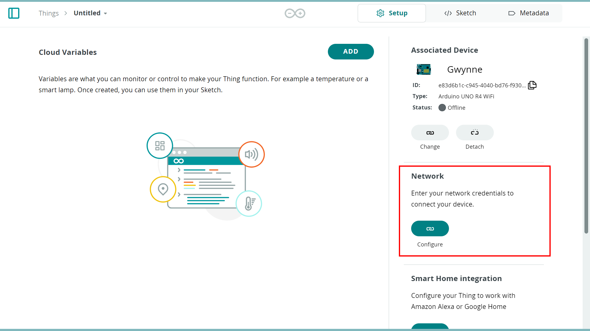

## Setup and Process

***If you are new to the Arduino Cloud, check out [Getting Started With the Arduino Cloud](/arduino-cloud/getting-started/iot-cloud-getting-started).***

To use the Arduino Cloud you will need to register and set up a **free** account.

### Configure Your Board

After you have set up your account, to add your device to your Arduino Cloud account go to the Devices page and click on **+ DEVICE**.

This will take you to the setup menu for your device. You can now choose between three different options depending on what type of board you are using. Continue by clicking on **Arduino board**.

Now you have to decide how you want to set up your board with the Cloud, either via Bluetooth® or USB cable (you can check if your board is compatible with the Bluetooth method below). These two options have different processes, pick the method that suits your needs best and follow the section for your chosen method.

## Bluetooth Provisioning

### Compatible boards

Here are the boards that are compatible with Bluetooth provisioning via a Bluetooth connection:

- UNO R4 WiFi (WiFi firmware version 0.6.0 or later required)

### Setting up Your Device With Bluetooth

After selecting the Bluetooth option you will see a page telling you how to connect your board. Follow the steps to connect your board via Bluetooth.

Once your board is connected you will see a page that will let you pick the WiFi the board should connect to. Pick the WiFi you want to connect to and enter the password. Here you can also change the device name.

After completing these steps your device will connect to your WiFi and you will be taken to the device page. Here you can click on the icon in the bottom left corner to attach a thing to the device. To find out more about Arduino Cloud Things, go [here.](https://docs.arduino.cc/arduino-cloud/cloud-interface/things/)

Now you are ready to start using your board with the Arduino Cloud!

## USB Provisioning

If this is your first time using the Arduino Cloud you will be asked to download the **Arduino Create Agent**. The Create Agent is a piece of software that is necessary for your Arduino board to communicate with your browser. Download and install it by clicking on download and following the installation process.

When the installation is finished you will get to a page that lets you select the board you wish to configure. Click on the board that you want to set up.

Now the board will start connecting. You should now see this loading screen:

Wait for it to finish and when it is complete click "continue".

You will now be taken to the device page. Here you can see the details of the board, change the name and attach it to a thing if you want to connect to a network. To find out more about Arduino Cloud Things, go [here.](https://docs.arduino.cc/arduino-cloud/cloud-interface/things/)

Let's have a look at how to connect the board to a network. In the bottom left corner you can press the icon highlighted in the image below to create a thing and attach your board to it automatically. Clicking it also takes you to the Thing page.

Under Network click on **configure** and add your Wi-Fi® credentials. Now the board will automatically connect to your network when you upload the sketch from the **sketch** tab.

