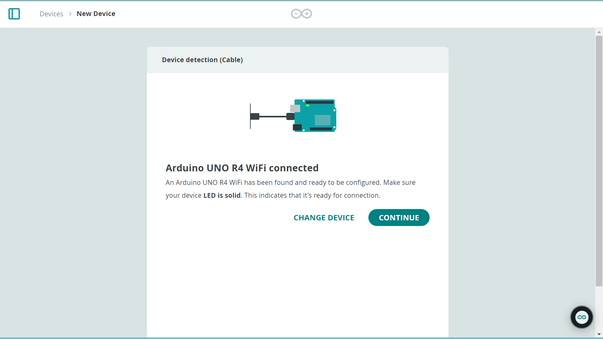

## Setup and Process

***If you are new to the Arduino Cloud, check out [Getting Started With the Arduino Cloud](/arduino-cloud/getting-started/iot-cloud-getting-started).***

To use the Arduino Cloud you will need to register and set up a **free** account.

## Different Device Provisioning Versions

There are two different versions of provisioning, 1.0 and 2.0. These different versions will change some things when you connect your board to the Cloud. The main change will be where the network credentials are stored.

If your board is provisioned to the Cloud with version 1.0, the network credentials will be stored in a "secret.h" file that can be found on the "thing" page, in the "sketch" tab. As shown here:

If your board is provisioned to the Cloud with version 2.0 the network credentials will be stored on the board.

### Compatible Boards List

|        Board        | Compatible version |
| ------------------- | ----------- |
|     Nicla Vision    | Version 2.0 |
|        Opta         | Version 2.0 |
|     GIGA R1 WiFi    | Version 2.0 |
|     UNO R4 WiFi     | Version 2.0 |
|     Portenta H7     | Version 2.0 |
|     MKR NB 1500     | Version 1.0 |
|     MKR WAN 1300    | Version 1.0 |
|     MKR WAN 1310    | Version 1.0 |
|     MKR 1000 WiFi       | Version 1.0 |
|     MKR WiFi 1010   | Version 1.0 |
|     MKR GSM 1400    | Version 1.0 |
|     Nano 33 IoT     | Version 1.0 |
|     Nano ESP32      | Version 1.0 |
| Nano RP2040 Connect | Version 1.0 |
|     Portenta C33    | Version 1.0 |
|     Portenta X8     | Version 1.0 |

If you have a board that is compatible with version 2.0 but have provisioned it with version 1.0, please have a look at the [section](#migrating-from-version-10-to-20) at the end to understand how to migrate your board from 1.0 to 2.0.

### Configure Your Board

After you have set up your account, to add your device to your Arduino Cloud account go to the [Devices page](https://app.arduino.cc/devices) and click on the **+ DEVICE** button.

This will take you to the setup menu for your device. You can now choose between three different options depending on what type of board you are using. Continue by clicking on **Arduino board**.

Now you have to decide how you want to set up your board with the Cloud, either via Bluetooth® or USB cable (you can check if your board is compatible with the Bluetooth method below). These two options have different processes, pick the method that suits your needs best and follow the section for your chosen method.

## Bluetooth Provisioning

### Compatible boards

Here are the boards that are compatible with Bluetooth provisioning via a Bluetooth connection:

- [Arduino UNO R4 WiFi](https://docs.arduino.cc/hardware/uno-r4-wifi/) (Wi-Fi firmware version 0.6.0 or later required)

A board that is ready for Bluetooth provisioning has a specific provisioning sketch installed and displays a pulsing LED or a Bluetooth icon on the LED matrix (for UNO R4 WiFi). Newer boards are delivered with this specific sketch already installed. If the pulsing LED is not visible, please use the USB provisioning method.

### Setting up Your Device With Bluetooth

After selecting the Bluetooth option you will see a page telling you how to connect your board. Follow the steps to connect your board via Bluetooth.

Once your board is connected you will see a page that will let you pick the Wi-Fi the board should connect to. Pick the Wi-Fi you want to connect to and enter the password. Here you can also change the device name.

After completing these steps your device will connect to your Wi-Fi and you will be taken to the device page. Here you can click on the icon in the bottom left corner to attach a thing to the device. To find out more about Arduino Cloud Things, go [here](https://docs.arduino.cc/arduino-cloud/cloud-interface/things/).

The Bluetooth LE interface is automatically turned off at the end of the procedure, and it remains off until the board is reset. More information about this can be found in the [How to set up the Reconfiguration Procedure](#how-to-set-up-the-reconfiguration-procedure) section.

Now you are ready to start using your board with the Arduino Cloud!

## USB Provisioning

If this is your first time using the Arduino Cloud you will be asked to download the [**Arduino Cloud Agent**](https://cloud.arduino.cc/download-agent/). The Create Agent is a piece of software that is necessary for your Arduino board to communicate with your browser. Download and install it by clicking on download and following the installation process.

When the installation is finished you will get to a page that lets you select the board you wish to configure. Click on the board that you want to set up.

Now the board will start connecting. You should now see this loading screen:

Wait for it to finish and when it is completed, click "continue".

You will now be taken to the page where you can select the network you want to connect to. Depending on your boards network compatibilities you can set up either ethernet, CAT-M1, Cellular or Wi-Fi connectivity. Here you can chose your network type and enter its credentials.

When this is done you will be taken to the device page. Here you can see the details of the board, change the name, attach it to a thing and change the network configuration.

To find out more about Arduino Cloud Things, go [here](https://docs.arduino.cc/arduino-cloud/cloud-interface/things/). In the bottom left corner you can press the icon highlighted in the image below to create a thing and attach your board to it automatically. Clicking it also takes you to the Thing page.

## Migrating from version 1.0 to 2.0

If you would like to upgrade your board from 1.0 to 2.0, so that your network credentials are saved on the boards storage and so that the board can be updated via BLE. And If you have a board that is compatible with version 2.0 but have provisioned it previously with version 1.0, please follow the instructions in this section! 

Go to the device page [here](https://app.arduino.cc/devices), if the board is on the list already please delete it. Then press the **+ DEVICE** button.

Next select "USB connection" and on the next page select your board.

Now your board will be updated to version 2.0, wait for the process to finish.

When this is done you can continue setting up the network connection for your board and it will now be using the latest provisioning method with the Arduino Cloud!

## How to update the Stored Network Configuration

To proceed with the next steps, the Cloud-generated sketch must be uploaded to the board. If you want to update the stored network configuration, there are two ways:

### Update Using the Bluetooth LE Interface

Ensure that the Cloud sketch has enabled the BLEAgent, via `thingProperties.h`. This is enabled by default if the board has been registered with Provisioning 2.0. If you need to enable it, please have a look at [this documentation](https://docs.arduino.cc/arduino-cloud/cloud-interface/sketches).

You can update the network settings from the detail page of the device on the Arduino Cloud webpage or the mobile app.

During this process you will be asked to wipe out the current network configuration to restart the board's Bluetooth LE interface. 

1. Power on the board.
2. Open the devices page of the Mobile App or the Arduino Cloud webpage.
3. Click on the device you want to update the network settings for.
4. Click on the "change" button by the network section.
5. If you are using the Arduino Cloud webpage, select the Bluetooth method.
6. Reset the board using the method of your board. Have a look at the [How to set up the Reconfiguration Procedure](https://docs.arduino.cc/arduino-cloud/cloud-interface/sketches/#how-to-set-up-the-reconfiguration-procedure) article to find the default board reset pin. If you have changed the reset pin from the default one, please use that.
7. The board will reboot, and you will see the LED pulsing.
8. Connect to the board on the Arduino Cloud.
9. Input the new network configuration.
10. The board will validate it, and if correct, it will close the connection.

### Update Using the Serial Interface

Ensure that the SerialAgent is enabled in the Cloud sketch, via `thingProperties.h`. This is enabled by default if the board has been registered with Provisioning 2.0. If you need to enable it, please have a look at [this documentation](https://docs.arduino.cc/arduino-cloud/cloud-interface/sketches).

This method only works with the Arduino Cloud website. You can update the network settings from the detail page of the board on the webpage. The Serial interface, if enabled, is always ready to receive a new configuration.

1. Turn on the board and connect it to your PC using a USB cable.
2. Open the devices page on the Arduino Cloud webpage.
3. Click on the board you want to update the network settings for.
4. Click on the "change" button by the network section.
5. Input the new network configuration.
6. The board will validate it, and if correct, it will close the connection.

## How to Delete a Stored Network Configuration

If you want to delete the stored network configuration without updating it, there are two possible methods to do so.

### Board Reset Procedure

To proceed with the next steps, the Cloud-generated sketch must be uploaded to the board.

Reset the board using the method of your board. Have a look at the [How to set up the Reconfiguration Procedure](https://docs.arduino.cc/arduino-cloud/cloud-interface/sketches/#how-to-set-up-the-reconfiguration-procedure) article to find the default board reset pin. If you have changed the reset pin from the default one, please use that.

### Using the DeleteConfiguration Sketch

Open Arduino IDE and on the left side open the **Library Manager**. Search for **Arduino_NetworkConfigurator** and download it. Once it is downloaded go to **File > Examples > Arduino_NetworkConfigurator > Utility > DeleteConfiguration**, this will open a new example sketch. Select your board and port then upload this example sketch to your board. When the sketch has been uploaded you can look at the serial monitor to monitor the progress and troubleshoot if needed.

The sketch can also be found [here](https://github.com/arduino-libraries/Arduino_NetworkConfigurator/blob/main/examples/utility/DeleteConfiguration/DeleteConfiguration.ino).

