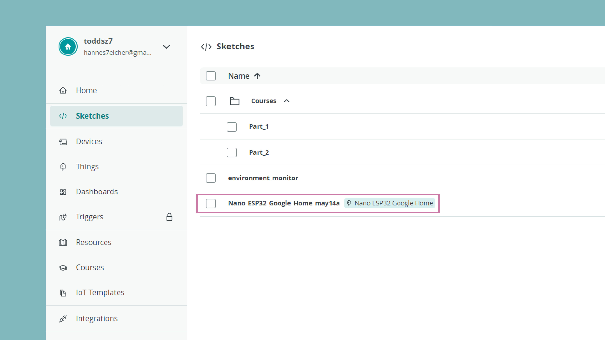

A sketch is a file where we write programs to run on our Arduino boards. Sketches have a `.ino` extension, which supports the Arduino programming language (a variant of C++).

The Arduino Cloud has two categories of sketches:
- **Regular sketch** - a single `.ino` file where you write a program. These sketches can be used for **any** Arduino board. 
- **IoT Sketch** - a set of files that are automatically generated when creating a [Thing](/arduino-cloud/cloud-interface/things). This includes an `.ino` file and two header (`.h`) files that contain your Thing configuration + credentials. Only available for boards with IoT support.

In this document we will take a look at how to use sketches in the Arduino Cloud environment.

***If you need help getting started with programming your Arduino in the online environment, check out the [Cloud Editor](/arduino-cloud/guides/cloud-editor) tutorial.***

## Access Your Sketches

You can access all your sketches at [app.arduino.cc/sketches](https://app.arduino.cc/sketches), where you can easily select between your regular sketches and IoT sketches.



Clicking on each sketch will direct you to the [Cloud Editor](https://create.arduino.cc/editor/), which is an online version of the Arduino IDE. Here you can write a program, compile it and upload it to your board. 

***To get started with the Cloud Editor, check out the [Cloud Editor](/arduino-cloud/guides/cloud-editor) tutorial.***

## Regular Sketches

A regular sketch in the Arduino Cloud is exactly like a sketch used in the [Arduino IDE](/software/ide-v2), with no difference whatsoever. You can take a sketch from the online IDE and compile it in the offline IDE. 

A regular sketch only has two minimum requirements: the inclusion of the `void loop()` and `void setup()` functions, which are required for any Arduino sketch.

```arduino
void setup(){
    //code runs once
}

void loop(){
    //code loops infinitely
}
```

If you are new to the Arduino environment, you can check out the [Language Reference](https://www.arduino.cc/reference/en/), which contains all the functions that you can use for **all** Arduino boards. 

For specific features of a board, make sure to check out the [hardware documentation](/).

## IoT Sketches

IoT sketches are more complex and are generated automatically when you create a Thing and variables.

***Read more about this in the [Automatic Sketch Generation](/arduino-cloud/cloud-interface/sketches) documentation.***

### Sketch File

The sketch file is generated with a set of additional Cloud-specific methods included, the essentials being:
- `initProperties()` - initializes properties/variables from your Thing.
- `ArduinoCloud.begin()` starts the library with the preferred connection (e.g. Wi-Fi® or LoRaWAN®).
- `ArduinoCloud.update()` - synchronizes all data between the board and the Arduino Cloud.

In addition, any variable created with a read/write permission will also generate a callback function that executes whenever the variable's value changes.
- If you create a variable called `test`, the function will render as `void onTestChange(){}`

Below is an example of how a default sketch looks like:

```arduino
#include "thingProperties.h"

void setup(){
  Serial.begin(115200);
  delay(1500);

  //initialize the variables/properties  
  initProperties();

  //debug information  
  ArduinoCloud.begin(ArduinoIoTPreferredConnection);
  setDebugMessageLevel(2);
  ArduinoCloud.printDebugInfo();
}
void loop() {
  //sync with Cloud  
  ArduinoCloud.update();
}

void onTestChange(){
  /*
  callback function, runs each time
  the variable value changes
  */
}
```

### Configuration Header File

The `thingProperties.h` file is a non-editable file that updates based on changes made in your Thing. For example:

- Creating a variable will add it to this file, along with parameters such as permission, update policy, variable type etc. 
- Changing from a Wi-Fi® device to a LoRa® device will update the **connection method** stored in this file,

The file cannot be edited in the Arduino Cloud as it is in sync with the platform and changes frequently.

### Secret File

The "Secret" File contains your secret credentials, such as Wi-Fi® network SSID/PASS or device secret key.

This file will be visible as a "Secret" tab in the Cloud Editor and is named `arduino_secrets.h`, which is not visible on the Cloud platform.

Note that if you are using the offline IDE / Arduino CLI, you will need to manually create this file. More information is in the **Offline Sketches section** just below.

## Offline Sketches

The Arduino Cloud provides an all-inclusive service for programming, uploading and monitoring your boards. While it is necessary to use the Arduino Cloud for configurations, you do not need to use the Cloud Editor for programming.

It is possible to work in an offline environment (such as Arduino IDE), which for many might be more desirable. To set this up, there are a few requirements and setbacks:
- You need to manually install the [ArduinoIoTCloud](https://github.com/arduino-libraries/ArduinoIoTCloud) and [Arduino_ConnectionHandler](https://github.com/arduino-libraries/Arduino_ConnectionHandler) libraries,
- you need to either download your sketch files and move them to your local sketch folder (e.g. `~/Documents/Arduino`), **or**
- use the [Remote Sketchbook Feature](https://docs.arduino.cc/software/ide-v2/tutorials/ide-v2-cloud-sketch-sync) feature. 

The Remote Sketchbook feature is great as you can push/pull your sketches from the Arduino Cloud. So if your `thingProperties.h` file changes, you can pull those changes as well. 

***A very important note on Remote Sketchbook: when you push/pull a sketch, you will overwrite the existing sketch, similarly to how GitHub works, but without the option of retrieving your previous sketch.***


## Recommended Code Practices (IoT Sketches)

This section highlights some important aspects of writing code with regard to the implementations in the [ArduinoIoTCloud](https://github.com/arduino-libraries/ArduinoIoTCloud).

### Watchdog Timer (WDT)

All Arduino Cloud sketches use a **Watchdog Timer (WDT)** by default. The WDT can be used to automatically recover from hardware faults or unrecoverable software errors.

A WDT is essentially a countdown timer, whereas it starts counting from a set value, and upon reaching zero, it resets the board. To prevent it from reaching zero, we continuously call it from the `loop()`, using the `ArduinoCloud.update()` function.

This is why, it is very important to not use any long blocking code in your sketch. For example, using a long `delay()` inside the `loop()` is **strongly discouraged**, as the WDT can reach zero and reset the board.

The WDT can however be disabled inside of the `setup()` function, by adding the `false` parameter:

```arduino
ArduinoCloud.begin(ArduinoIoTPreferredConnection, false).
```

***You can view the source code of this implementation [here](https://github.com/arduino-libraries/ArduinoIoTCloud/tree/master/src/utility/watchdog).***

### Alternatives to Delays

The `loop()` function includes the `ArduinoCloud.update();` call, which sends data to the Cloud and receives updates. To get the best responsiveness in your Cloud-connected projects, the `loop()` function should run as fast as possible. This means that no blocking commands should be used inside, and you should prefer a non-blocking programming approach whenever possible.

A common **blocking pattern** is the use of the `delay()` function which stops the execution of the function for the given time. We strongly advise to **get rid of this function** and achieve the same behavior in a non-blocking way with the `millis()` function as described below.

Let's see how to blink an LED. The traditional way involves the `delay()` function:

```arduino
void loop() {
  ArduinoCloud.update();

  digitalWrite(LED_BUILTIN, HIGH);
  delay(1000);
  digitalWrite(LED_BUILTIN, LOW);
  delay(1000);
}
```

This works, but it will cause a delay of at least two seconds between one execution of `ArduinoCloud.update()` and the next one, thus causing bad performance of the Cloud communication.

This can be rewritten in a non-blocking way as follows:

```arduino
void loop() {
  ArduinoCloud.update();

  digitalWrite(LED_PIN, (millis() % 2000) < 1000);
}
```

How does this work? It gets the current execution time provided by `millis()` and divides it by 2 seconds. If the remainder is smaller than one second it will turn the LED on, and if it's greater it will turn the LED off.

For a more complex and commented example, you can have a look at the [BlinkWithoutDelay example](/built-in-examples/digital/BlinkWithoutDelay).

### I2C Usage

Components connected via I²C (including the sensors onboard the [MKR IoT Carrier](https://store.arduino.cc/products/arduino-mkr-iot-carrier)) uses the same bus as the **ECCX08** crypto chip. As the crypto chip is an essential part of establishing a connection to the Arduino Cloud (it contains the credentials), it is important that other I²C peripherals are initialized after the connection has been made.

For example, if you are initializing a library such as [Arduino_MKRENV](https://www.arduino.cc/reference/en/libraries/arduino_mkrenv), your `setup()` should be implemented as:

```arduino
void setup() {
  Serial.begin(9600);
  delay(1500);

  initProperties();

  ArduinoCloud.begin(ArduinoIoTPreferredConnection);
  setDebugMessageLevel(2);
  ArduinoCloud.printDebugInfo();

  //initializing the Arduino_MKRENV library
  if (!ENV.begin()) {
    Serial.println("Failed to initialize MKR ENV shield!");
    while (1);
  }
}
```


### Avoid Blocking Serial Communication

`while(!Serial) {}` loops endlessly until the Serial Monitor is opened. This is a useful practice in cases where you want to see all debug output from the start of the sketch execution. However, when building IoT systems using **`while(!Serial){}` can hinder our project from running autonomously**, stopping the board from connecting to the network and Arduino Cloud before manually opening the Serial Monitor. Therefore, it is recommended to consider removing the `while(!Serial){}` loop if it's not necessary.

A common trick is to add a **`delay(1500);` command after `Serial.begin(9600);`**. This will slightly slow down the initialization of your device but will give you some time to open the serial monitor when you're interested in seeing its output without losing the very first lines.

## Create Agent

The [Arduino Create Agent](https://github.com/arduino/arduino-create-agent) is a single binary that will appear on the menu bar and work in the background. It allows you to use the Arduino Cloud and the Arduino Web Editor to seamlessly upload code to any board directly from the browser.

Downloading and installing the Arduino Create Agent plugin can be done following [this quick and easy process](https://create.arduino.cc/getting-started/plugin/welcome).

The full documentation of the [Arduino Create Agent is available here](https://github.com/arduino/arduino-create-agent#readme) for more advanced usage.