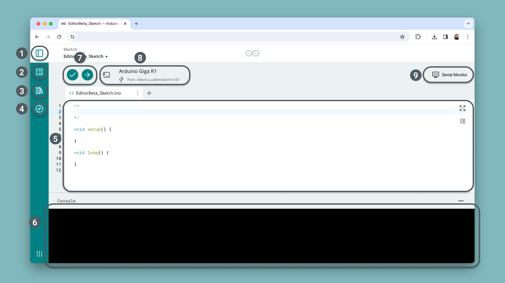

The communication between IoT devices and the Arduino Cloud is handled through something called **Things**. Things are a virtual twin of your hardware/setup, where you perform a lot of the configurations for your projects. 

In the Thing interface you can:
- create Cloud variables that can be synced across devices,
- select the main device you want to associate with
- edit & upload sketches to your board,
- set webhooks that trigger whenever data changes,
- edit the timezone.

## Thing Interface

The Thing interface is designed for ease-of-use and only has a few sections, which we will now go through.


- **1. Cloud Variables** - create variables that synchronize between a device and the Arduino Cloud.
- **2. Devices** - configure a device that will be associated with your Thing.
- **3. Network** - to modify your Wi-Fi® network/password go to Device page.
- **4. Setup** - the main configuration space tab.
- **5. Sketch** - access the sketch associated with your Thing.
- **6. Metadata** - metadata such as tags, timezone and Thing ID.

Below you will find more details on each of the sections.

## Variables

The variables section is where you create **"Cloud Variables"**, a variable that exist in the Arduino Cloud as well as on your board/setup, and is synchronized continuously. You can configure a variable to be:
- **Read/Write** - you can interact with the variable from a dashboard,
- **Read Only** - you can only read data from the board.

When you create a variable, it is automatically\* added to your `thingProperties.h` file, which is included in your Arduino Cloud sketch. This means that you do not need to declare them again. Read more in the [Automatic Sketch Generation](#automatic-sketch-generation) section further down.

For example, if you want to send temperature values to the Cloud from a sensor, all you need to do is:

```arduino
temperature = sensor.readTemperature();
```

***\*This does not apply to Things that are associated with a manual device (JavaScript, Python) as they have no sketch associated. Read more at [Manual Devices](/arduino-cloud/hardware/devices#manual-devices).***

There are a large number of variables available, including basic types such as `int`, `boolean` & `String`, but also complex types that hold multiple values, such as the `ColoredLight` variable. 

Variables of the same type can also be synchronized across all devices. This is done when creating a new variable, where you check the variables you want to sync with. 

***All variables are listed in the [Variables](/arduino-cloud/cloud-interface/variables) section. See [Variable Synchronization](/arduino-cloud/cloud-interface/variables#variable-synchronisation) for linking together your devices' variables.***

## Device

In the device section, you can select either a previously configured device, or configure a new one. Associating a device means your device and Thing are now linked indefinitely until you decide to detach them.

You can connect one of the following devices:
- [Arduino Wi-Fi® devices](/arduino-cloud/hardware/wifi) - official Arduino devices with a Wi-Fi® enabled module.
- [Arduino LoRa®-enabled devices](/arduino-cloud/hardware/lora) - official Arduino devices with a LoRa® technology.
- [Third-party ESP32/ESP8266 devices](/arduino-cloud/hardware/wifi) - third party devices with an ESP32/ESP8266 SoC.
- [Manual devices](/arduino-cloud/hardware/devices#manual-devices) - a virtual device using MicroPython, Python or JavaScript. These devices do not have a sketch associated.

The status of your device is also displayed in this section (online/offline).

***For more details on how to configure a device, check out the [Devices](/arduino-cloud/hardware/devices) section. The available types and links to individual guides are found there.***

## Network

***This option has been moved to the [Devices](/arduino-cloud/hardware/devices) section on the specific device page.***


In the network section, you configure the credentials for your network, such as your Wi-Fi® network, secret key (for ESP32 boards) and other credentials e.g. LoRa®-based networks & cellular. The network details are securely stored.


## Sketch

The sketch tab will open the Cloud Editor where you can edit, compile and upload sketches to your devices.



1. **Arduino Cloud Menu** - navigation menu for the Arduino Cloud platform and to go back to Cloud homepage.
2. **Examples** - a set of basic Arduino examples.
3. **Libraries** - all libraries that are included in the Arduino library manager (5000+).
4. **Reference** - the Arduino Reference provides an overview of the available methods in the Arduino programming API.
5. **Editor** - the code editor area, where we write the program for our board.
6. **Console Log** - this window informs you of the status of your compilation / upload. 
7. **Verify/Upload** - verify (compile) your code using the checkmark button, and upload it to your board using the right arrow. 
8. **Board / Port Selection** - the board connected to your computer will be automatically displayed here. You can also manually change this.
9. **Serial Monitor** - a tool that reads serial data sent from your board to the computer. 

The editor includes all cores for official Arduino boards, and over 6000+ libraries. Many boards also supports **Over-the-air (OTA)** uploads, which is enabled after your first upload via USB.

***For more information on the editor, check out the [Cloud Editor](https://docs.arduino.cc/arduino-cloud/guides/editor/) tutorial.***

## Metadata

In the metadata tab, you will find your **Thing ID**, **Timezone** configuration, timestamp data (creation/last modified). Here you can also create tags.

### Thing ID

Your Thing ID can be obtained from your metadata tab, and looks like this:

```
cd628fe4-31d1-42a8-bf33-a627997ce602
```

This ID is used when connecting with the [REST API](/arduino-cloud/api/arduino-iot-api) or with the [Arduino CLI](/arduino-cloud/arduino-cloud-cli/getting-started). Using either of these clients provides information about your Thing, such as device associated and Cloud variables.

### Timezone

You can choose your timezone through a dropdown menu in the metadata tab, which includes many cities in America, Europe, Asia, Africa, Oceania, Atlantic, Pacific and even Antarctica.

This is particularly important when using the [scheduler](/arduino-cloud/features/cloud-scheduler) feature to trigger events at specific times.

### Tags

Tags are used to organize and filter your Things. In a setup with many devices across different locations, this can be particularly useful. When creating a tag, you have two fields:
- **Key** - for example, `location` or `room`
- **Value** - for example, `London` or `Living Room`

## Automatic Sketch Generation

Things based on Arduino / C++ (the default way) benefit from **automatic sketch generation**. Whenever the configuration is done in your Thing, the changes are reflected in your sketch files.

For example:
- Associating a Wi-Fi board will automatically update the connection method.
- Creating a variable will add it to your `thingProperties.h` file.
- Creating a variable with **read/write** permission will also add a callback function at the bottom of your sketch. This will trigger any time the value changes.
- Changing your network credentials will update the `arduino_secrets.h` file, if you are using provisioning version 1.0, for more information read [here](https://docs.arduino.cc/arduino-cloud/hardware/device-provisioning/).

This is implemented so that the connection and synchronization between the board and Cloud is handled automatically, meaning you do not need to do any networking code when using the Arduino / C++ language.

***Please note that if you are using an offline environment, [Arduino IDE](/software/ide-v2), changes will only be made in the Cloud environment and will manually need to be adjusted. If you plan on using the offline IDE, you make use of the [sketch synchronisation](/software/ide-v2/tutorials/ide-v2-cloud-sketch-sync) feature that allows you to push/pull your Cloud sketches from the offline IDE.***

## Trademark Acknowledgments

- **LoRa®** is a registered trademark of Semtech Corporation.
