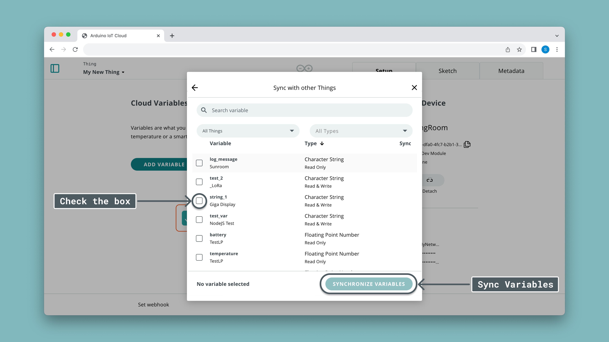

## Overview

Variables are essential component of the [Arduino Cloud](https://create.arduino.cc/iot/), and are created and configured inside a **Thing.**

A cloud variable is synced between your Arduino board and the Arduino IoT Cloud. If a variable is updated on your board (like reading a sensor), the Arduino Cloud will also receive this value. Similarly, if a board receives an update from the cloud, the variable also updates on your board. 

As long as your board maintains connection to the Arduino IoT Cloud, variables will be updated. 

**In this article, we will cover:**
- How to sync variables between your board and the Arduino IoT Cloud.
- Types of variables and list of available ones.
- How to structure a sketch for optimal variable synchronization.
- How to synchronize variables between devices.

## Create and Configure Variables

Creating and configuring variables are done inside a **Thing**, starting with the **"Add Variable"** button. This will open a new window where you can do a number of configurations.


### Variable Configuration

Inside a variable configuration, we have several options:

- **Name:** a friendly name for your variable. No spaces or special characters allowed.
- **(optional) Sync With Other Things:** sync a variable with a variable from another Thing. Whenever one variable updates, the other will follow.
- **Type:** type of variable. Choose between three categories.
  - [**Basic:**](#basic-types) e.g. `float`, `int`, `String`.
  - [**Specialized:**](#specialized-types) e.g. `CloudAcceleration`, `CloudTemperature`, `CloudFrequency`.
  - [**Complex:**](#complex-types) e.g. `CloudColor`, `CloudTelevision`.
- **Declaration:** the declaration of your variable. This is what you will use in a sketch.
- **Variable Permission:** 
  - **Read & Write:** variable can be updated from board and cloud.
  - **Read Only:** variable can only be updated from the board.
- **Variable Update Policy:**
  - **On Change:** variable synchronizes whenever value changes (threshold is `0` by default).
  - **Periodically:** variable synchronizes every `x` seconds. 


### Automatic Sketch Generation

Any variables you add will be automatically added to your [thingProperties](https://docscontentprivate-karlsoderbycloudv2.gatsbyjs.io/arduino-cloud/cloud-interface/sketches#configuration-header-file) file, which contains any configurations made inside your Thing.

Adding for example an integer variable called `test_value`, can now be used in your sketch without a need for defining the variable.

```arduino
test_value = 1;
```

***Read more about in the [IoT Sketches](https://docscontentprivate-karlsoderbycloudv2.gatsbyjs.io/arduino-cloud/cloud-interface/sketches#iot-sketches) section.***

### Callback Functions

When creating a variable with a **Read & Write** permission, a function is generated at the bottom of your sketch.

For example, a boolean variable named `button_switch` will generate a function called `void onButtonSwitch(){}`. This function executes every time the variable is changed from the cloud (through a dashboard).

You can for example implement an ON/OFF switch with the following code:

```arduino
void onButtonSwitch(){
  if(button_switch){
    digitalWrite(LED, HIGH);
  }
  else{
    digitalWrite(LED, LOW);
  }
}
```

## Cloud Updates

Data between a board and the cloud synchronizes whenever the `ArduinoCloud.update()` function is executed. This is automatically included in your sketch, inside the `void loop()`. 

It is a good practice to **not** use the `delay()` function in a cloud sketch. Please refer to the [millis()](https://www.arduino.cc/reference/en/language/functions/time/millis/) function that can be used to create non-blocking delays.

Below is an example on how to use the `millis()` function:

```arduino
unsigned long previousMillis = 0;
const long interval = 1000; //milliseconds

void setup(){

}

void loop(){
  unsigned long currentMillis = millis();
  
  if (currentMillis - previousMillis >= interval) {
    previousMillis = currentMillis;

    //code here will update every 1 second
    //without blocking the program and the cloud update
  }

```

***Note that a variable's sync between a board and the cloud is limited to two message per second (500ms)***

## Variable Synchronisation

It is possible to sync (link) one or many variables across different Things, a feature that enables bi-directional communication between devices, without writing a single line of code!

To enable variable synchronisation, create a new variable, and click on the "Sync with other Things" option.


Then select the variables you want to synchronize. They need to be of the same type (you can't link an integer to a boolean for example).



Whenever one variable updates, any variables added to the synchronisation will also update. In the graphic below we demonstrate how two Things could be set up:
- `switch_1` is synced with `light_1`. This is a typical remote light switch.
- `temperature` variables are **not linked**.
- `fan_control` is synced with `fan_speed`. This could be a potentiometer that remotely controls the speed of a fan.


***For more details on this feature, check out the [Device to Device](https://docs.arduino.cc/arduino-cloud/features/device-to-device) tutorial.***

## Cloud Variable List

Cloud variables are divided into three categories: **basic, specialized** and **complex** types. Below you will find all available variables that you can create.

### Basic Types

All available basic variables are listed below:

| Type                  | Declaration            |
| --------------------- | ---------------------- |
| Boolean               | `bool variableName;`   |
| Character String      | `String variableName;` |
| Floating Point Number | `float variableName;`  |
| Integer Number        | `int variableName;`    |


### Specialized Types

Specialized types are wrappers around basic types but declare the variable semantics more explicitly. This enables smarter integrations with third-party services (such as Alexa) and better visualization of widgets in dashboards.

You can use them just like a normal variable of the wrapped type, since they support assignment and comparison operators.

| Type                 | Declaration                              | Wrapped data type |
| -------------------- | ---------------------------------------- | ----------------- |
| Acceleration         | `CloudAcceleration variableName;`        | `float`           |
| Angle                | `CloudAngle variableName;`               | `float`           |
| Area                 | `CloudArea variableName;`                | `float`           |
| Capacitance          | `CloudCapacitance variableName;`         | `float`           |
| Contact Sensor       | `CloudContactSensor variableName;`       | `bool`            |
| Counter              | `CloudCounter variableName;`             | `int`             |
| Data Rate            | `CloudDataRate variableName;`            | `float`           |
| Electric Current     | `CloudElectricCurrent variableName;`     | `float`           |
| Electric Potention   | `CloudElectricPotention variableName;`   | `float`           |
| Electric Resistance  | `CloudElectricResistance variableName;`  | `float`           |
| Energy               | `CloudEnergy variableName;`              | `float`           |
| Flow Rate            | `CloudFlowRate variableName;`            | `float`           |
| Force                | `CloudForce variableName;`               | `float`           |
| Frequency            | `CloudFrequency variableName;`           | `float`           |
| Heart Rate           | `CloudHeartRate variableName;`           | `float`           |
| Information Content  | `CloudInformationContent variableName;`  | `int`             |
| Length               | `CloudLength variableName;`              | `float`           |
| Light                | `CloudLight variableName;`               | `bool`            |
| Logarithmic Quantity | `CloudLogarithmicQuantity variableName;` | `float`           |
| Luminance            | `CloudLuminance variableName;`           | `float`           |
| Luminous Flux        | `CloudLuminousFlux variableName;`        | `float`           |
| Luminous Intensity   | `CloudLuminousIntensity variableName;`   | `float`           |
| Mass                 | `CloudMass variableName;`                | `float`           |
| Motion Sensor        | `CloudMotionSensor variableName;`        | `bool`            |
| Percentage           | `CloudPercentage variableName;`          | `float`           |
| Power                | `CloudPower variableName;`               | `float`           |
| Pressure             | `CloudPressure variableName;`            | `float`           |
| Relative Humidity    | `CloudRelativeHumidity variableName;`    | `float`           |
| Smart Plug           | `CloudSmartPlug variableName;`           | `bool`            |
| Switch               | `CloudSwitch variableName;`              | `bool`            |
| CloudTemperature     | `CloudTemperature variableName;`         | `float`           |
| Temperature Sensor   | `CloudTemperatureSensor variableName;`   | `float`           |
| Time                 | `CloudTime variableName;`                | `float`           |
| Velocity             | `CloudVelocity variableName;`            | `float`           |
| Volume               | `CloudVolume variableName;`              | `float`           |


### Complex Types

The following variable types hold multiple values internally and are used to represent more complex data. In order to access such values, methods are provided.

#### CloudSchedule

`CloudSchedule` is used to check for an active state or to retrieve the timestamp.

| Description            | Type   | Read value              |
| ---------------------- | ------ | ----------------------- |
| Check for active state | `bool` | `x.isActive()`          |
| From (start date)      | `int`  | `x.getCloudValue().frm` |
| To (end date)\*        | `int`  | `x.getCloudValue().to`  |
| Length of Timestamp    | `int`  | `x.getCloudValue().len` |

\*If no end date is selected, value is defaulted to `0`.

#### DimmedLight

Declared as `CloudDimmedLight x;`

| Property   | Type            | Read value          | Set value           |
| ---------- | --------------- | ------------------- | ------------------- |
| Brightness | `float` (0-100) | `x.getBrightness()` | `x.setBrightness()` |
| Switch     | `bool`          | `x.getSwitch()`     | `x.setSwitch()`     |

#### ColoredLight

Declared as `CloudColoredLight x;`

| Property   | Type              | Read value          | Set value           |
| ---------- | ----------------- | ------------------- | ------------------- |
| Switch     | `bool`            | `x.getSwitch()`     | `x.setSwitch()`     |
| Hue        | `float` (0-360)   | `x.getHue()`        | `x.setHue()`        |
| Saturation | `float` (0-100)   | `x.getSaturation()` | `x.setSaturation()` |
| Brightness | `float` (0-100)   | `x.getBrightness()` | `x.setBrightness()` |
| Color      | `uint8_t` (0-255) | `x.getRGB(r,g,b)`   | `x.setRGB(r,g,b)`   |

#### CloudColor

Declared as `CloudColor x;`.

To read the Color values, we can use the following method `Color colorValues = x.getValue();`. This will assign the hue, saturation, and brightness values to the `colorValues` variable.

| Property   | Type              | Read value        | Set value                              |
| ---------- | ----------------- | ----------------- | -------------------------------------- |
| Hue        | `float` (0-360)   | `colorValues.hue` | `x = Color(hue,saturation,brightness)` |
| Saturation | `float` (0-100)   | `colorValues.sat` | `x = Color(hue,saturation,brightness)` |
| Brightness | `float` (0-100)   | `colorValues.bri` | `x = Color(hue,saturation,brightness)` |
| Color      | `uint8_t` (0-255) | `x.getRGB(r,g,b)` | `x.set(r,g,b)`                         |

To set the color, we can assign the CloudColor variable directly to float variables `x = {hue,saturation,brightness}`, or using the method ` x = Color(hue,saturation,brightness)`.

#### CloudLocation

Declared as `CloudLocation x;`.

To read the location values, we can use the following method `Location coordinates = x.getValue();`. This will assign the longitude and latitude values to the coordinates variable. If we want too access the values individually we can use `Serial.println(coordinates.lat)` and `Serial.println(coordinates.lon)`.

| Property  | Type    | Read value        | Set value                   |
| --------- | ------- | ----------------- | --------------------------- |
| Latitude  | `float` | `coordinates.lat` | This variable is ready only |
| Longitude | `float` | `coordinates.lon` | This variable is ready only |

***The format of the `lat` and `lon` is in Decimal Degrees (DD), for example `41.40338`, `2.17403`.***

#### Television    
   
Declared as `CloudTelevision x;`

| Property         | Type                                                                                                                                                                                      | Read Value               | Set value                |
| ---------------- | ----------------------------------------------------------------------------------------------------------------------------------------------------------------------------------------- | ------------------------ | ------------------------ |
| Switch           | `bool`                                                                                                                                                                                    | `x.getSwitch()`          | `x.setSwitch()`          |
| Volume           | `int`(0-100)                                                                                                                                                                              | `x.getVolume()`          | `x.setVolume()`          |
| Mute             | `bool`                                                                                                                                                                                    | `x.getMute()`            | `x.setMute()`            |
| PlaybackCommands | `PlaybackCommands` (FastForward, Next, Pause, Play, Previous, Rewind, StartOver, Stop)                                                                                                    | `x.getPlaybackCommand()` | `x.setPlaybackCommand()` |
| Input            | `InputValue` ([Up to 60 values](https://github.com/arduino-libraries/ArduinoIoTCloud/blob/master/src/property/types/automation/CloudTelevision.h) such as HDMI1, HDMI2, DVD, GAME...etc.) | `x.getInput()`           | `x.setInput()`           |
| Channel          | `int`                                                                                                                                                                                     | `x.getChannel()`         | `x.setChannel()`         |

## Examples

Here are some examples of how to use the variables in a sketch:

### Basic Types

The below example shows how to use some of the basic types. Remember that cloud variables are configured in the Arduino IoT cloud, and generated into your Thing's `thingProperties.h` file.

In this example, we are using the following cloud variables:

- `buttonSwitch` - boolean.
- `sensorVal` - int.
- `messageString` - string. 

```arduino
#include "thingProperties.h"

void setup() {
  // Initialize serial and wait for port to open:
  Serial.begin(9600);
  // This delay gives the chance to wait for a Serial mood without blocking if none is found
  delay(1500); 

  // Defined in thingProperties.h
  initProperties();

  // Connect to Arduino IoT Cloud
  ArduinoCloud.begin(ArduinoIoTPreferredConnection);
  setDebugMessageLevel(2);
  ArduinoCloud.printDebugInfo();
}

void loop() {
  ArduinoCloud.update();

  sensorVal = analogRead(A0); //int example

  if(buttonSwitch){ //bool example
    digitalWrite(LED_BUILTIN, HIGH);
    messageString = "LED ON!"; //String example
  }
  else{
    digitalWrite(LED_BUILTIN, LOW);
    messageString = "LED OFF!";  
  }
}
```

### Colored Light

ColoredLight is a complex variable declared automatically in the `thingProperties.h` file as `CloudColoredLight variableName;`. The example below shows how the ColoredLight variable (declared with the variableName `cLight`) can be used and modified in the sketch. Note that the `onCLightChange()` function is automatically added and is triggered whenever the value of the Light variable is updated in the Cloud.

```arduino
#include <ArduinoGraphics.h> 
#include <Arduino_MKRRGB.h> // Arduino_MKRRGB depends on ArduinoGraphics

#include "thingProperties.h"

void setup() {
  // Initialize serial and wait for port to open:
  Serial.begin(9600);
  // This delay gives the chance to wait for a Serial mood without blocking if none is found
  delay(1500); 

  // Defined in thingProperties.h
  initProperties();

  // Connect to Arduino IoT Cloud
  ArduinoCloud.begin(ArduinoIoTPreferredConnection);
  setDebugMessageLevel(2);
  ArduinoCloud.printDebugInfo();
  
  if (!MATRIX.begin()) {
    Serial.println("Failed to initialize MKR RGB shield!");
    while (1);
  }
  
  // set the brightness, supported values are 0 - 255
  MATRIX.brightness(10);
}

void loop() {
  ArduinoCloud.update();
}

void onCLightChange() {
  uint8_t r, g, b;
  cLight.getValue().getRGB(r, g, b);
  
  MATRIX.beginDraw();
  
  if (cLight.getSwitch()) {
    Serial.println("R:"+String(r)+" G:"+String(g)+ " B:"+String(b));
    MATRIX.fill(r, g, b);
    MATRIX.rect(0, 0, MATRIX.width(), MATRIX.height());
  }else{
    MATRIX.clear();
  }
  
  MATRIX.endDraw();
}
    
```

### Television

CloudTelevision is an automation variable declared automatically in the `thingProperties.h` file as `CloudTelevision variableName;`. The example below shows how the CloudTelevision variable (declared with the variableName `tv`) can be used and modified in the sketch. The example simulates a remote controller by using an IR receiver to read the signals sent from the a remote controller and save them in arrays of unsigned integers. An IR transmitter is then used to send IR signals using the Arduino IoT Cloud. To view the full documentation of the project, [you can check this page](https://create.arduino.cc/projecthub/313276/full-control-of-your-tv-using-alexa-and-arduino-iot-cloud-9e7c4d). 

Note that the `onTvChange()` function is automatically added and is triggered whenever the value of the tv variable is updated in the Cloud.

```arduino
#include "thingProperties.h"
#include <IRremote.h>

/******* SAVE DATA FROM IR RECEIVER ********/
const unsigned int chan[9][67] = {};
const unsigned int volUp[67] = {};
const unsigned int chanUp[67] = {};
const unsigned int onoff[67] = {};
                        
IRsend irsend;
const int freq = 38;
bool first;

int prevChannel;
int prevVolume;
bool prevSwitch;
bool prevMute;

void setup() {
  // Initialize serial and wait for port to open:
  Serial.begin(9600);
  // This delay gives the chance to wait for a Serial Monitor without blocking if none is found
  delay(1500); 

  // Defined in thingProperties.h
  initProperties();

  // Connect to Arduino IoT Cloud
  ArduinoCloud.begin(ArduinoIoTPreferredConnection);
  setDebugMessageLevel(2);
  ArduinoCloud.printDebugInfo();
 
  first = true;
  pinMode(LED_BUILTIN, OUTPUT);
}

void loop() {
  ArduinoCloud.update();
}

/******* HANDLING THE IR TRANSMITTER********/
void sendIR(const unsigned int buf[]) {
  digitalWrite(LED_BUILTIN, HIGH);
  irsend.sendRaw(buf, 67, freq);
  delay(300);
  digitalWrite(LED_BUILTIN, LOW);
}

void onTvChange() {
  
  Serial.println("==================");
  Serial.println("Switch:"+String(tv.getSwitch()));
  Serial.println("Volume:"+String(tv.getVolume()));
  Serial.println("Channel:"+String(tv.getChannel()));
  Serial.println("Mute:"+String(tv.getMute()));
  Serial.println("==================");
  
  if (first){
      prevSwitch = tv.getSwitch();
      prevVolume = tv.getVolume();
      prevChannel = tv.getChannel();
      prevMute = tv.getMute();
      first = false;
      return;
  } 
  
  
  // Volume changed
  if (tv.getVolume() > prevVolume) {
    tv.setMute(false);
    prevMute = false;
    for (int k = prevVolume + 1 ; k<=tv.getVolume(); k++) {
      sendIR(volUp);
      Serial.println("Volume requested:"+String(tv.getVolume())+" Set:"+String(k));  
    }
    prevVolume = tv.getVolume();
  }
  else if (tv.getVolume() < prevVolume) {
    tv.setMute(false);
    prevMute = false;
    for (int k = prevVolume - 1; k>=tv.getVolume(); k--) {
      sendIR(volDown);
      Serial.println("Volume changed:"+String(tv.getVolume())+" Set:"+String(k));  
    }
    prevVolume = tv.getVolume();
  }
  
  
  // Mute changed
  if (tv.getMute() != prevMute && tv.getMute()) {
    prevMute = tv.getMute();
    sendIR(mute);
    Serial.println("Mute changed:"+String(tv.getMute()));
  }
  else if (tv.getMute() != prevMute && !tv.getMute()) {
    prevMute = tv.getMute();
    sendIR(mute);
    Serial.println("Mute changed:"+String(tv.getMute()));
  }
  
  
  // Channel changed
  if (tv.getChannel() != prevChannel) {
    int newChannel = tv.getChannel();
    if (newChannel > 0 && newChannel < 10) {
      sendIR(chan[newChannel-1]);
    } else if (newChannel > 9) {
      if (newChannel > prevChannel) {
        for (int ch = prevChannel; ch < newChannel; ch++) {
          sendIR(chanUp);
          Serial.println("Chan requested:"+String(newChannel)+" Set:"+String(ch));  
        }  
      } else if (newChannel < prevChannel) {
          for (int ch = prevChannel; ch > newChannel; ch--) {
            sendIR(chanDown);
            Serial.println("Chan requested:"+String(newChannel)+" Set:"+String(ch));  
          }
      }
    }
    prevChannel = newChannel;
    Serial.println("Channel changed:"+String(tv.getChannel()));
  }
  
  
  // On/Off changed
  if (tv.getSwitch() != prevSwitch) {
    prevSwitch = tv.getSwitch();
    if (tv.getSwitch()) {
      sendIR(chan[6]);
    } else {
      sendIR(onoff);
    }
    Serial.println("Switch changed:"+String(tv.getSwitch()));
  }
}

```

## Alexa Variables

The integration between Alexa & Arduino IoT Cloud supports a limited amount of variables, see the list below:

- [Colored Light](#coloredlight) - `bool` and `float` (complex type).
- [Dimmed Light](#dimmedlight) - `bool` and `float` (complex type).
- [Television](#television) - `bool` and `int` (complex type)
- [Contact Sensor](#specialized-types) - `bool`
- [Light](#specialized-types) - `bool`
- [Motion Sensor](#specialized-types) - `bool`
- [Smart Plug](#specialized-types) - `bool`
- [Switch](#specialized-types) - `bool`
- [Temperature Sensor](#specialized-types) - `float`

Other variables used will not appear in the Amazon Alexa app.

***To synchronize your Arduino Cloud with the Amazon Alexa service, you can check out the [Arduino Cloud Alexa Tutorial](/arduino-cloud/tutorials/alexa-mkr-rgb-shield).***

## Summary

In this article, we have covered how to use variables in the Arduino IoT Cloud, and what variables are available.

We have also shown some code examples and good practices to keep variable synchronization optimal, such as using the `millis()` function.

The use of cloud variables is almost identical to how you use variables in a regular sketch, with the exception that they are synchronized with the Arduino IoT Cloud. 