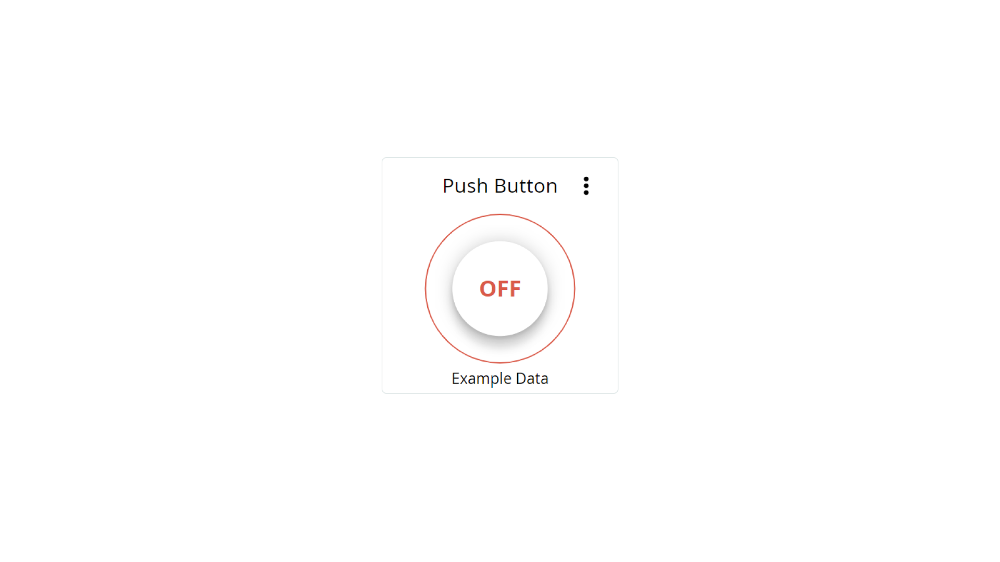
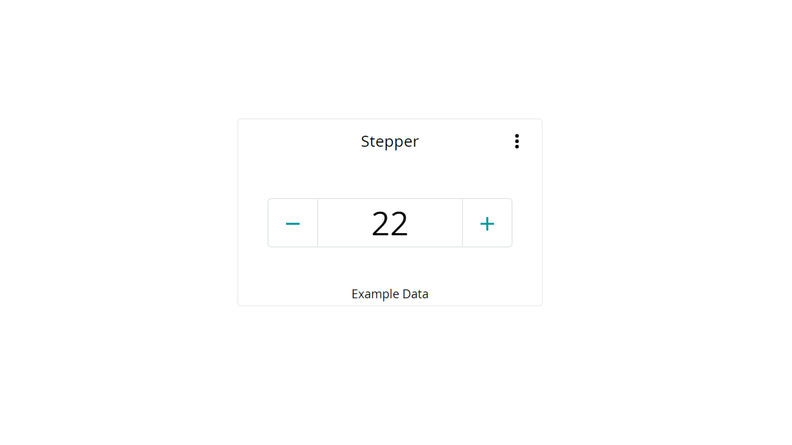
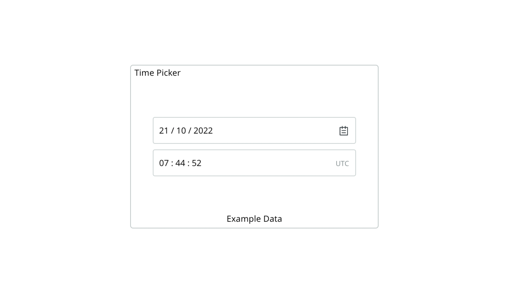
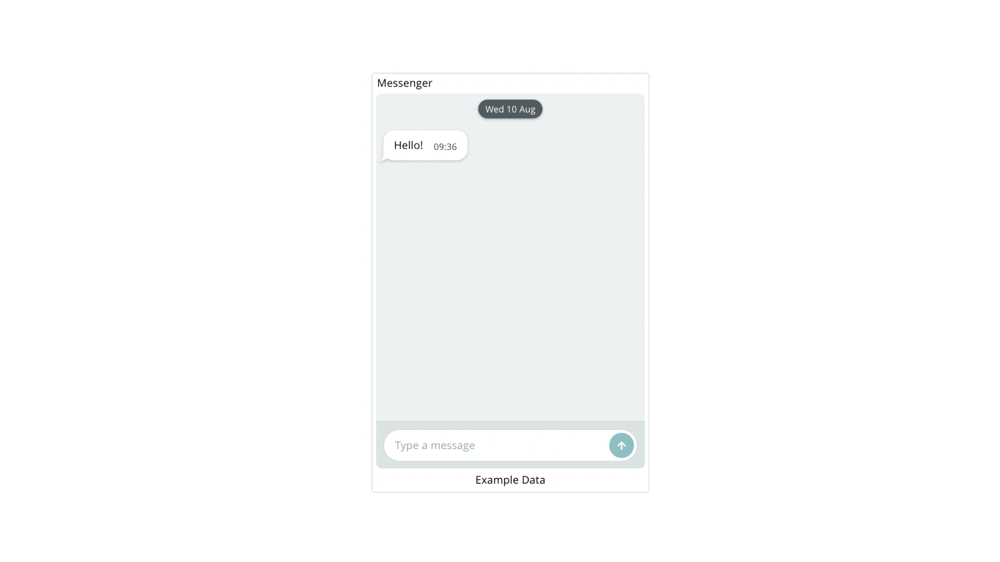
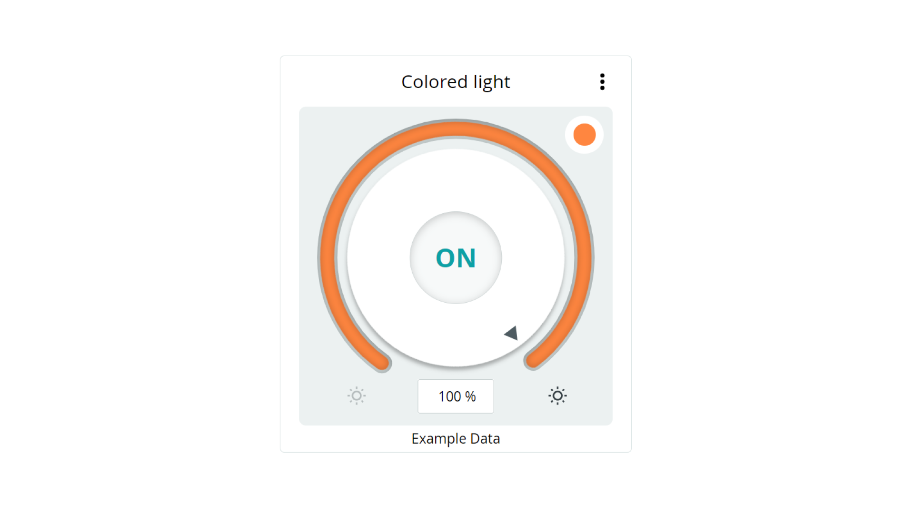
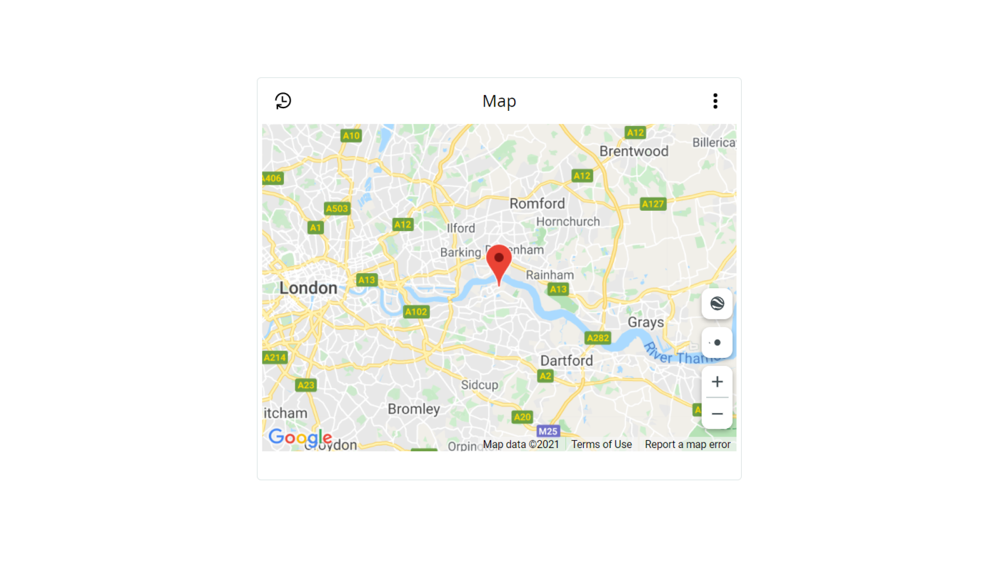
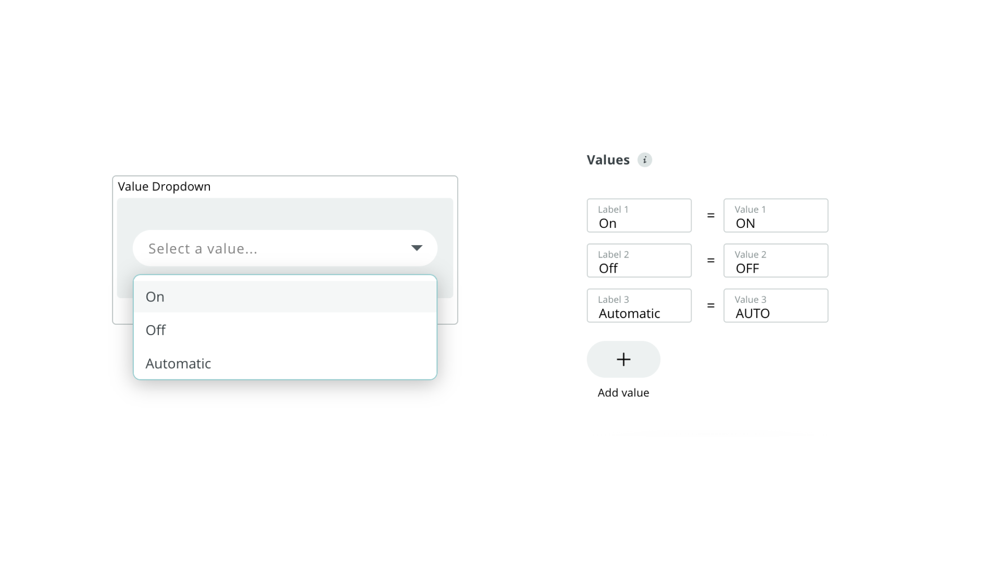

Dashboards in the [Arduino Cloud](https://cloud.arduino.cc/home/) are used to easily monitor & control your Arduino boards from a web interface. Dashboards are not linked to one specific Thing or device, you can control all of them through one single dashboard.

Dashboards are composed of [widgets](#widgets), which are directly linked to a variable. Whenever a variable is updated, so is the widget.

## Dashboards


A dashboard consists of one or several **widgets** that are linked with your cloud variables. You can for example set up a switch to turn on/off a light, a gauge that displays temperature, or a chart that shows data over time. 

Dashboards are not tied to one Thing, or one device, and they can be used to control and monitor several devices simultaneously. For example, you can have 10 devices monitoring temperature in different parts of the world, and the data is displayed in one single dashboard. 

***Deleting dashboards / widgets does not impact the functionality of your Thing & device. This means that you can safely edit your dashboards & widgets while your device is streaming data. It does however remove the historical data of that Widget.*** 

## IoT Remote App

The **IoT Remote App** is a mobile version of your dashboards, that can be downloaded through:
- [Google Play Store](https://play.google.com/store/apps/details?id=cc.arduino.cloudiot&hl=en&gl=US)
- [Apple App store](https://apps.apple.com/us/app/arduino-iot-cloud-remote/id1514358431)

***For more information, visit the [IoT Remote App docs](/arduino-cloud/iot-remote-app/getting-started).***

## Edit / View Modes

Dashboards have two modes, **edit** and **view**. For configuring the dashboard, you use the edit mode.

In both modes, you can also click the **Mobile Layout** icon, to see how the widgets will be viewed on your IoT Remote App.


While in **edit mode**, you can create widgets, link them to variables, move widgets around and lock them in place. Widgets can be scaled and customized to your liking. A switch widget can for example be adjusted from a 1x1 to 5x5 size. 


In **viewing** mode, you can only monitor/interact with your widgets.  

## Sharing Dashboards

You can share your live dashboards with other people, allowing them to monitor and interact with your devices. Note that you need a [maker plan](https://cloud.arduino.cc/plans) to use this feature.  


***Read more at [Sharing Dashboards in the Arduino Cloud](/arduino-cloud/features/sharing-dashboards).***

## Widgets

Widgets are the building blocks of your dashboard and can be used to either visualize data or interact with your board. Widgets are linked to a single cloud variable, and as that variable updates, the widget will as well.

There are many different widgets available that fit different types of uses, such as:
- **Gauge** - displaying data in a "gauge" style.
- **Switch** - for switching a boolean, i.e. turning something on/off.
- **Map** - display the location of your Thing.
- **Messenger** - to display or send strings to your board.

A full list of widgets and how to use them is available in the [List of Widgets](#list-of-widgets) .

### Link Widgets & Variables


### Download Historical Data

Data which is streamed to a widget is also available for download. The data retention rate depends on your Arduino Cloud plan. For example, an **entry plan** has a data retention of 15 days. You can download it as an `.csv` file that can easily be used with Excel, Google Sheets etc. 

***Learn more about downloading data in the [Historical Data on the Arduino Cloud](/arduino-cloud/features/iot-cloud-historical-data) tutorial.***


## List of Widgets

Below you will find a list of available widgets and examples on how they are linked to a variable used in a sketch.

### Switch


The switch widget is great for simply turning something ON or OFF.

Can be linked with a **boolean** variable.

An example of how it is used in a sketch:

```arduino
if(switchVariable == true){
    digitalWrite(ledPin, HIGH);
}

else{
    digitalWrite(ledPin, LOW);
}
```

### Push Button



The push button widget is a virtual version of a push button. While pushed down, something is activated, and when released, it is de-activated.

Can be linked with a **boolean** variable.

An example of how it is used in a sketch:

```arduino
while(pushbuttonVariable == true){
    counter++
    delay(10);
}
```

### Slider


The slider widget can be used to adjust a value range. Great for changing the intensity of light, or the speed of a motor.

Can be linked with multiple variables, including **integers & floats.**

An example of how it is used in a sketch:

```arduino
analogWrite(ledPin, sliderVariable);
```

### Stepper



Similar to the slider, the stepper widget increases or decreases a variable by increments of 1. It can be used to switch between different modes.

Can be linked with multiple variables, including **integers & floats.**

An example of how it is used in a sketch:

```arduino
if(stepperVariable == 10){
    activateThisFunction();    
}

//activate another function
else if(stepperVariable == 11){
    activateAnotherFunction();
}

//or simply print out the updated value
Serial.println(stepperVariable);
```

### Time Picker



The time picker widget is used to represent and set a time and/or a date.

Can be linked with a **CloudTime** variable.

An example of how it is used in a sketch:

```
CloudTimeVariable = ArduinoCloud.getLocalTime();
```

In this example, the variable named `CloudTimeVariable` is populated with `ArduinoCloud.getLocalTime()` which returns the Unix time stamp (in seconds) of the local time zone.

### Messenger



The messenger widget can be used to send and receive strings through the messenger window.

Can be linked with a **String** variable.

An example of how it is used in a sketch:

```arduino
stringVariable = "This is a string";
```

It is possible to clear the messenger widget window directly from the sketch, by using:

```arduino
stringVariable = PropertyActions::CLEAR;
```

***For ArduinoIoTCloud library versions below `1.7`, you can use `stringVariable = "\x1b";` to clear the widget window.*** 

### Color


The color widget is great for selecting an exact color for an RGB light.

Can be linked with a **Color** variable.

An example of how it is used in a sketch:

```arduino
uint8_t r, g, b;
rgbVariable.getValue().getRGB(r, g, b);
```

### Dimmed Light


The dimmed light widget is great for changing the intensity of a light, and to be able to turn it ON and OFF as well.

Can be linked with a **Dimmed Light** variable.

An example of how it is used in a sketch:

```arduino
  //retrieve and map brightness value from cloud
  uint8_t brightness = map(dimmedVariable.getBrightness(), 0, 100, 0, 255);

  //then check if switch is on/off 
  if (dimmedVariable.getSwitch()) {
    analogWrite(6, brightness); //write brightness value to pin 6    
  }
  else{
    analogWrite(6, LOW); //turn off lamp completely
  }
```

### Colored light



The colored light widget is designed to set the color of a lamp and turn it ON or OFF.

Can be linked with a **Colored Light** variable.

An example of how it is used in a sketch:

```arduino
uint8_t r, g, b;
rgbVariable.getValue().getRGB(r, g, b);
```

### Value


The value widget is a simple one. It only reads or writes values without any additional functionalities.

Can be linked with many different variables.

An example of how it is used in a sketch:

```arduino
valueVariable = analogRead(A0);
```

### Status


The status widget is great for checking the state of something: green is true, red is false!

Can be linked to a **boolean** variable.

An example of how it is used in a sketch:

```arduino
statusVariable = true;
//or
statusVariable = false;
```

### Gauge


The gauge widget is the go-to for any measurements that fit in a half circle. A great widget for building organized, professional dashboards.

Can be linked with multiple variables, including **integers & floats.**

An example of how it is used in a sketch:

```arduino
gaugeVariable = analogRead(A0);
```

### Percentage


The percentage widget displays values as percentages, with the option of adding **icons** and **color thresholds**. 

In the widget settings, you can choose from a range of icons, as well as a color that should be visible whenever a value is e.g. below a certain value.


Can be linked with multiple variables, including **integers & floats.**

An example of how it is used in a sketch:

```arduino
percentageVariable = analogRead(A0);
```

### LED


The LED widget is a virtual LED that can signal the status of something. Can either be set to ON or OFF.

Can be linked with a **boolean** variable.

An example of how it is used in a sketch:

```arduino
ledVariable = true;
//or
ledVariable = false;
```

### Map



The map widget is a tool for keeping track of the location of your projects. This is a great tool for any project involving GPS, or to get an overview of where your Thing, or multiple Things are operating.

Can be linked with the **Location** variable.

An example of how it is used in a sketch:

```arduino
locationVariable = Location(51.5074, 0.1278);
```

### Chart


The chart widget is great for data analytics. It's used to track real-time data, and track historical data. This widget can for example be used to track temperature changes, energy consumption and other sensor values. A chart widget can only be linked to one variable at a time.

An example of how it is used in a sketch:

```arduino
variable = analogRead(A0);
```

### Advanced Chart


The advanced chart widget allows you to track up to **5 variables simultaneously**. This widget also includes an additional configuration interface that appears while editing the widget.


An example of how it is used in code:

```arduino
variable_1 = analogRead(A1)
variable_2 = analogRead(A2)
variable_3 = analogRead(A3)
variable_4 = analogRead(A4)
variable_5 = analogRead(A5)
```

***Check out the [Advanced Chart](/arduino-cloud/features/advanced-chart) guide for more information.***

### Scheduler


The Scheduler Widget allows you to schedule a job in the future. With this widget, you can schedule:
- A job to activate at a specific hour, minute and second. 
- A job to execute only on specific days.
- A job that should last for X amount of seconds, minutes or hours.

In a sketch, use the `x.isActive()` boolean to check whether a state is active. 

Example:

```arduino
if(scheduleVariable.isActive){}
```


***Check out the [Scheduler](/arduino-cloud/features/cloud-scheduler) guide for more information.***

### Sticky Note


The sticky note widget can be used to write important notes or to categorize your widgets. 

The sticky note can **not** be linked with a variable and is designed to keep notes only while using a dashboard. It does support the use of markdown so that you can create titles, links, code blocks etc.

### Value Selector


The value selector widget can be used to switch between predetermined values through available buttons. Supported variable types are `int` and `String`. 

Example:

```arduino
if(valueSelector == 0){
  //if value matches, execute code
}

if(valueSelector == "string"){
  //if string matches, execute code
}
```

### Value Dropdown



The value dropdown widget works similarly to the **value selector** and can be used to switch between predetermined values through a dropdown menu. Supported variable types are `int` and `String`. 

Example:

```arduino
if(valueDropDown == 0){
  //if value matches, execute code
}

if(valueDropDown == "string"){
  //if string matches, execute code
}
```
