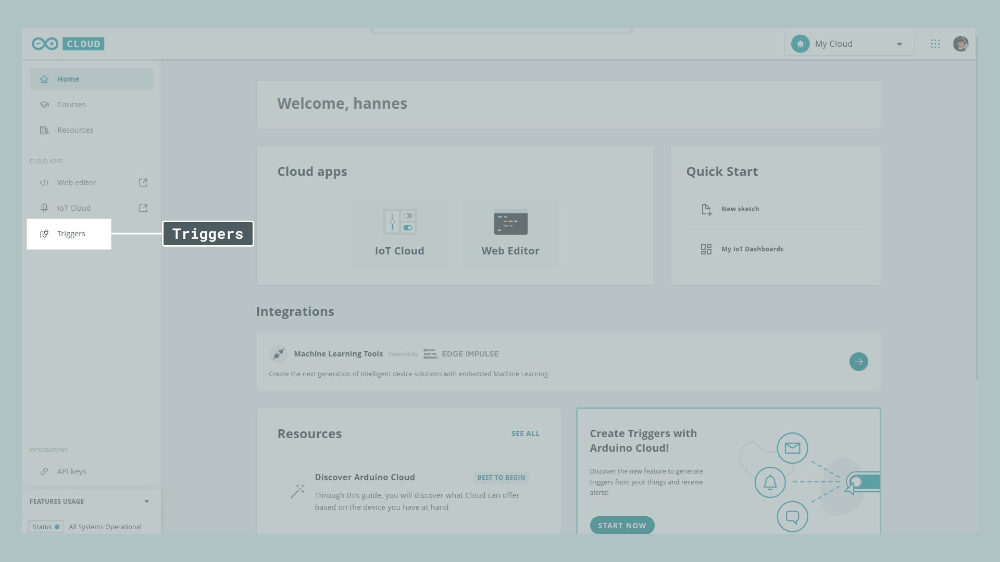
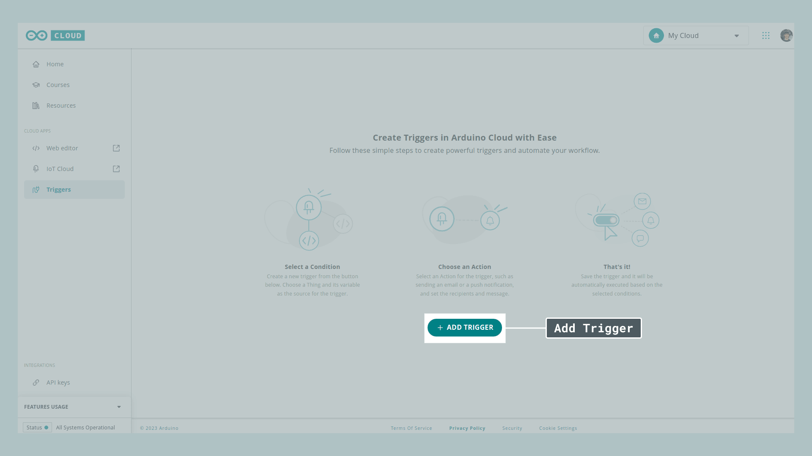
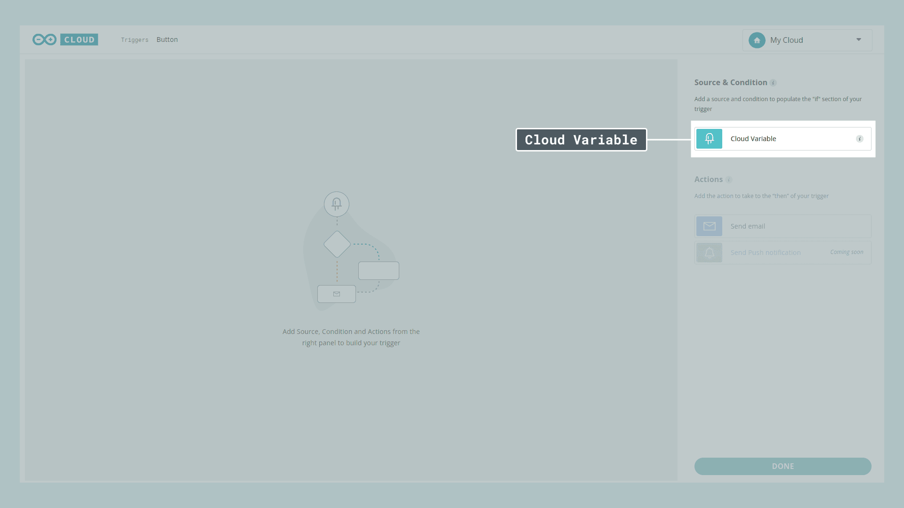
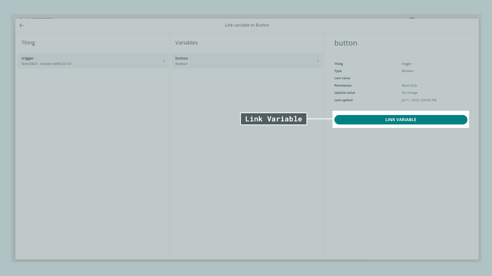
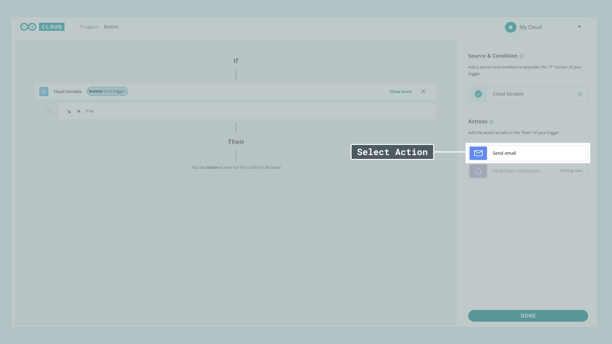
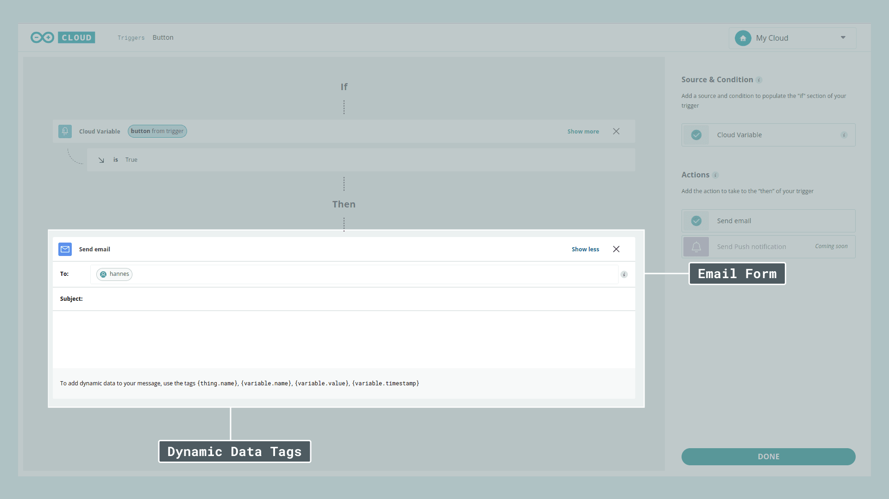
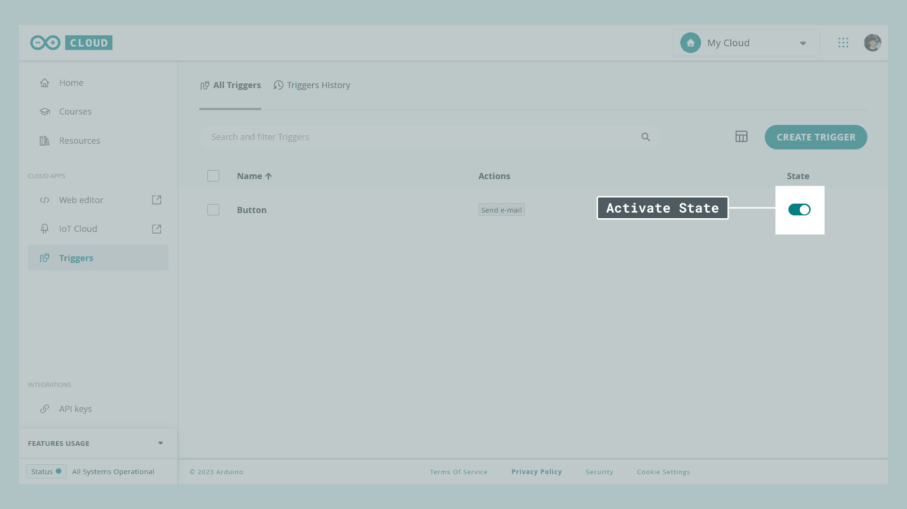

Triggers react to certain conditions inside your Arduino Cloud Thing, such as a boolean being true, or a string being assigned a value. As soon as a set condition is met a notification gets triggered and sent to you. This is useful when you monitor data and you need to know about any change as soon as it happens. This could be anything from different values in environmental monitoring or security-related information such as movement detection.

Triggers can also be used to detect **device status**, where you can configure to send an email / push notification whenever a device goes online/offline.

Triggers can be set up for any of your existing projects, and are found in the [cloud home section](https://cloud.arduino.cc/home/).

## Hardware & Software Needed

- [Arduino Cloud](https://app.arduino.cc/) (Maker plan).
- Cloud-compatible boards, [see full list](https://docs.arduino.cc/arduino-cloud/guides/overview#compatible-hardware).

***In this tutorial, we use the [Nano 33 IoT](https://store.arduino.cc/products/arduino-nano-33-iot). This is not a requirement, you can use any Arduino Cloud-compatible board for this tutorial.***

## Limitations

Currently, the only variables supported by the trigger feature are:

- Booleans
- Strings

## Setup & Configuration

***If you are unfamiliar with how to set up a Thing and variables, head on over to the [Getting Started with the Arduino Cloud](/arduino-cloud/guides/overview) article.***

**1.** Head over to the Things tab and create a new Thing, create a variable, and set up your device including a working network connection.

**2.** Upload your code to the board you want to use. For demonstration purposes, we'll use a [simple button](#example-code) sketch setting our button boolean to true each time a button connected to Pin D3 is pressed. You can of course set this up in whatever way you'd like.

**3.** Go to [Arduino Cloud home](https://cloud.arduino.cc/home/) and click on **Triggers**.
 



**4.** Click **Add Trigger**



**5.** Click **Cloud Variable**



 then select your **Thing**, your **Variable**, and finally press on **Link Variable**.



**6.** Next, select your **Action**, in our case **Email**. A new window will pop up in which we can create our personalized message, which is sent each time the trigger is activated.



You can even include **dynamic data** such as `{variable.timestamp}` or `{variable.value}` by using the tags shown at the bottom, to include variable data from your sketch in the messages sent to your email.



**7.** Once you're finished press **Done**. The final step is to turn on the **State** switch and now your trigger is ready to be used.



**8.** Try it out! Press the button and within a couple of seconds, you should receive an email telling you that the trigger has been activated showing you the message that you created in the previous step.

## Example Code

```arduino
#include "thingProperties.h"

const int btnPin = 3;

int buttonState = 0;

void setup() {
  // Initialize serial and wait for port to open:
  Serial.begin(9600);
  // This delay gives the chance to wait for a Serial Monitor without blocking if none is found
  delay(1500); 

  // Defined in thingProperties.h
  initProperties();

  // Connect to Arduino Cloud
  ArduinoCloud.begin(ArduinoIoTPreferredConnection);
  
  /*
     The following function allows you to obtain more information
     related to the state of network and Arduino Cloud connection and errors
     the higher number the more granular information you’ll get.
     The default is 0 (only errors).
     Maximum is 4
 */
  setDebugMessageLevel(2);
  ArduinoCloud.printDebugInfo();
  
  pinMode(btnPin, INPUT);
  pinMode(LED_BUILTIN, OUTPUT);
}

void loop() {
  ArduinoCloud.update();
  
  buttonState = digitalRead(btnPin);
  
  if (buttonState == HIGH) {
    digitalWrite(LED_BUILTIN, LOW);
    button = true;
  } else {
    digitalWrite(LED_BUILTIN, HIGH);
    button = false;
  }
}
```

## Use Cases

Here are some suggestions for potential projects that utilize **Triggers** in a project:

- A motion-detecting PIR, sending a notification as soon as the sensor is triggered.
- An automated plant monitoring setup sending a notification as soon as your plants need water.
- An environmental data collection setup notifying you as soon as the values reach a certain threshold.


## Summary
Triggers are a simple but extremely powerful feature allowing you to stay on track with all your Arduino Cloud projects. Instead of constantly checking your dashboards to see the newest update just create a trigger notifying you as soon as changes occur. In this tutorial, we used just **one trigger** in combination with a simple demo sketch but you can create **as many Triggers as you need** to automate your projects.