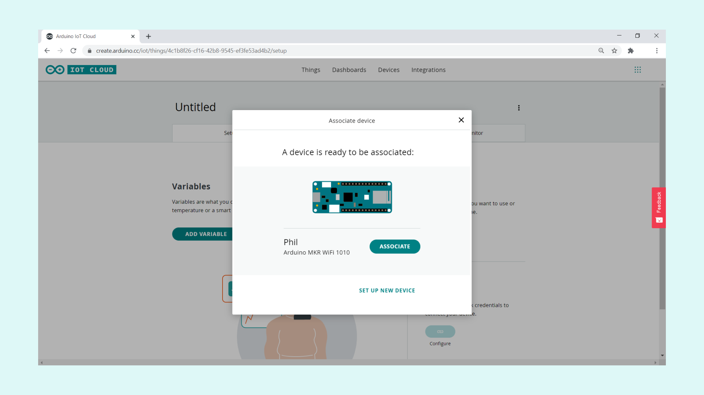
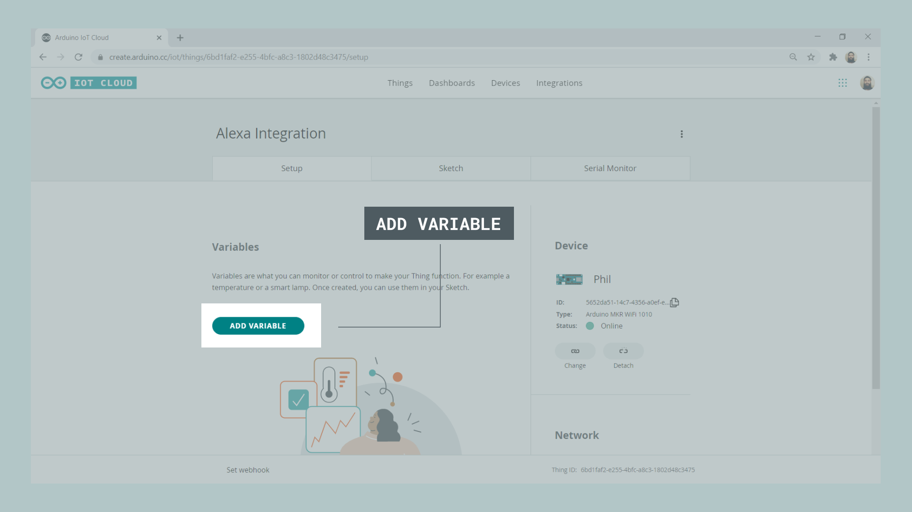
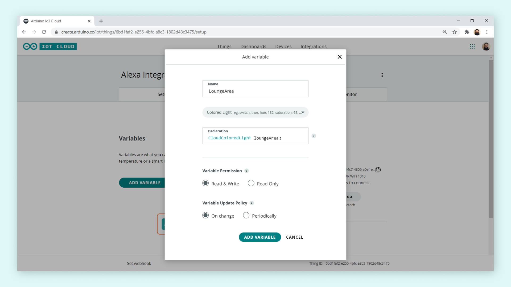
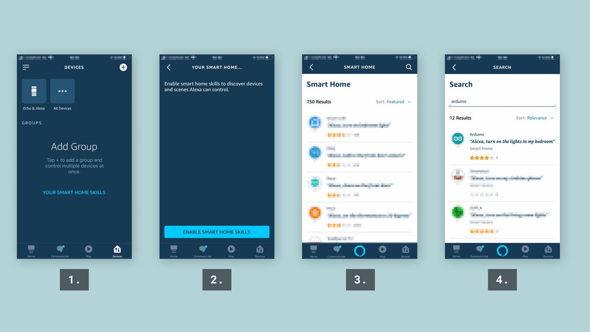

## Introduction

<iframe width="100%" height="400" src="https://www.youtube.com/embed/OMvZjwFYimo" title="YouTube video player" frameborder="0" allow="accelerometer; autoplay; clipboard-write; encrypted-media; gyroscope; picture-in-picture" allowfullscreen></iframe>

In this tutorial you will learn how to integrate the [Arduino IoT Cloud](https://create.arduino.cc/iot/) with the [Amazon Alexa skill](https://www.amazon.com/Arduino-LLC/dp/B07ZT2PK2H). At the end of this tutorial, we will be able to change the color of an  RGB matrix, using only voice commands in the Alexa app. 

This tutorial focuses on using the [MKR RGB Shield](https://store.arduino.cc/products/arduino-mkr-rgb-shield) but can easily be modified to use other matrices. 

***While this tutorial focuses on creating a smart lamp, it also shows the steps needed to integrate the two services, so you can essentially follow this tutorial to create other cool projects!***

***You can also find all variables that can be synchronized between Arduino Cloud and Alexa in the [IoT Cloud Variables guide](/arduino-cloud/getting-started/cloud-variables#alexa-variables).***

## Goals

The goals of this project are:

- Set up the Arduino IoT Cloud.
- Create a program that controls the RGB pixels.
- Install the Arduino Skill on the Alexa app.
- Sync the Arduino IoT Cloud with Alexa.

## Hardware & Software Needed

- [Arduino IoT Cloud](https://create.arduino.cc/iot/)
- [Amazon Alexa skill](https://www.amazon.com/Arduino-LLC/dp/B07ZT2PK2H)
- [Arduino MKR WiFi 1010](https://store.arduino.cc/mkr-wifi-1010).
- [MKR RGB Shield](https://store.arduino.cc/arduino-mkr-rgb-shield)

## Circuit

Simply mount the MKR RGB Shield on top of the MKR WiFi 1010.


## Step 1: Setting up the Arduino IoT Cloud

Let's start by navigating to the <a href="https://create.arduino.cc/iot/" target="_blank">Arduino IoT Cloud</a>.

>**Note:** You will need a Arduino account to use the Arduino IoT Cloud. If you do not have one, you will be directed to the account registration.

### Configure a New Device

Once we are in the Arduino IoT Cloud, we will need to click on the **"Devices"** tab. This will open a new page which will ask you to add a new device. Click on the **"Add device"** button.


You will now have an option of either configuring a new Arduino device, or a third party device. Select the **"Set up an Arduino device** option.


At this point, you will need to connect your cloud compatible board to your computer. You will also need to have installed the Arduino Create Agent. If if it is not installed, the set up wizard will ask you to install it. Your device should now show up, and you will need to click on the **"Configure"**
button. 


You will now be asked to name your device. In this case, a name was randomly generated, which is **Phil**. Click on **"Next"** to proceed.


After clicking on next, the board will start to configure. This process may take a few minutes.


Once it is done, we will be directed to the devices page, where we can see our device. Congratulations, you have just made your first device IoT ready!


### Creating a Thing and Linking Your Device

After our device is configured, we can move on to the next step: creating our very first Thing. Click on the **"Things"** tab. You should now see a button that says **"Create thing"**, which we will need to click.


We will now see an interface with multiple options. This is your Thing configuration overview. Here we can select what network we are connecting to, what device we are using and create variables that we want to sync.


Let's start by linking our freshly configured device, by clicking on the **"Select Device"** button to the right. This will open up a window, where we can **"Associate"** the board with this Thing.



### Creating the RGB variable

After our device is configured, we need to create the variable that will store the R, G, B data that will be retrieved from Alexa. Click on the **"Add Variable"** button in the Thing overview.



Name the variable **LoungeArea**, and for variable type, select the **Colored Light**. When done, click on **"Add Variable"**.



### Adding Your Network Details

Now that we have created a variable, we can configure the **network details**. This is done by clicking on the **"Configure"** button in the **"Network"** section.


>**Note:** You can't enter any network details until you have added a variable.

### Creating the Program

With all configurations done, we can move onto creating the program. By clicking on the **"Sketch"** tab, we can start editing the code right away.


First of all, we need to include two libraries called `ArduinoGraphics` and `Arduino_MKRRGB`. These will help us control the MKR RGB Shield.

We will only be adding a couple of lines inside the `setup()`, and then the functionality of the program will all be stored inside the `onLoungeAreaChange()` function. The `loop()` will remain empty.

When we later on will be connecting the cloud to Alexa, the data will be received directly from the Alexa app. Whenever the data updates, the `onLoungeAreaChange()` will execute, where it will fetch the data from Alexa (the RGB values) and display them on the RGB matrix. You can find the full code in the snippet below.

```arduino
#include <ArduinoGraphics.h>
#include <Arduino_MKRRGB.h>
#include "thingProperties.h"

void setup() {
  // Initialize serial and wait for port to open:
  Serial.begin(9600);
  // This delay gives the chance to wait for a Serial Monitor without blocking if none is found
  delay(1500);

  MATRIX.begin();
  MATRIX.brightness(10);

  while(!Serial);

  // Defined in thingProperties.h
  initProperties();

  // Connect to Arduino IoT Cloud
  ArduinoCloud.begin(ArduinoIoTPreferredConnection);

  /*
     The following function allows you to obtain more information
     related to the state of network and IoT Cloud connection and errors
     the higher number the more granular information you’ll get.
     The default is 0 (only errors).
     Maximum is 4
 */
  setDebugMessageLevel(2);
  ArduinoCloud.printDebugInfo();
}

void loop() {
  ArduinoCloud.update();
  // Your code here
}


void onLoungeAreaChange() {
  uint8_t r, g, b;
  loungeArea.getValue().getRGB(r, g, b);
  if (loungeArea.getSwitch()) {
  Serial.println("R:"+String(r)+" G:"+String(g)+ " B:"+String(b)); //prints the current R, G, B values
  MATRIX.beginDraw(); //starts a new "drawing" on the RGB shield's pixels
  MATRIX.clear(); //clears the RGB shield's pixels
  MATRIX.noStroke();
  MATRIX.fill(r, g, b); //the r, g, b values are fed into the shield's pixels
  MATRIX.rect(0, 0, MATRIX.width(), MATRIX.height()); //creates a rectangle (this covers the entire matrix)
  MATRIX.endDraw(); // ends the draw, and displays the new "drawing"

  }
  else{
  Serial.println("Lamp Off");
  //the following code simply turns everything off
  MATRIX.beginDraw();
  MATRIX.clear();
  MATRIX.noStroke();
  MATRIX.fill(0, 0, 0);
  MATRIX.rect(0, 0, MATRIX.width(), MATRIX.height());
  MATRIX.endDraw();

  }
}
```

### Uploading the Program

Upload the code in the snippet above to your MKR WiFi 1010 board. When it has successfully uploaded, go to the **"Serial Monitor"** tab to initialize the program. If the connection is successful, we should see the following:


We can now move on to the next step: **setting up Alexa.**

## Step 2: Setting up Alexa

We will now need the Amazon Alexa app which can be downloaded from the [Apple App Store](https://apps.apple.com/us/app/amazon-alexa/id944011620) or the [Google Play Store](https://play.google.com/store/apps/details?id=com.amazon.dee.app&hl=en). Once installed, login with your existing account or create a new one.

### Installing the Arduino Alexa Skill

Let's go through the steps necessary to install the Arduino Alexa Skill.



1. Once in the Amazon Alexa app, begin by tapping on "Devices".
2. Tap on the "Enable Smart home skills" button.
3. We will now see a list of featured ones, where we need to search for the right skill.
4. If we search for "Arduino" we will see a skill that has that exact name.


5. Once we have selected it, we'll need to enable it.
6. We now need to sync it with our Arduino Cloud, by logging into it.
7. Our Alexa and Arduino IoT Cloud is now synced!
8. We can now start discovering our devices!


### Amazon Alexa Devices Setup

After waiting a little bit, we should see a new screen appear, where it says **"1 light found and connected"**.

Click **"Set Up Device"**. If you like you can also add it to a group (this way you can control and organize your devices more easily), otherwise skip this part.


Congratulations! You should now be able to control the lights through your Alexa app.

## Step 3: Controlling the Lights

To control the lights on our setup, we will need to head over to the **"Devices"** tab in the Alexa app. Once in the Devices tab, click on the **"Lights"** button. We will now see the available lights. If you have other lights already connected, they will appear here as well. In our case, we only have one, which is **LoungeArea**, which is the same name as the variable we created earlier in the Arduino IoT Cloud. If we click on **LoungeArea** we will access the color / brightness control.


Any changes of color / brightness you make will be sent to our MKR WiFi 1010, which will change the pixels on the MKR RGB Shield accordingly.

### Troubleshooting

One great way of knowing if data is coming through from the Alexa app is by checking the Serial Monitor. The sketch that we uploaded to the board includes a command that prints out the value of **r, g** and **b** whenever they receive new data. If the board is successfully connecting to the cloud, it is most likely a problem on setting up the Alexa device.

## Conclusion

In this tutorial, we went through a few simple steps to integrate a MKR WiFi 1010 + MKR RGB Shield, the Arduino IoT Cloud and the Amazon Alexa app.


As a result, we now have a smart light that can be controlled directly through the Alexa app, and if you have a physical Alexa device, you can start playing around with different voice commands, such as changing the color and brightness of your lamp!

## More Tutorials

You can find more tutorials in the [Arduino IoT Cloud documentation page](/arduino-cloud/).

