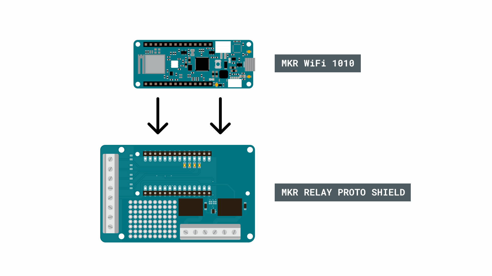
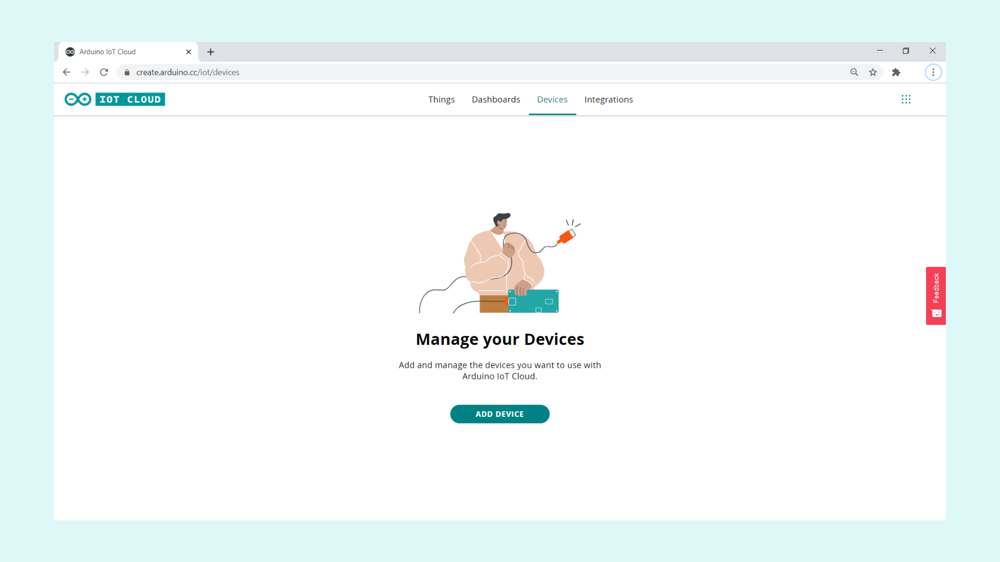
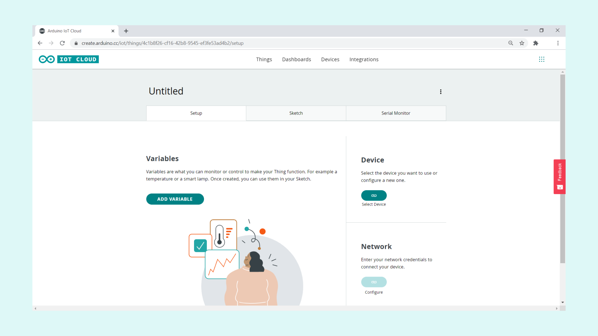
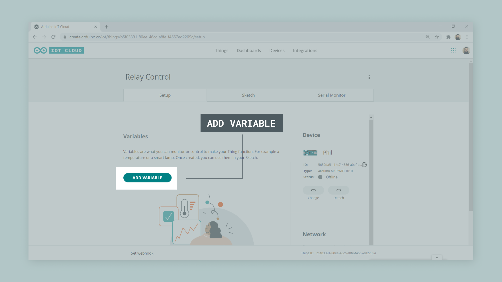
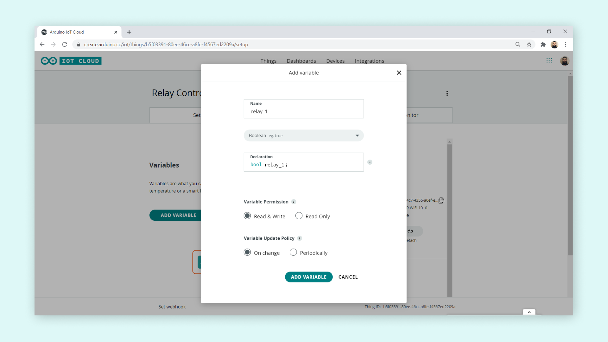
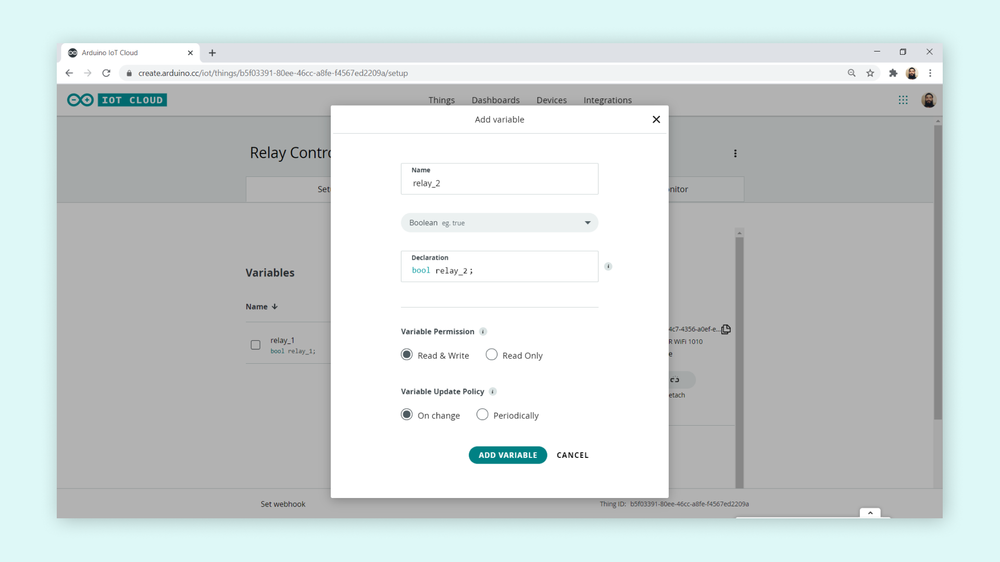
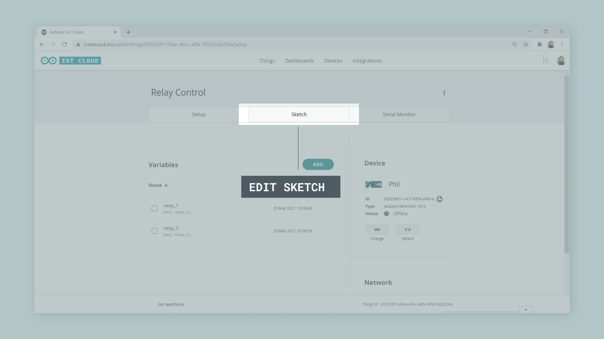
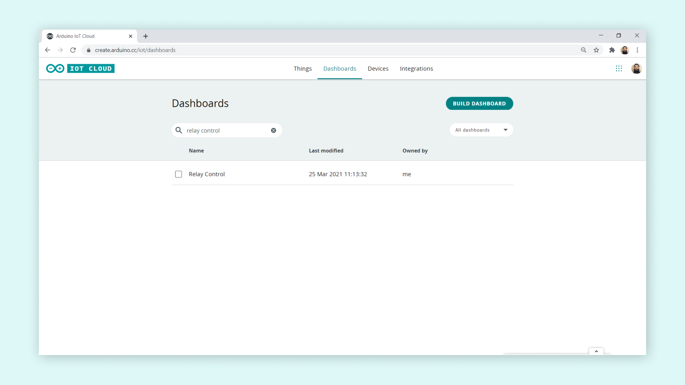
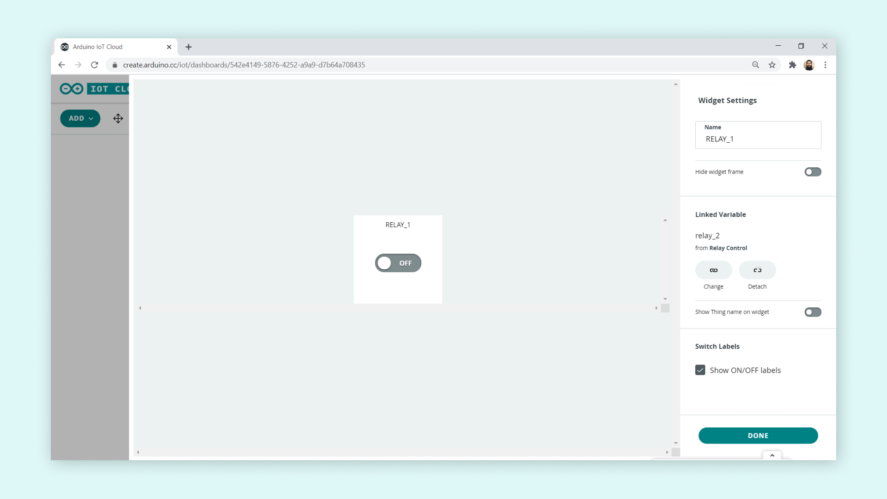
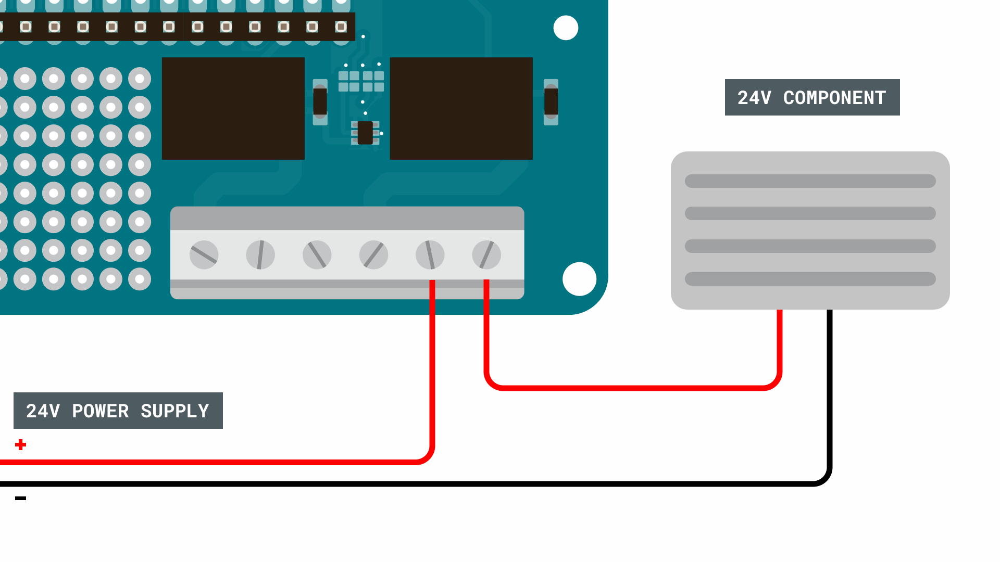

## Introduction

In this tutorial, we will go through how to control a MKR WiFi 1010 + a MKR Relay shield from the [Arduino IoT Cloud](https://create.arduino.cc/iot/things). We will create a simple configuration that allows us activate each of the relays on the shield through a dashboard in the cloud.

## Goals

The goals of this project are:

- Set up the Arduino IoT Cloud.
- Create a program that controls the relays.
- Create a dashboard to remotely control the relays.
- Use the Arduino IoT Cloud Remote app to control relays.

## Hardware & Software needed

- [Arduino IoT Cloud](https://create.arduino.cc/iot/)
- [Arduino MKR WiFi 1010](https://store.arduino.cc/mkr-wifi-1010)
- [Arduino MKR Relay Shield](https://store.arduino.cc/arduino-mkr-relay-proto-shield)
- Arduino IoT Cloud Remote app (optional). 
  - [Play Store](https://play.google.com/store/apps/details?id=cc.arduino.cloudiot&hl=en&gl=US)
  - [Apple Store](https://apps.apple.com/us/app/arduino-iot-cloud-remote/id1514358431)

## Circuit



## Step 1: Setting up the Arduino IoT Cloud

To do so, we will first need to configure our MKR 1010 device in the Arduino IoT Cloud. Let's start by navigating to the <a href="https://create.arduino.cc/iot/" target="_blank">Arduino IoT Cloud</a>. 

>**Note:** You will need a Arduino account to use the Arduino IoT Cloud. If you do not have one, you will be directed to the account registration.

### Configure a new device

Once we are in the Arduino IoT Cloud, we will need to click on the **"Devices"** tab. This will open a new page which will ask you to add a new device. Click on the **"Add device"** button.



You will now have an option of either configuring a new Arduino device, or a third party device. Select the **"Set up an Arduino device** option.


At this point, you will need to connect your cloud compatible board to your computer. You will also need to have installed the Arduino Create Agent. If if it is not installed, the set up wizard will ask you to install it. Your device should now show up, and you will need to click on the **"Configure"**
button. 


You will now be asked to name your device. In this case, a name was randomly generated, which is **Phil**. Click on **"Next"** to proceed.


After clicking on next, the board will start to configure. This process may take a few minutes. 


Once it is done, we will be directed to the devices page, where we can see our device. Congratulations, you have just made your first device IoT ready!


### Creating a Thing and linking your device

After our device is configured, we can move on to the next step: creating our very first Thing. Click on the **"Things"** tab. You should now see a button that says **"Create thing"**, which we will need to click.


We will now see an interface with multiple options. This is your Thing configuration overview. Here we can select what network we are connecting to, what device we are using and create variables that we want to sync.



Let's start by linking our freshly configured device, by clicking on the **"Select Device"** button to the right. This will open up a window, where we can **"Associate"** the board with this Thing.


### Creating variables

Now, we can continue to create **variables** for our Thing. These variables will be synced with the cloud, as long as the board is connected to Internet and the cloud.

For this application, we will create two **boolean** variables: one for each relay on the MKR Relay Shield.

To create a new variable, click on the **"Add Variable"** button.



Let's name it **relay_1**, and select the **boolean** data type. Then click on **"Add Variable"**.



Let's add another variable, but let's name this one **relay_2**, which is also a boolean variable.



Great, now we have two **boolean variables** named **relay_1** and **relay_2**. 

### Adding your network details

Now that we have created the variables, we can configure the **network details**. This is done by clicking on the **"Configure"** button in the **"Network"** section.


>**Note:** You can't enter any network details until you have added a variable.


### Over the Air Uploads

Did you know that the Arduino IoT Cloud supports over the air uploads? When you've uploaded a sketch to your board once, it will become available for you to upload a new sketch to the board without connecting it to your computer!

***Over the Air uploads requires an Entry plan to the Arduino IoT Cloud***

To use this feature, make sure the board has power. If your project is already sitting somewhere in your house, as long as it's powered on, you should be able to upload to it. navigate to the Things sketch tab in the Arduino IoT Cloud interface, and you should see it being discovered just as if it was connected via USB.

### Creating the program

Once we are finished with all the configurations, we can move on to creating the sketch that we are going to upload to our MKR WiFi 1010. To do so, we first need to go to the **"Sketch"** tab.



The sketch we are going to create is very simple. As most of the code is already generated through the configurations we made, we only need to make a few additions: configuring the relay pins as output, and creating two conditionals. 

You can find the full sketch below, which we need to upload to our board. 

```arduino
#include "thingProperties.h"

void setup() {
  // Initialize serial and wait for port to open:
  Serial.begin(9600);
  // This delay gives the chance to wait for a Serial Monitor without blocking if none is found
  delay(1500); 
  
  pinMode(1, OUTPUT);
  pinMode(2, OUTPUT);
  
  // Defined in thingProperties.h
  initProperties();

  // Connect to Arduino IoT Cloud
  ArduinoCloud.begin(ArduinoIoTPreferredConnection);
  
  /*
     The following function allows you to obtain more information
     related to the state of network and IoT Cloud connection and errors
     the higher number the more granular information you’ll get.
     The default is 0 (only errors).
     Maximum is 4
 */
  setDebugMessageLevel(2);
  ArduinoCloud.printDebugInfo();
}

void loop() {
  ArduinoCloud.update();
  // Your code here 
  
}

void onRelay1Change() {
  // Do something
  if(relay_1){
    digitalWrite(1, LOW);
  }
  else{
    digitalWrite(1, HIGH);
  }
}

void onRelay2Change() {
  // Do something
    if(relay_2){
    digitalWrite(2, LOW);
  }
  else{
    digitalWrite(2, HIGH);
  }
}
```

## Step 2: Creating a dashboard

After our code has been successfully uploaded to our board, we we will need to create a dashboard to control our relays!

Head over to the **"Dashboards"** tab, and click on **"Build Dashboard"**.



We can now see an empty dashboard. Let's click on the **"Add"** button, and select a **Switch** widget.


Now, we need to link it with our **relay_1** variable, inside our Thing.


We also need to rename the widget so we know which one is which. We choose **"RELAY_1"**.



Now, repeat the same process, but instead link it to the **relay_2** variable. At the end, we should have two widgets, each linked to a relay.


Now you can simply test it out by turning ON or OFF the switches. You should hear the relays on your **MKR Relay Shield** making clicking noises. That means it is working! 

## Step 3: Connecting a component with higher voltage

>**Note:** Working with higher voltage components should be done with extreme caution. Do not alter the circuit while it is connected to a higher power source, and do not connect any high voltage components directly to the Arduino. 

Up until now, we have simply activated the relays, but we still haven't connected anything to them. While we are not going to go in-depth on how to connect high power components, we can take a look at how we could connect something that operates on maximum 24V.

Let's begin with the high power pins on the MKR Relay Shield. There are **six in total** for both relays, where there are three different type of connections: NO, COM and NC. 


In this scenario, we are going to use the **NC** configuration, which means that writing a **LOW** signal to the relay will connect the NC pin to COM, which provides power to the component connected. The circuit for this could look like this:



In this circuit, we are using a 24V power supply and a 24V heater. To control them, we need to use the following commands:

To activate the relays:

```
digitalWrite(relay_1, LOW)
```

To de-activate the relays:

```
digitalWrite(relay_1, HIGH)
```

>**Note:** Use extreme caution when creating higher power circuits. Make sure that both the power supply and the component does not exceed 24V. For example, connecting it straight to a wall socket without a power converter would supply 220-240V, which is **10 times as high.**

## Conclusion

In this tutorial, we have gone through the necessary steps to connect a MKR WiFi 1010 + a MKR Relay Shield to the Arduino IoT Cloud. The relays can now be used to trigger higher voltage components, such as smaller heaters, fans or light bulbs. 

### More tutorials

You can find more tutorials in the [Arduino IoT Cloud documentation page](/arduino-cloud/).