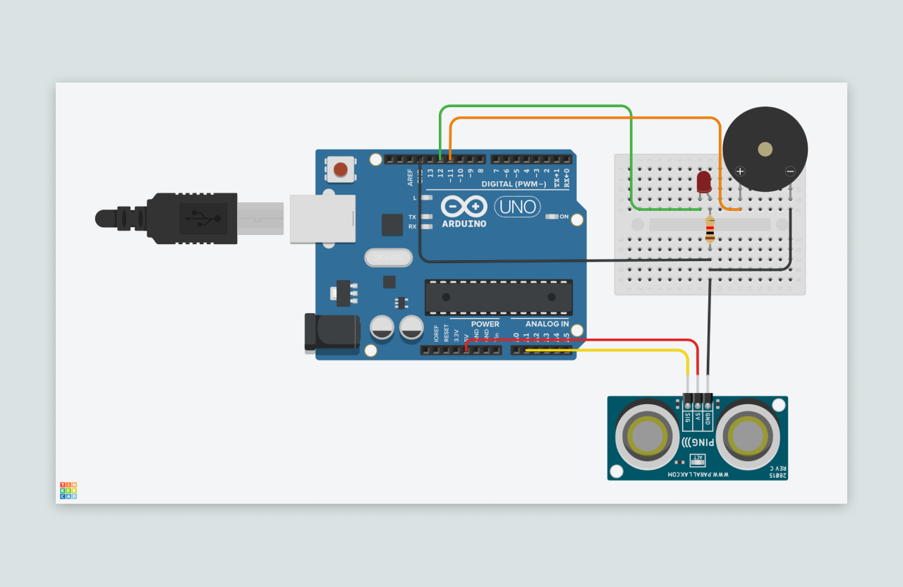
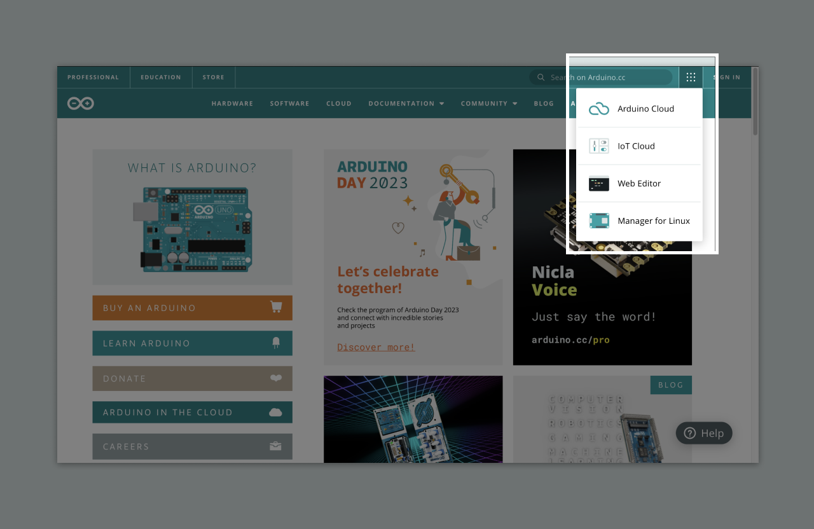
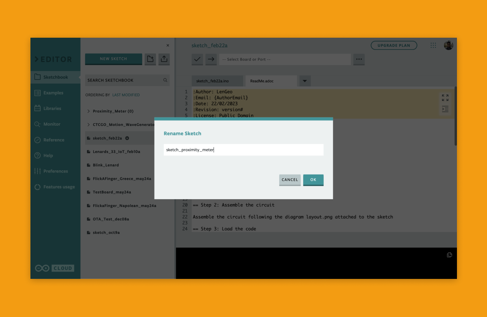
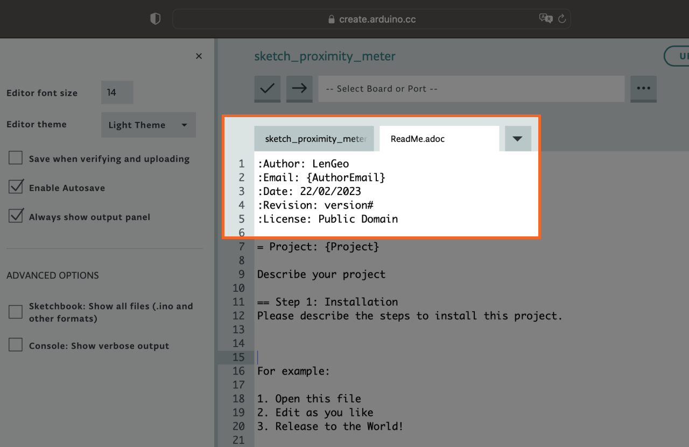
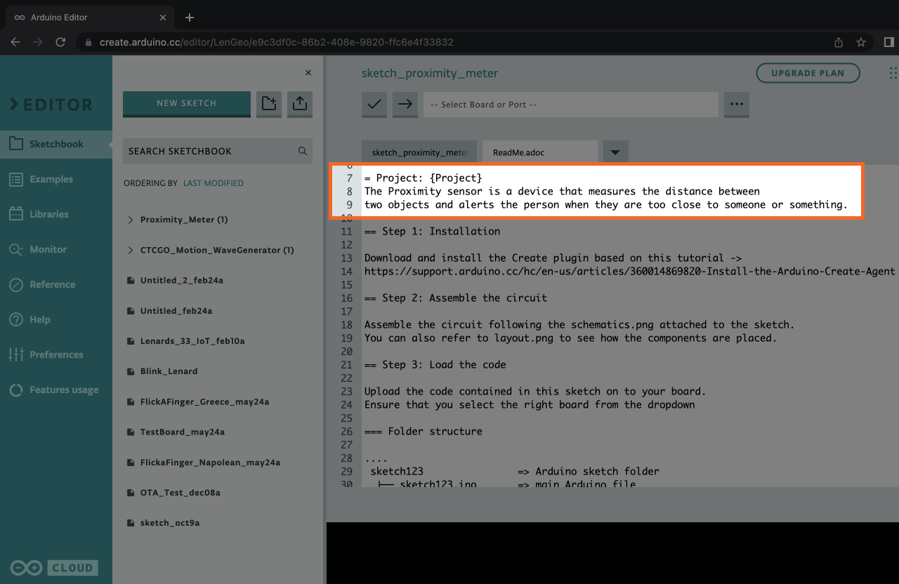
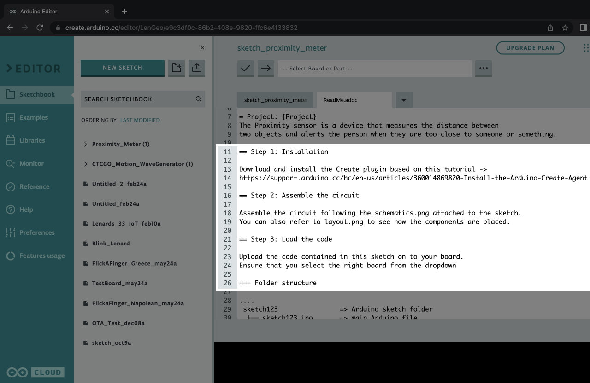
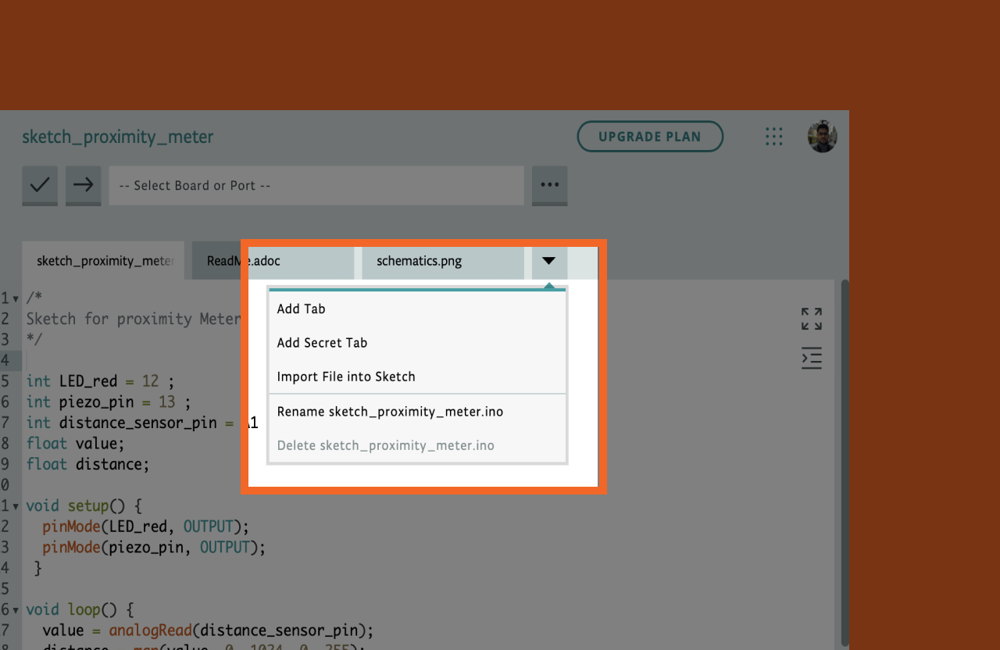
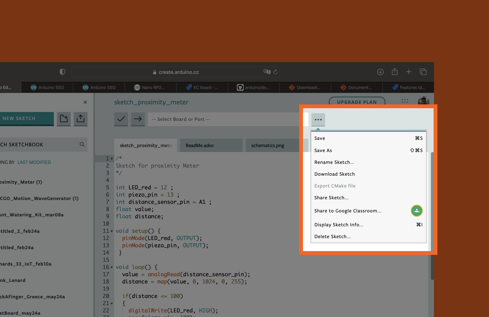

## Introduction 

Many of you might have interesting ideas for your projects but struggle with documentation and sharing it with your class. In this article, you will learn how to use the Arduino Web Editor to document a project. We will illustrate the process with an example project.

***Note: We recommend that you read the article (Getting started with the Web Editor)(/getting-started/getting-started-web-editor) before you proceed with this tutorial.***

## The Essentials 
Every arduino project has 3 essential elements that will make your teaching effortless. These are
* Circuit diagrams 
* Sketch Files 
* Picture of your project 

### 1. Create a circuit diagram
Start by thinking about the layout of your circuit. It could be as basic as a pen on paper but a higher-fidelity sketch might make it easier for your students to understand how to connect the components. 

For this tutorial we created a circuit of the proximity meter using [tinkercad](https://www.tinkercad.com/circuits).



### 2. Connect the components 
Once you have created the components, it's good to connect the components to ensure all connections are correct. Sometimes it's also good to support your document with photos of your connections. Here's a picture of the circuit. This gives your students a good visual sense of how the circuit looks in real life.


### 3. Open a new sketch.
Open the Web Editor by clicking on the  icon in the header. 



When your editor is ready, create a new sketch by clicking  and rename the sketch to the name of your project. 



### 4. Write your sketch. 
Write your sketch or copy-paste your sketch from another project. For easy readability ensure that
* Adding comments to describe important statements 
* Assigning good variable names 
* Inundating the code 

Here's the example sketch of the Proximity Meter project for your reference.  

<div class="sketch-iframe" data-src="https://create.arduino.cc/editor/ArduinoEdu/e833b75d-5989-4049-aec4-a2472303415d/preview?embed&snippet=L73-L77&hideNumbers&height=120#L73-L77"></div>

## Documenting your Project 
To use the project, students must be able to clearly understand the goals of the project and they should go through each step of creating it. The Web Editor comes with a ReadMe.adoc file attached to the sketch. Here you can document all the instructions required. The template comes with these sections:
* Credits
* Project description
* Instructions 
* Troubleshooting tips

### 5. Fill in your credits.
The first part of the ReadMe are credits where you can fill in your personal details. Students can use this section to reach out to you if needed. 

``` arduino
:Author: LenGeo
:Email: {AuthorEmail}
:Date: 22/02/2023
:Revision: version#
:License: Public Domain
´´´


***Note: License is something you don’t have to be concerned with unless you want to share your project on the internet.***

### 6. Describe your project
Give a short description of the project. In this example we will describe what the Proximity Meter is going to do. 



### 7. Provide instructions 
Briefly describe what you intend your students to do with this project. Make sure you provide all details from installing the plugins to uploading the code to the board. 



Note- Most students would be new to the web editor and they wouldn’t have the webeditor installed. Copy paste this link if would like to https://docs.arduino.cc/arduino-cloud/getting-started/getting-started-web-editor

### 8. Other Details
The rest of the document can be ignored as it's intended to be used by the readers of your documentation. If you want, you can add some troubleshooting tips that address common errors and 

## Share it with your class
Once you have finished creating the essential components of your project, you can upload the files and share it with the rest of your class. 

### 9. Import your files 
Keeping your files organised is important. You can import the circuit diagram and the photo of your project from the dropdown next to the sketch. 



### 10. Share the URL 
After you have imported all your files, your project is ready to be shared with your class. You can do this through the Share feature of the Web Editor.



 


