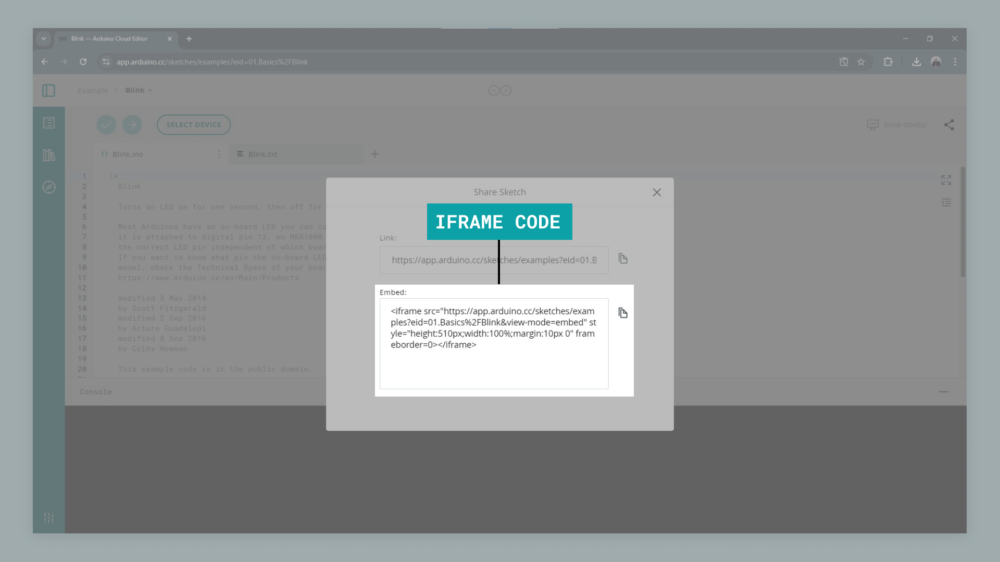

The Cloud Editor is a great tool for creating and uploading programs while also collecting all of your sketches in one place. Another great feature is embedding them as iframes, such as articles, blogposts or journals.

To embed an iframe is very easy, and we just need to copy and paste a link from our sketch in the Cloud Editor. But we can also do a series of modifications to that iframe, and in this tutorial we will take a look at how to do that.

## Let's start

First of all, we need to navigate to the [Cloud Editor](https://create.arduino.cc/editor). If we do not have an account, we can register one with just a few simple steps.

Then, we need to have a code. In this tutorial, we are just going to use the good old **blink** example. When we have our sketch ready, click on the **share** button next to the serial monitor tool. This will open up a new window, that will have two fields: **link** and **embed**. Copy the embed field.



It should look something like this:

```markup
<iframe src="https://app.arduino.cc/sketches/examples?eid=01.Basics%2FBlink&view-mode=embed" style="height:510px;width:100%;margin:10px 0" frameborder=0></iframe>
```

This iframe can now simply be embedded in a HTML page, and it will look like this:

<iframe src="https://app.arduino.cc/sketches/examples?eid=01.Basics%2FBlink&view-mode=embed" style="height:510px;width:100%;margin:10px 0" frameborder="0"></iframe>

But there are many ways we can modify the iframe to look different. So let's take a look the available modifications we can make!

## Creating a snippet

First up is the easiest: making a simple snippet. This removes the other information, such as sketch name and author, and simply presents a good looking snippet!

To do this, we just need to add the following code to the end of the URL:

```
&snippet
```
The result is the following:

<iframe src="https://app.arduino.cc/sketches/examples?eid=01.Basics%2FBlink&view-mode=embed&snippet" style="height:510px;width:100%;margin:10px 0" frameborder="0"></iframe>

And the full URL should look like this:

```markup
<iframe src="https://app.arduino.cc/sketches/examples?eid=01.Basics%2FBlink&view-mode=embed&snippet" style="height:510px;width:100%;margin:10px 0" frameborder=0></iframe>
```


## Highlighting specific lines

Next is the highlighting feature. To use this, simply add the following lines to the end of your URL:

```
&snippet#L3-L4
```

The result is that line 3 and 4 are highlighted:

<iframe src="https://app.arduino.cc/sketches/examples?eid=01.Basics%2FBlink&view-mode=embed&snippet#L3-L4" style="height:510px;width:100%;margin:10px 0" frameborder="0"></iframe>

And the full URL should look like this:

```markup
<iframe src="https://app.arduino.cc/sketches/examples?eid=01.Basics%2FBlink&view-mode=embed&snippet#L3-L4" style="height:510px;width:100%;margin:10px 0" frameborder=0></iframe>
```

You can highlight as many lines as you want, and it is easily configurable. For example, if we want to highlight line 1, 3 and 5-8, we simply need to add the following to the URL:

```
&snippet#L1,L3,L5-L8
```

## Manually changing the size of your widget

If we want to change the size of the widget, we just need to modify the dimensions of the iframe.

The following dimensions are default:

```markup
style="height:510px;width:100%;margin:10px 0"
```

But we can change them up a bit:

```
style="height:200px;width:50%;margin:10px 0"
```

Which will look like this:

<iframe src="https://app.arduino.cc/sketches/examples?eid=01.Basics%2FBlink&view-mode=embed&snippet" style="height:200px;width:50%;margin:10px 0" frameborder="0"></iframe>

## Automatically re-sizing your sketches

We can also choose to automatically re-size our iframes. This is simply done by first including this script in your HTML file:

```markup
<script src="https://content.arduino.cc/assets/arduinoSketchIframeResizer.js"></script>
```

And then using the class `arduino-sketch-iframe` in your HTML element.

## Summary

There are several cool ways of working with iframes from the Cloud Editor, and it is a really easy process that requires very little coding.

The Cloud Editor helps you keep track on all of your sketches, and with the iframes, including your projects on other pages has never been easier.

### More tutorials

You can find more tutorials in the [Arduino Cloud documentation page](/arduino-cloud).