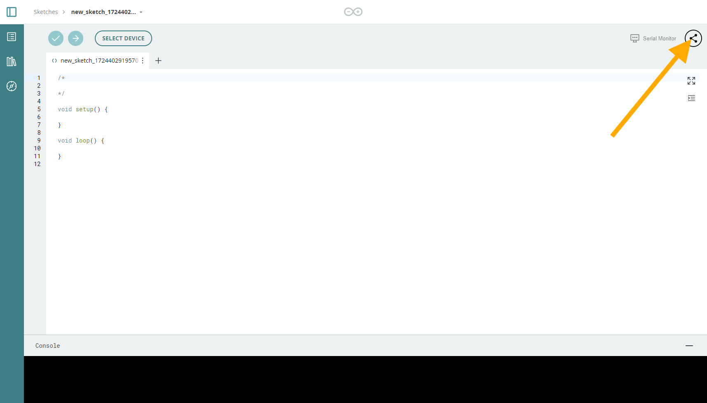
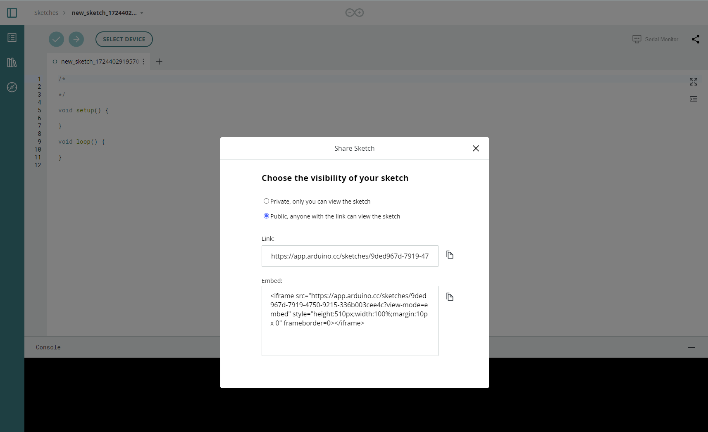
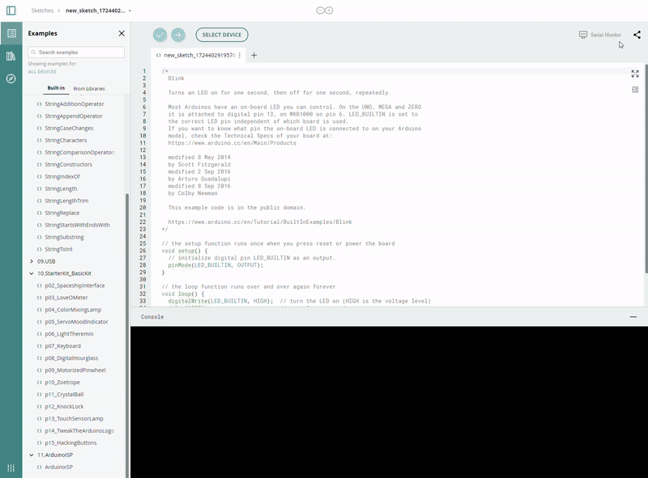
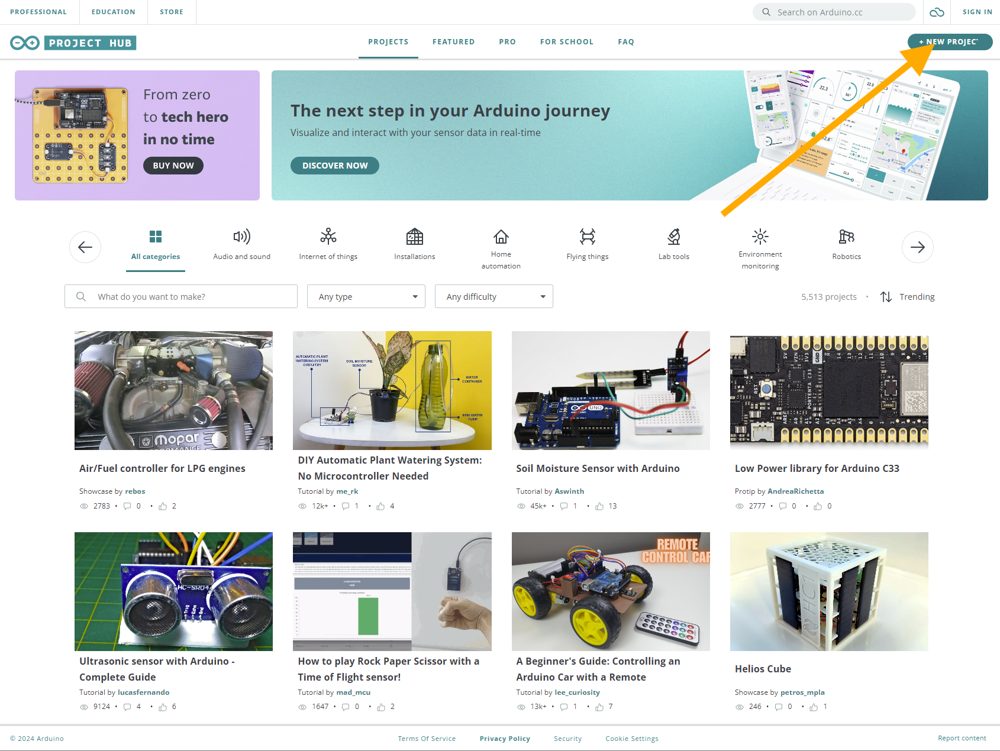
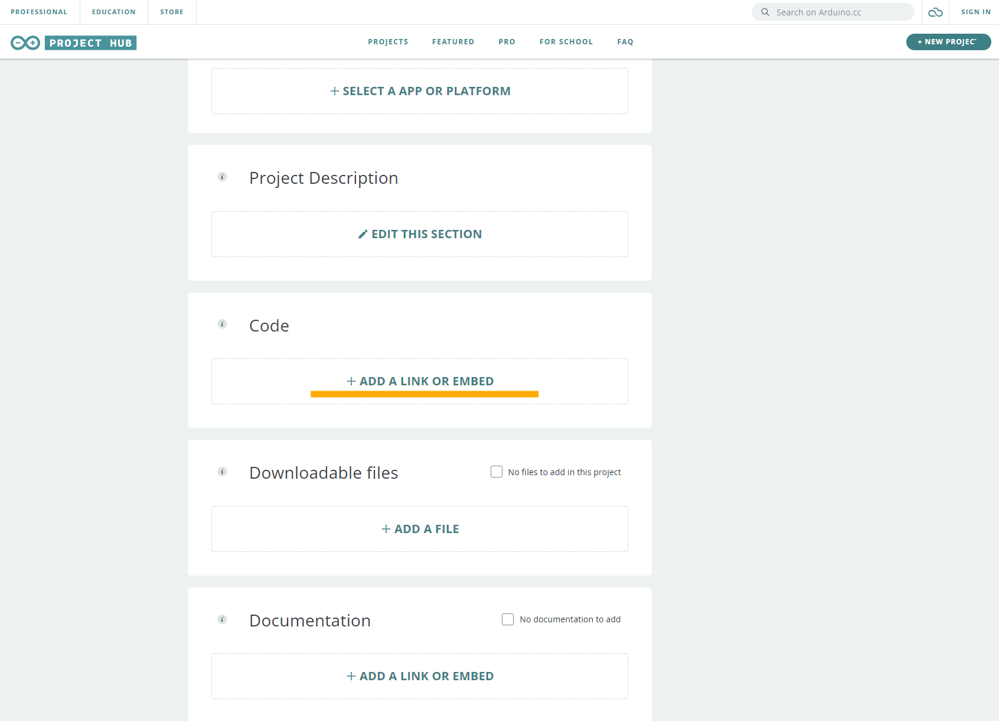
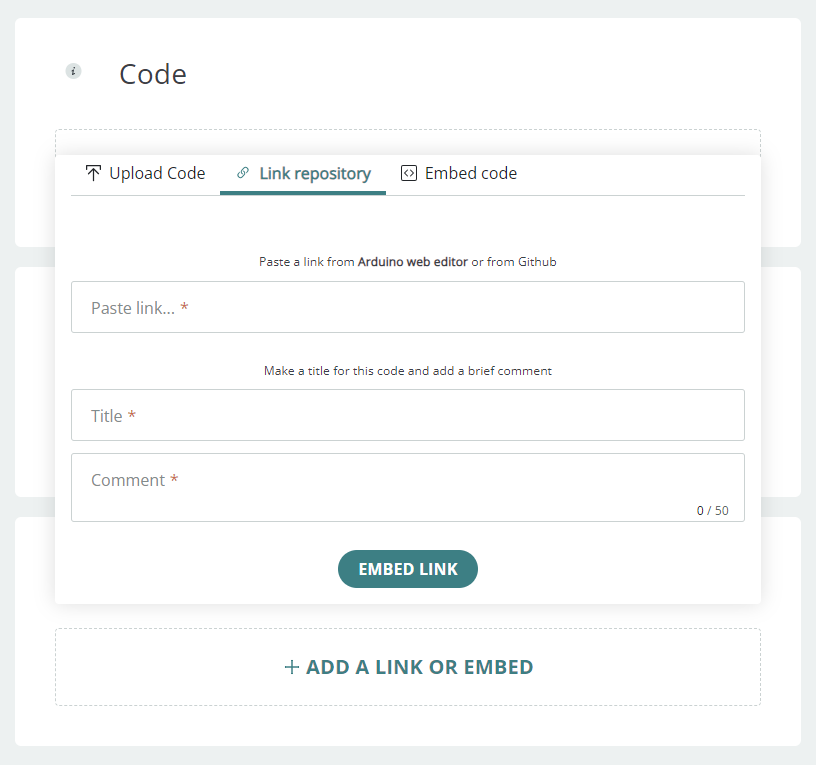
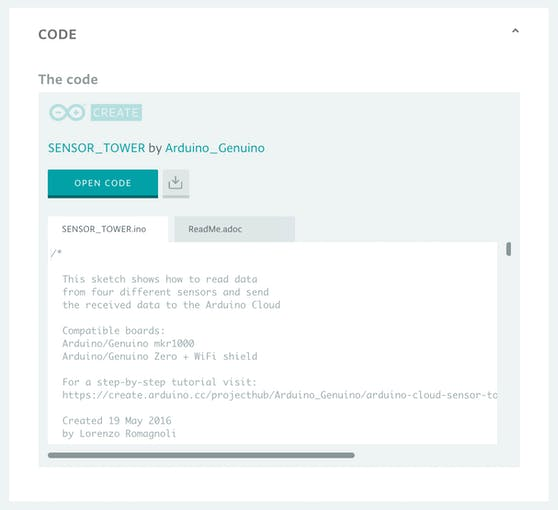
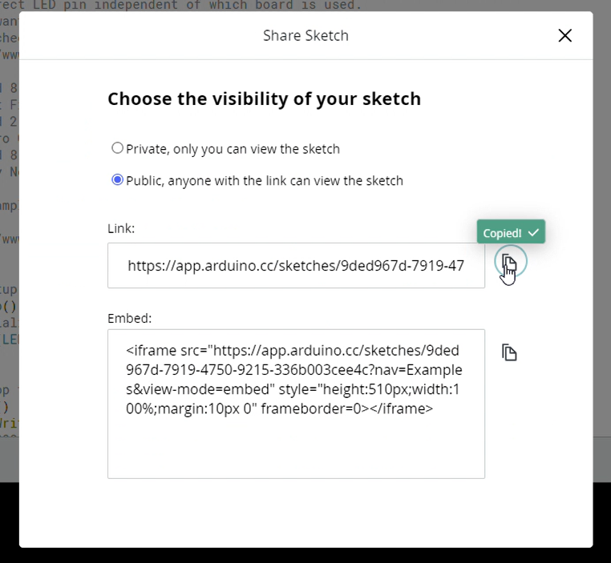
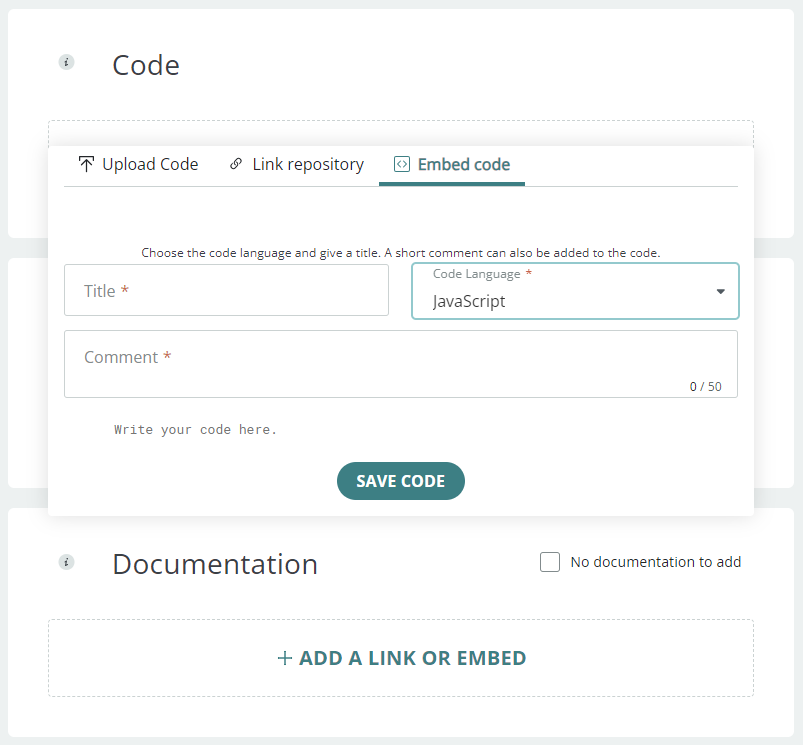

## Share Your Sketches on the Arduino Cloud editor

The [Arduino Cloud editor](https://create.arduino.cc/editor) is the online IDE developed by the Arduino team, this web app is part of the [Arduino Cloud platform](https://cloud.arduino.cc/home/). If you are new to it you can learn all about it on this [Getting Started tutorial](/arduino-cloud/getting-started/getting-started-web-editor).

The Arduino sketch is the unit that can include everything you need to bring an idea to life. With the **Share feature** of the Cloud editor you can simply give someone access to your sketches just by sending them a URL, or by embedding the sketch into a webpage or in a Project Hub tutorial.

When someone [shares a sketch with you](https://create.arduino.cc/editor/Arduino_Genuino/a5cf7fad-0802-49b6-81ce-2a5bf41bed5d/preview), you’ll have access both to the code, the layout for the electronics, and the full tutorial (when available). This will allow you to have all the necessary information to build on top of the original project, making it your own. Keep on reading and discover how to do it!

## How to Share Your Sketch

* If you don’t have one yet, create your brand new Arduino account [here](https://id.arduino.cc/auth/signup).
  
* Log in on Arduino the Cloud editor [here](https://create.arduino.cc/editor/).
  
* Once you are successfully logged in the Cloud editor, hit the ‘New Sketch’ button and code on
  
* When done with writing your sketch, click the **‘Share’** button on the toolbar in the editor area. Press the **Copy** icon on the link and you can now share your Arduino code with the rest of the world!

We will now show you three ways to do so.

### 1. Add Your Sketch to a Project Hub Tutorial

Embed your sketch and share it on Project Hub is super easy! Simply create a new project.

Once you are done with the Story and the previous fields go to the Software tab. In the ‘Code’ section, click on **Add a link or embed**.

Give your sketch a title, add some comments and finally copy here the sketch public URL you got previously on the Cloud editor. That’s it! Your sketch is now available here and it will always be up-to-date with your latest edits. It will look like this on your tutorial page:

### 2. Share Your Sketch via a Public URL

In the [Arduino Cloud editor](https://create.arduino.cc/editor) hit the **‘Share’** button, a popup window will be displayed. Click **‘Copy link’** to copy your sketch’s public URL on your clipboard. When you paste this URL in a new tab of your browser you will see a preview of your sketch. You won't even need to be logged in with an Arduino account, so anybody can access it.

The people you shared you sketch with can now download it or add it to their sketchbook (after having signed up to the Arduino Cloud editor of course). If you have embedded [your sketch](https://create.arduino.cc/editor/Arduino_Genuino/a5cf7fad-0802-49b6-81ce-2a5bf41bed5d/preview) in a Project Hub tutorial you will see the ‘Open Tutorial’ button displayed to this page as well.

When you share a sketch with all these supporting contents (layout, schematics, tutorial...) with a friend, a colleague or in your classroom, they will have everything needed to build up from your idea and make it their own!

### 3. Embed Your Sketch on a Web Page

In the same Share popup window you can also copy your project’s related iFrame and paste it into your HTML page. You will also be able to edit its size and format in order to fit with your page design by editing the iFrame attributes.

## Always Up-To-Date!

Now your code is ready to be shared across a variety of platforms! Do you know what’s cool about this feature? Now that your sketch is on the Cloud (literally!) once edited on the Cloud editor, it will be also updated across all the places where you have embedded it!

### More tutorials

You can find more tutorials in the [Arduino Cloud documentation page](/arduino-cloud).