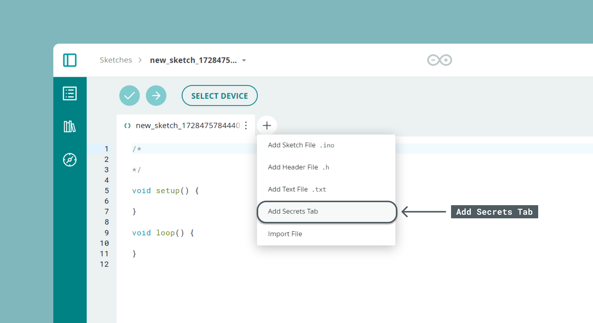
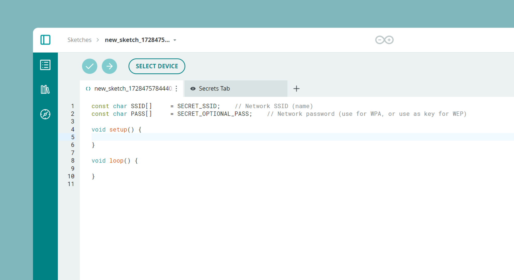
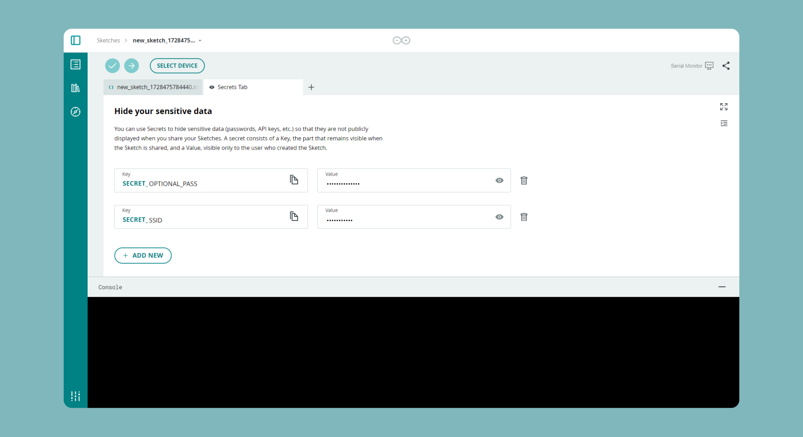

Often in your sketch, there is some sensitive data that you’d like to keep private, which could accidentally become public when published on GitHub or when you [share your sketch with someone else via URL](content/arduino-cloud/04.cloud-editor/embedding-create-iframes/embedding-create-iframes.md). This sensitive information may include Wi-Fi network names and passwords, API key, and so on. But now, you can add a secret tab to your sketch and store your private data there.

This feature has been designed specifically for the [Arduino Cloud Editor](https://app.arduino.cc). If you have yet to try it, follow [Getting Started with Arduino Cloud](https://docs.arduino.cc/arduino-cloud/guides/overview/) — all you need is an Arduino ID.

## How it works

Basically every time you type `SECRET_SOMETHING` in your sketch and save it, we will create a Secret tab for you to fill out.

## How to Add Secret Values to Your Own Sketch

Write your sketch as you would normally. Then click on the plus icon next to your sketch name and click on "Add Secrets Tab".

In your sketch, replace the strings containing sensitive data by writing `SECRET_NAMEYOUWANT`. For instance, if your string is `"ssid`, you should replace it with `SECRET_SSID`. **Make sure all these identifiers are in caps.**

A new page will appear where you can enter your secret keys.

That's it! If you share this sketch with someone via URL or if you download it, the values on the tab will be blank.

## Adding an extra optional field

If you look at the examples above you notice we've also added a `SECRET_OPTIONAL_PASS`. This is used to store optional information e.g. a password that might be needed to connect to the Wi-Fi®.

You can add it in the same fashion as the `SECRET_SSID` and add the `OPTIONAL` to it.

## Download the sketch

If you download a sketch, we will automatically create a file called arduino_secrets.h and add it to the .zip file. If you open the sketch with the Desktop IDE, you will be able to fill up this tab with your secrets as usual.

## Tech Details

All the values you enter will be considered strings.

The secrets are stored as plain text values, and will only be available when the user logs in to his/her account and looks at their own sketches in their personal sketchbooks.

You will be able to delete the Secret tab simply by removing the `SECRET_XX` identifiers from the .ino file.

### More tutorials

You can find more tutorials in the [Arduino Cloud documentation page](/arduino-cloud).