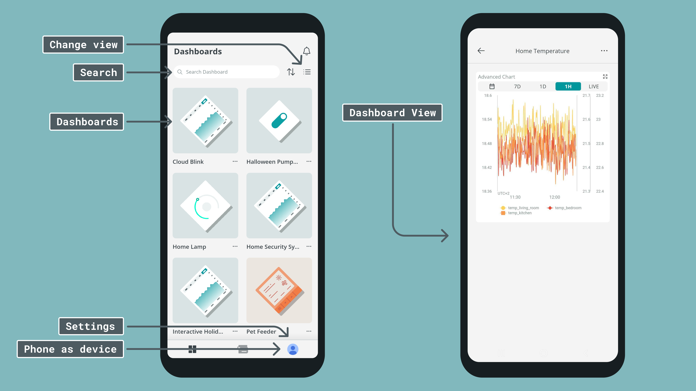
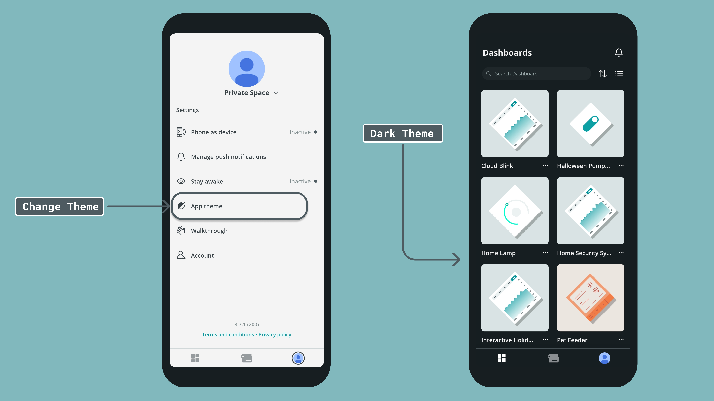
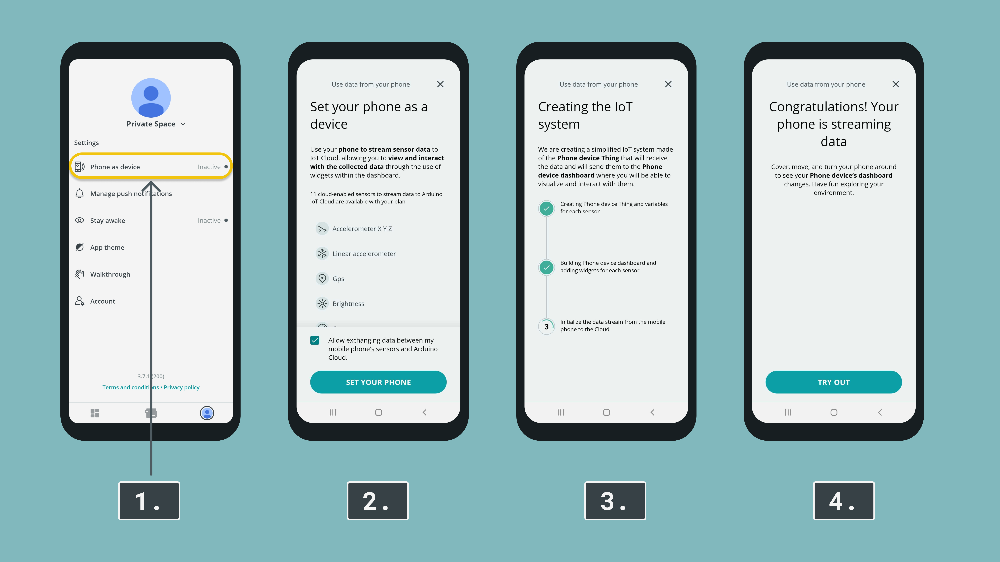
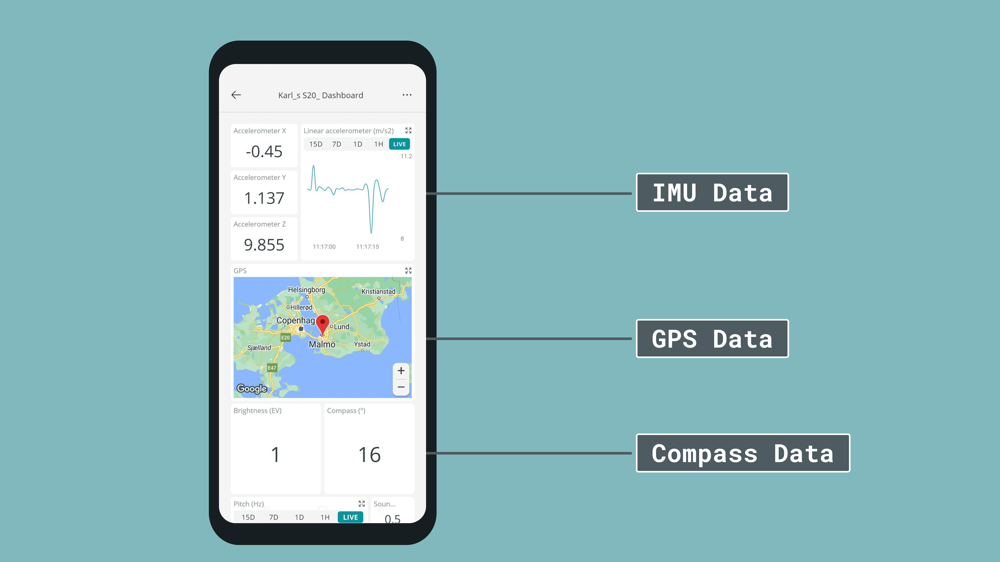
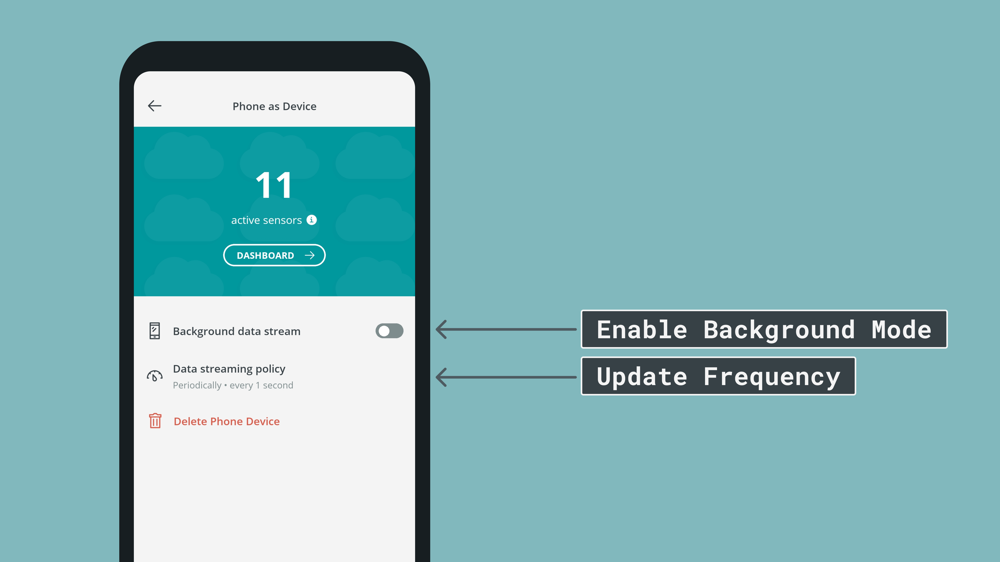
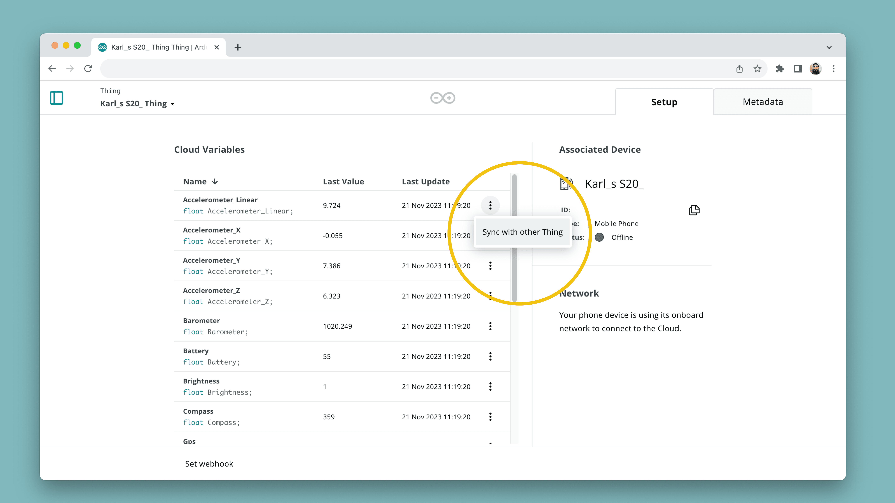

The **Arduino IoT Remote** phone application lets you control and monitor all of your dashboards in the [Arduino Cloud](https://app.arduino.cc/). With the app, you can also access your phone's internal sensors such as GPS data, light sensor, IMU and more (depending on what phone you have).

The phone's sensor data is automatically stored in cloud variables, which you can also synchronize with other Things. This means your phone can become a part of your IoT system, acting as another node in your network.

***The Arduino IoT Remote app now supports data collection in background mode. This can be enabled inside the app. Please note that your microphone is NEVER used in background mode, only when the app is being used directly. See more in the [Background Mode](#background-mode) section***

## Hardware & Software Needed

- Android / iOS smart phone.
- Arduino account (sign up [here](https://login.arduino.cc/login)).
- Arduino IoT Remote App:
  - [App Store](https://apps.apple.com/us/app/arduino-iot-cloud-remote/id1514358431).
  - [Google Play](https://play.google.com/store/apps/details?id=cc.arduino.cloudiot).

## Install App

To use the Arduino IoT Remote app, visit Google Play / App Store and search for **"Arduino IoT Remote"**. Links are available just above.

***NOTE: The IoT Remote app requires iOS 12.4 or later for iOS the version. If you are using Android, version 8.0 or later is required. Make sure the iOS or Android version on your device is up to date before downloading the app.***

After installing the app, you will need to log in to your Arduino account. If you do not have one, you can [sign up here](https://login.arduino.cc/login).

After you login, you will discover all of your dashboards (if you have any), in the main menu. 

## Themes

You can change between the default (light) to the dark theme, by navigating to **Settings > App theme**.

## Access Phone Sensor Data

To access phone sensor data, go to the **"Settings"** menu, located at the top right corner. Inside the settings, click on the **"Phone as Device"**. 

This will start an configuration process, as seen in the image below. Complete the process to access your phone's sensor data.

Upon completion, head over to the new dashboard, that should contain your name + your phone's name (in this case, it is `Karl_s S20_Dashboard`). Here you can view your phone's data in real time, such as:
- GPS coordinates (location on map)
- Accelerometer data
- Compass

For a more in depth guide on how to set this up, and how to use it to control your other devices, head over to the full [Phone Sensor Data Guide](/arduino-cloud/iot-remote-app/iot-remote-phone-sensors).

***When setting up your phone as a device, a Thing with a similar name is created in the Arduino Cloud. It can not be programmed as a regular device.***

### Background Mode

Now that you've got access to your phone's data, you can also enable the **background mode**. This will allow your phone to continue streaming data to the cloud, even though the app is not being used.

The exception is your microphone, this one is always disabled in background mode, for data privacy reasons.

To enable it, go to the settings menu (top left corner), and flick the switch next to **"Background data stream"**.

Here you can also choose the update frequency, (either on change, or every `x` seconds).

## Phone & Board Sync

The sensor data from your phone is tracked through **variables** in the Arduino Cloud, and can therefore be synchronized with other variables.

Head over to the [Arduino Cloud - Things](https://app.arduino.cc/things) and go to the Thing created for your phone (in this case, it is named `Karl_s S20_ Thing`), and select a variable you want to synchronize. In the following menu you can link it to other variables on other Things.
 

Simply described, this allows you to use your phone as an input for a number of different applications. For example, the `Compass` variable can be used to control the angle of a servo motor on another device. You can read more about how to synchronize these variables in the [Use Sensor Data From Your Phone](/arduino-cloud/iot-remote-app/iot-remote-phone-sensors) tutorial, that includes a practical example.