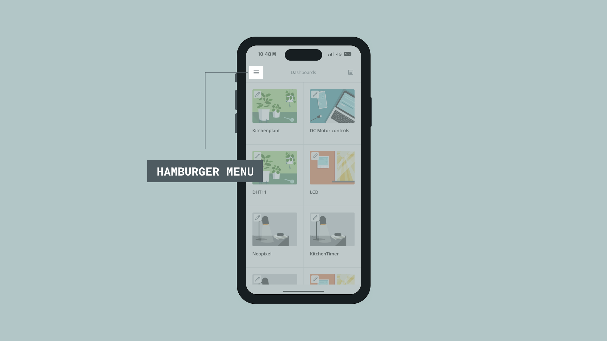
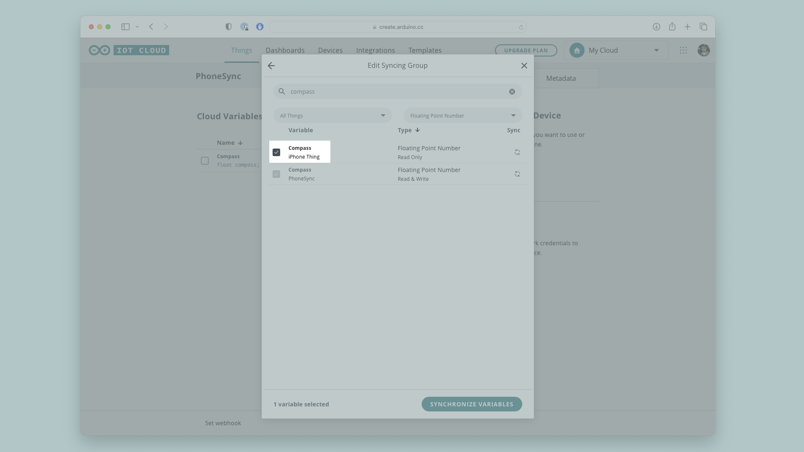

The Arduino Cloud is a powerful platform that can help you with setting up your own IoT devices within minutes. 

It is now possible to synchronize your phone's sensor data with the cloud, using the Arduino IoT Remote App for [iOS](https://apps.apple.com/us/app/arduino-iot-cloud-remote/id1514358431) and [Android](https://play.google.com/store/apps/details?id=cc.arduino.cloudiot&hl=en&gl=US). Furthermore, this data can also be used to control your Arduino boards, such as mapping a value from a sensor on your phone to an actuator on your Arduino.

Your smartphone is absolutely **packed** with sophisticated sensors that constantly measure everything from GPS position, to magnetic fields, acceleration, and so on. But they're difficult for a maker to take advantage of without having extensive knowledge of mobile development. 

That is changed by the Arduino IoT Remote app - as you are able to, with the latest version of the app for [Android](https://play.google.com/store/apps/details?id=cc.arduino.cloudiot&hl=en&gl=US) and [iOS](https://apps.apple.com/us/app/arduino-iot-cloud-remote/id1514358431), set up a dashboard in the Arduino Cloud that tracks and displays all your sensor data in a neat dashboard within a minute.

The goal with this project is to learn about how you can use your smartphone as a remote, sending sensor data to the Arduino Cloud. You'll also learn how this sensor data can be used by other Things in your Arduino Cloud account, essentially letting you control your IoT devices depending on your variables such as GPS position, compass orientation, or any of the other in the long list of variables the IoT Remote app can stream live to the cloud. 

You will learn this by making a small project where a servo motor reacts to where you point your phone, as shown below.


## Requirements
To Follow along with this article, you will need the following:

- An Android or iOS Smartphone/tablet
- An [Arduino Cloud](https://cloud.arduino.cc/home/) Account
- An Arduino Cloud-compatible board (optional).
- A Servo motor (optional). 

## Phone Setup
To start this process, you will need to download the Arduino IoT Remote app from either the [Google Play Store](https://play.google.com/store/apps/details?id=cc.arduino.cloudiot&hl=en&gl=US) or the[ Apple App store](https://apps.apple.com/us/app/arduino-iot-cloud-remote/id1514358431) depending on your device, if you don't already have it installed. If you do have it installed already you may need to update it, so take a quick look to make sure that you have the latest version downloaded.

Once you have the app installed, open it and log into your [Arduino Cloud](https://cloud.arduino.cc/home/) account. At this point you should be presented with a list of all your previous dashboards if you have any. 



Tap the hamburger-menu in the top left of your screen, if you're using version 1.1 of the app or later you should have two options, press "**Use data from your phone**". 

At this point, if you expand the section, you can see all the sensors that can be tracked in the Arduino Cloud listed. You'll need to consent to the sensor data being sent to the Arduino Cloud by checking the box, then you're ready to start the automated process of building the dashboard. Tap "**SET YOUR PHONE**" and sit back, relax, while the app takes care of everything else for you.

Once done, check out all the sensor data in the dashboard. How neat is that?


Try manipulating your phone in different ways to see how the data reacts, move it around, bring magnets close, make sounds, try anything you can think of!

## Use the Data
Now that you've got your sensor data in the Arduino Cloud, the next step is to use it for a project. As an example, let's sync the compass orientation of your phone to a variable controlling the angle of a servo motor.

The mobile "**Thing**" can't be programmed, but you can sync the variables from it with variables in other "**Things**"

So go to the [Arduino Cloud](app.arduino.cc/things) on your computer, and create a new **Thing**. 

Grab your **Arduino Cloud** compatible Arduino board and connect it to your computer, and configure it with your thing. I am using an **Arduino Nano 33 IoT**, and I am going with the suggested name for my device, which happens to be "**Robby**"

You will also need to enter your network credentials at this stage.

Now you can add a new variable in your **Thing**. When configuring this variable, you have the option to sync it to variables in other **Things**. This is very powerful and lets your devices talk to each other seamlessly, while still acting just like the variables you are familiar with in the code you're writing. 

Name the variable something appropriate, "Compass" for example. Click the **"Sync with other Things"** button to open up the syncing menu, search for **"compass"** and make sure to tick the box of the compass variable tied to your mobile devices Thing. 



When one of the variables are updated, the other one will sync to the same value. This means that if we refer to the Compass variable in the sketch of our Arduino Thing we can access the values from the mobile device. 

Now that the input is figured out, let's move on to creating our sketch. If you want to skip the code explanation, the full sketch can be found at the bottom of this section. 

At the very top of the sketch we want to do three things, the first one is to include the servo library, the second one is to initialise the servo library, and the third is to create a variable to hold a mapped value from the compass. The compass in your phone reports a value between 0-360, but because servo motors usually cannot rotate 360 degrees we need to make sure that the value we send to the servo is witing the acceptables ranges for the servo we're using. Most small servos can move within a 90 or 180 degree range.

So start by including and initialising the servo library, and creating an empty integer variable at the top of your sketch.

```arduino
#include <Servo.h>

Servo myServo;

int mappedCompass;
```

Within `void setup()` we'll need select a pin for the servo motor. We'll also write it to a default starting position.

Add the following code somwehere in the setup function:
```
  myServo.attach(2);
  myServo.write(80);
```

In `void loop()` we need to remap the compass value like explained earlier, but once that is done all we need to do is to write the remapped value to the servo motor.

Add the following code in the loop function:
```
  mappedCompass = map(compass, 0, 360, 0, 90);
  
  myServo.write(mappedCompass);
```

The full code can be found here:
```
/* 
  Arduino Cloud Variables description

  The following variables are automatically generated and updated when changes are made to the Thing

  float compass;

  Variables which are marked as READ/WRITE in the Cloud Thing will also have functions
  which are called when their values are changed from the Dashboard.
  These functions are generated with the Thing and added at the end of this sketch.
*/

#include "thingProperties.h"
#include <Servo.h>

Servo myServo;

int mappedCompass;

void setup() {
  // Initialize serial and wait for port to open:
  Serial.begin(9600);
  // This delay gives the chance to wait for a Serial Monitor without blocking if none is found
  delay(1500); 
  
  myServo.attach(2);
  myServo.write(80);

  // Defined in thingProperties.h
  initProperties();

  // Connect to Arduino Cloud
  ArduinoCloud.begin(ArduinoIoTPreferredConnection);
  
  /*
     The following function allows you to obtain more information
     related to the state of network and Arduino Cloud connection and errors
     the higher number the more granular information you’ll get.
     The default is 0 (only errors).
     Maximum is 4
 */
  setDebugMessageLevel(2);
  ArduinoCloud.printDebugInfo();
}

void loop() {
  ArduinoCloud.update();
  // Your code here 
  mappedCompass = map(compass, 0, 360, 0, 90);
  
  myServo.write(mappedCompass);
  
}

/*
  Since Compass is READ_WRITE variable, onCompassChange() is
  executed every time a new value is received from Arduino Cloud.
*/
void onCompassChange()  {
  // Add your code here to act upon Compass change
}

```

Once the sketch is uploaded to your board, wait for it to connect to your network, then open the IoT Remote app on your phone and watch as the Servo reacts when you rotate your phone.

## Conclusion
With this tutorial, you have learned how to connect your android or iOS smartphone to the Arduino Cloud and send all sorts of sensor data from your device, and how to integrate this sensor data with your other Arduino Cloud Things.

The small project done in this tutorial is just the tip of the iceberg, you could take what you learned here and apply it in other ways to create an endless amount of cool interactive IoT projects that take advantage of the sophisticated sensors you carry in your pocket every day. 