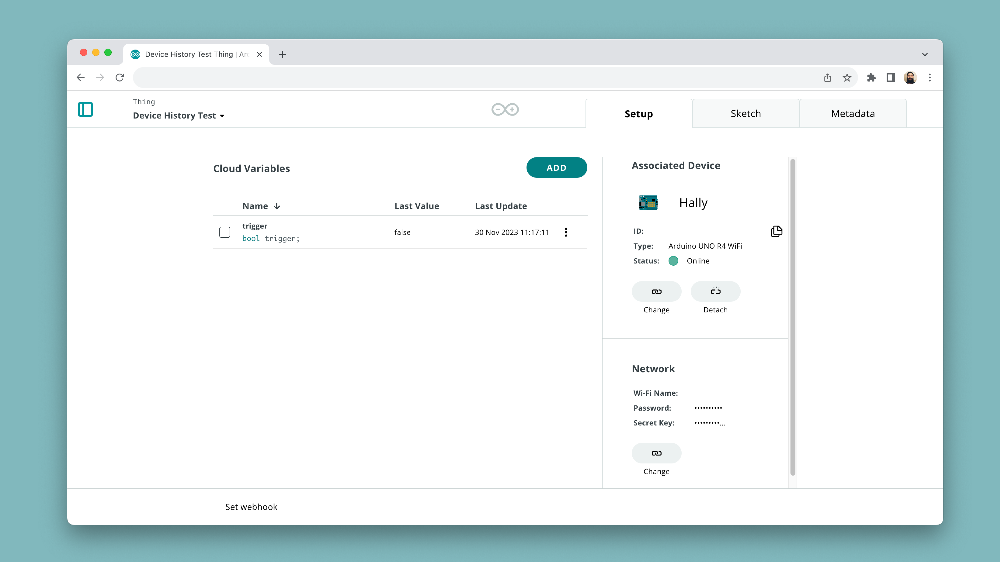

The **Arduino IoT Remote App** ([iOS](https://apps.apple.com/us/app/arduino-iot-cloud-remote/id1514358431) / [Android](https://play.google.com/store/apps/details?id=cc.arduino.cloudiot)) has support for **push notifications**, which can be set up by creating a [Trigger](/arduino-cloud/cloud-interface/triggers).

Currently, **booleans & strings** are the only supported data types, where you can send push notifications either when a boolean is **true**, or whenever a string match.

This feature allows your phone to receive important notifications, such as when a sensor value drops below a certain threshold, your power consumption is too high and many more cases.

## Requirements

- [Arduino Cloud](https://app.arduino.cc/) account, with a maker plan.
- A [configure device]() in the Arduino Cloud.
- Android / iPhone.
- Arduino IoT Remote App:
  - [App Store](https://apps.apple.com/us/app/arduino-iot-cloud-remote/id1514358431).
  - [Google Play](https://play.google.com/store/apps/details?id=cc.arduino.cloudiot).

## Setup

Setting up push notifications is done in the [Arduino Cloud](https://app.arduino.cc/), and in the **IoT Remote App**, which you will need to download to your phone.

## IoT Remote Setup

***Need help getting started with the IoT Remote App? Check out the [IoT Remote App Guide](/arduino-cloud/iot-remote-app/getting-started).***

To set up the IoT Remote App, first make sure you have it installed. The download links are available in the [section just above](#requirements).

1. Open the app, and navigate to your settings (click on your avatar in the top right corner).
2. Click on **"Manage push notifications"**, and allow the IoT Remote App to show notifications. This varies from phone to phone.
3. Done! You can now move on to the next steps!


## Arduino Cloud Setup

To create a push notification, you will need to have a [Thing](/arduino-cloud/cloud-interface/things) created, and a boolean / string variable created.

### Create Thing

1. Navigate to [Arduino Cloud](https://app.arduino.cc/), and click on the Thing button in the side menu. Create a new Thing (or use an existing Thing), and create a `boolean` variable named `trigger`.
2. Attach a device to your Thing. If you use an official Arduino board / ESP32 device, you can also program your device directly via the **"Sketch"** tab. 
3. Write the application code for your device. Just below is an example that sets a boolean variable (`trigger`), to `true`, which will activate the trigger. This can be activated from a dashboard.

    ```arduino
    #include "thingProperties.h"

    void setup() {
      // Initialize serial and wait for port to open:
      Serial.begin(9600);
      // This delay gives the chance to wait for a Serial Monitor without blocking if none is found
      delay(1500); 

      // Defined in thingProperties.h
      initProperties();

      // Connect to Arduino IoT Cloud
      ArduinoCloud.begin(ArduinoIoTPreferredConnection);
    }

    void loop() {
      ArduinoCloud.update();

    }

    void onTriggerChange()  {
        trigger = false;
    }
    ```

4. Upload the code to your device and check that your device is online.

    

***Find more details about this setup in the documentation of [Things](/arduino-cloud/cloud-interface/things), [Devices](/arduino-cloud/hardware/devices) and [Variables](/arduino-cloud/cloud-interface/variables).***

### Create Trigger

Next step is to create a [Trigger](/arduino-cloud/cloud-interface/triggers), which we will link to the `trigger` variable we created earlier.

1. Go to the **Triggers Page**, accessible in the left hand menu.
2. Create a new trigger, and click on the **"Cloud Variable"** button to the right. From the list of Things, find the `trigger` variable we created earlier, and click on **"Link Variable"**.
3. Now, select **"Send Push Notifications"**. It will open a new field that allows you to enter a **title** and **description**. Fill in something that you want to appear on your phone, such as `"Test Trigger"`, or `"Reminder to make coffee!"`. When complete, it should look something like the image below. To finish, click on **"Done"**, in the bottom corner.

    

4. Your push notification is now active, just waiting to be "triggered". To trigger it, we are going to use a **dashboard**.

### Create Dashboard

Finally, we will create a dashboard that we can trigger the notification from.

1. Go to the **"Dashboards"** page, and create a new dashboard / use an existing dashboard.
2. Create a switch widget and link it to your `trigger` variable, similarly to how we set up the trigger.
3. Once linked, flick the switch. It should immediately go back to its "off" state, and you should now receive a notification in your phone.

    

4. Congratulations! Your phone now receives notifications from the Arduino Cloud.

***Please note that as soon as you create a trigger, it will also activate. Note that there is a limit of `100` triggers a day for a Maker plan, and `400` for the Maker plus plan. You can de-activate the triggers easily in the Triggers page. See instructions in the section just below.***

## Disable/Enable Triggers

Once your trigger is set up and running, it is possible to disable/enable them. This is done in the **"Triggers"** page, where a switch allows you to toggle the state.

