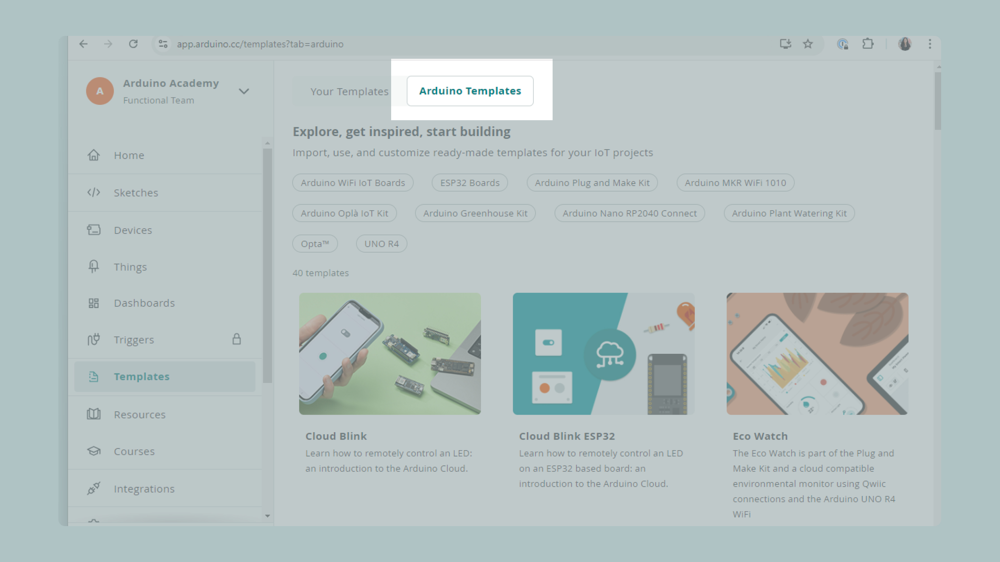
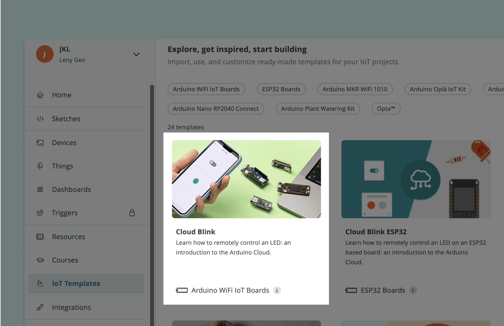
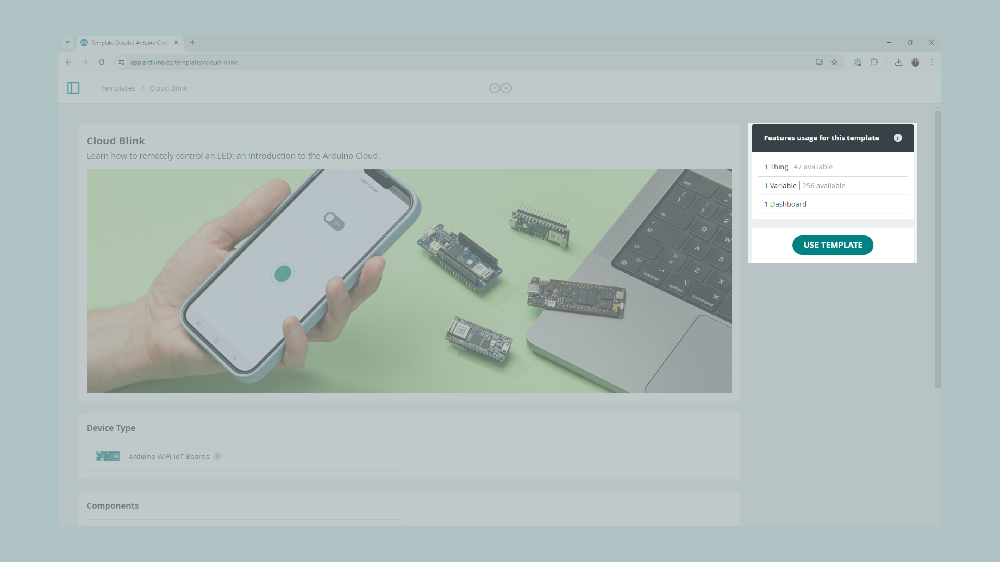
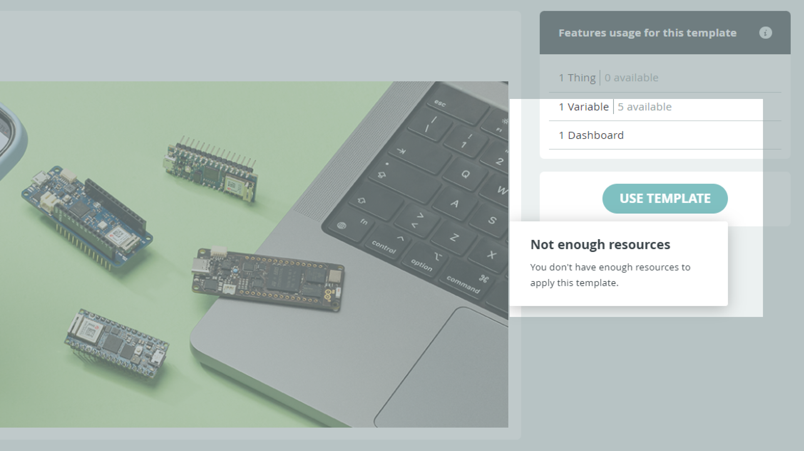
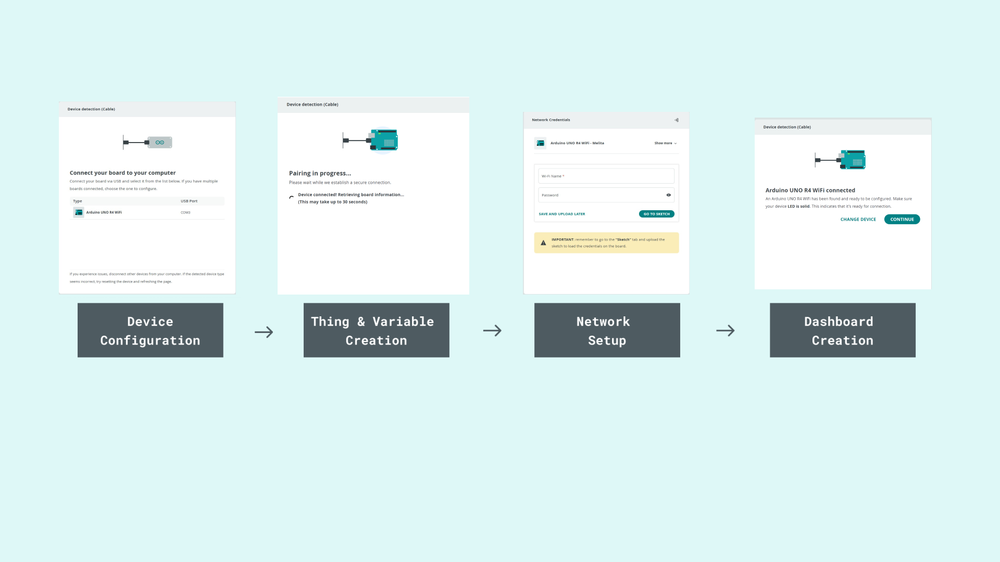
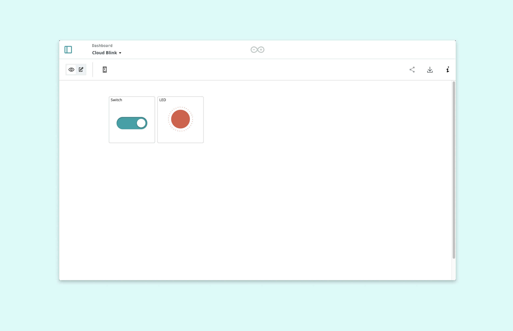
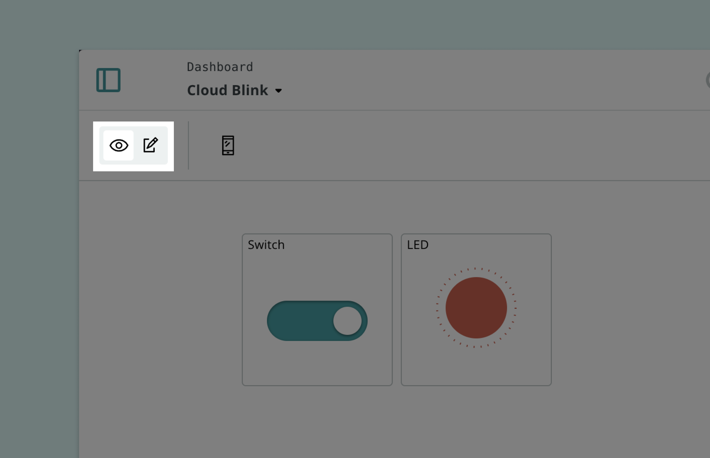
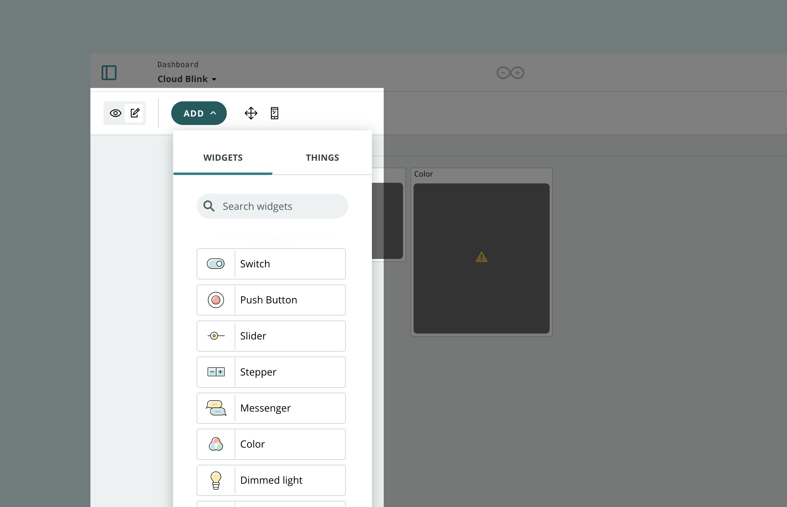
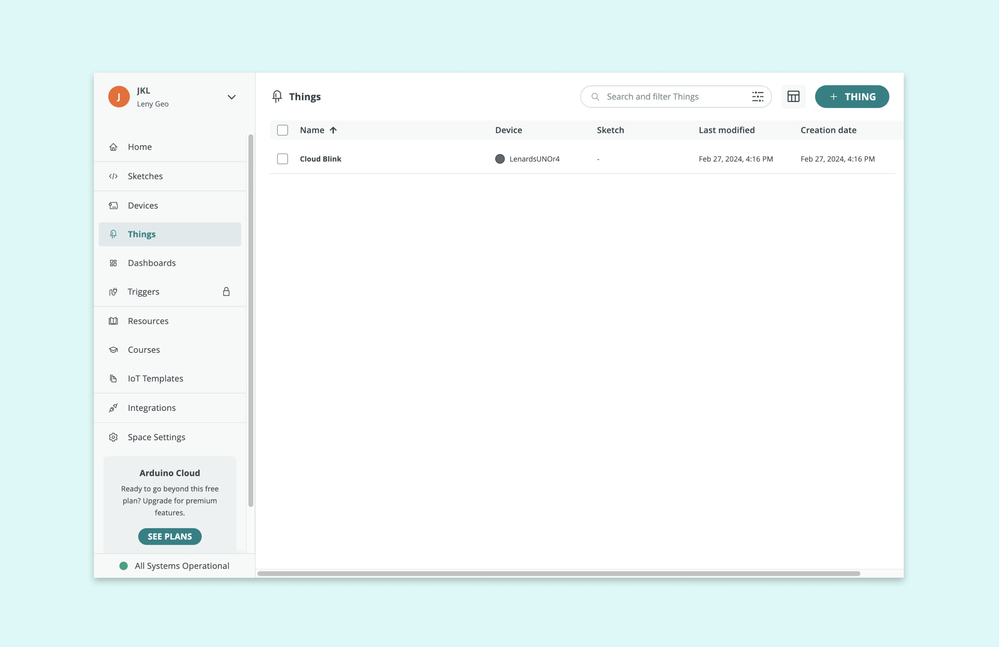
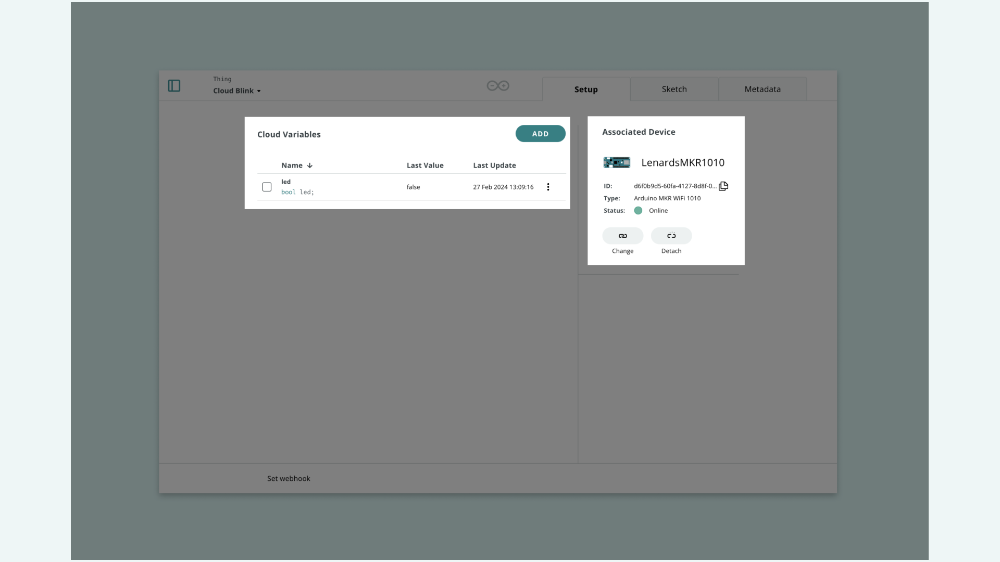

## Introduction 

This guide aims to introduce anyone interested in exploring the world of the Internet of Things (IoT) to Arduino Cloud Templates. These templates are pre-built projects that make it significantly easier to dive into IoT applications. Whether you're a teacher, a maker, planning your next class or organizing a hackathon, these templates provide a quick and accessible way to get started with the fundamental components of an IoT project.

## What you will learn

- Templates and their benefits
- Collection of Arduino Templates
- Importing Templates
- Create Custom Templates

## Arduino Templates

<iframe width="100%" height="480" src="https://www.youtube-nocookie.com/embed/J5_QleCPc64?si=I-3lU1mVam3jtA4_" title="YouTube video player" frameborder="0" allow="accelerometer; autoplay; clipboard-write; encrypted-media; gyroscope; picture-in-picture; web-share" allowfullscreen></iframe>

Templates are pre-configured projects that allow users to quickly set up Arduino devices for the Arduino Cloud, creating a dashboard based on the project in two minutes. Through a [Dashboard](https://docs.arduino.cc/arduino-cloud/cloud-interface/dashboard-widgets), you can easily monitor and control IoT projects on a web interface.

Dashboards are an excellent way to learn about IoT concepts, data collection and analysis, and interaction with hardware/sensors without having to build an IoT project from scratch. This reduces the time and the learning curve, providing a starting point for building innovative ideas and deepening knowledge.

## Setup

Once you have decided which template(s) you would like to use, it's important to prepare the essentials to conduct this activity effectively. Before you begin using templates, ensure that you have the following items checked: 

- Hardware - Any choice of [Arduino Wi-Fi® boards](https://support.arduino.cc/hc/en-us/articles/4407129094546-Boards-and-shields-with-wireless-connectivity)

- USB Cable - Ensure you have the right one for your board

- Software - Arduino Account

- Good Internet Connection

- Collaborative Space (optional - useful if you're working in a group)

- Sensors and Actuators (optional)

For our tutorial, we will use the [Cloud Blink Template](https://app.arduino.cc/templates/cloud-blink) that will illustrate how to control an Arduino Board’s LED through a dashboard in the Arduino Cloud. This is a great template if you want to get started with the Arduino Cloud since it works with all boards. After you have completed the installation, you can modify the sketch and dashboard freely.

For troubleshooting, we recommend to read this article from our Help Center:

* [Configure your network for Arduino Cloud](https://support.arduino.cc/hc/en-us/articles/360017279260-Configure-your-network-for-Arduino-Cloud)

## Choosing a template 

Once you have logged into your account, Templates can be accessed from the sidebar **Templates > Arduino Templates** from the menu on top. 

Here you will find templates across various categories and different boards. Click on the "Cloud Blink" Template. 

The template page will open, where you will find the description of what the project does together with essential information on hardware and electronics components.

## Use a Template 

Arduino Templates can be imported easily by clicking on the import button from the template description page. The process is similar to that of uploading a sketch to the Arduino board. Once the device is plugged in the USB port, click on **USE TEMPLATE** to import the chosen template. If you have not yet connected a device you will be guided to.

***Note: If this is your first time using the Arduino Cloud, you will be prompted to install the Create Agent. This software facilitates communication between your browser and Arduino board. Simply install it as you would any other program. For detailed instructions on installing the Create Agent, click [here](https://support.arduino.cc/hc/en-us/articles/360014869820-Install-the-Arduino-Create-Agent).***

Above the `Use Template` button, you can find information on how many [Things](https://docs.arduino.cc/arduino-cloud/cloud-interface/things), [Variables](https://docs.arduino.cc/arduino-cloud/cloud-interface/variables) and [Dashboards](https://docs.arduino.cc/arduino-cloud/cloud-interface/dashboard-widgets) are associated with this template. The Arduino Cloud platform will handle the creation of these IoT components along with setting up the device and network for the selected template. 

***Note: with a Free Plan a user can only have two Things at same time. When you already have two Things, you won't be able to click on USE TEMPLATE. To avoid this you could choose to upgrade your Cloud plan or manually delete an existing Thing.***

This process involves creating the necessary components and uploading the sketch (program) to your device:

1. Configure your Arduino hardware and add it to the Cloud platform,
2. Create a virtual representation of your IoT setup,
3. Assign the right network credentials to your devices, 
4. Build a dashboard with the right widgets.

***Note: The process may take up to 5 minutes. Do not unplug the device during this step or close the laptop during the import process.*** 

For troubleshooting, we recommend to read this article from our Help Center:

* [If your device can't be added or won't connect to Arduino Cloud](https://support.arduino.cc/hc/en-us/articles/360019355679-If-your-device-can-t-be-added-or-won-t-connect-to-Arduino-Cloud)

Once connected, the template will become operational. For example, if using the "Cloud Blink" template, you can now control an LED remotely through the Cloud interface.

For troubleshooting, we recommend to read this article from our Help Center:

* ['We were not able to upload the template sketch' in Arduino Cloud](https://support.arduino.cc/hc/en-us/articles/4408887422994--We-were-not-able-to-upload-the-template-sketch-in-Arduino-Cloud)

## Editing a Template 

This interface is fully customizable and you can extend this template based on your needs and creativity. If you’d like to make changes to the `Dashboard` by adding additional widgets, you can do so by clicking on the **Edit icon**. 

Click on the **Add** to select a widget you would like to add. 

Once you have added the `Widget`, you can either connect it to the available `variables` or you can create a new variable. For this you need to go to **Things** from your sidebar and click on the Thing that **has the same name as your template**. 

As mentioned earlier, a template also creates: **variables**, **sketch files**, **device** and **network information** that can be configured based on your preference. Most of this information can be found inside a **Thing**. The **network information** can be found on the device page.

If you have already worked with Arduino IoT projects, you can go ahead and start customizing the templates based on your choice, otherwise you can [get started reading this tutorial]( https://docs.arduino.cc/arduino-cloud/guides/overview/). 

### Effective Classroom Learning with Templates

Integrating Arduino Templates into a course curriculum offers a tangible way to teach concepts like sensor data collection, cloud computing, and Internet of Things principles across various disciplines such as physics, chemistry, biology and computer science. Here are some innovative ways a teacher can use these templates in their course.

| Subject / Project | Physics                                                      | Chemistry                                                    | Biology                                                      | Comp. Science                                                | Arts and Design                                              |
| ----------------- | ------------------------------------------------------------ | ------------------------------------------------------------ | ------------------------------------------------------------ | ------------------------------------------------------------ | ------------------------------------------------------------ |
|                   |                                                              |                                                              |                                                              | [Remote LED Control](https://app.arduino.cc/templates/cloud-blink) | [Fun and Games](https://app.arduino.cc/templates/pavlovs-cat) |
|                   | [Thermodynamics](https://app.arduino.cc/templates/ventilation) | [Soil properties](https://app.arduino.cc/templates/soil-moist) | [Photosynthesis and respiration](https://app.arduino.cc/templates/photosynthesis) | [Greenhouse Monitoring](https://app.arduino.cc/templates/watering) | [UI Design of industrial systems](https://app.arduino.cc/templates/smart-garden) |
|                   |                                                              | [Monitoring indoor air quality](https://app.arduino.cc/templates/thermostat-control) | [Studying indoor plant growth](https://app.arduino.cc/templates/natural-and-artificial-light) | [Introducing Sensor technology](https://app.arduino.cc/templates/remote-controlled-lights) | [Ideation and prototyping easy to use home projects](https://app.arduino.cc/templates/plant-watering-kit) |
|                   | [Pressure, temperature and light](https://app.arduino.cc/templates/humidity-and-temperature) |                                                              | [Weather Stations](https://app.arduino.cc/templates/personal-weather-station) | [Basics of structuring data](https://app.arduino.cc/templates/sparkfun-weather-station) |                                                              |
|                   |                                                              |                                                              |                                                              | [Loops, Pointers, Arrays and Functions](https://app.arduino.cc/templates/puzzle-box) | [Emotional expressions through technology](https://app.arduino.cc/templates/thinking-about-you) |

If you plan to use templates in a teaching environment or during a workshop with multiple participants, you might find [shared spaces](https://docs.arduino.cc/arduino-cloud/education/shared-spaces/) very useful. Make sure all participants have created their individual accounts and have been added to the shared space you have set up.

## Conclusion

Arduino Templates offer a practical and engaging way to introduce students to IoT technology. By guiding them through setting up, programming, and deploying IoT projects, educators can provide a hands-on learning experience that emphasizes the importance of IoT in today's technology-driven world. Encourage your students to explore, experiment, and innovate as they embark on their IoT learning journey.

