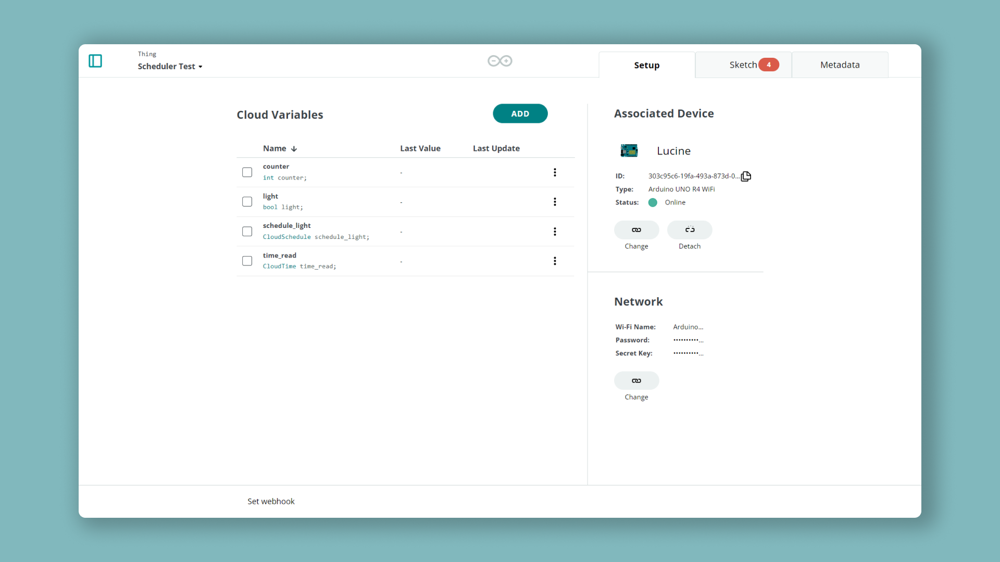
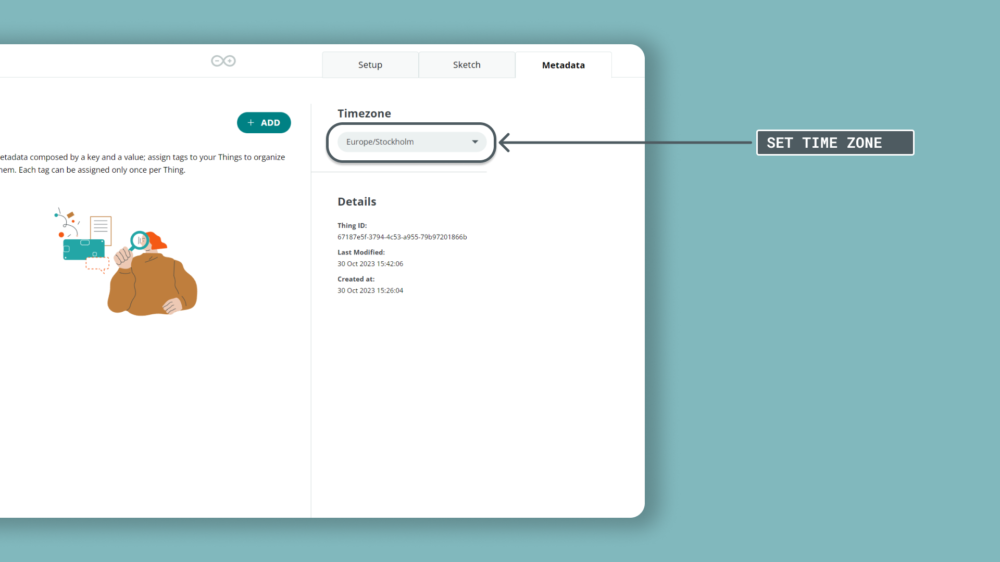
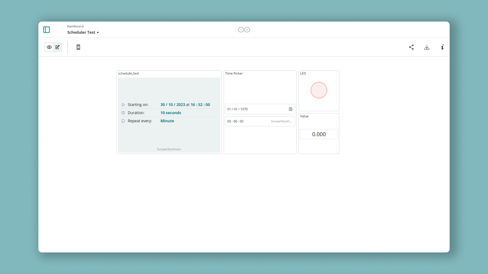
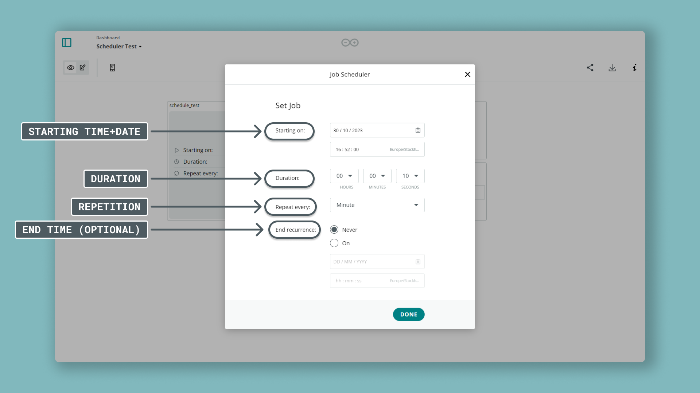

It is now possible to schedule jobs with the [Arduino Cloud](https://app.arduino.cc/), using the new `CloudSchedule` variable type. You can pick a start & end date for when the variable should be triggered, and for how long it should be active. This variable can be controlled in real time using a graphical widget that you can place on an Arduino Cloud dashboard.

We can for example have:

- One trigger scheduled to run every minute for 10 seconds
- One trigger scheduled to run every hour for 10 minutes

## Goals

The goals of this project are:

- Learn how the `CloudSchedule` variable works.
- Learn how to access local time in your sketch.

Make sure you have a [cloud-compatible board](/arduino-cloud/hardware/devices#type-of-devices).

## How Does it Work?

A variable of `CloudSchedule` type can be configured to trigger at a specific time, with a specific duration. In the code, you do not need to worry about the logic for this. The configuration of the variable is done in the dashboard, through a widget associated to the variable.

For example, we can set such variable to be:
- ON for 10 seconds, every minute.
- ON for 8 hours, every day. 
- ON for a week, and then finish.


## Application Examples

There are countless examples where schedulers can be used, but predominantly it can be utilized for timer projects. Below are a few examples that can be used as inspiration.

***Note that "schedule_variable" used in these examples is the name we give when creating the variable in the Thing settings.***

### Basic Example

To test out functionality of your scheduler job, we can turn on an LED while the job is active. 

```arduino
if (schedule_variable.isActive()) {
   // whenever the job is "active", turn on the LED
   digitalWrite(LED, HIGH);
} else {
   // whenever the job is "not active", turn off the LED
   digitalWrite(LED, LOW);  
}
```

### Multiple Schedulers

You can set up **multiple scheduler variables.** This way, you can have a different code executing at specific times. In the example below, there are three schedulers, each performing a unique task whenever triggered:

- Write a high state to a pin.
- Read a sensor.
- Change a string.

```arduino
// scheduler 1 (write a high state to a pin)
if (schedule_variable_1.isActive()) {
   digitalWrite(3, HIGH);
} else {
   digitalWrite(3, LOW);
}

// scheduler 2 (read a sensor)
if(schedule_variable_2.isActive()) {
   sensor_variable = analogRead(A1);
}

// scheduler 3 (change a string)
if (schedule_variable_3.isActive()) {
   string_variable = "";
   string_variable = "Update something here!";
}
```


### Smart Light Automation

Turning on and off light sources can be a great power saver for the office, home or vacation home. This can be achieved with a few lines of code and a [relay shield](https://store.arduino.cc/products/arduino-mkr-relay-proto-shield).

```arduino
if (schedule_variable.isActive()) {
   // can be configured to be ON between 8am - 5pm 
   digitalWrite(relay, HIGH);
} else {
   //can be set to OFF between 5pm - 8am the next morning
   digitalWrite(relay, LOW);  
}
```


### Plant Watering

For a "smart watering" setup, if you connect a pump through a relay, you can schedule a job to be on for a period of time (pumping water) and then turn off. This could for example occur for a few seconds every day to keep your plants alive.

```arduino
// configure to be "on" for 10 seconds every day
if (schedule_variable.isActive()) {
   digitalWrite(pump, HIGH);
} else {
   digitalWrite(pump, LOW);
}
```

Or, if you use a driver, such as **L298N**, you can control the pump through:

```arduino
if (schedule_variable.isActive()) {
   analogWrite(pump, 127); // range between 0-255
} else {
   analogWrite(pump, 0);
}
```

## Creating a Scheduler (Tutorial)

In this section you will find a step by step tutorial that will guide you to creating and testing out the **scheduler feature**.

- Create a Thing.
- Configure an Arduino board.
- Create a basic sketch & upload it to the board.
- Create a dashboard.

### API

The two **variables types** introduced in this tutorial are `CloudTime` and `CloudSchedule`. These are used to retrieve local time and to schedule a job respectively.

The `CloudSchedule` variable is of a **complex type**. It has a **internal boolean state**, which can be checked through the `isActive()` function (returns `true` or `false`).

```arduino
if(schedule_variable.isActive()) {
  //do something
}
```

The `CloudTime` variable is an unsigned integer which is used to store current time. We can use the `getLocalTime()` function to retrieve local time.

```arduino
time_variable = ArduinoCloud.getLocalTime();
```

### Create a Thing

***If you are new to the Arduino Cloud, you can either visit the [Getting Started with Arduino Cloud](/arduino-cloud/guides/overview) guide, or any of the tutorials in the [Arduino Cloud documentation](/arduino-cloud/). There you will find detailed step by step guides.***

**1.** Navigate to [Arduino Cloud](https://app.arduino.cc/). You will need to log in with your Arduino account.

**2.** Create a new Thing by clicking on the "Create Thing" button. You can name it something like "Scheduler Test".

**3.** Now, we need to attach a device to our Thing, by clicking on **"Select Device"**. If you already have a device configured, you can select it, otherwise, follow the configuration.

***Note that your board will need to be connected to your computer at this point.***

Once your device is configured and attached to your Thing, we can move on to create variables.

### Create Variables

For this project, we will need to create the following variables, by clicking on the "Add Variable" button.

| Variable Name | Variable Type | Permission   |
| ------------- | ------------- | ------------ |
| schedule_test | CloudSchedule | Read & Write |
| time_read     | CloudTime     | Read Only    |
| light         | bool          | Read Only    |
| counter       | int           | Read Only    |

Your Thing overview should now look like the image below:



### Set Time Zone

In order for our job to go off at the right time, we need to set the **time zone** for our Thing. This is done in our Thing configuration, by selecting your time zone through the drop down menu available at the bottom of the page.



### Network Credentials

To connect your device to the Arduino Cloud, you need to enter your network credentials in the "network" section.

***Note that this only applies to Wi-Fi enabled boards.***

### Programming the Board

Now, let's take a look at the sketch used for this tutorial. First, we need to navigate to the **"Sketch Tab"**.

- This sketch first checks whether the `schedule_test` variable is true, and if it is, increase the `counter` variable and turn on the `light`.
- The `light` variable is used for feedback later on, when we create a dashboard. Whenever `schedule_test` is true, so is `light`.
- The `LED` variable is also attached to pin 6, which is **ON** when the job is active, and **OFF** when the job is inactive.

### Complete Sketch

```arduino
#include "thingProperties.h"
#include <RTCZero.h>

bool toggle;
int LED = 6;

void setup() {
  Serial.begin(9600);
  delay(1500); 

  initProperties();

  ArduinoCloud.begin(ArduinoIoTPreferredConnection);
  setDebugMessageLevel(2);
  ArduinoCloud.printDebugInfo();
  counter = 0;
  light = false;
}

void loop() {
  ArduinoCloud.update();
  // Your code here 
    if (schedule_test.isActive()) {
    light = true;
    digitalWrite(LED, HIGH);

    if (toggle) {
      counter = ++counter;
      toggle = false;
    }
  } else {
    light = false;
    digitalWrite(LED, LOW);
    toggle = true;
  }
  if(ArduinoCloud.connected()){
     time_read = ArduinoCloud.getLocalTime();
  }
}

void onScheduleTestChange()  {
  
}
```

***If you want to see if your board successfully connects to the cloud, open the Serial Monitor right after the upload finishes. If there's any errors, you will see them there.***

### Creating a Dashboard

Finally, let's build a dashboard that will help us interface with our Arduino board. 

**1.** Head over to the **"Dashboards"** section, and click on the **"Build Dashboard"** button.

**2.** Now we will need to create a set of widgets that we will link to our variables. Follow the table below to create them.

| Widget      | Variable      |
| ----------- | ------------- |
| Scheduler   | schedule_test |
| Time Picker | time_read     |
| Value       | value         |
| LED         | light         |

***When you create a widget, you will need to click on "Link Variable" in the widget settings, and then choose the variable you want to link (see the image below).***


When the dashboard is finished, it should look something like the image below, where we have four widgets in total:



We are now finished with the setup, and can move on to testing out the scheduler feature.

## Scheduling a Job

To schedule a job, there are several parameters that can be set:

- **Start & end** date for a "job". For example, **start** on 1st of December at 00:00, **end** at 31st of December at 12.00.
- **Duration** of the job, set in hours, minutes, seconds. If we for example set 1 minute, the `schedule_test` variable will be `true` for 1 minute.
- **Repetition** interval, how often should this job occur: every minute, hour, day, week, month, day or year.

To create a job, simply click anywhere on the **scheduler widget**, and configure the job after your preferences.



### Testing the Scheduler

In this tutorial, we created a job that has the following parameters:

- **Start:** today.
- **End:** never.
- **Duration:** 10 seconds.
- **Repeat Every:** minute.

The sketch used for this is configured to switch the `light` variable to true, whenever the `schedule_test` variable is true. While it is true, the **LED widget**, which is linked to the `light` variable, will be on (for 10 seconds). Each time this happens, the `counter` variable will also increase by 1.


### Troubleshoot

If you have any issues with finishing this tutorial, you can check out some common troubleshooting issues:

- Is your network credentials correct? If you change these, you will need to upload the sketch again for the changes to have effect.
- If you can't link a widget to a variable, you may have selected the wrong variable type. The **scheduler widget** will only work with the **scheduler variable**.
- Does the variables created in your Thing match the variables in your sketch? For example, if your variable is named `Schedule_test`, the code provided in this tutorial will not work since it is **case sensitive**.

## Conclusion

The scheduler is yet another amazing Arduino Cloud feature that allows you to control the future. In this tutorial, we used **just one scheduler**, but you might just as easily create 10 schedulers that can perform actions automatically. This makes it an ideal building block for IoT projects.
