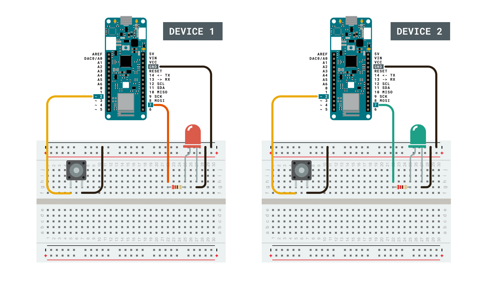
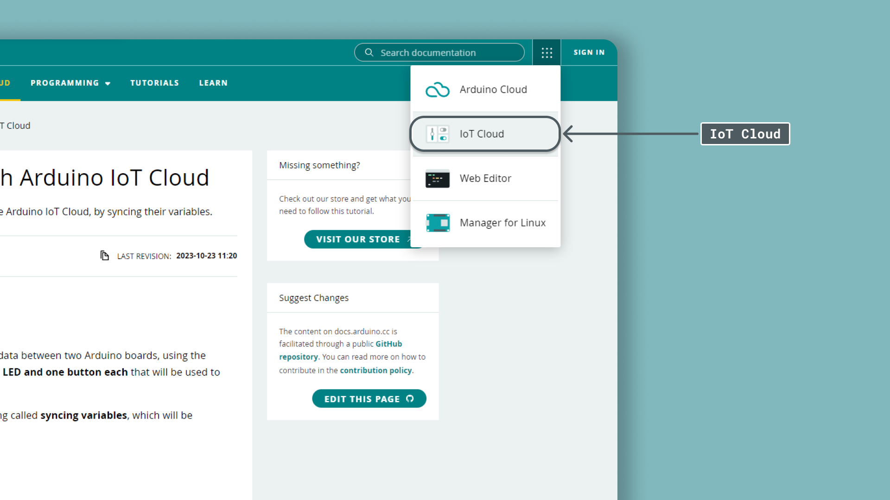
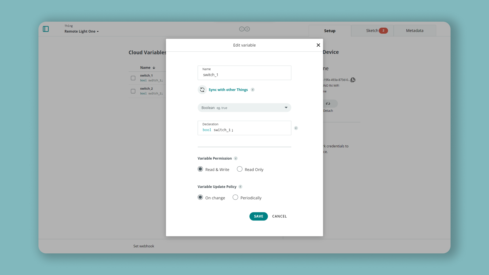

## Introduction

In this tutorial, we will find out how to send data between two Arduino boards, using the Arduino Cloud. Each board will have **one LED and one button each** that will be used to send data between the boards.

This will be made possible through something called **syncing variables**, which will be explained further in this tutorial.

## Goals

The goals of this project are:

- Set up the Arduino Cloud.
- Create synchronized variables.
- Control an LED remotely with a push button.

## Hardware & Software needed

- [Arduino Cloud](https://app.arduino.cc/).
- 2x [Arduino MKR WiFi 1010](https://store.arduino.cc/mkr-wifi-1010) or,
- 2x [Arduino MKR WiFi 1000](https://store.arduino.cc/arduino-mkr1000-wifi) or, 
- 2x [Arduino Nano 33 IoT](https://store.arduino.cc/arduino-nano-33-iot) or,
- 2x [Arduino Nano RP2040 Connect](https://store.arduino.cc/nano-rp2040-connect-with-headers).
- Micro USB cable.

***Note: It is not required to have two devices of the same type. You can for example use a Nano RP2040 Connect and a MKR WiFi 1010. Any [Arduino Cloud enabled Wi-Fi board](/arduino-cloud/hardware/devices#type-of-devices) will work with this tutorial.***

We will also need the following components for the circuit:

- 2x generic LEDs.
- 2x pushbuttons.
- 2x 220 ohm resistors.
- Jumper wires.
- Breadboard.

## Circuit

Follow the circuit below to connect the buttons and LEDs to your Arduino board.

***Note that the pinouts are different on a Nano board. The circuit below is for a MKR WiFi 1000/1010 board.***



## Setting up the Arduino Cloud

To start, we will need to head over to the [Arduino Cloud](https://app.arduino.cc/). This is also accessible through the menu at the top right.



### Step 1: Configuring two devices

In this tutorial, we will need to set up **two devices in the Arduino Cloud**. If you have never used this service before, you can check out [our getting started with the Arduino Cloud guide](https://www.arduino.cc/en/Tutorial/iot-cloud-getting-started).

Now that we are working with two devices, it is important to separate them from each other, since they will later be linked to two different Things. In this tutorial, we named the devices:

- **Device_1**
- **Device_2**

It is a good idea to place a label on the physical board to remember which one is which as well!

### Step 2: Creating the first Thing

Let's start by creating a new Thing, for simplicity, let's name it **Remote Light One**. 


Now, we will need to add two variables, with the following settings:

| Variable Name | Data Type | Permission   |
| ------------- | --------- | ------------ |
| switch_1      | boolean   | read & write |
| switch_2      | boolean   | read & write |

We also need to enter our network details, and select our device (which should be **Device_1**).

The final overview should look something like this:


### Step 3: Program the first Thing

Now, we also need to complete the sketch for our first Thing. First, let's head over to the **"Sketch"** tab in the Arduino Cloud. 


The code that is needed can be found in the snippet below. Upload the sketch to the first board.

### Step 4: Complete code for Device_1

```arduino
#include "thingProperties.h"

int buttonPin = 2;
int ledPin = 7;

void setup() {
  // Initialize serial and wait for port to open:
  pinMode(buttonPin, INPUT_PULLUP);
  pinMode(ledPin, OUTPUT);
  
  // Initialize serial and wait for port to open:
  Serial.begin(9600);
  // This delay gives the chance to wait for a Serial Monitor without blocking if none is found
  delay(1500); 

  // Defined in thingProperties.h
  initProperties();

  // Connect to Arduino Cloud
  ArduinoCloud.begin(ArduinoIoTPreferredConnection);
  
  /*
     The following function allows you to obtain more information
     related to the state of network and Arduino Cloud connection and errors
     the higher number the more granular information you’ll get.
     The default is 0 (only errors).
     Maximum is 4
 */
  setDebugMessageLevel(2);
  ArduinoCloud.printDebugInfo();
}

void loop() {
  ArduinoCloud.update();
  // Your code here 
  
  int buttonState = digitalRead(buttonPin);
  
  if(buttonState == LOW) {
    switch_1 = !switch_1;
    delay(500);
  }
  
}

void onSwitch2Change() {
  // Do something
  
}

void onSwitch1Change() {
  // Do something
    if(switch_2) {
    digitalWrite(ledPin, HIGH);
  }
  else{
    digitalWrite(ledPin, LOW);
  }
}
```

### Step 5: Creating the second Thing

After we have successfully uploaded the code to our first board, we can go on to create our **second Thing.** 

To create our second Thing, we need to click on the **"Things"** tab, and click on **"Create Thing"**. We can name this one **Remote Light Two**. 


Now, we need to create the variables we want to sync with the other Thing. First, click on the **"Add Variable"** button. We will name this one **switch_1** as well, and then click on the **"Sync with other things"** option.



We will now see the two variables we created inside **Remote Light One**. Let's select the **switch_1** variable and click on **"Synchronize variables"** and finally click on **Add Variable**.


Next, we can repeat the same process for the boolean variable, but instead of selecting the **switch_2** variable to sync with, select the **boolean_sync** variable. Now we should have two variables that are synced with our other Thing.

Here we will also need to enter our network details, and select our device (which should be **Device_2**). 

### Step 6: Program the second Thing

Now we will need to edit the sketch for our second Thing. This sketch is almost identical to the previous sketch we made, but the only difference is that we switched places on the **boolean variables**. 

This means that whenever the button is pressed, `switch_2` will change. As it is synced, it will turn ON / OFF the LED on the other board. Similarly, we check if `switch_1` has changed, and turn ON / OFF the LED on this board.

The code that is needed can be found in the snippet below. Upload the sketch to the board.

>**Note:** Make sure that you upload this sketch to **Device_2**, as we have already uploaded the first sketch to **Device_1**.

### Step 7: Complete for Device_2

```arduino
#include "thingProperties.h"

int buttonPin = 2;
int ledPin = 7;

void setup() {
  // Initialize serial and wait for port to open:
  pinMode(buttonPin, INPUT_PULLUP);
  pinMode(ledPin, OUTPUT);
  
  // Initialize serial and wait for port to open:
  Serial.begin(9600);
  // This delay gives the chance to wait for a Serial Monitor without blocking if none is found
  delay(1500); 

  // Defined in thingProperties.h
  initProperties();

  // Connect to Arduino Cloud
  ArduinoCloud.begin(ArduinoIoTPreferredConnection);
  
  /*
     The following function allows you to obtain more information
     related to the state of network and Arduino Cloud connection and errors
     the higher number the more granular information you’ll get.
     The default is 0 (only errors).
     Maximum is 4
 */
  setDebugMessageLevel(2);
  ArduinoCloud.printDebugInfo();
}

void loop() {
  ArduinoCloud.update();
  // Your code here 
  
  int buttonState = digitalRead(buttonPin);
  
  if(buttonState == LOW) {
    switch_2 = !switch_2;
    delay(500);
  }
  
  
}

void onSwitch2Change() {
  // Do something
  
}

void onSwitch1Change() {
  // Do something
    if(switch_1) {
    digitalWrite(ledPin, HIGH);
  }
  else{
    digitalWrite(ledPin, LOW);
  }
}
```

## Testing it out

After we have successfully uploaded the code to our second Thing, we have completed all the configurations needed for the two boards to communicate.

Just to re-cap here's what we have done so far:

- Configured two devices.
- Created two Things.
- Created two variables, `switch_1` and `switch_2`.
- Synced the variables between the Things.
- Uploaded the sketches to **Device_1** and **Device_2**.

If everything is working properly, and the circuit is wired correctly, we should be able to control both LEDs on each board, by **pressing the button on the opposite board.** 

- The button on **Device_1** will control the LED on **Device_2.**
- The button on **Device_2** will control the LED on **Device_1.**
- The logic is set to turn ON and OFF the LED with the same button.


The logic behind it is that one button is each linked to one of the booleans. If for example, `switch_2` is `false`, then the LED in **Remote Light One** will be OFF, and if `switch_1` is set to `true`, the LED in **Remote Light Two** will be off.


### Troubleshooting

- Have you uploaded the sketches correctly? Remember that you need to upload the sketch for **Remote Light One** to **Device_1** and **Remote Light Two** to **Device_2**.
- Have you entered the network details correctly? After you have uploaded the sketch, open the Serial Monitor to see if there is any errors with your connection.
- Have you configured the devices properly? It can sometimes be confusing to which board is which, sometimes it helps to re-configure and re-upload the sketches!

## Conclusion

In this tutorial, we created a connection between two Arduino boards, using the Arduino Cloud. We set up two identical circuits, and uploaded two almost identical sketches to the boards. 

The connection between the boards is made through the **syncing of variables**, which allows two Things to communicate with each other. In this case, whenever a boolean is activated on one device, it is also activated on the other device. This **remote ON/OFF switch** is a great building block for creating other cool IoT projects. 

### More tutorials

You can find more tutorials in the [Arduino Cloud documentation page](/arduino-cloud/).


 