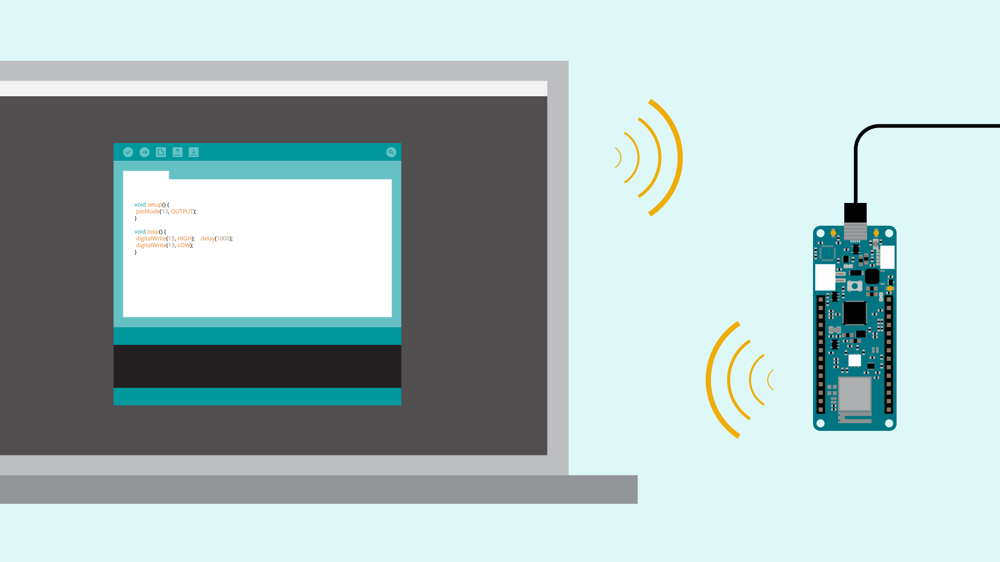
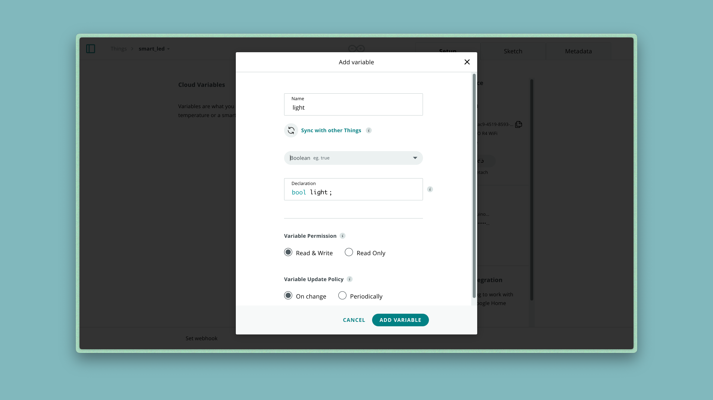
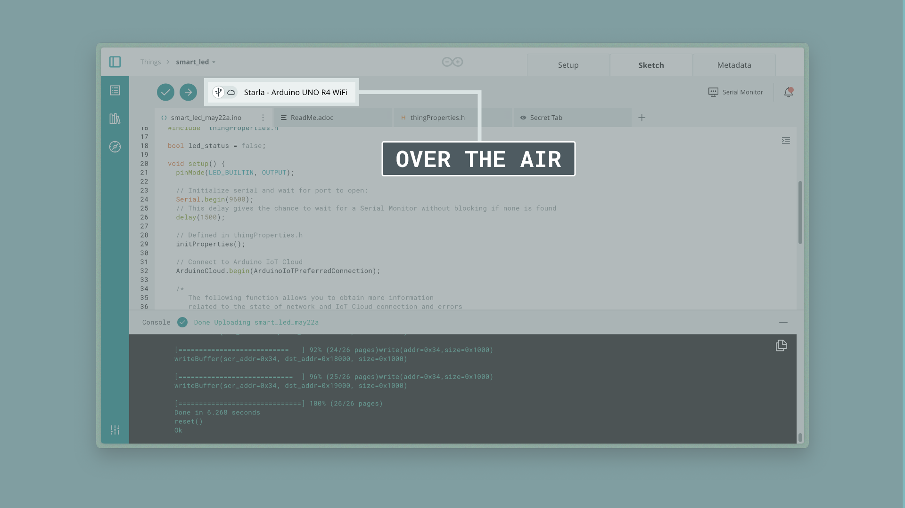

The new IoT Cloud brings a lot of new things, and one of them is the OTA (over-the-air) feature. This feature allows you to upload programs wirelessly to your Arduino boards. This way, as soon as you have a compatible board connected to a WiFi network and configured to work with OTA, you won’t need to physically connect the board to the computer in order to upload new sketches to it. Instead, everything will work over-the-air.

Over-the-air update is now available through [Arduino Cloud](app.arduino.cc) and the [Arduino Web Editor](https://create.arduino.cc/editor), which is an always up-to-date online IDE that stores sketches in the Cloud. It also allows you to wirelessly upload sketches from a browser, to any board that is connected to that computer. 

This tutorial will guide you through the necessary steps to configure your board to work with the OTA feature.

## Compatible Hardware

OTA is supported on several Arduino devices, as well as many ESP32 devices.

### Supported Arduino Boards

- [Arduino MKR WiFi 1010](https://store.arduino.cc/mkr-wifi-1010)
- [Arduino Nano 33 IoT](https://store.arduino.cc/arduino-nano-33-iot)
- [Arduino Nano RP2040 Connect](https://store.arduino.cc/nano-rp2040-connect-with-headers)
- [Portenta H7](https://store.arduino.cc/portenta-h7)
- [Portenta Machine Control](https://store.arduino.cc/products/arduino-portenta-machine-control)
- [Nicla Vision](https://store.arduino.cc/products/nicla-vision)

### Verified ESP32 Boards Supporting OTA 

The following ESP32 boards have been tested and verified to support OTA:

- ESP32-S2-DevKitC
- NODEMCU-32-S2
- WEMOS LOLIN D32
- ESP32-S3-DevKitC
- WEMOS LOLIN D32
- ESP32-CAM
- NodeMCU-32S
- Freenove ESP32 WROVER
- ESP32-DevKitC32E
- DOIT ESP32 DevKit v1

## How does it work

In order to configure the feature, we will need to create a project in the IoT Cloud following the next steps.

**1.** Go to the [IoT Cloud](app.arduino.cc/things) by opening the grid menu in any Arduino Site.

> **Note:** You will need to have an Arduino account to be able to use both the Web editor and IoT Cloud features.

**2.** Once you are logged in the IoT Cloud, you need to create a new thing and name it “smart_led”.
    Inside the thing let’s include a boolean variable called `light`, activate the interaction **Modify from dashboard API** and select the **on change** variable update. Once we have these characteristics set, click on **add variable**.

> **Note:** If you want to know more about how to get started with the Arduino Cloud, visit the [getting started tutorial](/arduino-cloud/getting-started/iot-cloud-getting-started).

**3.** Once you have added the variable, you’ll need to associate your device (Arduino MKR WiFi 1010 or Arduino Nano 33 IoT) to this new thing and add your network credentials.

***Note: If it is the first time you configure the MKR WiFi 1010 or the Nano 33 IoT board to the IoT Cloud, you will need to have the latest version of the WiFi Nina firmware installed. The configuration process updates it automatically. However, if you get any error during the configuration process, you can manually update the FW version of the Nina module following [these instructions](https://support.arduino.cc/hc/en-us/articles/360013896579-Check-and-update-the-firmware-for-WiFiNINA-and-WiFi101).***

**4.** Next step is to create a dashboard with a **Switch** widget, linked to the lights variable that you created before. Once it is set, click on the **use dashboard** button and go to **things > smart_led > Sketch**

**5.** It is time now to edit the sketch. Let’s create a program that turns ON/OFF the `LED_BUILTIN` embedded on your board. To do so, you will need to add just four lines of code to the auto generated sketch:
   1. Initialise as `false` the  boolean variable `led_status` at the beginning of the program.
   2. Set as `OUTPUT`  the `LED_BUILTIN` pin of the board in the `setup()` function.
   3. Modify the state of the `LED_BUILTIN` pin with the `led_status` variable in the `loop()` function. To do so, let’s use the `digitalWrite()` statement.
   4. Add the statement `led_status = !led_status` inside the `onLightChange()`auto generated function.

Check the highlighted lines in the following code to see what required changes are.

<iframe src="https://create.arduino.cc/editor/FT-CONTENT/865fd13a-03d3-484a-a7ef-8729b42716bd/preview?embed&snippet#L18,L21,L49,L53" style="height:510px;width:100%;margin:10px 0" frameborder="0"></iframe>

**6.** Once the sketch has uploaded to your board, let’s check that everything is working as it should. To do so, go back to the IoT Cloud and once in there, go to the **smart_led** dashboard we created before. Now, when you turn the **light** widget in the dashboard ON or OFF, the LED in your board should also turn ON or OFF.

Now that we have checked that everything is working as it should, let’s go back to the **Things > smart_led >**  **Sketch** tab in the IoT Cloud, and see what has happened there.

Once in the sketch tab, let’s open the board's drop down menu. There, a new option to connect our board should be available. The name of the board configured for the cloud will appear, followed by the **Over-the-Air** option.

If you select this option, you should be able to upload sketches to your board wirelessly. Let’s learn how to do it, by following the next steps.

**1.** Let’s modify the program in order to blink the LED each second when we click the button ON, and switch it Off when the button OFF is pressed.
   To do it, you will need to modify the `loop()` function by adding the highlighted lines shown in the following sketch.

<iframe src="https://create.arduino.cc/editor/FT-CONTENT/f6aa7be6-ae9c-40b9-a369-fc6e0d034514/preview?embed&snippet#L47-L54" style="height:510px;width:100%;margin:10px 0" frameborder="0"></iframe>

**2.** Power your board from a different power supplier than your computer's USB cable. Powering it through a phone charger's USB should be enough.

**3.** Once you have powered the board from a power source other than your computer, you should only see the **Over-the-Air** option. Select it, and upload the program to the board.

> **Note:** This option will take a bit longer than usual, since the process of compiling and uploading the program to the board over-the-air is a longer process.

**4.** Now, if you switch the widget on the IoT Cloud dashboard ON and OFF, the LED will either blink every second or go off.

## But how does it work, inside?

An IoT Cloud sketch is generated by the IoT Cloud application, it leverages the Arduino Cloud and [Arduino Connection Handler](https://github.com/arduino-libraries/Arduino_ConnectionHandler) libraries to give your sketch IoT powers.

When uploading a sketch over-the-air:

- The sketch is compiled for the selected board type.
- The compiled file is stored in a [AWS S3](https://aws.amazon.com/s3/) bucket.
- OTA file url location is associated with the target device.
- OTA_REQ flag set to true to instruct the board to start the OTA file download.
- OTA file length/CRC is verified.
- Updated sketch is flashed on the board.

## Conclusion

In order to upload sketches Over-the-Air to your Arduino board you need:

- An [Arduino NANO 33 IoT](https://store.arduino.cc/arduino-nano-33-iot) or [Arduino MKR WiFi 1010](https://store.arduino.cc/arduino-mkr-wifi-1010) board.
- NINA firmware on the board, updated to version 1.4.1 or later.
- An **IoT Sketch** to be uploaded.

### Next steps

If you want to continue learning about amazing IoT features or projects you can check:

- [Oplà IoT Kit](https://opla.arduino.cc/)

---

### More tutorials

You can find more tutorials in the [Arduino Cloud documentation page](/arduino-cloud/).
