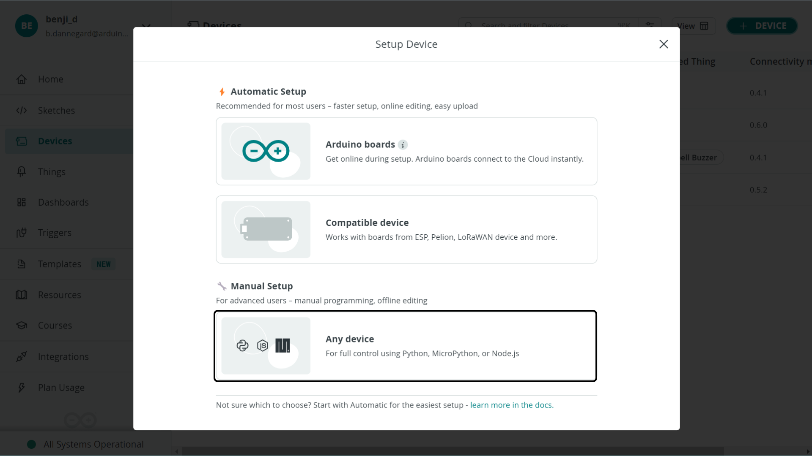
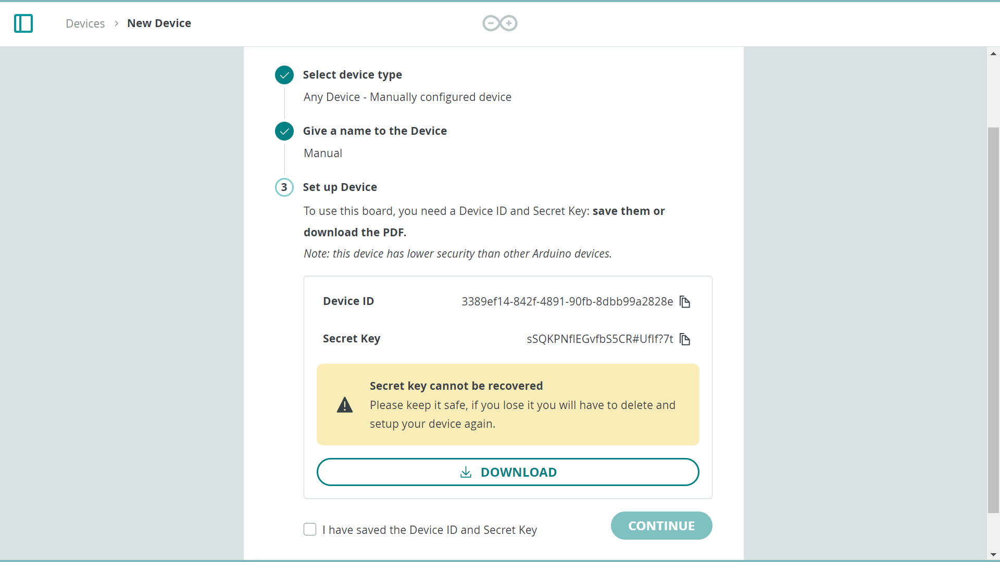

Authentication & data synchronisation is automatically handled when you choose the automatic configuration option in the [Arduino Cloud](app.arduino.cc).

You can during the setup of your device instead choose the manual configuration option. This allows you to connect to the cloud using the **Device API** (MicroPython, Python or Node.js).

This opens up possibilities for more kinds of devices, mainly Linux based, to connect to the Arduino Cloud.

***Manual configuration is recommended for more advanced users, mainly those that are looking to integrate existing projects with the Arduino Cloud.***

## Goals

In this article you will learn how to configure a manual device, and how to connect to the Arduino Cloud with:
- MicroPython
- Python
- JavaScript (Node.js)

## Hardware & Software Needed

Depending on what framework you choose to connect with, you will need various requirements.
- To connect using MicroPython you need to have a [GIGA R1 WiFi](https://store.arduino.cc/products/giga-r1-wifi), [Portenta H7](https://store.arduino.cc/products/portenta-h7), [Nano RP2040 Connect](https://store.arduino.cc/products/arduino-nano-rp2040-connect) with MicroPython => 1.2 installed.
- To connect using Python you need to have a [version of Python](https://www.python.org/) installed on your machine (check `python --version`). This has been tested with Python version **3.11**.
- To connect using JavaScript, you will need to install [Node.js](https://nodejs.org/en) is required to be installed to connect via JS.

Each method of interaction with the Device API requires various levels of complexity.

## Device API

The **Device API** allows you to interact with the Arduino Cloud MQTT broker, by sending/receiving updates from your IoT Cloud variables. 

This API is ideal for you who'd like to integrate existing Python or JavaScript projects with Arduino.

This API is currently split between two repositories:
- [arduino-iot-js](https://github.com/arduino/arduino-iot-js) - for Node.js / JavaScript
- [arduino-iot-cloud-py](https://github.com/arduino/arduino-iot-cloud-py) for Python / MicroPython

Note that the Device API is designed to interact with the MQTT broker. To manage devices, Things etc., please refer to the [Application API](https://www.arduino.cc/reference/en/iot/api) which can be interacted with using HTTP requests.

## Configure Manual Devices

To configure a manual device, go to [devices in the IoT Cloud](app.arduino.cc/devices), and click the **"Add"** button. This will open a new window, where you will be asked to either configure automatically, or manually. Choose the **"Manual"** option.



Follow the steps (name your device), and at the end of the wizard you will receive your credentials, which you can also download as a PDF.



***Make sure to save the credentials, as the Secret Key will no longer be obtainable after completing the installation.***

After you have created your device, you need to link it to a Thing before using it. This is done in the Thing interface, under **"Associated Devices"**.

## MicroPython

The pre-requisities for connecting the the IoT Cloud via MicroPython are:
- A [GIGA R1 WiFi](https://store.arduino.cc/products/giga-r1-wifi) / [Portenta H7](https://store.arduino.cc/products/portenta-h7) board with MicroPython installed,
- [Arduino Lab for MicroPython](https://labs.arduino.cc/en/labs/micropython) code editor,
- [arduino-iot-cloud-py](https://github.com/arduino/arduino-iot-cloud-py) installed,


To install MicroPython, you can check out the [Installation Guide](/micropython/basics/board-installation#giga-r1-wifi). The installation process is the same for both boards as they are based on the same MCU (STM32H7).

To connect with MicroPython, you will need to have a manual device created in the IoT Cloud. When you create it, you will receive a **Device ID** and a **Secret Key**.

### MicroPython Example

Below is a script that connects to the cloud, and allows you to control the onboard LED from a dashboard in the cloud. You will need to have exactly matching variables created inside your Thing in the cloud for this to work. For example:
- `client.register("led", value=None)` requires a variable named `led`.

```python
from machine import Pin
import time
import network
import logging
from arduino_iot_cloud import ArduinoCloudClient

WIFI_SSID = "WIFI_NETWORK"
WIFI_PASSWORD = "WIFI_PASSWORD"
DEVICE_ID = "YOUR_DEVICE_ID"
SECRET_KEY = "YOUR_SECRET_KEY"

led = Pin("LEDB", Pin.OUT) # Configure the desired LED pin as an output.

def on_switch_changed(client, value):
    # Toggles the hardware LED on or off.
    led.value(not value)
    
    # Sets the value of the cloud variable "led" to the current state of the LED
    # and thus mirrors the hardware state in the cloud.
    client["led"] = value

def wifi_connect():
    if not WIFI_SSID or not WIFI_PASSWORD:
        raise (Exception("Network is not configured. Set SSID and passwords in secrets.py"))
    wlan = network.WLAN(network.STA_IF)
    wlan.active(True)
    wlan.connect(WIFI_SSID, WIFI_PASSWORD)
    while not wlan.isconnected():
        logging.info("Trying to connect. Note this may take a while...")
        time.sleep_ms(500)
    logging.info(f"WiFi Connected {wlan.ifconfig()}")

if __name__ == "__main__":
    # Configure the logger.
    # All message equal or higher to the logger level are printed.
    # To see more debugging messages, set level=logging.DEBUG.
    logging.basicConfig(
        datefmt="%H:%M:%S",
        format="%(asctime)s.%(msecs)03d %(message)s",
        level=logging.INFO,
    )
    
    # NOTE: Add networking code here or in boot.py
    wifi_connect()
    
    # Create a client object to connect to the Arduino Cloud.
    # For MicroPython, the key and cert files must be stored in DER format on the filesystem.
    # Alternatively, a username and password can be used to authenticate:
    client = ArduinoCloudClient(device_id=DEVICE_ID, username=DEVICE_ID, password=SECRET_KEY)

    # Register cloud objects.
    # Note: The following objects must be created first in the dashboard and linked to the device.
    # This cloud object is initialized with its last known value from the cloud. When this object is updated
    # from the dashboard, the on_switch_changed function is called with the client object and the new value.
    client.register("ledSwitch", value=None, on_write=on_switch_changed, interval=0.250)

    # This cloud object is updated manually in the switch's on_write_change callback to update the LED state in the cloud.
    client.register("led", value=None)

    # Start the Arduino Cloud client.
    client.start()
```

For a more details, you can visit a more complete guide at [Connecting to Arduino Cloud using MicroPython](/arduino-cloud/getting-started/iot-cloud-micropython).

## Python

The pre-requisities for connecting with Python is:
- [Python](https://www.python.org/) installed on your machine (this is tested and confirmed to work with v3.11),
- [arduino-iot-cloud-py](https://github.com/arduino/arduino-iot-cloud-py) installed,
- a Thing + [manual device](#configure-manual-devices) created in the Arduino Cloud.

Connection to the cloud via Python uses the same API as the MicroPython example listed in this article. To install the [arduino-iot-cloud-py](https://github.com/arduino/arduino-iot-cloud-py) module, we can use `pip`.

```
pip install arduino-iot-cloud
```

You will also need to install [SWIG](https://pypi.org/project/swig/), which is also done via `pip`:

```
pip install swig
```

You will also need to have configured a manual device in the cloud. The **Device ID** and **Secret Key** are required in your script to authenticate. To connect, we use the following command:

```python
client = ArduinoCloudClient(device_id=DEVICE_ID, username=DEVICE_ID, password=SECRET_KEY)
```

To use the script further below, you will need to create a Thing with the following variables:
- `ledSwitch` - boolean
- `temperature` - float

The variables are set up to test bi-directional communication between the cloud and the manual device. The `temperature` variable will send just a dummy value to the cloud, and the `ledSwitch` will send data from the cloud to the manual device.

In the script, we need register the variables to use them, and set some parameters. 

```python
# register and send "temperature" data
client.register("temperature")  
client["temperature"] = 20

# register and set callback (on_switch_changed) 
client.register("ledSwitch", value=None, on_write=on_switch_changed) 
```

### Python Example

Below is a script that you can use to test out the API. Make sure to replace the `DEVICE_ID` and `SECRET_KEY` entries with your own credentials.

```python
import time
import logging

import sys
sys.path.append("lib")

from arduino_iot_cloud import ArduinoCloudClient

DEVICE_ID = b"YOUR_DEVICE_ID"
SECRET_KEY = b"YOUR_SECRET_KEY"

def logging_func():
    logging.basicConfig(
        datefmt="%H:%M:%S",
        format="%(asctime)s.%(msecs)03d %(message)s",
        level=logging.INFO,
    )   

# This function is executed each time the "ledSwitch" variable changes 
def on_switch_changed(client, value):
    print("Switch Pressed! Status is: ", value)

if __name__ == "__main__":

    logging_func()
    client = ArduinoCloudClient(device_id=DEVICE_ID, username=DEVICE_ID, password=SECRET_KEY)

    client.register("temperature")  
    client["temperature"] = 20
    client.register("ledSwitch", value=None, on_write=on_switch_changed)
    
    client.start()
```

Once you run the script, you will start the client and you will be able to interact with it from a dashboard. The script is setup so that anytime the `ledSwitch` changes, we will print the current state of the variable (true/false) in the REPL. 

## JavaScript/Node.js

The pre-requisities for connecting with Node.js is:
- [Node.js](https://nodejs.org/en) installed on your machine (this is tested and confirmed to work with v20.2.0),
- [arduino-iot-js](https://github.com/arduino/arduino-iot-js) installed,
- a Thing created in the Arduino Cloud,
- a manual device created in the Arduino Cloud, associated to your Thing.

Connection to the cloud via Node.js/Javascript requires you to first install the [arduino-iot-js](https://github.com/arduino/arduino-iot-js) package. You will also need to configure a manual device in the cloud, which will generate the **Device ID** and **Secret Key** needed to connect. 

```sh
npm install arduino-iot-js
```

After installation, you can use the example below to connect and send variable updates to the cloud.

### JavaScript Example

This example connects to the cloud (MQTT broker), and sends a variable update with `sendProperty()`, and then listens for updates using the `onPropertyValue()` method.

***Please note: `cloudVar` needs to contain the variable name you create in the Arduino Cloud. In this case, we are calling it `test_variable`*** 

```js
const { ArduinoIoTCloud } = require('arduino-iot-js');

(async () => {
  const client = await ArduinoIoTCloud.connect({
    deviceId: 'YOUR_DEVICE_ID',
    secretKey: 'YOUR_SECRET_KEY',
    onDisconnect: (message) => console.error(message),
  });

  const value = 20;
  let cloudVar = "test_variable"

  client.sendProperty(cloudVar, value);
  console.log(cloudVar, ":", value);

  client.onPropertyValue(cloudVar, (value) => console.log(cloudVar, ":", value));
})();
```

On successful connection, we should receive the following:

```sh
found association to thing: <thingid>
```

And upon receiving an update (if you change the value in the dashboard), you should see:

```sh
test_variable: <value>
```

## Summary

In this article, you have learned about the Arduino Cloud's **Device API**, and how to connect to it using MicroPython, Python & JavaScript (Node.js). 

This API makes it easier to integrate existing software projects written in Python & JavaScript.


