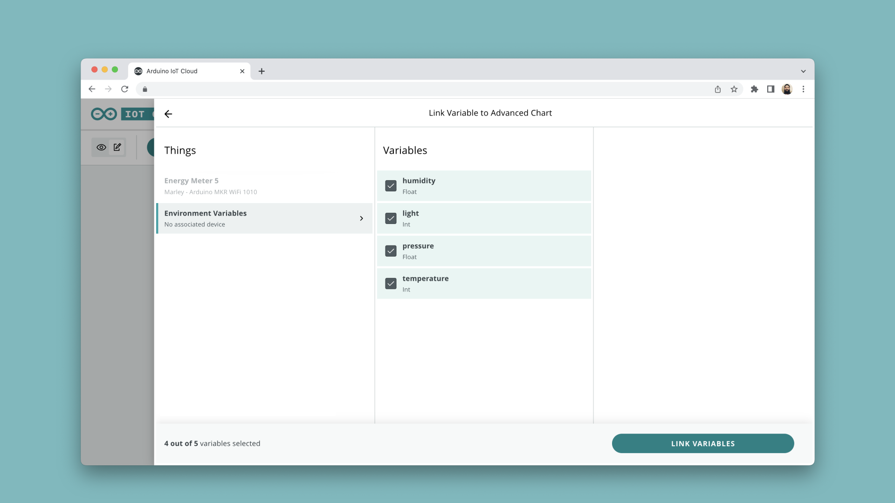
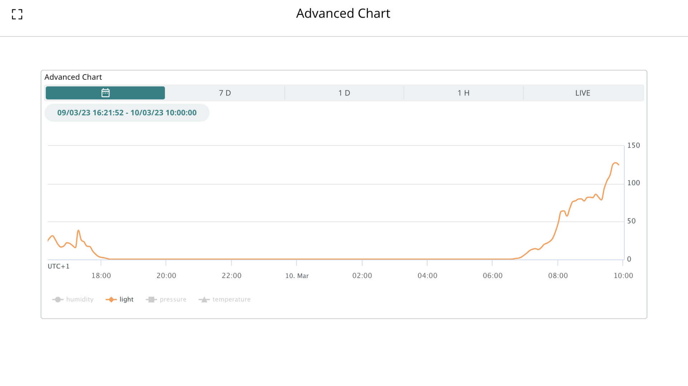

The **advanced chart widget** is used to display data from several Arduino Cloud variables in a single chart. You can track the data in both real time, select from a specific time period while selecting the variables you want to display.


This widget can be added onto existing projects (if you are already tracking data), and is particularly interesting to use in projects such as:
- Weather stations,
- Environmental data tracking,
- Energy consumption,
- Various science projects where data comparison is needed.

This widget can use variables from **different Things**, so you can monitor data from various devices and plot it all in one place. 

For example, you could set up a series of sensors around a city, and measure the CO2 emissions from your phone or laptop in a single chart!

## Hardware & Software Needed

- [Arduino Cloud](https://app.arduino.cc/).
- Cloud compatible boards, [see full list](https://docs.arduino.cc/arduino-cloud/guides/overview#compatible-hardware).

***In this tutorial, we use the [MKR WiFi 1010](/hardware/mkr-wifi-1010) and [MKR ENV Shield](/hardware/mkr-env-shield) for recording environmental values. This is not a requirement, you can use any board for this tutorial.***

## Setup & Configuration

To use the advanced widget, you will need to set up a Thing and some variables that you want to track. We choose to set up and track:
- `temperature`
- `humidity`
- `pressure`
- `light`

***If you are unfamiliar with how to set up a Thing and variables, head on over to the [Getting Started with the Arduino Cloud](/arduino-cloud/guides/overview) article.***

**1.** Head on over to the **"Dashboards"** in the Arduino Cloud, and create a new dashboard (or use an existing dashboard).

**2.** Add a new **"Advanced Chart Widget"**, selecting it from the list of available widgets. 

**3.** Link the variables you want to compare. In this case, we are using `temperature`, `humidity`, `pressure` and `light`.



>You can use up to a maximum of 5 variables.

**4.** After selection, your variables will appear in the right panel, with a number of configuration options. You can for example choose how each data point will be represented (line, spline, spline area, line area and bar). 


**5.** Click on **"Done"** when finished selecting the variables. If your board is connected and is sending data to the cloud, you will see the widget's data update frequently.

## Example Code

The sketch of your project does not require much complexity. In your automatically generated code, simply add the sensor reading code inside of the loop. We are using the [Arduino_MKRENV](https://www.arduino.cc/reference/en/libraries/arduino_mkrenv/) library, and we only needed to add these following lines to the loop to read all sensors:

```arduino
temperature = ENV.readTemperature();
humidity    = ENV.readHumidity();
pressure    = ENV.readPressure();
light = ENV.readIlluminance();
```

The full sketch used is found below:

```arduino
#include <Arduino_MKRENV.h>

#include "thingProperties.h"

void setup() {
  // Initialize serial and wait for port to open:
  Serial.begin(9600);
  
  if (!ENV.begin()) {
    while (1);
  }

  delay(1500); 

  initProperties();

  ArduinoCloud.begin(ArduinoIoTPreferredConnection);

  setDebugMessageLevel(2);
  ArduinoCloud.printDebugInfo();
}

void loop() {
  ArduinoCloud.update();

    temperature = ENV.readTemperature();
    humidity    = ENV.readHumidity();
    pressure    = ENV.readPressure();
    light = ENV.readIlluminance();
  
}
```

## Usage

With the widget set up, let's explore some of its features. 

### Toggle Variables

You can enable or disable to variables you want to display by simply clicking the name of the variable.


### Value Tracking

Hover over a line to see what the value of a variable was in a specific point in time. In this case, we choose to check only the temperature and the humidity.


### Specific Time Period

To see a specific time period, click on the calendar icon, where you can select the starting & end time & date.


As an example, the widget below shows the illuminance (LUX) recorded via the **MKR ENV Shield**, the `light` variable.

Here, we can see that sunset occurred around 18.00 (6PM), and sunrise sometime around 07.00 (7AM).



## Limitations

The following variables are not supported in the advanced chart widget.

- Character String
- Schedule
- Location
- Color
- Custom Variable
- Colored Light
- Dimmed Light
- Contact Sensor
- Motion Sensor
- Television
- Boolean
- Light
- Smart Plug
- Switch

## Summary

The advanced chart widget can be used for **any** project that includes data monitoring. It is perfect for scientific projects when monitoring & comparing data over time is needed.